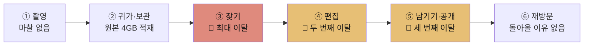
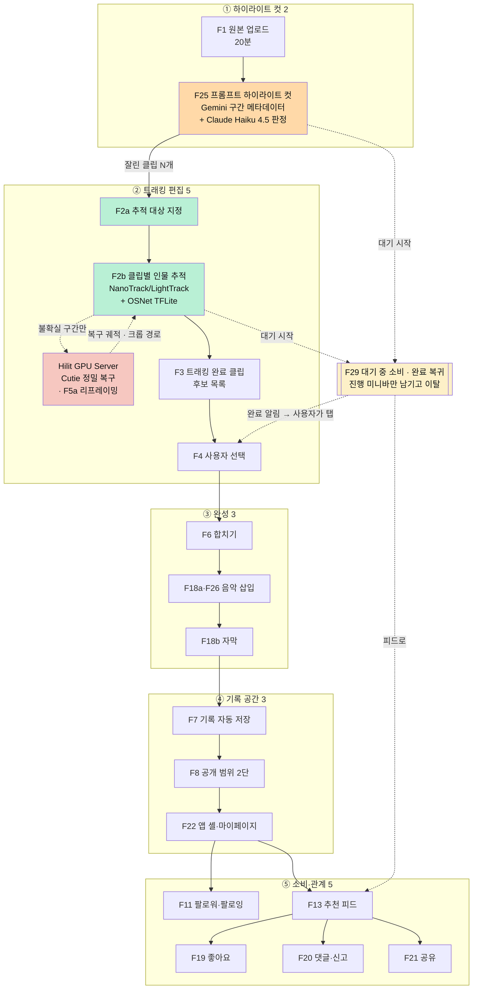
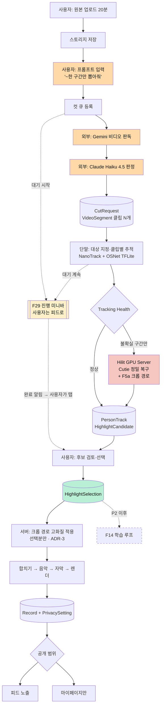

# HILiT PRD v0.5

| 항목 | 내용 |
| --- | --- |
| **Owner 팀** | HILiT Product — 제품 아키텍트 · AI 팀 · 클라이언트 · 백엔드 · 디자인 |
| **최종 업데이트** | 2026-09-02 |
| **PRD Status** | **Draft** |
| **Source of Truth** | `VPS_v0_3.html` (Value Proposition 0.3, 2026-08-29 개정) |
| **보조 근거** | `Value-Proposition_claude-opus-5-1m_effort-high (1).html` · 팀 PRD 초안 `hilit-prd-v1_0.html` |
| **이번 릴리스 범위** | 🔴 **MVP 23개 기능** — Gate A · Gate B · **Gate C** 통과가 조건 *(v0.3에서 F29 추가)* |
| **보조 근거 (v0.2 추가)** | `HILIT_추적PoC_기술기획서.md` — 추적 아키텍처·모델 4종·실측 원가 |
| **다루지 않는 것** | **매출 목표 · LTV/CAC · 결제 대행 선정** (요금은 확정, 목표는 미정) |

---

## 판 이력

| 판 | 날짜 | 변경 | 근거 |
| --- | --- | --- | --- |
| 0.1 | 2026-08-30 | 초판. VPS 0.3 → PRD 변환 · MVP 17개 | `VPS_v0_3.html` |
| **0.2** | **2026-09-01** | ① **그룹(F23) 제외 · 공개 범위 Public/Private 2단** ② **편집 서비스 과금 모델 신설**(무료·구독·충전) — 기능 6개 추가 ③ **ADR-1 결정 · ADR-2 개정**(서버 GPU → 모바일 우선 하이브리드) ④ 트래킹 기술 구성을 PoC 실측으로 확정 ⑤ 🔴 **파이프라인 순서 정정 — 컷이 먼저, 트래킹이 나중** | 제품 결정 · `HILIT_추적PoC_기술기획서.md` · `리프레임 과정.png` |
| **0.3** | **2026-09-02** | 🔴 **대기 시간을 소비 시간으로 바꾼다** — ① **F29 신설**(대기 중 소비 · 완료 복귀) · MVP 22 → **23** ② **ADR-6 결정** ③ 진행 미니바 · 복귀 계약(`resume_route`)을 데이터·API에 신설 ④ **R13**(피드 몰입으로 미복귀) · **Q21·Q22** 신설 ⑤ 🔴 **"직렬 실행" 전제 일부 폐기** — 추적(브라우저)과 피드 재생이 **동시에** 돈다 | 제품 결정 *(대기 경험)* · SRS v3.0 §6.5.3 · FC-5 |
| 🔴 **0.4** | **2026-09-02** | 🔴 **무료 티어 한도를 다시 그린다 — 과금 경계 정정.** ① **무료 편집 편수**: 월 2회 → 🔴 **가입 후 첫 달 5회 · 이후 월 2회**(회당 20분은 유지) ② 🔴 **수동 트래킹(F24)에 한도 신설** — 무료 **월 1회** · 구독·충전 **무제한**. v0.3까지 F24는 전 요금제 무제한(●)이었다 ③ **`UsageKind.MANUAL_TRACK` 신설** — 수동 트래킹이 계측 대상에서 **과금 대상**으로 바뀐다 ④ **AF-16 신설**(수동 트래킹 한도 소진 → 리프레이밍 없이 합치기) · **Q23·Q24 신설**(무료 한도 리셋 앵커·이월 / 트래킹 1회의 계수 단위) ⑤ AC7-1 재작성 — 🔴 **"무료로 1편 완성"의 단위가 "월 1편"으로 명시된다** | 제품 결정 *(과금 경계)* |
| 🔴 **0.5** | **2026-09-02** | 🔴 **요금제를 3종에서 2종으로 줄이고, 충전을 플랜에서 *확장*으로 내린다.** ① 🔴 **충전(PREPAID) 요금제 폐지** — 19,800원 3편 상품이 사라진다. `Plan` 열거형이 **2값**이 된다 ② 🔴 **추가 사용분을 두 방식으로 재정의** — 무료는 **크레딧 충전(선불)**, 구독은 **사용량 종량(후불)**. 🔴 **후불은 이 제품에 없던 결제 흐름이다** — 미납·상한 위험이 새로 생긴다(R15) ③ 🔴 **무료도 AI 음악을 쓸 수 있다 — 충전 시.** 접근 판정이 **플랜만의 함수가 아니게 된다** ④ **F27 원본 보관은 구독 전용**으로 정리 ⑤ 🟢 **G13·Q15 해소** — 충전 플랜이 없어지면서 *"2배 금액의 근거"* 질문 자체가 소멸 ⑥ **Q25~Q27 신설**(추가분 단가 · 후불 상한 · 후불 미납) | 제품 결정 *(요금제 구조)* |

> ### v0.2가 VPS 0.3과 어긋나는 지점 — 지우지 않고 적는다
> **① 그룹(F23) 제외.** VPS 0.3은 MVP 17개에 F23을 포함하고 "그룹이 부계정을 대체한다"(A5)를 가정했다. v0.2는 **편집 서비스에 집중하기 위해 F23을 제외**하고, 부계정 대체 가정을 **Private 기록**으로 옮겼다. SNS 형식(팔로워·팔로잉·추천 피드·좋아요·댓글·공유)은 그대로 유지한다.
> **② 과금 모델 도입.** v0.1은 "수익 모델·가격을 다루지 않는다"고 선언했다. v0.2는 그 선언을 **철회**한다 — 요금이 확정됐고, 요금이 곧 기능 경계를 정하기 때문이다(§4.6). 다만 **매출 목표는 여전히 다루지 않는다.**
> 두 변경 모두 VPS 차기 개정에 반영이 필요하다.

> ### 🔴 v0.3이 바꾼 것 — 기다림을 없애지 못하면 기다리는 동안 다른 것을 하게 한다
> v0.2까지 이 PRD는 대기 시간을 **줄여야 할 비용**으로만 다뤘다(컷 + 추적 p95 ≤ 8분). 그러나 **8분은 줄여도 8분이고, 그동안 사용자는 편집 화면에 묶여 있었다.**
>
> | | v0.2까지 | **v0.3** |
> | --- | --- | --- |
> | 대기 중 사용자 | 진행 화면을 **지켜본다** — 또는 앱을 나간다 | 🔴 **상단 진행 미니바만 남기고 피드로 간다**(F29) |
> | 대기 화면의 목표 | *"8분을 견디게 한다"* | 🔴 *"8분을 **다른 가치로 채운다**"* — 소비 루프(O7)와 편집 루프가 같은 세션에서 만난다 |
> | 완료 시 | 사용자가 화면을 보고 있어야 안다 | **알림 후 사용자가 탭하면 이어갈 지점으로 복귀** — 🔴 **강제 전환은 하지 않는다** |
>
> **이 변경은 공짜가 아니다.** ① 추적은 **브라우저**에서 도는데 피드 재생도 브라우저다 — SRS FC-5의 *"직렬이다, 동시 실행 없음"* 전제가 여기서 깨진다(R13 · Q21 · T7). ② 피드에 몰입해 **편집으로 돌아오지 않으면** 완주율(≥95%)이 오히려 떨어진다. 둘 다 §7.3에 위험으로 적고 계측 지표를 붙였다.
>
> **③ 렌더 단계에는 적용하지 않는다.** 렌더는 이탈하면 결과가 소실되므로(R1) 대기 중 소비의 대상이 아니다 — **컷과 트래킹에만 적용된다.**

> ### 🔴 파이프라인 순서 정정 — 이 문서가 틀렸던 지점
> v0.1과 v0.2 초안은 **트래킹이 원본 전체를 훑어 등장 구간을 찾고, 그 위에 프롬프트 판정을 얹는 구조**로 썼다. **틀렸다.** 실제 설계는 반대다.
>
> | | 잘못 쓴 순서 | **정정된 순서** |
> | --- | --- | --- |
> | 1 | 업로드 | 업로드 |
> | 2 | **트래킹**(원본 20분 전체) | 🔴 **하이라이트 컷** — 프롬프트로 구간을 찾아 **먼저 자른다**(F25) |
> | 3 | 등장 구간 탐지 | 🔴 **트래킹** — **잘린 클립들에 대해서만** 수행(F2a·F2b) |
> | 4 | 프롬프트 판정(얹기) | 사용자 선택(F4) |
> | 5 | 선택 → 완성 | 합치기 → 음악 → 자막 → 렌더 |
>
> **리프레이밍(F5a)의 위치도 함께 정정했다** — ③완성이 아니라 **②트래킹의 Cutie 단계**다. 서버가 정밀 복구로 만든 마스크로 크롭 경로를 산출하고, **그 경로의 고화질 적용만 선택 이후**에 일어난다(ADR-3).
>
> **이 순서가 제품·원가·게이트를 동시에 바꾼다.**
> ① **트래킹은 20분 전체가 아니라 컷된 분량에만 돈다** — GPU 복구 원가의 분모가 줄어든다(§5.5)
> ② **"어느 구간인가"를 정하는 주체가 F2b에서 F25로 옮겨간다** — Gate A가 판정하던 O9의 소관이 바뀐다(§5.3 · §8.1)
> ③ **Gate C가 Gate A보다 파이프라인상 앞선다** — v0.2 초안의 "Gate C는 Gate A에 종속" 서술을 폐기한다(§8.1)
>
> 근거: `HILIT_추적PoC_기술기획서.md` §2.2(모바일 우선 하이브리드) · `리프레임 과정.png`(10분 → 컷 → 트래킹).

---

## 표기 규칙 — 모든 숫자는 출처 상태를 갖는다

| 태그 | 뜻 |
| --- | --- |
| **[SOURCE]** | VPS 0.3에 **직접 명시**된 값. 그대로 옮겼다 |
| **[HYPOTHESIS]** | VPS 0.3이 **1년차 가설·추정**으로 명시한 값. 실측치가 아니다 |
| **[PROPOSED]** | 이 PRD가 **새로 제안하는 초안**. VPS에 근거가 없다. 착수 전 팀 합의가 필요하다 |
| **[INFERENCE]** | VPS 내용을 제품 요구사항으로 **해석**한 것 |
| **[TBD]** | 추가 의사결정이 필요하다 |
| 🔴 **[EVIDENCE GAP]** | **VPS와 PRD 사이 논리 연결이 끊긴 지점.** 근거 보강 없이 진행하면 위험하다 |

> **NFR(5장)·데이터/API(6장)의 수치는 대부분 [PROPOSED]다.** VPS는 제품 가치를 다루고 시스템 사양은 다루지 않았다.

### 이 PRD가 스스로에게 건 3가지 금지

| # | 금지 | 이유 |
| --- | --- | --- |
| **N1** | **경쟁사 대비 배수·퍼센트를 쓰지 않는다** | "탐지율 2배", "원가 20% 절감" 같은 표현은 **측정된 적 없는 분모**를 전제한다. VPS의 주장은 범주적이다 — *"코트에는 말하는 사람이 없다. 이 조건에서 사람을 놓치지 않는 서비스는 조사한 목록에 없다"*. 범주적 주장이 정량 주장보다 **강하고 반박하기 어렵다.** 약한 형태로 번역하지 않는다 |
| **N2** | **판정할 수 없는 문장을 요구사항으로 쓰지 않는다** | "법무 검토 선행 필수"는 요구사항이 아니라 소망이다. 통과/실패를 판정할 수 없기 때문이다. **산출물 승인 = 배포 게이트**로 바꿔야 CI가 판정한다 |
| **N3** | **기준선 빈칸을 그럴듯한 숫자로 메우지 않는다** | 없는 숫자 대신 **언제·무엇으로 확정할지**를 적는다. VPS가 대시(—)로 둔 칸은 이 PRD에서도 대시로 남는다 |

---

# 1. 개요·목표

## 1.1 문제 정의

선별 페르소나 6명에게 공통으로 나타난 Pain 3가지. **실패 KPI**는 "지금 얼마나 실패하고 있는가"다.

| # | Pain | 근본 원인 | 해당 | 실패 KPI (현재) | 상태 |
| --- | --- | --- | :---: | --- | :---: |
| **P1** | 원본에서 자기 장면을 찾는 시간이 편집보다 오래 걸린다 | 고정 카메라는 경기를 담지만 **누가 어디에 있었는지는 기록하지 않는다** | **6/6** | 원본 1편당 탐색 **60분 이상** · 원본→완성 전환율 **약 4%** (원본 47편 → 업로드 2건) | [SOURCE] |
| **P2** | 고정 카메라는 사람을 따라오지 않아 화면에 작게 잡힌다 | **P1과 원인이 동일** | 3/6 | 재촬영 **1~3회/결과물** · "잘 잡혔다" 평가 **측정 불가** | [SOURCE] |
| **P3** | 공개할 자신이 없으면 기록도 남지 않는다 | 기존 SNS는 **올려야 남는** 구조다 | 3/6 | 비공개 기록 비율 **0%** · 월 기록 생성 **0.7건** · 편집 외주 **월 60만 원**(강태오) | [SOURCE]/[HYPOTHESIS] |

> **P1과 P2의 원인은 하나다.** 고정 카메라가 사람의 위치를 모른다는 사실이 두 문제를 동시에 만들었다. 그래서 **사용자 트래킹 하나가 P1과 P2를 함께 없앤다**. [SOURCE]

## 1.2 Value Proposition

> ### **① AI가 영상 속 나를 끝까지 따라가며 하이라이트를 찾아주고, 내가 선택한 순간을 나 중심의 영상으로 완성한다.**
> ### **② 누구에게 보여주기 위한 기록뿐만 아니라 나를 위해 오래 남겨두는 개인 기록 공간을 제공한다.**
>
> *"40분을 넣으면 **내가 주인공인** 15초가 나온다. 그리고 그 15초는 올리지 않아도 남는다."* [SOURCE]

## 1.3 Core Job

> **"이미 찍어둔 긴 영상에서, 내가 의미 있다고 판단한 순간만 건져서, 남에게 보여줄지와 무관하게 내 기록으로 만들고 싶다."** [SOURCE]

**세 부분으로 나눠 읽는다. 이 의미를 임의로 확장하지 않는다.**

| 구절 | 제품 경계 |
| --- | --- |
| **이미 찍어둔** | 촬영 기능을 만들지 않는다 |
| **내가 판단한** | 최종 선택권을 기계에 넘기지 않는다 |
| **보여줄지와 무관하게** | 기록과 공개를 분리한다 |

> 세 조건 중 **하나라도 빠지면 이 Job은 기존 대안으로도 충족된다.** [SOURCE]

## 1.4 목표

| 구분 | 내용 | 상태 |
| --- | --- | :---: |
| **우리가 푸는 것** | 게시 **이전**의 실행 문제 — 찾기 · 구도 · 완성 · 반복 노동 · 저장공간 | [SOURCE] |
| **우리가 풀지 않는 것** | 게시 **이후**의 결과 문제 — 팔로워 성장 · 조회수 · 수익화. 다만 카테고리 랭킹(F15, P1)으로 노출 자리는 만든다 | [SOURCE] |

> **범위를 좁히는 것이 오히려 더 강한 논증이 된다.** Podia 조사에서 크리에이터의 1위 고민은 편집이 아니라 **오디언스 성장(32.9%)** 이었다. 이 사실을 무시하고 "가장 큰 문제는 편집"이라고 말하면 즉시 반박당한다. [SOURCE]

## 1.5 성공 지표

| 구분 | 지표 | 값 | 상태 |
| --- | --- | ---: | :---: |
| **1년차 성공 지표** | 기록 3개 이상 축적 사용자 | **1만 명** | [HYPOTHESIS] |
| | 처리 영상 | **연 12만 편** (1만 명 × 월 1편) | [HYPOTHESIS] |
| **요금** | 구독 · 🔴 **추가 사용분** | **9,900원/월** · 🔴 **추가분 단가 [TBD]** | [SOURCE · v0.2 결정 · **v0.5 정정**] |
| **매출 목표** | — | **다루지 않음** | [SOURCE] |

> 처리 물량 12만 편은 **가치사슬 분석의 GPU 원가에 직접 비례**하므로 사업 계획과 원가가 같은 지표를 공유한다. [SOURCE]

---

# 2. 사용자와 페르소나

## 2.1 세그먼트 선별

**1순위 기준은 "원본 영상이 있는가"다.** HILiT은 앱에서 촬영하지 않으므로 원본이 없으면 제품이 아예 작동하지 않는다. 2순위는 "돈이나 시간을 쓸 의향이 있는가". [SOURCE]

| 세그먼트 | 정의 | 국내 규모 | 페르소나 | 처리 |
| --- | --- | ---: | --- | --- |
| **Q1** | 원본 O · 지불의향 O | 약 50만 명 [HYPOTHESIS] | 김도현(A-1) · 박서연(A-2) · 강태오(C-1) · 오세진(C-3) | **대상 · 1순위** |
| **Q4** | 원본 O · 지불의향 X | 약 450만 명 [HYPOTHESIS] | 이준혁(A-3) · 정민수(B-2) | **대상 · 2순위** |
| Q2 | 원본 X · 지불의향 O | 약 200만 명 [HYPOTHESIS] | 최윤아(B-1) | 보류 — F17 촬영 가이드 단계에서 열림 |
| Q3 | 순수 소비자 | 약 2,800만 명 [HYPOTHESIS] | — | 타깃 아님 |
| 밖 | 첫 카테고리(농구·구기) 밖 | — | 한지우(B-3) · 서하린(C-2) | 확장 단계 · Proof 근거로 재활용 |

## 2.2 핵심 페르소나 6명

| ID | 페르소나 | 세그먼트 | 핵심 Pain | Needs |
| --- | --- | :---: | --- | --- |
| **A-1** | **김도현** 26 · 3년차 직장인 · 주 2회 사회인 농구 · 본계정+부계정 | Q1 | 40분 원본에서 자기 장면 찾는 데 **1시간 이상** · 코트 반대편에서 **화면 구석에 작게** · 원본 47개 적재, 3개월 업로드 2건 | 원본을 뒤지지 않고 잘 나온 장면만 남기기 |
| **A-2** | **박서연** 22 · 풋살 동아리 주장 겸 촬영 담당 | Q1 | 팀원 **8명분**을 사람 손으로 찾는 것은 불가능 · 촬영 담당이라 **자기 기록만 없음** | 원본 하나로 각자 자기 장면 가져가게 · 자기 기록도 남기기 |
| **C-1** | **강태오** 24 · 농구 크리에이터 · 팔로워 8,200 | Q1 | 촬영 1시간 + **편집 3시간** → 주 3회 못 지킴 · 외주 **월 60만 원대** [HYPOTHESIS ⚠️] | 완성도 지키며 편집 시간만 줄이기 |
| **C-3** | **오세진** 30 · 풋살팀 운영 · 팀원 12명 | Q1 | **12명이 각자 원하나 편집 인력 1명** · 팀 계정 하나라 개인 기록이 안 남음 | 팀원이 각자 스스로 만들게 |
| **A-3** | **이준혁** 34 · 카페 자영업 · 액션캠 50분·4GB | Q4 | 남길 건 15초인데 **50분 원본을 못 지움** · 유료 앱 3개 결제 후 전부 해지 | 15초 건지고 원본 지우기 · 공개 없이 해마다 쌓기 |
| **B-2** | **정민수** 28 · 제조업 사무직 · 업로드 연 3회 | Q4 | 컷·자막·음악까지 **30분 넘어 중도 포기** · 갤러리 미편집 **약 200개** | 편집 실력 없이 볼 만한 영상 하나 · 1년 뒤 다시 볼 기록 |

*모든 인물·수치는 VPS 0.3 기준 [SOURCE], 팔로워·영상 개수 등은 가상 인터뷰 예시 [HYPOTHESIS]*

## 2.3 Persona Journey — 이탈이 몰린 곳



| 단계 | 현재 상태 | 마찰 |
| --- | --- | --- |
| ① 촬영 | 삼각대 세우고 녹화 — 1분이면 끝 | 없음 |
| ② 귀가·보관 | 원본 4GB 적재 | 저장공간 압박 |
| **③ 찾기** | 40분을 10초씩 되돌려 봄 | 🔴 **1시간 이상 · 최대 이탈** |
| **④ 편집** | 컷·자막·음악 직접 | 🔴 **30분 초과 · 중도 포기** |
| **⑤ 남기기·공개** | *"이 정도를 남한테 보여줄 수준인가"* | 🔴 **세 번째 이탈** |
| ⑥ 재방문 | 기록이 없으니 돌아올 이유도 없음 | 원본만 증가 |

> **가설의 표현을 "편집이 어려워서 못 올린다"에서 "촬영 이후에 발생하는 시간·기술·반복 작업의 부담"으로 바꿔야 한다.** 앞은 직접 조사 데이터가 없어 반박당하고, 뒤는 여러 조사에서 반복 확인된다. [SOURCE]

## 2.4 Pain → KPI 변환

| Persona | Pain | 실패 KPI | Baseline | Target | 측정 방법 | 상태 |
| --- | --- | --- | ---: | ---: | --- | :---: |
| 김도현·정민수·강태오 | 장면 탐색 시간 | 원본 1편당 탐색 소요 시간 | **60분 이상** [SOURCE] | **5분 이내** [HYPOTHESIS] | task completion time · 클라이언트 계측 | O1 |
| 김도현·강태오·오세진 | 완성으로 안 이어짐 | 원본 대비 완성 영상 전환율 | **약 4%** [SOURCE] | **60% 이상** [HYPOTHESIS] | 업로드 건수 ÷ 완성 건수 | O2 |
| 김도현·강태오 | 화면에 작게 잡힘 | "잘 잡혔다" 평가 비율 | **측정 불가** [SOURCE] | **80% 이상** [HYPOTHESIS] | 완성 직후 1문항 설문 | O3 |
| 전원 | 추적 누락 | 실제 등장 구간 대비 탐지 비율 | **해당 없음** [SOURCE] | **85% 이상** [HYPOTHESIS] | 사람이 표시한 정답과 비교 | **O9 · Gate A** |
| 강태오·서하린 | 재촬영 | 결과물당 재촬영 횟수 | **1~3회** [SOURCE] | **0회** [HYPOTHESIS] | 사용자 로그 | O10 |
| 이준혁 | 원본 못 지움 | 결과물 확보 후 원본 삭제 실행률 | **0%** [SOURCE] | **50% 이상** [HYPOTHESIS] | F9 이벤트 | O4 |
| 이준혁·정민수·최윤아 | 공개 부담 | 비공개(나만 보기) 기록 비율 | **0%** [SOURCE] | **30% 이상** [HYPOTHESIS] | F8 설정값 | O5 |
| 전원 | 기록 끊김 | 월간 기록 생성 편수 | **월 0.7건** [SOURCE] | **월 4건** [HYPOTHESIS] | 기록 생성 이벤트 | O6 |
| 전원 | 재방문 없음 | 기록 3개 이상 축적 사용자 | — | **1만 명** [HYPOTHESIS] | 코호트 분석 | **O7 · North Star** |
| 강태오·오세진 | 외주 지출 | 편집 외주 지출 | **월 60만 원** [HYPOTHESIS] | **0원** [HYPOTHESIS] | 인터뷰 | O8 |

---

# 3. 사용자 스토리와 수용 기준

각 JTBD를 User Story로 변환하고 **측정 가능한 AC를 최소 3개** 붙였다. JTBD 원문은 [SOURCE].

## US-1 · 김도현 (A-1, Q1) — 40분에서 내 장면 찾기

> **As a** 주 2회 농구를 하고 부계정을 운영하는 직장인,
> **I want** 40분 원본에서 내가 잘 나온 장면을 대신 찾아주기를,
> **so that** 편집에 한 시간을 쓰지 않고도 오늘의 기록을 남길 수 있다. [SOURCE]

> **AC는 파이프라인 순서로 읽는다** — ① 자르고(AC1-1) → ② 추적하고(AC1-2·AC1-3) → ③ 고른다(AC1-4·AC1-5). v0.2 정정 전에는 ②가 ①보다 앞에 있었다(판 이력 참조).

| AC | Given | When | Then |
| --- | --- | --- | --- |
| **AC1-1**<br>**① 컷** | **20분** 원본이 업로드되었을 때 | *"내가 슛 쏘는 장면만 뽑아줘"* 처럼 **특정 행동을 언급한 프롬프트**를 입력하면 | **Gemini**가 비디오를 읽어 구간 메타데이터를 만들고 **Claude Haiku 4.5**가 프롬프트와 대조해 판정한 **구간이 잘려 클립으로 제시된다** · 판정 정확도 **[TBD]** [PROPOSED · **Gate C 판정**] |
| **AC1-2**<br>**② 트래킹** | 클립이 만들어졌고 사용자가 자신을 **1회 지정**했을 때 | 추적을 실행하면 | 가려졌다 다시 나타나도 **같은 사람으로 인식**된다 · **F2a 재식별 오탐률 [TBD]** [SOURCE · G1] |
| **AC1-3**<br>**② 트래킹** | 잘린 클립들이 있을 때 | 클립별 추적(F2b)을 실행하면 | 🔴 **원본 20분 전체가 아니라 잘린 클립에 대해서만** 단말 **NanoTrack/LightTrack + OSNet TFLite**로 추적하고, **정상 구간과 불확실 구간을 구분**한다 · **불확실 구간만 Hilit GPU Server로 보내 Cutie로 복구**한다 · 추적 유지율 **≥ 85%** [HYPOTHESIS · O9 · **Gate A 판정**] |
| **AC1-4**<br>**③ 선택** | 트래킹이 **모두 끝났을 때** | 후보 목록을 조회하면 | 각 후보에 **시작·종료 타임코드**와 **추적 상태**(정상 / 복구 완료 / 저신뢰)가 표시된다 · 후보 개수는 **프롬프트에 따라 달라진다** 🔴 **G15** |
| **AC1-5**<br>**③ 선택** | 후보 목록이 표시되었을 때 | 사용자가 어떤 후보든 선택·제외하면 | **후보 100%에 대해** 선택·제외가 가능하다 [INFERENCE — Core Job "내가 판단한"] |
| **AC1-6** | **20분** 원본이 업로드되었을 때 | 컷·추적을 실행하면 | `cut_started` → `selection_opened` 구간 **p95 ≤ 8분** [PROPOSED] — O1(체감 5분) 달성의 상한 · **컷(F25)과 추적(F2b)을 분리 계측**한다<br>*(VPS 원문 "체감 5분" → 계측 이벤트로 치환. 무엇을 무엇으로 바꿨는지 남겨 두어 치환이 틀리면 되돌린다)* |
| **AC1-7** | 업로드가 네트워크 오류로 중단되었을 때 | 사용자가 재시도하면 | 중단 지점부터 **이어올리기**가 되고 재개 성공률 **≥ 99%** [PROPOSED] |
| 🔴 **AC1-8**<br>**대기** | 컷(F25) 또는 추적(F2b)이 진행 중일 때 | 사용자가 편집 화면을 벗어나면 | **상단 진행 미니바만 남고** 팔로잉·추천 피드를 그대로 소비할 수 있다 · 미니바에는 **현재 단계와 그 단계의 진행률(%)** 이 보인다 · 🔴 **추적은 브라우저에서 돌므로 같은 탭을 유지해야 하고, 컷은 외부에서 돌므로 탭을 닫아도 된다** — 두 안내가 구분된다 [PROPOSED · v0.3 · F29] |
| 🔴 **AC1-9**<br>**복귀** | 사용자가 피드를 보는 중 처리가 끝났을 때 | 완료가 알려지면 | 미니바가 **완료 상태로 바뀌고**, 탭하면 **이어갈 지점**(컷 결과 화면 또는 후보 목록)으로 돌아간다 · 🔴 **보고 있던 영상을 끊고 자동 전환하지 않는다** — 자동 복귀는 사용자가 켜는 선택 항목이다 [PROPOSED · v0.3 · F29] |

## US-2 · 이준혁 (A-3, Q4) — 원본을 지울 수 있게

> **As a** 액션캠으로 50분을 찍고 저장공간 경고를 받는 사람,
> **I want** 50분 원본에서 남길 15초를 확실히 건져 주기를,
> **so that** 공개하지 않고도 내 운동 기록을 해마다 쌓을 수 있다. [SOURCE]

| AC | Given | When | Then |
| --- | --- | --- | --- |
| **AC2-1** | 완성 영상이 생성되었을 때 | 저장을 실행하면 | **공개 범위 설정과 무관하게** 개인 기록에 저장된다 [SOURCE · F7] |
| **AC2-2** | 기록이 저장되었을 때 | 공개 범위를 선택하면 | **Public(전체공개) / Private(나만 보기)** 2단 중 하나를 **기록 단위로** 지정할 수 있다 [PROPOSED · v0.2 — VPS 0.3의 3단에서 그룹을 제외] |
| **AC2-3** | 저장이 완료되었을 때 | 저장 성공 여부를 확인하면 | 기록 저장 성공률 **≥ 99.9%** [PROPOSED] — 여기서 유실되면 제품 주장 자체가 무너진다 |
| **AC2-4** | 아무 공개 범위도 선택하지 않았을 때 | 기록을 저장하면 | 기본값은 **나만 보기**다 [PROPOSED — VPS는 기본값을 명시하지 않음] |

## US-3 · 정민수 (B-2, Q4) — 편집 실력 없이 완성

> **As a** 편집에 30분 넘게 걸려 매번 포기하는 사람,
> **I want** 편집 실력 없이도 볼 만한 영상 하나가 완성되기를,
> **so that** 1년 뒤에 다시 볼 기록을 갖고 싶다. [SOURCE]

| AC | Given | When | Then |
| --- | --- | --- | --- |
| **AC3-1** | Cutie 단계에서 크롭 경로가 산출되어 있고 사용자가 후보를 선택했을 때 | 구도 보정(F5a)이 적용되면 | 정밀 마스크 기준으로 프레임이 재구성되고, 완성 후 설문에서 "잘 잡혔다" 응답이 **≥ 80%** [HYPOTHESIS · O3] |
| **AC3-2** | 선택 장면이 확정되었을 때 | 음악 라이브러리(F18a)를 열면 | **저작권이 정리된 곡만** 앱 안에서 제공된다 [SOURCE] — 외부 반입 경로를 제공하지 않는다 |
| **AC3-3** | 장면·음악이 확정되었을 때 | 렌더를 실행하면 | 하나의 영상으로 합쳐지고 **p95 ≤ 90초** [PROPOSED] |
| **AC3-4** | 완성까지의 전 과정에서 | 사용자가 작업을 진행하면 | **다른 앱으로 나가지 않고** 완성된다 [SOURCE — Core Job "앱을 옮기지 않고 완성"] · 계측: 세션 내 외부 앱 전환 이벤트 **0건** |
| **AC3-5** | 음악 라이브러리(F18a)가 열렸을 때 | 사용자가 곡을 탐색·삽입하면 | 곡 수 **[TBD] 이상** · 라이선스 문서 확보율 **100%** · 곡 삽입 성공률 **≥ 99%** [PROPOSED] |

> **AC3-5를 왜 따로 두는가.** F18a는 P0인데 "저작권이 정리된 곡만"이라는 조건만으로는 **곡 12개짜리 목록으로 출시해도 AC를 통과한다.** VPS는 F18a를 O2(완성 전환율 4% → 60%) 달성의 인과 경로로 지목했으므로 [SOURCE], 규모·커버리지·삽입 성공률에 검수 기준이 필요하다. 곡 수 목표는 **Q9(음원 라이선스 조달) 결정 직후 확정**한다.

## US-4 · 박서연 (A-2, Q1) — 각자 자기 장면을 가져가기

> **As a** 풋살 동아리 주장 겸 촬영 담당,
> **I want** 사람마다 자기가 나온 장면을 각자 골라 가져갈 수 있기를,
> **so that** 촬영 담당인 나도 내 기록을 남길 수 있다. [SOURCE]

> 🔴 **[EVIDENCE GAP]** 이 Story를 **완전히** 충족하려면 F16(팀 공유 편집)이 필요한데 **F16은 P3·미정**이다 [SOURCE]. MVP 범위에서는 **박서연 본인의 기록**만 해결되고, 팀원 8명 배포는 해결되지 않는다. AC는 MVP 범위로 한정해 작성한다.

| AC | Given | When | Then |
| --- | --- | --- | --- |
| **AC4-1** | 박서연이 자신을 지정했을 때 | 탐지를 실행하면 | **촬영 담당인 자신의 등장 구간**도 다른 사용자와 동일한 정확도로 탐지된다 [INFERENCE] |
| **AC4-2** | 기록이 완성되었을 때 | 팀원에게 개별 전달하려 하면 | **공유 링크(F21)** 로 전달되며, 링크는 기록의 공개 범위를 따른다 [PROPOSED · v0.2 — 그룹 제외에 따른 대체 경로] |
| **AC4-3** | 촬영 담당인 박서연이 자기 기록을 남길 때 | 공개 범위를 Private로 두면 | 팀에 공유하지 않고도 **본인 마이페이지에 그대로 남는다** [SOURCE · F7·F8] |

## US-5 · 오세진 (C-3, Q1) — 소비 루프로 다시 오게

> **As a** 팀 계정을 혼자 관리하는 운영자,
> **I want** 팀원 각자가 자기 하이라이트를 스스로 만들 수 있기를,
> **so that** 홍보 주기를 나 한 명의 편집 속도에서 떼어낼 수 있다. [SOURCE]

> 🔴 **[EVIDENCE GAP]** US-4와 동일 — 완전 충족은 F16(P3) 필요. MVP는 **각 팀원이 개별 계정으로 자기 원본을 처리**하는 경로만 지원한다.

| AC | Given | When | Then |
| --- | --- | --- | --- |
| **AC5-1** | 사용자가 앱을 실행했을 때 | 앱 셸이 로드되면 | **팔로잉 탭**에 영상이 바로 재생되고 첫 프레임 **p95 ≤ 1.5초** [PROPOSED · F22] |
| **AC5-2** | 공개된 기록이 있을 때 | 다른 사용자가 좋아요·댓글을 남기면 | 작성자에게 반영되며, **"나만 보기" 기록에는 좋아요가 붙지 않는다** [SOURCE · F19] |
| **AC5-3** | 기록을 앱 밖으로 보낼 때 | 링크·카카오톡 공유를 실행하면 | **공유 링크도 기록의 공개 범위를 따른다** [SOURCE · F21] |

## US-6 · 강태오 (C-1, Q1) — 편집 시간 단축

> **As a** 주 3회 업로드를 목표로 하는 농구 크리에이터,
> **I want** 편집 시간을 3시간에서 크게 줄여 주기를,
> **so that** 쌓여 있는 원본을 업로드로 연결하고 성장 근거를 만들 수 있다. [SOURCE]

| AC | Given | When | Then |
| --- | --- | --- | --- |
| **AC6-1** | 원본 업로드부터 완성까지 | 전 과정을 1회 수행하면 | 사용자 조작 시간이 **[TBD] 목표 미확정** — Gate B 이후 실측으로 설정 |
| **AC6-2** | 완성 영상이 저장되었을 때 | 외부 플랫폼 발행이 필요하면 | 🔴 **[EVIDENCE GAP]** VPS 0.3은 외부 내보내기 정책을 명시하지 않는다. **[TBD] 결정 필요** |
| **AC6-3** | 후보 목록이 제시되었을 때 | 사용자가 검토하면 | 후보 목록 렌더 **p95 ≤ 1초** [PROPOSED] · 후보 개수는 프롬프트가 정한다(G15) |

## US-7 · 정민수·이준혁 (Q4) — 무료로 시작해 필요할 때만 낸다

> **As a** 유료 앱 3개를 결제했다가 전부 해지한 사람,
> **I want** 돈을 내기 전에 이 앱이 내 영상에 쓸모 있는지 확인할 수 있기를,
> **so that** 쓰지도 않을 구독을 또 떠안지 않아도 된다. [PROPOSED · v0.2 — 이준혁(A-3)의 "유료 앱 3개 결제 후 전부 해지"에서 도출]

| AC | Given | When | Then |
| --- | --- | --- | --- |
| **AC7-1** | 결제하지 않은 사용자일 때 | 앱을 처음 열면 | 🔴 **가입 후 첫 달 업로드 5회 · 이후 월 2회**(회당 최대 20분) 와 기본 편집(좌우반전 · 수동 컷 · **수동 트래킹 월 1회** · 자막 · 무료 음악)으로 **결제 없이 영상 1편을 끝까지 완성**할 수 있다 — 🔴 **완성 단위는 "월 1편"이다**(수동 트래킹 월 1회가 그 하한을 정한다) [PROPOSED · v0.4 · F24·F18b] |
| **AC7-2** | 자막을 편집할 때 | 폰트를 고르면 | **OFL 폰트 5종**(Pretendard · 본고딕 · 나눔글꼴 · Freesentation)이 **전부 무료로** 제공되고, 라이선스 표기가 앱 내에 노출된다 [PROPOSED · F18b] |
| **AC7-3** | 구독 사용자가 편집을 시작할 때 | *"내가 슛 쏘는 장면"* 처럼 프롬프트를 입력하면 | 🔴 **트래킹보다 먼저** 해당 구간이 판정되어 **컷으로 제시**되고, 그 클립들이 트래킹 입력이 된다 · **판정 정확도 [TBD] — Gate C** [PROPOSED · F25 · AC1-1] |
| **AC7-4** | 🔴 **AI 음악을 쓸 수 있는 사용자가**(구독 · 또는 **크레딧을 가진 무료 사용자**) | 생성을 실행하면 | **1회 생성에 2곡**이 나오고 그중 하나를 고른다 · 구독 월 **3회** 한도 · 🔴 **무료는 보유 크레딧만큼** · 잔여가 생성 **전에** 표시된다 [PROPOSED · F26 · **v0.5**] |
| 🔴 **AC7-7** | **무료 사용자가 크레딧을 구매하려 할 때** | 충전 화면에 진입하면 | 🔴 **무엇이 열리고 무엇이 열리지 않는지**를 구매 **전에** 알린다 — 열리는 것은 **추가 업로드 편수와 AI 음악뿐**이고, **AI 컷·자동 추적·리프레이밍은 크레딧으로 열리지 않는다** · 🔴 *"충전하면 다 되는 줄 알았다"* 가 이 설계의 최대 오해 지점이다 [PROPOSED · v0.5 · F28] |
| 🔴 **AC7-8** | **구독 사용자가 포함량을 초과해 계속 쓸 때**(사용량 종량) | 추가 사용이 발생하면 | 🔴 **누적 청구 예상액이 실시간으로 보이고**, **상한에 도달하면 더 쓰기 전에 멈춘다** — 청구서를 보고 처음 아는 일이 없어야 한다 · 상한값 **[TBD Q26]** [PROPOSED · v0.5 · F28] |
| **AC7-5** | 편집을 끝낸 뒤 | 7일 안에 다시 열면 | 원본이 남아 있어 **재편집이 가능**하고, 7일이 지나면 자동 삭제된다 · 삭제 **전에** 안내한다 [PROPOSED · F27] |
| **AC7-6** | 한도를 모두 소진했을 때 | 다음 편집을 시도하면 | **무엇이 얼마나 남았는지**와 **추가 결제 없이 할 수 있는 것**(무료 도구로 계속하기)을 함께 제시한다 — 막다른 벽을 만들지 않는다 [PROPOSED · F28] |

> **AC7-6이 왜 필요한가.** 한도 초과 화면은 대부분 결제 유도만 남긴다. 그런데 이 제품의 무료 티어는 **그 자체로 완성이 되는 편집기**다(AC7-1). 한도에 부딪힌 사용자를 결제 아니면 이탈로 몰지 않고 **무료 경로로 되돌릴 수 있다** — 이준혁의 해지 이력이 가리키는 지점이 여기다.

---

## 3.7 실패 경로 AC — 성공 경로만 정의된 요구사항은 출시되지 않는다

> VPS 0.3은 **가치**를 다루고 실패 경로를 다루지 않는다. 그러나 40분·4GB 원본을 다루는 파이프라인에서 사용자가 실제로 겪는 것은 대부분 여기다. 아래 9종은 **이 PRD의 신설**이며 VPS에 대응 근거가 없다 [PROPOSED].

| AC | Given | When | Then |
| --- | --- | --- | --- |
| **AF-1** | 지원하지 않는 코덱·컨테이너 파일일 때 | 업로드를 시도하면 | 업로드 **전에** 거부되고, 지원 형식과 **변환 방법**을 안내한다 (업로드 후 실패 금지) |
| **AF-2** | 업로드가 네트워크 오류로 끊겼을 때 | 앱을 재실행하면 | 진행률이 보존된 상태로 **이어올리기**를 제안한다 → AC1-4 |
| **AF-3** | **프롬프트에 맞는 구간이 0건**일 때(F25) | 컷 결과 화면에 진입하면 | 빈 화면 대신 **원인 후보**(그 행동이 영상에 없음 / 프롬프트가 모호함)와 **프롬프트를 바꿔 다시 시도**하는 경로를 제시한다 · 🔴 **사용량을 차감하지 않는다** |
| **AF-13** | 잘린 클립 **전부에서 추적이 실패**했을 때(F2b) | 후보 화면에 진입하면 | 컷은 성공했으므로 **클립 자체는 남기고**, 추적 없이 쓸 수 있는 경로(수동 트래킹 F24 · 리프레이밍 없이 합치기)를 제시한다 — **컷 실패와 추적 실패를 구분해 안내한다** |
| **AF-4** | F2a 재식별 신뢰도가 임계 미만일 때 | 후보를 제시하면 | 해당 후보를 **저신뢰로 표시하거나 제외**한다 — 타인 장면을 조용히 섞지 않는다 · **GPU 복구(Lv3)를 거친 구간은 "복구 완료"로 구분 표시**한다 [SOURCE · R2 · PoC §3.5] |
| **AF-5** | 렌더가 실패했을 때 | 사용자가 재시도하면 | 선택·음악 상태가 보존되고 **처음부터 다시 고르게 하지 않는다** |
| **AF-6** | 처리 중 앱이 종료되었을 때 | 재진입하면 | 마지막 완료 단계에서 재개된다 (업로드/탐지/선택/렌더 단계별 체크포인트) |
| **AF-7** | 이미 공유 링크를 배포한 기록을 **Public → Private로 되돌렸을 때** | 기존 링크로 접근하면 | 링크가 **즉시 회수**되고 열리지 않는다 — 되돌릴 수 없는 공개는 Private 우선 원칙(D4)을 무너뜨린다 |
| **AF-8** | 팔로잉이 0명이거나 새 영상이 없을 때 | 피드를 열면 | 빈 피드 대신 **본인 기록 또는 추천**을 노출한다 — O7 재방문 루프가 첫 진입에서 끊기지 않게 |
| **AF-9** | 저장 용량·쿼터를 초과했을 때 | 업로드를 시도하면 | 초과 사실과 **정리 가능한 대상**을 함께 제시한다 (원본 삭제는 US-2의 핵심 동기다) |
| **AF-10** | **20분을 넘는 원본**(40분 경기 등)을 올릴 때 | 업로드를 시도하면 | 업로드 **전에** 제한을 알리고 **분할 지점을 제안**한다 — 올린 뒤 거부하지 않는다 🔴 **G11** |
| **AF-11** | 외부 AI 제공자(Gemini · Claude · Suno)가 응답하지 않을 때 | 해당 기능을 실행하면 | **사용량을 차감하지 않고** 실패를 알리며, 무료 경로(**수동 컷 F24** · 무료 음악 F18a)로 되돌아갈 수 있다 — 🔴 **F25가 죽으면 파이프라인 첫 단계가 막히므로 수동 컷 폴백은 선택이 아니라 필수다** |
| **AF-12** | AI 음악 한도를 모두 소진했는데 쓸 곡이 없을 때 *(구독 월 3회 · 🔴 **무료는 크레딧 소진**)* | 완성을 진행하면 | **무료 음악 라이브러리(F18a)로 자연스럽게 넘어간다** — 음악 없이 끝내게 하거나 결제만 남기지 않는다 🔴 **G12** · 🔴 **v0.5: 무료 사용자에게도 같은 경로다** — 크레딧이 떨어졌다고 충전 화면만 남기지 않는다 |
| 🔴 **AF-14** | **추적(F2b) 대기 중 피드를 보다가 탭·브라우저를 완전히 닫았을 때** | 나중에 다시 들어오면 | **끝난 클립까지는 남아 있고**(클립 단위 즉시 저장) 남은 클립부터 이어서 추적한다 · 🔴 **"처음부터 다시"가 아님이 화면에 드러난다** · **컷은 외부에서 도므로 탭을 닫아도 영향이 없다** — 두 경우를 같은 문구로 안내하지 않는다 [PROPOSED · v0.3 · F29] |
| 🔴 **AF-15** | **피드를 보는 중 처리가 실패했을 때** | 미니바를 확인하면 | 실패가 **피드 위에서 바로** 전달되고(성공과 같은 자리), 탭하면 실패 유형에 맞는 화면으로 간다 — `CAPTURE`는 재지정, `INFRA`는 재시도 · 🔴 **실패를 편집 화면에 들어가야만 알 수 있게 두지 않는다** [PROPOSED · v0.3 · F29] |
| 🔴 **AF-16** | **무료 사용자가 수동 트래킹 월 1회를 이미 쓴 뒤** 같은 달에 다른 영상을 편집할 때 | 트래킹 단계에 진입하면 | 🔴 **막지 않는다** — ① 남은 무료 경로(**리프레이밍 없이 합치기** · 좌우반전 · 자막 · 무료 음악)로 **완성까지 갈 수 있음**을 먼저 보이고 ② 갱신일과 ③ 결제를 함께 제시한다 — **AF-13과 같은 "추적 없이 쓰는 경로"를 재사용**한다 · 🔴 **결제 버튼만 남기는 화면이 되면 AC7-6 위반이다** [PROPOSED · v0.4 · F24·F28] |
| 🔴 **AF-17** | **구독 사용자가 사용량 종량(후불)의 상한에 도달했을 때** | 추가 사용을 시도하면 | 🔴 **더 쓰기 전에 멈추고** ① 이번 달 누적 예상액 ② 상한을 올리는 선택 ③ **다음 달까지 기다리는 선택**을 제시한다 — 🔴 **말없이 계속 쓰게 두면 청구서가 사고가 된다.** 상한값 **[TBD Q26]** [PROPOSED · v0.5 · F28] |
| 🔴 **AF-18** | **후불 청구가 실패했을 때**(미납) | 다음 사용을 시도하면 | 🔴 **이미 쓴 분은 회수하지 않고**, 결제 수단 갱신을 안내하며 **추가 종량 사용만 막는다** — 🔺 **구독 포함량까지 막을지는 [TBD Q27]** · 🔴 **기록·재생·무료 편집 도구는 어떤 경우에도 막지 않는다** [PROPOSED · v0.5 · F28] |

### 상위 지표 — 파이프라인 완주율

| KPI | 정의 | Baseline | Target | 상태 |
| --- | --- | --- | ---: | :---: |
| **S-완주** | `render_succeeded` ÷ `detection_started` | 미측정 | **≥ 95%** | [PROPOSED] |
| 🔴 **S-복귀** | `edit_resumed` ÷ `waiting_feed_entered` — **대기 중 피드로 간 사용자가 편집으로 돌아온 비율** | 미측정 | **[TBD]** | 🔴 [PROPOSED · v0.3] · **R13의 트리거 지표** |

> 🔴 **S-복귀가 없으면 F29는 완주율을 갉아먹으면서도 그 사실이 보이지 않는다.** 대기 중 이탈(앱 밖으로 나감)이 줄어드는 것과 편집으로 돌아오는 것은 다른 사건이다. **둘을 한 지표로 묶으면 피드 몰입이 개선으로 오독된다.**

> **왜 상위 지표가 따로 필요한가.** AF-1~AF-9는 각각 **알려진** 실패만 잡는다. 파이프라인 완주율은 **아직 이름 붙이지 못한 누수**까지 하나로 잡아낸다. 개별 실패 AC가 전부 통과하는데 완주율이 80%라면, 우리가 모르는 실패 경로가 있다는 뜻이다.

---

# 4. 기능 요구사항

## 4.1 Feature Architecture

> **읽는 순서가 곧 처리 순서다.** ① 자르고 → ② 자른 것만 추적하고 → ③ 고른 것만 완성한다. **각 단계가 다음 단계의 입력을 줄인다** — 이것이 원가 구조의 뼈대다.



**세 가지 색이 각각 다른 것을 말한다.**

| 색 | 기능 | 무엇인가 |
| --- | --- | --- |
| 🟠 **주황** | **F25** | **어느 구간인가** — 사용자가 말한 행동에 맞는 구간을 찾아 **자른다**. 외부 모델(Gemini · Claude Haiku 4.5)이 담당 |
| 🟢 **민트** | **F2a · F2b** | **누구를 따라가는가** — 잘린 클립 안에서 인물을 추적한다. **단말에서 돈다** |
| 🔴 **분홍** | **GPU 복구 · F5a 리프레이밍** | 추적이 흔들린 **불확실 구간만** 서버로 보내 Cutie로 정밀 복구한다. 🔴 **리프레이밍도 이 단계다** — Cutie가 만든 정밀 마스크로 인물 중심 **크롭 경로를 산출**한다. **정상 구간은 서버를 부르지 않는다** |
| 🟡 **노랑** | **F29** *(v0.3 신설)* | **기다리는 동안 무엇을 하는가** — ①과 ②가 도는 사이 사용자를 편집 화면에 묶어두지 않는다. **진행 미니바만 남기고 ⑤ 소비 루프로 보낸 뒤, 끝나면 이어갈 지점으로 되돌린다.** 🔴 **③ 완성(렌더)에는 적용하지 않는다** — 렌더는 이탈하면 소실된다 |

**① → ② → ③에서 다루는 분량이 계속 줄어든다.**

```
원본 20분
  │  F25 프롬프트 컷 ─────────────→  클립 N개 (예: 10초 × 6 = 1분)
  │                                   ↑ 트래킹은 여기서부터 돈다
  │  F2b 클립별 추적 ─────────────→  정상 구간 + 불확실 구간
  │                                   ↑ 불확실 구간만 GPU Cutie (전체의 일부)
  │                                   ↑ 여기서 리프레이밍 크롭 경로도 나온다 (F5a)
  │  F4 사용자 선택 ──────────────→  고른 클립만
  │                                   ↑ 크롭 경로의 고화질 적용은 여기서만 (ADR-3)
  └─ F6·F18a·F18b 완성 ──────────→  결과물 1편
```

> **20분 전체를 추적하지 않는다.** v0.1·v0.2 초안은 이 지점을 반대로 적었다(판 이력 참조). 컷이 먼저 오기 때문에 **추적 대상 분량이 원본이 아니라 컷 결과**이고, 이는 §5.5 원가 계산의 전제를 바꾼다.

**F2a · F2b · F5a가 사용자 트래킹 기능** — MVP 23개 중 셋이며 고객 가치의 원천이다. [SOURCE] 🔴 **v0.2 정정: F5a는 ③완성이 아니라 ②트래킹의 Cutie 단계에 속한다.**

> ### 🔴 F29는 이 그림에서 유일하게 **세로가 아니라 가로로** 걸린다 [v0.3 신설]
> ①~④는 순서를 따라 흐르지만 **F29는 ①·②가 도는 동안 ⑤로 건너가는 우회로**다. 즉 **처리 파이프라인이 아니라 사용자 시간의 배치**를 바꾼다.
>
> | | 파이프라인이 다루는 것 | **F29가 다루는 것** |
> | --- | --- | --- |
> | 대상 | 영상 데이터 | **사용자가 기다리는 8분** |
> | 성공 | 결과물이 나온다 | 🔴 **그 8분이 소비 루프(O7)로 채워지고, 끝나면 사용자가 돌아온다** |
> | 실패 | 처리가 멈춘다 | 🔴 **돌아오지 않는다**(R13) — 완주율이 떨어지는데 대기 이탈 지표는 좋아 보인다 |
>
> **그래서 F29의 판정 지표는 파이프라인 지표가 아니라 S-복귀(§3.7)다.**

> **⑥ 무료 편집·과금 4는 이 그림 밖에 있다**(F24 · F26 · F27 · F28). 그중 **F24(수동 컷 · 수동 트래킹)는 F25와 F2b의 수동 대체 경로**다 — 무료 사용자는 같은 순서를 **직접** 밟는다(§4.6).

## 4.2 MSCW Prioritization

| 분류 | Feature | 근거 (Core Job 기여 · Pain 제거 · 차별 가치) |
| --- | --- | --- |
| **Must** | **F25** | 🔴 **파이프라인의 첫 단계다.** 자르지 않으면 추적할 클립이 없다. *"~한 구간만 뽑아줘"* 가 이 제품의 입구이며, Core Job의 **"내가 의미 있다고 판단한 순간"** 을 사용자의 말로 받는 유일한 경로 [PROPOSED · v0.2] |
| **Must** | F1 · F2a · F2b · F3 · F4 · F5a · F6 · F7 · F8 · F22 | Core Job 3조건(이미 찍어둔 / 내가 판단 / 공개 무관)이 이 열로 성립. F2a·F2b·F5a는 **차별 가치의 원천** |
| **Must** | F18a | 없으면 사용자가 CapCut·릴스로 내보내 붙이고 **그 순간 기록도 그쪽에 남는다** — Core Job "앱을 옮기지 않고 완성"이 깨진다 [SOURCE] |
| **Must** | F11 · F13 · F19 · F20 · F21 | Core Job에는 없으나 **O7 재방문 루프**에 필수. 관계망은 나중에 붙일 수 없다 [SOURCE] |
| **Must** | **F24 · F18b** | **무료 티어가 그 자체로 완성되는 편집기여야 한다.** F24는 **F25(컷)·F2b(추적)의 수동 대체 경로**이므로 유료 경로와 같은 순서를 밟는다 (AC7-1) [PROPOSED · v0.2] |
| **Must** | **F26 · F27** | 구독이 파는 것의 나머지 둘 — AI 음악과 재편집 여유. **F25·F2b가 파는 "시간"에 딸린 편의** [PROPOSED · v0.2] |
| **Must** | **F28** | 한도·잔여량이 보이지 않으면 나머지 요금제 기능이 전부 판정 불가가 된다 [PROPOSED · v0.2] |
| **Must** | 🔴 **F29** | **컷 + 추적 합산 p95 8분은 줄여도 8분이다.** 그 8분 동안 편집 화면에 묶어두면 사용자는 앱을 나가고, 나간 사용자는 완성으로 돌아오지 않는다 — **O2(완성 전환율)와 O7(재방문 루프)이 같은 대기 구간에서 만난다.** 소비 루프 5기능이 이미 MVP에 있으므로 **추가 자산 없이 대기를 가치로 바꿀 수 있는 유일한 자리**다 [PROPOSED · v0.3] |
| **Should** | F9 · F10 · F12 · F15 · F5b | MVP 직후(P1). O4·O6·O7 심화 및 결과물 완성도 |
| **Could** | F14 | 방어선이지만 **학습할 선택 데이터가 사용자 없이는 생기지 않는다** (P2) [SOURCE] |
| **Won't** | F16 · F17 · **F23(그룹)** | 기획 미정 또는 v0.2에서 제외. 정해지지 않은 것을 MVP에 넣지 않는다 [SOURCE · v0.2] |

## 4.3 Functional Requirements — MVP 23

> **표의 순서가 처리 순서다**(§4.1). ① 컷 → ② 트래킹 → ③ 완성 → ④ 기록 → ⑤ 소비 → ⑥ 과금 → 🔴 **⑦ 대기 경험**(v0.3 · 순서가 아니라 ①·②에 겹쳐 도는 층).

**① 하이라이트 컷 2**

| ID | Feature | User Job | Requirement | 중요도 | 우선 | AC | 상태 |
| --- | --- | --- | --- | :---: | :---: | --- | :---: |
| **F1** | 긴 원본 영상 업로드 | 이미 찍어둔 영상을 가져온다 | 🔴 **1회당 20분 상한** (v0.2 요금제 결정) · 이어올리기 지원 · 20분 초과 원본은 업로드 **전에** 분할 안내 | H | P0 | AC1-7 · AF-10 | [PROPOSED · v0.2 — **v0.1의 "40~50분 수용"에서 축소 · G11**] |
| **F25** | **프롬프트 하이라이트 컷** | **말한 행동이 담긴 구간만 뽑는다** | 🔴 **트래킹보다 먼저 실행된다.** 사용자가 특정 행동을 언급한 프롬프트를 입력하면 그 행동에 맞는 구간을 도출해 **영상을 자른다** · **Gemini**가 비디오를 읽어 **구간 메타데이터**를 만들고 → **Claude Haiku 4.5**가 **텍스트 위에서** 사용자 프롬프트와 대조해 판정 · 출력은 **잘린 클립 N개**이며 이것이 F2b의 입력이 된다 | H | P0 | **AC1-1 · AC7-3 · Gate C** | [PROPOSED · v0.2] |

**② 트래킹 편집 5 — 잘린 클립에 대해서만 수행**

| ID | Feature | User Job | Requirement | 중요도 | 우선 | AC | 상태 |
| --- | --- | --- | --- | :---: | :---: | --- | :---: |
| **F2a** | 추적 대상 지정·재식별 | 내가 누구인지 앱이 알게 한다 | 사용자가 자기를 **1회 지정** · 가려졌다 다시 나타나도 **같은 사람으로 인식** · 단말 **OSNet TFLite(Re-ID)** [PoC §3.1] | H | P0 | AC1-2 | [SOURCE] |
| **F2b** | **클립별 인물 추적 · 구간 판정** | 잘린 장면에서 나를 끝까지 따라간다 | 🔴 **F25가 자른 클립들에 대해서만 돈다.** 단말 **NanoTrack / LightTrack + OSNet TFLite**로 매 프레임 추적 → **Tracking Health 7신호**로 **정상 구간 / 불확실 구간** 판정 [PoC §3.2] → 🔴 **불확실 구간만 Hilit GPU Server로 보내 Cutie로 정밀 복구**(±4초 클립 · 정상 구간은 서버를 부르지 않는다) [PoC §3.5] · **최우선 검증 대상** | H | P0 | **AC1-3 · Gate A** | [SOURCE · PoC] |
| **F3** | 트래킹 완료 클립 후보 목록 | 판단할 대상을 좁혀준다 | 추적이 끝난 클립을 후보로 제시 · **정상 구간 비율이 높은 클립 우선** · 각 후보에 시작·종료 타임코드와 **추적 상태**(정상 / 복구 완료 / 저신뢰) 표시 | H | P0 | AC1-4 · AF-4 | [SOURCE · v0.2 재정의] |
| **F5a** | 사용자 중심 크롭·리프레이밍 | 내가 알아볼 수 있게 잡아준다 | 🔴 **Cutie 단계에 속한다** — 서버가 정밀 복구로 만든 마스크·궤적으로 **인물 중심 크롭 경로를 산출**한다 · 그 경로의 **고화질 적용은 사용자가 고른 클립만**(ADR-3) · 🔴 **강제 9:16 없음** — 입력 방향 유지, 비율은 export 옵션일 때만 적용 [PoC §2.3 · §3.9] | H | P0 | AC3-1 | [SOURCE · v0.2 위치 정정] |
| **F4** | 사용자 장면 선택 UI | 의미 있는 순간을 내가 고른다 | **트래킹이 모두 끝난 뒤** 사용자가 고른다 · "여기가 하이라이트다" · **후보 100%에 선택·제외 가능** | H | P0 | AC1-5 | [SOURCE] |

**③ 완성 3 — 고른 클립에 대해서만 수행**

| ID | Feature | User Job | Requirement | 중요도 | 우선 | AC | 상태 |
| --- | --- | --- | --- | :---: | :---: | --- | :---: |
| **F6** | 합치기·렌더링 | 앱을 옮기지 않고 완성한다 | 선택 장면을 하나의 영상으로 병합 · 순서 변경 가능 | H | P0 | AC3-3 | [SOURCE] |
| **F18a** | 음악 라이브러리 삽입 | 앱을 옮기지 않고 완성한다 | **저작권이 정리된 곡만** 앱 내 제공 · 사용자가 곡을 가져오게 하지 않는다 · 결과물 길이에 자동 맞춤 | M | P0 | AC3-2 · AC3-5 | [SOURCE] |
| **F18b** | 자막 편집 | 앱을 옮기지 않고 완성한다 | 텍스트·타이밍·스타일 편집 · **OFL 폰트 5종**(Pretendard · 본고딕 Noto Sans KR/Source Han · 나눔글꼴 · Freesentation) — 전부 무료 | M | P0 | AC7-2 | [PROPOSED · v0.2 — **v0.1의 P3에서 승격**] |

**④ 기록 공간 3**

| ID | Feature | User Job | Requirement | 중요도 | 우선 | AC | 상태 |
| --- | --- | --- | --- | :---: | :---: | --- | :---: |
| **F7** | 개인 기록 자동 저장 | 공개하지 않아도 남는다 | **공개와 무관하게** 마이페이지에 저장 | H | P0 | AC2-1 · AC2-3 | [SOURCE] |
| **F8** | 기록 단위 공개 범위 | 계정을 쪼개지 않는다 | **Public · Private** 2단 · 기본값 Private | H | P0 | AC2-2 · AC2-4 | [PROPOSED · v0.2] |
| **F22** | 앱 셸 — 2탭·+·마이페이지 | 앱을 열면 볼 것이 있다 | 진입 시 **팔로잉 탭** 재생 · 탭은 **팔로잉·추천** · 가운데 **+**가 편집·업로드 | H | P0 | AC5-1 | [PROPOSED · v0.2] |

**⑤ 소비·관계 5**

| ID | Feature | User Job | Requirement | 중요도 | 우선 | AC | 상태 |
| --- | --- | --- | --- | :---: | :---: | --- | :---: |
| **F11** | 팔로워 · 팔로잉 | 가까운 사람과 나눈다 | 관계는 **공개 기록만** 정한다 · v0.6에서 맞팔로우를 걷어냄 | H | P0 | — | [SOURCE] |
| **F13** | 추천 피드 · 진입 화면 | 콘텐츠를 소비한다 | MVP는 **팔로잉·인기 기준** · 취향 설문(F12) 반영은 이후 | M | P0 | AC5-1 | [SOURCE] |
| **F19** | 좋아요 | 반응을 받는다 | **공개 범위 안에서만** 보인다 — Private 기록에는 붙지 않는다 | M | P0 | AC5-2 | [SOURCE] |
| **F20** | 댓글 · 신고 | 반응을 주고받는다 | 댓글에 **신고 기능 포함** — 공개 기록을 여는 최소 안전장치 | M | P0 | — | [SOURCE] |
| **F21** | 공유 — 링크·카톡 | 앱 밖의 사람에게 보낸다 | **공유 링크도 기록의 공개 범위를 따른다** | M | P0 | AC5-3 · AF-7 | [SOURCE] |

**⑥ 무료 편집·과금 4 — v0.2 신설** [PROPOSED]

| ID | Feature | User Job | Requirement | 중요도 | 우선 | AC | 상태 |
| --- | --- | --- | --- | :---: | :---: | --- | :---: |
| **F24** | 기본 편집 도구 | 돈을 내기 전에 완성해 본다 | **좌우반전 · 수동 컷(분할) · 수동 트래킹** — 🔴 **F25·F2b의 수동 대체 경로**다. 무료 사용자는 같은 순서(자르고 → 추적하고 → 고른다)를 **직접** 밟는다 · 🔴 **수동 트래킹만 한도가 있다 — 무료 월 1회 · 구독 무제한**(v0.4). 좌우반전·수동 컷은 전 요금제 무제한 · 🔺 **추가 업로드를 사도 트래킹 한도는 그대로다**(v0.5) | M | P0 | AC7-1 · AF-16 | [PROPOSED · v0.2 · **한도 v0.4**] |
| **F26** | AI 음악 생성 | 영상에 맞는 곡을 만든다 | **Suno** 자동 생성 · **1회 생성 = 2곡**, 그중 선택 · 구독 **월 3회** · 원가 **75원/회** · F18a와 같은 자리에 들어간다 | M | P0 | AC7-4 · AF-12 | [PROPOSED · v0.2] |
| **F27** | 원본 임시 보관 · 리캡 | 다시 편집할 수 있게 | 재편집용 원본 **7일** 보관 후 자동 삭제 · 삭제 전 안내 · **다른 프롬프트로 다시 자를 수 있다**(F25 재실행) | M | P0 | AC7-5 | [PROPOSED · v0.2] |
| **F28** | 요금제 · 사용량 관리 | 쓴 만큼만 낸다 | 🔴 **무료 / 구독 2종**(v0.5) · 잔여량 상시 표시 · 🔴 **추가 사용분 2방식 — 무료 크레딧 충전(선불) · 구독 사용량 종량(후불)** · **선불 구매분 1달 후 소멸** · 한도 초과 시 무료 경로 안내 | M | P0 | AC7-6 | [PROPOSED · v0.2 · **구조 v0.5**] |

**⑦ 대기 경험 1 — v0.3 신설** [PROPOSED]

| ID | Feature | User Job | Requirement | 중요도 | 우선 | AC | 상태 |
| --- | --- | --- | --- | :---: | :---: | --- | :---: |
| 🔴 **F29** | **대기 중 소비 · 완료 복귀** | **기다리는 동안 다른 걸 본다** | 🔴 **① 컷(F25)·② 추적(F2b)·정밀 복구가 도는 동안에만 적용된다.** 사용자가 편집 화면을 벗어나도 **상단 진행 미니바**가 앱 전역을 따라다니며 **현재 단계와 그 단계의 진행률(%)** 을 보여준다 · 사용자는 팔로잉·추천 피드(F13·F22)를 정상 소비한다 · 완료 시 미니바가 **완료 상태로 바뀌고 탭하면 이어갈 지점으로 복귀**한다 · 🔴 **강제 자동 전환 금지**(자동 복귀는 사용자가 켜는 옵션) · 🔴 **③ 렌더 단계에서는 비활성** — 이탈 시 소실되므로 이탈 경고를 유지한다 | H | P0 | **AC1-8 · AC1-9 · AF-14 · AF-15** | [PROPOSED · v0.3] |

> ### 🔴 진행률(%)을 어디까지 정직하게 만들 수 있는가 — 이 표가 숨기면 안 되는 것
> 사용자에게 퍼센트를 보여주려면 **그 퍼센트가 무엇의 비율인지** 말할 수 있어야 한다. 단계마다 사정이 다르다.
>
> | 단계 | 퍼센트의 근거 | 판정 |
> | --- | --- | :--: |
> | **② 추적(F2b)** | **완료 클립 ÷ 전체 클립** — 컷이 클립 개수를 확정해 두므로 **실측값**이다 | ✅ **진짜 퍼센트** |
> | **① 컷(F25)** | 2단계(Gemini 판독 → Claude 판정)의 **단계 완료 비율** — 0% → 50% → 100%의 이산값 | 🟡 **이산 퍼센트** — 단계명을 함께 적어야 오해가 없다 |
> | **①+② 통합** | 두 단계의 **가중치가 임의값**이다 | 🔴 **[TBD · Q22]** — 확정 전까지 통합 퍼센트를 만들지 않는다 |
>
> **그래서 미니바는 `단계명 + 그 단계의 퍼센트`로 표기한다** — *"추적 중 · 4/6 클립(67%)"*. 매끄럽게 차오르는 단일 막대는 **근거 없는 숫자**이므로 만들지 않는다.

**MVP 외 (참고)**

| ID | Feature | 우선 | 사유 |
| --- | --- | :---: | --- |
| F5b | 구도 규칙·앵글 연출 | P1 | 별도 연출 규칙 설계 필요 |
| F9 | 원본 삭제 안내 | P1 | O4 |
| F10 | 기록 타임라인 | P1 | O6·O7 |
| F12 | 취향 설문 | P1 | F13이 팔로잉·인기로 먼저 작동 |
| F15 | 카테고리 랭킹 | P1 | "게시 이후 문제" 선 바로 위 · 노출 자리를 만드는 유일한 수단 |
| F14 | 선택 데이터 학습 | P2 | 사용자 없이 데이터가 안 생김 |
| **F16** | 팀 공유 편집 | **P3** | 🔴 팀 계정·공유 권한·얼굴 동의·비용 부담 **넷 다 미정** |
| F17 | 촬영 가이드 | P3 | Q2 확장용 |
| **F23** | 그룹 · 소그룹 공유 | **제외** | 🔴 v0.2에서 MVP 밖으로. 편집 서비스에 집중 · 부계정 대체는 Private 기록(A5)이 맡는다 |

## 4.4 구현 규모와 스프린트 적합성 [PROPOSED]

> **인·일로 환산하지 않는다.** 팀 속도(velocity) 실측이 없으므로 **상대 규모**만 적는다. 첫 스프린트 종료 후 실측으로 보정한다.

| 규모 | 정의 | 1스프린트 적합성 |
| :--: | --- | --- |
| **S** | 기존 패턴 조합 · 신규 기술 위험 없음 | ✅ 한 스프린트에 **복수** 소화 가능 |
| **M** | 신규 설계가 필요하나 **결과가 예측 가능** | ✅ 한 스프린트에 **1개** |
| **L** | **모델 성능이 결과를 좌우** — 종료 조건이 정확도·만족도 | ❌ **부적합** — 아래 참조 |

### Must (MVP 23)

| 규모 | Feature | 판정 근거 |
| :--: | --- | --- |
| **L** | 🔴 **F25 프롬프트 하이라이트 컷** | **파이프라인의 첫 단계이면서 종료 조건이 정확도다.** 완료 판정이 "구현됐다"가 아니라 **"말한 대로 잘랐다"** 이며, 그 임계값은 아직 없다(Gate C). **여기가 틀리면 뒤의 트래킹은 엉뚱한 클립을 추적한다** |
| **L** | **F2a · F2b · F5a** | **크기 때문이 아니라 종료 조건 때문이다.** 완료 판정이 "구현됐다"가 아니라 **"추적을 놓치지 않았다"(O9) · "80%가 잘 잡혔다고 답했다"(O3)** 이다. 정확도는 스프린트로 **도달**하는 것이 아니라 반복으로 **수렴**한다 |
| **M** | F1 업로드 | 4GB 청크·이어올리기·재개 성공률 99% — 인프라 설계 필요 |
| **M** | F6 렌더링 | 인코딩 파이프라인 · p95 90초 |
| **M** | F3 후보 목록 | F2b 출력의 **추적 상태별 정렬 규칙**(정상 구간 비율 우선) |
| **M** | F22 앱 셸 | 2탭 + 진입 자동재생 p95 1.5초 |
| **M** | F13 추천 피드 | 팔로잉·인기 랭킹 + 피드 API p95 400ms |
| **M** | F18a 음악 | 기술 규모는 M이나 **차단 요인이 계약**이다 → Q9 |
| **S** | F4 · F7 · F8 · F11 · F19 · F20 · F21 | 목록·토글·관계·반응 — 기존 패턴 조합 |
| **M** | **F24 기본 편집** · **F18b 자막** · **F28 요금제·사용량** | 수동 트래킹 UI / 자막 타임라인 / 결제·한도 상태 기계 — 각각 신규 설계 |
| **S** | **F26 AI 음악** · **F27 임시 보관** | 외부 API 연동 · 보존 기간 잡(job) |
| **M** | 🔴 **F29 대기 중 소비·복귀** | 화면 하나가 아니라 **앱 전역 상태**다 — 미니바가 모든 라우트에 붙고, 실시간 구독이 편집 화면에서 **전역 레이아웃으로 올라가며**, 복귀 지점을 서버가 기억해야 한다. 🔺 **다만 추적과 피드 재생의 자원 배분(Q21)이 미결이라 M의 하단이 아니라 상단으로 본다** |

**Must 23 = L 4 · M 10 · S 9**

### Should · Could

| 규모 | Feature | 판정 근거 |
| :--: | --- | --- |
| **M** | F5b 구도 규칙 · F15 카테고리 랭킹 | 연출 규칙 / 랭킹 로직 신규 설계 |
| **S** | F9 원본 삭제 안내 · F10 타임라인 · F12 취향 설문 | 화면·조회 중심 |
| **L** | **F14 선택 데이터 학습** | 모델 작업인 데다 **학습할 데이터가 사용자 없이는 생기지 않아 착수 자체가 불가**하다 [SOURCE] — Could 유보의 실질 사유가 우선순위가 아니라 **선행 조건 부재**임을 여기서 확인한다 |

### 🔴 이 표가 드러낸 것 — L 3개는 스프린트 백로그에 두면 안 된다

F2a·F2b·F5a를 일반 스프린트에 넣으면 **매 스프린트 "미완"으로 이월**된다. 종료 조건이 스프린트 안에서 판정되지 않기 때문이다. [PROPOSED] **두 트랙으로 분리한다.**

| 트랙 | 대상 | 종료 조건 | 리듬 |
| --- | --- | --- | --- |
| **Gate A 트랙** | F2a · F2b · F5a | **O9 ≥ 85% · O3 ≥ 80%** 도달 | 스프린트가 아니라 **측정 주기** |
| **Gate C 트랙** | **F25** | **프롬프트 판정 정확도 [TBD]** 도달 | 측정 주기 · 🔴 **Gate A와 병렬** — 아래 참조 |
| **스프린트 트랙** | M 9 · S 9 | 기능 완료 + AC 통과 | 통상 스프린트 |

> ### 🔴 Gate C는 Gate A에 종속되지 않는다 — v0.2 초안 서술 폐기
> v0.2 초안은 *"F25는 F2b의 출력에 얹히므로 Gate A가 열리기 전에는 판정할 수 없다"* 고 썼다. **파이프라인 순서가 반대이므로 이 서술은 틀렸다**(판 이력 참조).
>
> | | 파이프라인 순서 | 검증 순서 |
> | --- | --- | --- |
> | **F25** (Gate C) | **1번째** — 원본을 자른다 | **독립 검증 가능** — 사람이 라벨한 정답 구간과 대조 |
> | **F2a·F2b·F5a** (Gate A) | 2번째 — 잘린 클립을 추적 | **독립 검증 가능** — **수동으로 자른 클립**을 입력으로 쓰면 F25 없이도 잰다 |
>
> **둘 다 상대 없이 잴 수 있으므로 병렬이다.** 다만 **통합 판정**(원본 → 결과물 완주)은 C → A 순서로만 성립한다. 이것이 §8.1의 게이트 순서를 정한다.

> **세 트랙은 병렬이다.** Gate가 열리기를 기다리며 스프린트 트랙을 멈추면 안 된다 — S 9개(F4·F7·F8·F11·F19·F20·F21·F26·F27)는 **컷·추적 결과가 없어도 만들 수 있다.** 다만 **Gate C가 실패하면 사용자는 원하는 구간을 말로 못 찾고, Gate A가 실패하면 찾아도 인물을 놓친다** — 둘 중 하나만 실패해도 스프린트 트랙 결과물은 **기록 앱 하나로 남는다**(§9.4 D1). 이것이 R1을 치명으로 판정한 이유다.

**패스 기준 대비** — "Could 이상 1스프린트 내 구현 가능성"에 대해: **S 9 · M 9는 적합**, **L 5(F2a·F2b·F5a·F25·F14)는 부적합하며 그 사유를 명시**했다. F14는 선행 조건 부재로 **규모 판정 이전 단계**다.

## 4.5 Job-Feature Traceability

| Core Job 구절 | 담당 Feature | 없으면 |
| --- | --- | --- |
| **"이미 찍어둔 긴 영상에서"** | F1 | 촬영 앱이 되어 제품 정의가 바뀐다 |
| **"내가 의미 있다고 판단한 순간만 건져서"** | **F25**(말로 지정) · F2a · F2b · F3 · **F4**(최종 선택) | 기계 판정이 되어 기존 대안과 같아진다. **F25가 사용자의 말을 받고, F4가 최종 결정권을 돌려준다** — 둘 사이에 트래킹이 들어간다 |
| **"남에게 보여줄지와 무관하게 내 기록으로"** | F7 · F8 · F22 | 올려야 남는 구조가 되어 Instagram과 같아진다 |
| *(가치 전달 통로)* | F5a · F6 · F18a · F18b | 완성이 안 되거나 다른 앱으로 나간다 |
| *(재방문 루프)* | F11 · F13 · F19 · F20 · F21 | O7이 성립하지 않는다 |
| *(지불 경계)* | **F24 · F18b** (무료) / **F25 · F26 · F27** (구독) / **F28** (경계 관리) | 무료가 완성되지 않으면 체험이 안 되고, 구독이 파는 것이 없으면 9,900원의 근거가 없다 |
| 🔴 *(대기 시간)* | **F29** | 🔴 **Core Job의 어느 구절에도 대응하지 않는다** — 사용자가 원하는 일이 아니라 **우리 파이프라인이 만든 부담**이기 때문이다. 그래서 F29의 정당성은 Job이 아니라 **O2(완성 전환율)와 O7(재방문)의 교차점**에서 나온다. 없으면 8분 동안 사용자가 앱을 나가고, 나간 세션은 완성으로 돌아오지 않는다 |

---

## 4.6 요금제 패키징 [PROPOSED · v0.2]

> **요금이 곧 기능 경계다.** 어떤 기능이 어느 요금제에 있는지가 정해지지 않으면 §4.3의 22개는 배포 단위로 묶이지 않는다. 금액은 확정, **원가·한도의 근거는 미확정**이다(§5.5 · Q14~Q17).

### 🔴 요금제 2종 + 추가 사용분 *(v0.5)*

| | **무료** | **구독** |
| --- | --- | --- |
| **금액** | 0원 | **9,900원 / 월** |
| **업로드** | 🔴 **가입 첫 달 5회** · **이후 월 2회** · 회당 최대 **20분** | **월 3편** · 1편당 **20분** |
| **수동 트래킹(F24)** | **월 1회** | **무제한** |
| **AI 음악(F26)** | 🔴 **충전 시 사용 가능** | **월 최대 3회** |
| **원본 임시 보관(F27)** | — | **7일** |
| **유효 기간** | 🔴 **가입일 기준 월 갱신** · 잔여 이월 없음 🔺 **[TBD Q23]** | 월 갱신 |

**추가 사용분 — 🔴 요금제가 아니라 두 플랜 각각의 확장이다**

| | **무료** | **구독** |
| --- | --- | --- |
| **과금 방식** | 🔴 **크레딧 충전 (선불)** | 🔴 **사용량 종량 (후불)** |
| 추가 업로드 1편(20분) | **[TBD] 원** · 🔴 **구매 후 1달 뒤 소멸** | **[TBD] 원** |
| AI 음악 1회 생성(2곡) | **[TBD] 원** | **[TBD] 원** |

> ### 🔴 [v0.5] 충전을 요금제에서 내린 것이 이 판의 구조 변경이다
> v0.4까지 **충전은 세 번째 요금제**였다(19,800원 = 3편). 🔴 **그 상품이 사라지고, 충전은 "무료 사용자가 더 쓰는 법"이 됐다.** `Plan` 은 **무료 · 구독 2값**이다.
>
> | | v0.4까지 | 🔴 **v0.5** |
> | --- | --- | --- |
> | 요금제 | 무료 · 구독 · **충전** 3종 | 🔴 **무료 · 구독 2종** |
> | 더 쓰는 법 | 충전 요금제로 **갈아탄다** | 🔴 **각 플랜 안에서 확장한다** — 무료는 선불, 구독은 후불 |
> | 무료의 AI 음악 | 제공하지 않음 | 🔴 **충전하면 쓸 수 있다** |
>
> 🟢 **이 변경이 G13·Q15를 해소한다.** *"충전 19,800원이 구독 9,900원과 같은 3편인데 왜 2배인가"* 는 **충전이 요금제였기 때문에 생긴 질문**이다. 나란히 비교될 상품이 없어지면 질문 자체가 사라진다.
>
> 🔴 **대신 이 제품에 없던 결제 흐름이 하나 생겼다 — 후불이다.** 지금까지 모든 과금은 **선불**이었다(결제 → 충전 → 소비). 후불은 **소비 → 월말 청구**라서 ① **미납 위험**(제품이 원가를 먼저 쓴다) ② **상한이 없으면 사용자도 위험**(청구서를 보고 놀란다)이 새로 생긴다 — **R15 · Q26 · Q27**.
>
> 🔴 **접근 판정이 플랜만의 함수가 아니게 됐다.** *"무료 = AI 음악 없음"* 이 더는 참이 아니다 — **크레딧을 가진 무료 사용자는 쓸 수 있다.** `can(plan, feature)` 로 끝나던 판정에 **잔여 확인이 붙는다**(F28 · CT-010).
>
> 🔺 **충전해도 열리지 않는 것이 있다 — AI 컷과 자동 추적이다.** 위 표에서 무료 칸이 `—` 인 줄(F25 · F2a · F2b · F5a)은 **크레딧으로도 열리지 않는다.** 🔴 **"충전하면 다 되는 줄 알았다"가 이 설계의 가장 큰 오해 지점**이므로, 충전 화면이 **무엇이 열리고 무엇이 열리지 않는지**를 구매 전에 말해야 한다.
>
> 🔺 **추가 업로드를 사도 수동 트래킹 월 1회는 그대로다.** 무료 사용자가 편수를 늘려도 **트래킹은 늘지 않는다** — 산 편수로 할 수 있는 것은 수동 컷·합치기·자막·무료 음악까지다.

> ### 🔴 [v0.4] 무료 한도를 두 층으로 나눈 이유
> **첫 달 5회는 "체험 폭", 이후 월 2회는 "유지 비용"이다.** 이준혁(A-3)의 이탈 이유는 *쓸모를 확인하기 전에 결제한 것*이므로, **판단에 필요한 표본은 첫 달에 몰아준다**(5편). 반면 유지 구간을 5회로 두면 무료가 구독(3편)을 넘어서므로 **월 2회로 되돌린다**.
>
> 🔴 **수동 트래킹만 따로 1회로 묶은 이유는 원가가 아니라 노동이다.** 수동 트래킹은 서버·GPU·외부 API를 전혀 쓰지 않으므로(§7.1 원가 3분할에서 0원 축) **한도의 근거가 원가일 수 없다.** 근거는 **"구독이 파는 것 = 직접 하는 시간"** 이다 — 무료에서 그 시간을 **월 1회분만** 체험하게 하고, 두 번째부터는 *직접 할지 / 살지* 를 사용자가 고른다.
>
> 🔺 **그래서 이 한도는 벽이 되면 실패한다.** 서버 원가가 없는 기능을 막는 것이므로, **소진 화면이 결제 유도로만 끝나면 사용자는 "이유 없는 제한"으로 읽는다.** AF-16이 남긴 무료 경로(리프레이밍 없이 합치기)가 이 한도의 정당성을 지탱한다.
>
> 🔺 **업로드 5회 : 트래킹 1회의 비대칭은 의도된 것이다** — 업로드·수동 컷까지는 자유롭게 해 보고, **구도를 따라가는 작업만** 월 1회로 맛본다. 다만 *"5편 올렸는데 1편만 트래킹된다"* 가 손해로 읽히지 않게 **업로드 시점에 잔여 트래킹 횟수를 함께 보인다**(UX-012).

### 기능 × 요금제

**파이프라인 순서대로 읽는다.** 같은 줄의 무료·유료가 **같은 작업의 수동/자동 짝**이다.

| 단계 | 기능 | 무료 | 구독 |
| :---: | --- | :---: | :---: |
| ① 컷 | **F25** 프롬프트 하이라이트 컷 (Gemini + Claude Haiku 4.5) | — | ● |
| ① 컷 | **F24** 수동 컷(분할) — *F25의 수동 짝* | ● | ● |
| ② 트래킹 | **F2a** 추적 대상 지정 · 재식별 | — | ● |
| ② 트래킹 | **F2b** 클립별 자동 추적 · GPU 정밀 복구 | — | ● |
| ② 트래킹 | **F24** 수동 트래킹 — *F2b의 수동 짝* | 🔴 **월 1회** | **무제한** |
| ② 트래킹 | **F5a** 사용자 중심 크롭 · 자동 리프레이밍 *(Cutie 단계)* | — | ● |
| ② 선택 | **F3·F4** 후보 목록 · 사용자 선택 | ● | ● |
| ③ 완성 | **F24** 좌우반전 | ● | ● |
| ③ 완성 | **F6** 합치기 · 렌더 | ● | ● |
| ③ 완성 | **F18a** 무료 음악 라이브러리 · 삽입 | ● | ● |
| ③ 완성 | **F26** AI 음악 생성 (1회 = 2곡) | 🔴 **충전 시** | **월 3회** |
| ③ 완성 | **F18b** 자막 편집 (OFL 폰트 5종) | ● | ● |
| ④ 기록 | **F7·F8** 기록 저장 · 공개 범위 | ● | ● |
| ⑦ 대기 | 🔴 **F29** 대기 중 소비 · 완료 복귀 | ● | ● |
| — | **F27** 원본 임시 보관 · 리캡 (7일) | — | ● |
| — | 🔴 **추가 사용분**(업로드 1편 · AI 음악 1회) | **크레딧 충전(선불)** | **사용량 종량(후불)** |

**● = 포함(무제한) · — = 제공하지 않음 · 숫자 = 주기당 한도 · 🔴 "충전 시" = 크레딧을 사면 열린다**

> 🔴 **`—` 와 "충전 시"를 혼동하지 않는다.** `—` 인 줄(**F25 · F2a · F2b · F5a**)은 🔴 **크레딧으로도 열리지 않는다** — 무료 티어에서 자동화는 팔지 않는다는 뜻이다. 열리는 것은 **F26(AI 음악)과 추가 업로드 편수뿐**이다.

### 이 패키징이 지키는 두 가지

| 원칙 | 어떻게 지키는가 |
| --- | --- |
| **무료로도 영상 1편이 완성된다** | 무료 사용자는 **유료와 똑같은 순서**(자르고 → 추적하고 → 고르고 → 완성)를 밟는다. 다만 ①과 ②를 **직접** 한다(F24). 무료 티어는 **기능이 잘린 체험판이 아니라 수동 편집기**다 — 이준혁(A-3)의 "유료 앱 3개 결제 후 전부 해지"에 대한 답이 여기다 (AC7-1). 🔴 **v0.4에서 그 단위가 "월 1편"으로 명시됐다** — 수동 트래킹 월 1회가 하한을 정한다. 🔴 **한도를 넘어도 벽이 아니다**: 리프레이밍 없이 합치기·좌우반전·자막·무료 음악은 그대로 남으므로 **두 번째 영상도 완성은 된다**(AF-16) |
| 🔴 **대기 경험은 요금제로 가르지 않는다** *(v0.3)* | **F29는 전 요금제 공통이다.** 무료 사용자도 수동 컷·수동 트래킹(F24)을 하는 동안 브라우저가 돌고, 그 시간에 피드를 볼 수 있어야 한다. 🔴 **대기를 유료 특전으로 만들면 "무료 사용자는 기다려라"가 되어 AC7-1(무료로도 1편이 완성된다)의 취지와 충돌**한다. 다만 **무료 경로는 대기 자체가 짧거나 없으므로**(사용자가 직접 자른다) 실제 수혜는 유료 쪽이 크다 — 이는 설계가 만든 차이가 아니라 **작업 성질의 차이**다 |
| **돈을 내면 사라지는 것은 "직접 하는 시간"이다** | 위 표에서 무료와 유료가 갈리는 줄은 **①컷 · ②트래킹 · ③리프레이밍뿐**이다. 🔴 **v0.4에서 한 줄이 더 갈렸다 — 수동 트래킹의 *횟수*다**(무료 월 1회 vs 무제한). 기능이 아니라 **빈도**가 갈리는 유일한 줄이므로, 화면에서도 "쓸 수 없다"가 아니라 "이번 달에 한 번 더 쓰려면"으로 말한다(AF-16). 🔴 **v0.5에서 F26(AI 음악)이 이 목록에서 빠졌다** — 충전하면 무료도 쓸 수 있으므로 **더는 플랜이 가르는 줄이 아니다**. 남은 경계는 **자동화 넷(F25·F2a·F2b·F5a)** 과 **트래킹 빈도** 다섯 줄이다. 나머지(선택 · 합치기 · 무료 음악 · 자막 · 기록)는 전부 무료에 있다. 구독이 파는 것은 **20분을 되감으며 자르고 따라가는 시간**이며, 이는 §1.4의 "우리가 푸는 것 = 게시 이전의 실행 문제"와 정확히 같은 경계다 |

> ### 🟢 [해소 · G13 · v0.5] 충전 요금제가 없어지면서 질문이 소멸했다
> ~~*충전 19,800원이 구독 9,900원과 같은 3편인데 금액은 2배다*~~ — 🟢 **v0.5에서 충전이 요금제가 아니게 되면서 나란히 비교될 상품이 사라졌다.** 추가 사용분은 **각 플랜 안의 확장**이므로 "어느 요금제가 유리한가"라는 비교 자체가 성립하지 않는다. **Q15 종결.**
>
> 🔴 **다만 갚아야 할 것이 남았다.** G13은 *"2배 금액의 근거가 없다"* 는 문제였고, v0.5는 그것을 **없앤 것이 아니라 미룬 것**이다 — **추가 업로드 1편의 단가([TBD] Q25)가 구독 9,900원 대비 얼마인지**에서 같은 질문이 되살아난다. 🔺 **1편 단가가 구독가의 절반을 넘으면 "차라리 구독"이 되고, 너무 낮으면 구독이 잠식된다.**

> ### 🔴 [EVIDENCE GAP · G16 · v0.5] 후불 종량에는 이 제품이 겪어본 적 없는 위험이 있다
> 지금까지 모든 과금은 **선불**이었다 — 결제가 먼저고 소비가 나중이라 **미납이 구조적으로 불가능**했다. 🔴 **구독의 사용량 종량(후불)은 그 순서를 뒤집는다**: 제품이 **원가를 먼저 쓰고**(Gemini·Claude·Suno·GPU) 청구는 나중이다.
>
> | 새 위험 | 내용 |
> | --- | --- |
> | **미납** | 월말 청구가 실패하면 **이미 쓴 원가는 회수되지 않는다** |
> | **청구 충격** | 상한이 없으면 사용자가 **청구서를 보고 놀란다** — 해지 사유가 된다 |
> | **정지 정책** | 미납 시 구독을 어디까지 막을 것인가 — 무료로 강등? 즉시 정지? |
>
> **Q26**(상한) · **Q27**(미납 처리)에서 결정한다. 🔴 **상한 없이 출시하지 않는다** — 이준혁(A-3)의 "결제 후 전부 해지"가 정확히 이 지점에서 재현된다.

---

# 5. 비기능 요구사항

> **이 장의 수치는 대부분 [PROPOSED]다.** VPS 0.3은 제품 가치를 다루고 시스템 사양을 다루지 않았다.

## 5.1 Performance

| 항목 | Threshold | Baseline | 근거 | 상태 |
| --- | ---: | ---: | --- | :---: |
| 앱 진입 → 첫 영상 프레임 | **p95 ≤ 1.5초** | 미측정 | AC5-1 · "로그인 화면 없이 바로 재생" | [PROPOSED] |
| **20분** 원본 업로드(LTE) | **p95 ≤ 6분** | 미측정 | 이어올리기 필수 · 상한은 v0.2 요금제 기준 | [PROPOSED · v0.2] |
| 🔴 **프롬프트 컷(F25) — 20분 원본** | **p95 ≤ 5분** | 미측정 | Gemini 판독 + Claude 판정 · **여기가 사용자가 가장 오래 기다리는 구간** | [PROPOSED · v0.2] |
| 🔴 **클립 추적(F2b) — 컷 결과 분량** | **p95 ≤ 3분** | 미측정 | **입력이 20분이 아니라 컷된 분량(예: 1분)** 이라 상한이 낮다 | [PROPOSED · v0.2] |
| **컷 + 추적 합산** | **p95 ≤ 8분** | 미측정 | **O1(체감 5분) 달성의 상한** — 임계는 입력 길이가 아니라 **사용자 체감**에서 온 값이라 v0.2에서도 유지 · AC1-6 | [PROPOSED] |
| 후보 목록(F3) 렌더 | **p95 ≤ 1초** | 미측정 | — | [PROPOSED] |
| 15초 결과물 렌더(F6) | **p95 ≤ 90초** | 미측정 | AC3-3 | [PROPOSED] |
| 단말 추적 처리량(NanoTrack) | **≥ 30 fps** | **131 fps** (개발 PC CPU) | PoC §5.4 — 실단말 재측정 필요 | [PROPOSED · PoC 실측] |
| 단말 추적 peak 메모리 | **≤ 300 MB** | **161 MB** (개발 PC) | PoC §5.4 | [PROPOSED · PoC 실측] |
| 서버 정밀 복구 1회(±4초 클립) | **p95 ≤ 90초** | **35~60초** (MX250) | PoC §5.5 — RTX 4090 재측정 필요 | [PROPOSED · PoC 실측] |
| 피드·목록 API | **p95 ≤ 400ms** | 미측정 | AC5-1 | [PROPOSED] |
| 🔴 **진행 미니바 상태 반영 지연**(F29) | **p95 ≤ 3초** | 미측정 | 단계 전이·완료가 화면에 닿는 시간 · AC1-8 | [PROPOSED · v0.3] |
| 🔴 **완료 → 복귀 화면 도달**(F29) | **p95 ≤ 2초** | 미측정 | 미니바 탭 → 이어갈 지점 렌더 · AC1-9 | [PROPOSED · v0.3] |
| 🔴 **추적 중 피드 첫 프레임**(F29) | **p95 ≤ 3초** | 미측정 | 🔴 **평시 1.5초의 2배를 대기 중 허용치로 둔다** — 브라우저가 추적과 재생을 동시에 하기 때문 · **Q21 실측으로 확정** | 🔴 [PROPOSED · v0.3 · **가설**] |
| 🔴 **피드 재생 중 추적 처리량 저하**(F29) | **≤ 30% 하락** | 미측정 | 🔴 **추적 단독 대비 허용 하락폭** · 초과 시 저부하 피드 모드로 강등 · **Q21 · T7** | 🔴 [PROPOSED · v0.3 · **가설**] |

> ### 🔴 아래 두 임계는 근거가 없는 가설이다 — 지금 지킬 수 있다고 말하지 않는다 [v0.3]
> *"피드 첫 프레임 3초"* 와 *"추적 처리량 30% 하락"* 은 **측정된 적 없는 값**이다. PoC(§5.4)는 추적을 **단독 실행**으로만 쟀고, 피드 재생과 겹친 상태의 수치는 이 프로젝트 어디에도 없다.
>
> **두 값은 목표가 아니라 판정 기준으로 쓴다** — SP-003 실측에서 초과하면 **피드 쪽을 낮춘다**(저부하 모드: 해상도 하향 · 프리페치 축소 · 동시 디코딩 1개). **추적을 늦추는 선택은 하지 않는다** — 추적이 느려지면 대기가 길어지고, 그러면 F29가 풀려던 문제 자체가 커진다.

## 5.2 Reliability

| 항목 | Threshold | 비고 | 상태 |
| --- | ---: | --- | :---: |
| 월 가용성 (앱 셸·피드·기록 조회) | **≥ 99.5%** | — | [PROPOSED] |
| 월 가용성 (AI 처리 파이프라인) | **≥ 99.0%** | 비동기 큐로 **지연은 허용, 유실은 불허** | [PROPOSED] |
| **기록 저장 성공률 (F7)** | **≥ 99.9%** | 🔴 **Gate B의 전제.** 여기서 유실되면 제품 주장 자체가 무너진다 | [PROPOSED] |
| 업로드 실패율 / 재개 성공률 | **< 0.5% / ≥ 99%** | — | [PROPOSED] |
| API 5xx 오류율 | **≤ 0.1%** | — | [PROPOSED] |
| 처리 실패 시 | 원본·중간 산출물 보존 후 **재시도 ≥ 3회** | — | [PROPOSED] |
| 🔴 **완료·실패 알림 전달률**(F29) | **≥ 99.5%** | 🔴 **피드를 보는 사용자에게 완료가 닿지 않으면 F29는 대기를 늘리기만 한다** · 연결 끊김 시 재구독 + 재진입 시 1회 조회로 보강 | [PROPOSED · v0.3] |
| 🔴 **복귀 지점 정확도**(F29) | **100%** | 🔴 **`resume_route`가 틀리면 사용자는 한 단계 뒤로 떨어진다** — 되돌아온 자리가 이어갈 자리가 아니면 복귀가 아니라 재시작이다 | [PROPOSED · v0.3] |

## 5.3 AI Quality

| 항목 | Threshold | Baseline | 상태 |
| --- | ---: | ---: | :---: |
| 🔴 **F25 프롬프트 판정 정확도** | **[TBD]** — Precision / Recall | 미측정 | **[PROPOSED] · Gate C 판정 · v0.2** |
| **F2b 추적 유지율 (O9)** | **≥ 85%** | 해당 없음 (사람이 눈으로 찾음) | **[HYPOTHESIS] · Gate A 판정** |
| **F2a 재식별 오탐률** | **[TBD]** | 미측정 | 🔴 **VPS에 지표 없음 — 별도 정의 필요** |
| F5a 구도 보정 만족도 (O3) | **≥ 80%** | 측정 불가 | [HYPOTHESIS] |
| Re-ID 임계값 | `0.60` (운영값) · Critical 우회 `0.35` | **정답셋 미검증** | 🔴 [PoC §7.1] — 튜닝 근거 없음 |
| 모바일 재획득(Lv2) 성공률 | **[TBD]** | 🔴 **PoC에서 1회도 성공 못 함** | 🔴 [PoC §7.3] |
| N-Level 원가 절감 효과 | **[TBD]** | **미측정** | 🔴 [PoC §7.6] |

> ### 🔴 O9의 소관이 F2b에서 F25·F2b 둘로 갈렸다 — v0.2 정정
> v0.1의 O9는 *"실제 등장 구간 대비 탐지 비율"* 이었고, **F2b가 원본 전체를 훑어 구간을 찾는다는 전제**에서 나온 지표다. 파이프라인이 정정되면서 그 전제가 사라졌다(판 이력 참조).
>
> | 질문 | 담당 | 지표 | 게이트 |
> | --- | --- | --- | --- |
> | **어느 구간인가** | **F25** | 프롬프트 판정 Precision / Recall **[TBD]** | **Gate C** |
> | **그 구간에서 누구를 따라가는가** | **F2b** | **추적 유지율 (O9) ≥ 85%** | **Gate A** |
>
> **O9는 이제 "찾기"가 아니라 "놓치지 않기" 지표다.** 사용자가 체감하는 "내 장면을 찾아준다"는 **두 지표의 곱**으로만 성립한다 — F25가 60%만 맞히면 F2b가 100%여도 사용자에겐 60%다. 🔴 **[PROPOSED] 파이프라인 합산 지표를 E1에서 함께 잰다.**

> ### 🔴 [EVIDENCE GAP] F2a에 판정 지표가 없다
> VPS 0.3은 *"F2a가 틀리면 **다른 사람의 장면**을 내 하이라이트로 준다. 앞의 실패는 신뢰를 즉시 깨뜨린다"* 고 명시했으나 [SOURCE], **F2a의 정량 임계값은 제시하지 않았다.** O9(85%)는 F2b 지표다.
> **[PROPOSED]** F2a 오탐률 ≤ 5% — 다만 이 값은 근거가 없으므로 Gate A 실험에서 **F2a·F2b를 분리 계측**해 실측 후 확정한다.

## 5.4 Security & Privacy

| 항목 | 요구 | 상태 |
| --- | --- | :---: |
| 영상 저장 | 저장 시 암호화 · 접근 통제 | [PROPOSED] |
| **제3자 얼굴** | 🔴 영상에 함께 잡힌 타인의 처리 방침 **[TBD]** — VPS는 F16 논의에서만 언급 | [SOURCE·미정] |
| 🔴 **외부 AI 제공자 전송** | **F25(Gemini)가 원본 영상을 외부로 보낸다.** 타인의 얼굴이 함께 나간다 — Q4 게이트의 판정 범위를 **자사 서버 → 외부 제공자**까지 확장해야 한다 | 🔴 **[TBD] · v0.2 신설** |
| 서버로 나가는 구간 | 정밀 복구는 **문제 구간 ±4초 클립만** 전송 · 전체 영상 미전송 [PoC §3.5] | [PROPOSED] |
| 삭제 요청 | 사용자 요청 시 원본·파생물 전량 삭제 | [PROPOSED] |
| 미성년자 | **[TBD]** — 서비스 대상 연령 정책 미정 | [TBD] |
| 신고 처리 | F20에 신고 기능 포함 · 처리 절차 **[TBD]** | [SOURCE·미정] |

## 5.5 Cost

> **v0.2에서 이 절의 성격이 바뀌었다.** v0.1은 원가를 "언젠가 산정할 것"으로 뒀지만, **요금이 확정된 이상 원가는 마진을 직접 결정한다.** 아래 표는 **아는 것과 모르는 것을 섞지 않는다**(N3).

### 🔴 v0.2 정정 — 트래킹의 분모가 원본이 아니라 컷 결과다

파이프라인 순서가 정정되면서 **GPU 복구 원가의 전제가 바뀌었다**(판 이력 참조).

| | 정정 전 가정 | **정정된 구조** |
| --- | --- | --- |
| 추적 대상 분량 | 원본 **20분 전체** | 🔴 **컷된 클립만** (예: 10초 × 6 = 1분) |
| 복구 호출이 생기는 곳 | 20분 어디서나 | **컷된 1분 안에서만** |
| 편당 복구 상한 40회의 의미 | 20분에 대한 상한 | **컷 분량에 대한 상한** — 실제 호출 수는 훨씬 아래일 가능성이 크다 |

**아래 "상한" 계산은 그대로 두되, 이것이 상한임을 다시 강조한다.** 컷이 앞에 서면서 **실제 평균은 상한에서 멀어질 여지가 생겼다** — 다만 **측정된 적이 없으므로 낮춰 적지 않는다**(N3).

> 🔴 **대신 새 원가가 앞단에 생겼다.** F25는 **편집 1건마다 반드시 실행**되므로 Gemini·Claude 호출은 **선택이 아니라 고정비**다. 복구 원가에서 아낀 만큼이 컷 원가로 옮겨갔을 수 있다 — **Q14가 v0.2에서 더 중요해진 이유가 여기다.**

### 단위 원가 — 아는 것

| 항목 | 실측·확정값 | 출처 |
| --- | ---: | --- |
| 서버 정밀 복구 1회 (Cutie · ±4초 클립) | **10~17원** | PoC §5.5 (MX250 실측 · **RTX 4090 재측정 필요**) |
| 영상 1편당 복구 호출 **상한** | **40회** (`MAX_RECOVERIES_PER_VIDEO`) | PoC §3.5 |
| → 영상 1편당 복구 원가 **상한** | **400~680원** | 위 둘의 곱 |
| AI 음악 1회 생성 (2곡) | **75원** | Suno 단가 · v0.2 결정 |

### 단위 원가 — 모르는 것 🔴

| 항목 | 왜 지금 모르는가 | 언제 정하는가 |
| --- | --- | --- |
| **Gemini 영상 판독 (F25)** | 20분 영상의 토큰 비용을 산정한 적이 없다. 🔴 **편집 1건마다 반드시 발생하는 고정비**이므로 **구독 원가에서 가장 큰 미지수** | **Q14 · Phase 1 전** |
| **Claude Haiku 4.5 판정 (F25)** | 구간 메타데이터 길이에 비례 · 미산정 | Q14 |
| 렌더 · 스토리지 · 전송 | 편당 산정 없음 | Q3 |
| **영상 1편당 복구 호출 실제 평균** | 상한 40회는 알지만 **평균을 측정한 적이 없다** · Lv2 실패(R9)가 이 값을 끌어올리고, **컷 선행(v0.2 정정)이 끌어내린다** — 두 힘의 방향이 반대라 추정하지 않는다 | Gate A와 함께 |
| **컷 결과 분량 (F25 출력 길이)** | 🔴 **프롬프트에 따라 달라진다.** 이 값이 곧 추적·복구 원가의 분모다 | Gate C와 함께 |

### 구독 9,900원 — 지금 말할 수 있는 것

| | 3편 기준 | 구독가 대비 |
| --- | ---: | ---: |
| 복구 원가 **상한** (3편 × 40회) | 1,200 ~ 2,040원 | 12 ~ 21% |
| AI 음악 (3회) | 225원 | 2.3% |
| **알려진 원가 소계** | **1,425 ~ 2,265원** | **14 ~ 23%** |
| 🔴 **Gemini + Claude Haiku 4.5 (3편 × 1회 필수)** | **[TBD]** | **[TBD]** |
| 렌더 · 스토리지 · 전송 | **[TBD]** | **[TBD]** |

> 🔴 **"14~23%"를 마진 근거로 쓰면 안 된다.** 가장 큰 미지수(Gemini·Claude)가 빠진 숫자이고, 그것은 **편집 1건마다 반드시 발생하는 고정비**다. **알려진 원가만으로 이미 구독가의 5분의 1을 넘을 수 있다**는 사실만 확정이다.

### 원가 손잡이 — 세 개 [PoC 근거]

| 손잡이 | 효과 | 부작용 |
| --- | --- | --- |
| 🔴 **컷 분량** (F25 출력) | **가장 위에 있는 손잡이.** 추적·복구·렌더의 분모를 한 번에 정한다 — 짧게 자르면 뒤의 원가가 모두 줄어든다 | 너무 짧으면 맥락이 잘려 사용자가 다시 자른다(재실행 = 컷 원가 2배) |
| **N-Level** (2/3/4) | 클수록 서버를 덜 부른다 | 정확도 하락 · **절감 효과 자체가 미측정**(PoC §7.6) |
| **복구 클립 길이** (±4초) | 원가를 직접 결정 — ±10초로 늘리면 **2.5배** | 짧을수록 복구 실패 가능 |
| **선택 후 고도화** (ADR-3) | 후보 중 **고른 것만** 고화질 리프레이밍 | 선택 시점에 최종 화질을 모름 |

> **요금제별로 N-Level을 다르게 둘 수 있다.** PoC는 이 손잡이를 "등급별 원가 차등"을 위해 설계했다(§3.4). 🟢 **v0.5에서 G13이 소멸했으므로 이 손잡이는 요금제 차등 용도에서 풀려났다** — 이제 순수하게 **원가 대 품질**의 조정 손잡이다(§5.5 · Q3).

| 항목 | 내용 | 상태 |
| --- | --- | :---: |
| 처리 물량 목표 | **연 12만 편** (1만 명 × 월 1편) | [HYPOTHESIS] |
| 무료 티어 원가 | AI를 쓰지 않으므로 **GPU 원가 0** · 업로드·스토리지·렌더만 발생 · 🔴 **v0.5 예외: 크레딧을 산 무료 사용자는 AI 음악(Suno 75원/회) 원가를 만든다** — 다만 **선불이라 원가가 매출에 선행하지 않는다** | [INFERENCE · v0.2 · **v0.5 보정**] |

## 5.6 Observability

| 항목 | 요구 | 상태 |
| --- | --- | :---: |
| 파이프라인 단계별 계측 | 업로드·F2a·F2b·F3·F5a·F6 각 단계 소요·성공률 | [PROPOSED] |
| **Gate 판정 지표 자동 집계** | O9 · O3 · O7을 대시보드로 상시 노출 | [PROPOSED] |
| 실패 분류 | 촬영 / 모델 / UX / 인프라 / 정책 5분류 | [PROPOSED] |
| 큐 대기 시간 | p95 모니터링 · 임계 초과 시 알림 | [PROPOSED] |
| 🔴 **대기 경험 계측**(F29) | `waiting_feed_entered`(대기 중 피드 진입) · `waiting_dwell_ms`(대기 중 피드 체류) · `job_completed_notified`(완료 알림 도달) · `edit_resumed`(편집 복귀) · `edit_abandoned_in_feed`(복귀 없이 세션 종료) · `waiting_tab_closed`(대기 중 탭 종료 · 단계 포함) | [PROPOSED · v0.3] |
| 🔴 **동시 부하 계측**(F29) | 추적 fps·메모리를 **피드 재생 중 / 비재생 중으로 나눠** 기록 — 🔴 **합산 하나로 재면 Q21을 영영 못 푼다** | [PROPOSED · v0.3] |

---

# 6. 데이터·인터페이스 개요

## 6.1 Entity Model

| Entity | 주요 Field | 설명 | 출처 |
| --- | --- | --- | :---: |
| **User** | id · handle · profile | 개인 계정 | [SOURCE] |
| **Video** (원본) | id · owner_id · duration · size · storage_uri · status | 업로드된 긴 원본 | [SOURCE · F1] |
| **CutRequest** | id · video_id · prompt · model_refs · created_at | 🔴 **사용자 프롬프트 1건** — Gemini·Claude 호출 근거이자 원가 귀속 단위 | [PROPOSED · v0.2 · F25] |
| **VideoSegment** (컷 클립) | id · video_id · cut_request_id · start_tc · end_tc · match_score | 🔴 **F25가 잘라낸 구간** — 파이프라인상 **트래킹의 입력**이다 | [PROPOSED · v0.2 · F25] |
| **PersonTrack** | id · **segment_id** · subject_ref · bbox_timeline · health_timeline · recovery_refs | 🔴 **클립(VideoSegment) 단위 추적 궤적** — video 단위가 아니다 · 구간별 Tracking Health와 GPU 복구 이력 포함 | [PROPOSED · v0.2 · F2a·F2b · PoC §3.2] |
| **RecoveryJob** | id · person_track_id · clip_start · clip_end · gpu_seconds · cost_krw | 🔴 **불확실 구간 1건당 Cutie 복구 작업** — 편당 상한 40회 · **GPU 원가의 계량 단위** | [PROPOSED · v0.2 · PoC §3.5] |
| **HighlightCandidate** | id · segment_id · person_track_id · track_status · rank · thumbnail | F3이 제시하는 후보 — `track_status` = 정상 / 복구 완료 / 저신뢰 | [PROPOSED · v0.2 · F3] |
| **HighlightSelection** | id · candidate_id · user_id · selected_at | 🔴 **F14 학습의 원천 데이터** | [INFERENCE · F4] |
| **GeneratedVideo** | id · owner_id · source_video_id · duration · music_id | 완성 영상 | [INFERENCE · F6] |
| **Record** (개인 기록) | id · generated_video_id · privacy · created_at | **공개와 무관하게 존재** | [SOURCE · F7] |
| **PrivacySetting** | record_id · scope(public\|private) | 기록 단위 2단 · 기본값 private | [PROPOSED · F8] |
| **FollowRelation** | follower_id · followee_id | 단방향 — 맞팔 개념 없음 | [SOURCE · F11] |
| **ProcessingJob** | id · video_id · stage · status · retry_count · 🔴 **resume_route · progress_num · progress_den · notified_at** | 비동기 큐 작업 · 🔴 **v0.3에서 F29의 원천이 되었다** — `resume_route`가 "어디로 돌아갈지", `progress_num/den`이 "무엇의 몇 퍼센트인지"를 들고 있다. **분자·분모를 나눠 저장하는 이유는 퍼센트를 계산된 값이 아니라 근거와 함께 남기기 위해서다**(예: 4/6 클립) | [PROPOSED · v0.3 확장] |
| **MusicTrack** | id · title · license_ref · origin(library\|ai) | 저작권 정리된 곡 · AI 생성곡도 같은 라이선스 판정을 받는다 | [SOURCE · F18a·F26] |
| **Subtitle** | id · generated_video_id · start_tc · end_tc · text · style_ref | 자막 1줄 · font는 OFL 5종 중 하나 | [PROPOSED · v0.2 · F18b] |
| **UsageLedger** | id · user_id · plan · kind(edit\|ai_music\|recovery) · amount · expires_at | 요금제 잔여량·소멸 관리 | [PROPOSED · v0.2 · F28] |
| **Reaction** | id · record_id · user_id · type(like\|comment) · report_flag | 공개 범위 내에서만 | [SOURCE · F19·F20] |

## 6.2 AI Data Pipeline

```mermaid
flowchart LR
    A[Raw Video<br>20분] --> B[Video Ingestion<br>F1]
    B --> P{{"사용자 프롬프트<br>'~한 구간만'"}}
    P --> C1["Gemini<br>비디오 판독 → 구간 메타데이터"]
    C1 --> C2["Claude Haiku 4.5<br>텍스트 위에서 프롬프트 대조·판정"]
    C2 --> D["잘린 클립 N개<br>VideoSegment"]
    D --> E1["단말: NanoTrack/LightTrack<br>+ OSNet TFLite<br>클립별 추적"]
    E1 --> E2{"Tracking Health<br>정상 / 불확실"}
    E2 -->|정상| E4["PersonTrack 확정"]
    E2 -->|불확실 구간만| E3["Hilit GPU Server<br>Cutie 정밀 복구<br>+ F5a 크롭 경로 산출"]
    E3 --> E4
    E4 --> E5["후보 목록<br>HighlightCandidate F3"]
    E5 --> F{"User Selection<br>F4"}
    F --> G["크롭 경로 고화질 적용<br>선택분만 · ADR-3"]
    G --> H["합치기 F6 → 음악 F18a·F26 → 자막 F18b"]
    H --> I["Personal Archive<br>F7"]
    I --> J{"Privacy Scope<br>F8"}
    J -->|Public| K["Public Feed"]
    J -->|Private| M["Private Only"]
    style P fill:#ffd9a8,color:#111
    style C1 fill:#ffd9a8,color:#111
    style C2 fill:#ffd9a8,color:#111
    style E3 fill:#f6c7c0,color:#111
    style F fill:#b9f0d5,color:#111
    style I fill:#b9f0d5,color:#111
```



> 🔴 **분기점이 셋이다.**
> ① **P(사용자 프롬프트)** — 파이프라인이 여기서 시작한다. 무엇을 자를지는 **사용자의 말**이 정한다
> ② **E2(Tracking Health)** — 정상이면 단말에서 끝나고, 불확실할 때만 서버가 열린다. **이 분기가 원가를 정한다**
> ③ **F(User Selection)** — 없으면 기계 판정이 되어 기존 대안과 같아진다(D2)
>
> **I(Personal Archive)가 없으면 올려야 남는 구조가 된다**(D4).

> ### 🔴 이 그림에 F29는 없다 — 없는 것이 맞다 [v0.3]
> F29는 **데이터가 지나가는 단계가 아니다.** 위 파이프라인은 `C1 → C2 → D → E1`로 그대로 돌고, F29는 그동안 **사용자의 화면이 어디에 있는지**만 바꾼다. 그래서 AI 데이터 파이프라인 그림에 노드를 추가하지 않는다.
>
> **대신 F29가 이 그림에 거는 조건이 둘 있다.**
> ① **`C1`~`E4` 구간의 상태가 사용자 화면 밖에서도 관측 가능해야 한다** — 실시간 구독이 편집 화면이 아니라 **앱 전역**에 붙어야 한다는 뜻이다
> ② 🔴 **`E1`(브라우저 추적)은 사용자가 피드를 보는 동안에도 계속 돌아야 한다** — 같은 탭 안이면 계속 돌지만 **재생과 자원을 나눠 쓰게 된다**(§5.1 · Q21). `C1`·`C2`·`E3`는 외부에서 돌므로 이 조건과 무관하다

## 6.3 Internal API (개요)

| 엔드포인트 | 역할 | 상태 |
| --- | --- | :---: |
| `POST /videos` | 원본 업로드 개시 · 이어올리기 세션 | [PROPOSED] |
| 🔴 `POST /videos/{id}/cut` | **F25 프롬프트 컷** — body에 `prompt` · Gemini·Claude 호출을 큐에 등록 · 응답은 `cut_request_id` | [PROPOSED · v0.2] |
| `GET /videos/{id}/segments` | F25 결과 — 잘린 클립 목록 | [PROPOSED · v0.2] |
| `POST /segments/{id}/subject` | F2a 대상 지정 *(video가 아니라 **segment** 단위)* | [PROPOSED · v0.2] |
| `POST /segments/{id}/track` | F2b 클립별 추적 큐 등록 | [PROPOSED · v0.2] |
| 🔴 `POST /segments/{id}/recover` | **불확실 구간만** Cutie 정밀 복구 요청(±4초 클립) · 편당 40회 상한 | [PROPOSED · v0.2 · PoC §3.5] |
| `GET /videos/{id}/candidates` | F3 후보 목록 — `track_status` 포함 | [PROPOSED] |
| `POST /records` | F4 선택 → F5a·F6·F18a·F18b 렌더 → F7 저장 | [PROPOSED] |
| `GET /usage` | F28 잔여량 · 소멸 예정일 | [PROPOSED · v0.2] |
| `PATCH /records/{id}/privacy` | F8 공개 범위 변경 | [PROPOSED] |
| `GET /feed?tab=following\|recommend` | F13·F22 | [PROPOSED] |
| 🔴 `GET /jobs/active` | **F29 진행 미니바의 원천** — 진행 중인 컷·추적·복구를 **하나로 합쳐** 단계·진행률·`resume_route`를 반환 · 🔴 **앱 전역 레이아웃에서 1회 조회**한 뒤 실시간 구독으로 갱신한다 | [PROPOSED · v0.3] |
| 🔴 `POST /jobs/{id}/resume` | **F29 복귀** — 이어갈 지점(`resume_route`)을 확정해 반환 · 🔴 **서버가 복귀 지점을 정한다** — 클라이언트가 추측하면 단계가 바뀐 사이에 엉뚱한 화면으로 간다 | [PROPOSED · v0.3] |

## 6.4 External API

| 대상 | 용도 | 상태 |
| --- | --- | :---: |
| 카카오톡 공유 | F21 | [PROPOSED] |
| 음원 라이선스 제공자 | F18a | **[TBD]** — 계약 미정 |
| 외부 플랫폼 발행 | 🔴 **[EVIDENCE GAP]** VPS 0.3에 정책 없음 | **[TBD]** |

## 6.5 Data Flow — End-to-End



> **원가가 발생하는 지점이 셋으로 갈린다** — 🟠 **외부 API**(EX1·EX2, 편당 1회 · Q14 미산정) · 🔴 **GPU 복구**(불확실 구간만 · 편당 상한 40회) · 서버 렌더(선택분만). **단말 추적은 원가가 0이다**(§5.5).

> 🔴 **`W1`(F29)은 점선이다 — 데이터가 아니라 사용자가 지나가는 길이기 때문이다** [v0.3]. 영상은 `Q1 → EX1 → EX2 → MB1 → U2`로 실선을 따라 그대로 흐르고, **사용자만 옆으로 빠졌다가 `U2`(후보 검토·선택)에서 다시 합류**한다. **`R1`(렌더) 구간에는 이 점선이 없다** — 렌더 중 이탈은 결과 소실이므로 F29의 대상이 아니다.

---

# 7. 범위·리스크·가정·의존성

## 7.1 In Scope

| 구분 | 범위 | 상태 |
| --- | --- | :---: |
| **MVP In — 컷·트래킹·기록·소비 (16)** | 이미 촬영된 원본 · **프롬프트 하이라이트 컷** · 대상 지정·재식별 · **클립별 추적·GPU 정밀 복구** · 후보 목록 · 사용자 선택 · 구도 보정 · 합치기 · 음악 라이브러리 · **자막** · 개인 기록 · **공개 범위 2단** · 앱 셸 · 팔로워/팔로잉 · 추천 피드 · 좋아요 · 댓글/신고 · 공유 | [SOURCE · v0.2 수정] |
| **MVP In — 편집 서비스·과금 (6)** | 기본 편집(좌우반전·수동 컷·수동 트래킹) · 자막 편집 · **프롬프트 하이라이트 컷** · AI 음악 생성 · 원본 7일 임시 보관 · 요금제/사용량 관리 🔴 **(v0.5: 무료·구독 2종 + 추가 사용분 선불/후불)** | [PROPOSED · v0.2 · **구조 v0.5**] |
| 🔴 **MVP In — 대기 경험 (1)** | **F29 대기 중 소비 · 완료 복귀** — 전역 진행 미니바 · 대기 중 피드 소비 · 완료 알림 후 이어갈 지점 복귀 **— 합계 23개** | [PROPOSED · v0.3] |
| **P1** | F5b 구도 규칙 · F9 원본 삭제 · F10 타임라인 · F12 취향 설문 · F15 카테고리 랭킹 | [SOURCE] |
| **P2** | F14 선택 데이터 학습 | [SOURCE] |
| **Future/P3** | F16 팀 공유 편집 · F17 촬영 가이드 · F18b 자막 | [SOURCE] |

## 7.2 Out of Scope

| 제외 | 사유 | 상태 |
| --- | --- | :---: |
| **촬영 기능** | Core Job "이미 찍어둔" | [SOURCE] |
| **팔로워 성장 · 조회수 최적화 · 수익화** | "게시 이후의 결과 문제는 풀지 않는다" | [SOURCE] |
| **매출 목표 · LTV/CAC** | 요금은 확정했으나 목표는 미정 | [SOURCE · v0.2] |
| **그룹 · 소그룹 공유(F23)** | 🔴 v0.2에서 제외 — 편집 서비스에 집중 | [PROPOSED · v0.2] |
| 외부 음원 반입 | 사용자가 자기 음원을 가져오는 경로를 제공하지 않는다 | [SOURCE] |
| 🔴 **렌더(F6) 중 이탈 허용** | **F29는 컷·추적에만 적용된다.** 렌더는 브라우저에서 돌고 이탈하면 결과가 소실되므로, 대기 중 소비 대상이 아니라 **이탈 경고 대상**이다 | [PROPOSED · v0.3] |
| 🔴 **백그라운드 실행 · 푸시 알림** | 탭을 완전히 닫은 뒤에도 추적을 이어가거나 OS 알림을 보내는 경로는 **MVP 범위 밖**이다. 🔴 **웹에서 신뢰성이 낮고 실패해도 사용자가 알 방법이 없다** — F29는 **탭이 살아 있는 동안의 앱 내 이동**만 다룬다 | [PROPOSED · v0.3] |

## 7.3 Risk

| # | Risk | Impact | Prob. | Mitigation | Trigger Metric | 출처 |
| --- | --- | :---: | :---: | --- | --- | :---: |
| **R1** | **F2b 추적 유지율이 85%에 못 미친다** | 🔴 치명 — 이후 전부 무의미 | [TBD] | Gate A를 **최우선** 수행(수동 컷 클립으로 독립 측정). 실패 시 전면 재검토 | O9 < 85% | [SOURCE] |
| **R12** | 🔴 **F25가 엉뚱한 구간을 자른다** — 파이프라인 첫 단계라 **이후 트래킹·복구·렌더 원가가 통째로 버려진다** | 🔴 높음 — 원가와 신뢰 동시 손상 | [TBD] | Gate C에서 **Precision 우선** 판정 · 실패 시 수동 컷(F24)으로 후퇴 · 컷 결과를 **사용자가 확인·수정**할 수 있게 한다 | Precision · 프롬프트 재시도율 | 🔴 **[PROPOSED] · v0.2 정정** |
| **R2** | **F2a 재식별 실패로 타인 장면을 내 것으로 제공** | 🔴 치명 — 신뢰 즉시 붕괴 | [TBD] | F2a·F2b **분리 계측**. 오탐 시 후보에서 제외하거나 저신뢰 표시 | F2a 오탐률 [TBD] | [SOURCE] |
| **R3** | **처리 물량 증가에 따른 GPU 원가 급증** | 🔴 높음 — 성장이 곧 적자 | [TBD] | **선택 후 고도화** 설계 · 저해상도 1차 훑기 · 단가 조기 산정 | 편당 GPU 원가 [TBD] | [SOURCE] |
| **R4** | **원본 촬영 조건(거리·조도)에 따라 결과 품질이 크게 갈린다** | 🔴 높음 | [TBD] | Gate A 테스트에 **다양한 촬영 조건 포함** · 실패 시 원인 안내 | 조건별 O9 편차 | [INFERENCE] |
| **R5** | **공개하지 않고 기록만 하는 사용자가 재방문하지 않는다** | 🟡 중간 — O7 미달 | [TBD] | 소비 루프 5기능을 MVP에 포함 · **Private 기본값**으로 첫 저장 문턱을 낮춤 | O7 코호트 | [SOURCE] |
| **R6** | **사용자가 AI 후보를 신뢰하지 않아 전부 다시 고른다** | 🟡 중간 | [TBD] | `다시 고르기` 클릭률을 품질 신호로 계측 | 재선택률 [TBD] | [INFERENCE] |
| **R7** | 🔴 **[EVIDENCE GAP]** 영상에 함께 잡힌 제3자 처리 방침 부재 | 🔴 높음 — 공개 기능의 전제 | — | F8 공개 전환 시점에만 적용되는 정책 수립 **[TBD]** | — | [SOURCE·미정] |
| **R8** | **단말 발열·배터리가 측정된 적 없다** — 20분 영상을 단말에서 추적한다 | 🔴 높음 — ADR-2의 전제 | [TBD] | 실단말 온도·배터리 측정을 **Gate A와 같은 관문에 둔다** · 초과 시 서버 비중 상향 | 20분 처리 시 온도·배터리 소모 | 🔴 [PoC §5.4 미측정] |
| **R9** | **모바일 재획득(Lv2)이 PoC에서 한 번도 성공하지 못했다** | 🟡 중간 — 복구가 전부 서버(Lv3)로 몰려 원가 상승 | [TBD] | Lv2 실패 시 원가 영향을 N-Level로 흡수 · 실패 원인 규명 | Lv3 호출 비율 | 🔴 [PoC §7.3] |
| **R11** | 🔴 **20분 상한이 핵심 페르소나의 원본 길이(40~50분)와 맞지 않는다** | 🔴 높음 — P1을 절반만 해결 | [TBD] | 분할 업로드 안내(AF-10) · 상한 재검토 **[TBD]** | 20분 초과 업로드 시도율 | 🔴 **G11 · v0.2 신설** |
| **R10** | **외부 AI 제공자 의존** — Gemini·Claude·Suno 중 하나의 정책·가격 변경이 구독 상품을 직접 흔든다 | 🟡 중간 | [TBD] | 제공자별 대체안을 사전 식별 · 단가 변동을 §5.5에서 상시 추적 | 제공자 단가 변동률 | [PROPOSED · v0.2] |
| 🔴 **R13** | **F29가 완주율을 갉아먹는다** — 피드에 몰입해 편집으로 **돌아오지 않는다.** 🔴 **대기 이탈률은 좋아지는데 완성 전환율(O2)은 떨어지는 형태로 나타나므로 대시보드에서 개선으로 오독되기 쉽다** | 🔴 높음 — O2와 O7이 서로를 잠식 | [TBD] | **S-복귀(`edit_resumed` ÷ `waiting_feed_entered`)를 O2와 같은 화면에 둔다** · 완료 알림을 피드 위에서 놓칠 수 없게 설계(§5.2 전달률 99.5%) · 🔴 **임계 미달 시 후퇴 경로: 자동 복귀를 기본값으로 전환**(사용자 설정이 아니라 기본 동작으로) | 🔴 **S-복귀 [TBD] · O2 동시 관측** | 🔴 **[PROPOSED] · v0.3 신설** |
| 🔴 **R14** | **추적(브라우저)과 피드 재생이 자원을 다툰다** — 🔴 **PoC의 131 fps·161 MB는 추적 단독 실측이다.** 재생과 겹친 수치는 **어디에도 없다.** ADR-2의 "단말 추적 0원" 전제가 여기서 시험된다 | 🔴 높음 — 추적 지연 또는 재생 끊김 | [TBD] | **SP-003에 동시 부하 측정을 넣는다**(단독 / 재생 중 분리 계측) · 초과 시 🔴 **피드를 낮춘다 — 추적을 늦추지 않는다**(§5.1) · 저사양 단말은 대기 중 피드를 **정지 이미지 위주**로 강등 | 🔴 **재생 중 추적 fps 하락률 · 피드 첫 프레임 p95** | 🔴 **[PROPOSED] · v0.3 신설 · Q21·T7** |
| 🔴 **R15** | **후불 종량이 미납으로 끝난다** — 🔴 **제품이 원가를 먼저 쓰고 청구는 나중이다.** 지금까지 모든 과금이 선불이라 이 위험은 겪어본 적이 없다(G16) | 🔴 높음 — 쓴 원가 미회수 · 상한 없으면 청구 충격에 의한 해지 | [TBD] | 🔴 **상한(cap) 필수**(Q26 · AF-17) · 누적 예상액 실시간 표시(AC7-8) · 미납 시 **종량만 차단**하고 기록·무료 도구는 유지(AF-18 · Q27) · 결제 수단 사전 검증 | 🔴 **종량 미납률 · 상한 도달률 · 상한 도달 후 이탈률** | 🔴 **[PROPOSED] · v0.5 신설 · Q26·Q27** |

## 7.4 Assumption

| # | 가정 | 검증 방법 | 상태 |
| --- | --- | --- | :---: |
| A1 | 대상 사용자는 이미 원본을 갖고 있다 | 세그먼트 정의 자체가 이 가정 | [SOURCE] |
| A2 | 첫 카테고리는 농구·구기 | VPS 선별 기준 | [SOURCE] |
| A3 | 후보 **약 30개**가 적정하다 | 🔴 **초안값이자 전제가 바뀐 값** — v0.2 정정으로 후보 개수는 **프롬프트가 정한다**(G15). E5에서 프롬프트별 분포 실측 | [SOURCE·초안 · v0.2 재검토] |
| A4 | 사용자는 "나만 보기"를 실제로 쓴다 (O5 30%) | Gate B | [HYPOTHESIS] |
| A5 | **Private 기록이 부계정을 대체한다** | Gate B | [PROPOSED · v0.2 — v0.1의 "그룹이 대체한다"를 그룹 제외에 따라 교체] |

## 7.5 Dependency

| 대상 | 내용 | 상태 |
| --- | --- | :---: |
| GPU 인프라 | 정밀 복구(Cutie)·리프레이밍·렌더 | [PROPOSED] |
| 추적 모델 4종 | Cutie(MIT) · OSNet-AIN(MIT) · NanoTrack v2(Apache-2.0) · NanoDet(Apache-2.0) — **전부 허용적 라이선스** [PoC §3.1] | ✅ 확보 |
| **Google Gemini** | F25 — 영상 구간 메타데이터 생성 | **[TBD]** — 계정·단가·데이터 처리 조건 |
| **Claude Haiku 4.5** | F25 — 프롬프트 대조 판정 | **[TBD]** — 단가 |
| **Suno** | F26 — AI 음악 생성 (편당 75원) | **[TBD]** — 🔴 상업 이용 조건이 Q9 증빙 3종을 통과해야 함 |
| OFL 폰트 5종 | F18b — Pretendard · 본고딕(Noto Sans KR/Source Han) · 나눔글꼴 · Freesentation | ✅ 확보 (OFL — 표기 의무 있음) |
| 음원 라이선스 | F18a — **계약 필요** | **[TBD]** |
| 카카오 공유 SDK | F21 | [PROPOSED] |
| 객체 스토리지 | 원본·중간 산출물·결과물 | [PROPOSED] |

## 7.6 Architecture Decision Records

**ADR은 "무엇을 골랐는가"가 아니라 "왜 그렇게 골랐고 무엇을 감수하는가"의 기록이다.** 따라서 결정한 것과 아직 못 정한 것을 나누고, 못 정한 쪽에는 **왜 지금 정하면 안 되는지**를 적는다.

| # | 결정 | 상태 |
| --- | --- | :---: |
| **ADR-1** | 추적 모델 조달 | ✅ **결정 — 공개 모델 4종 조합** [PoC 근거 · v0.2 개정] |
| **ADR-2** | 처리 방식 | ✅ **개정 — 모바일 우선 하이브리드** [PoC 근거 · v0.2 개정] |
| **ADR-3** | 후보 생성 해상도 | ✅ **결정 — 저해상도 1차 → 선택분만 고화질** [PROPOSED] |
| **ADR-4** | 공개 범위 기본값 | ⏸ **보류** — 양방향 리스크, E3에서 판정 |
| **ADR-5** | 외부 내보내기 | ⏸ **보류** — 🔴 VPS 0.3 무언급 (G6) |
| 🔴 **ADR-6** | **대기 시간의 처리** | ✅ **결정 — 대기 중 소비 · 완료 후 사용자 주도 복귀** [PROPOSED · v0.3] |

---

### ✅ ADR-1 · 추적 모델은 **공개 모델 4종 조합**으로 간다 [v0.2 신규 결정]

**맥락** — v0.1은 이 결정을 "Gate A 결과에 종속"이라며 보류했다. 그 사이 **추적 PoC**(`HILIT_추적PoC_기술기획서.md`)가 실행되어 4종 조합의 동작과 성능이 실측됐다. **보류의 전제였던 "근거 없음"이 해소됐다.**

**결정** — 아래 4종을 조합한다. 자체 학습·상용 API는 **채택하지 않는다.**

| 모델 | 역할 | 도는 곳 | 파일 | 라이선스 |
| --- | --- | --- | ---: | --- |
| **NanoTrack v2** | 매 프레임 추적 | 단말 | 1.8 MB | Apache-2.0 |
| **OSNet-AIN** | 사람 재식별(Re-ID) | 단말 (20/5프레임) | 0.9 MB | MIT |
| **NanoDet** | 사람 검출 (필요할 때만) | 단말 | 3.8 MB | Apache-2.0 |
| **Cutie** | 정밀 복구 (VOS) | **GPU 서버** (문제 구간만) | 350 MB + 백본 143 MB | MIT |

**근거**
1. **넷 다 허용적 라이선스(MIT · Apache-2.0)** 라 상용 배포에 계약이 필요 없다 — F18a(음원)처럼 계약이 병목이 되지 않는다
2. **실측이 있다** — NanoTrack 131 fps · peak 메모리 161 MB [PoC §5.4]. 자체 학습·상용 API에는 이 수준의 근거가 없다
3. Cutie는 마스크 품질이 좋아 **복구 전문**으로 남길 가치가 있다. 주 추적기에서 내리고 위치만 바꿨다 [PoC §2.1~2.2]

**감수하는 것 (Consequences)**
- **Gate A(O9 ≥ 85%)는 여전히 미통과다.** 이 ADR은 "무엇으로 시도할지"를 정할 뿐 **"충분한지"를 정하지 않는다**
- **Re-ID 임계 `0.60`은 정답셋으로 검증된 값이 아니다** [PoC §7.1] — Gate A 실험에서 함께 확정한다

**재검토 조건** — Gate A에서 O9 < 85%가 확인되면 **파인튜닝 → 상용 API 순으로** 재평가한다.

---

### ✅ ADR-2 · 처리 방식은 **모바일 우선 하이브리드**로 한다 [v0.2 개정]

> 🔴 **v0.1은 "서버 GPU · 온디바이스는 MVP 제외"였다.** 추적 PoC가 그 전제를 뒤집었으므로 **결정을 개정한다.** 바꾼 사실과 이유를 지우지 않고 남긴다.

**맥락** — v0.1의 서버 GPU 결정은 "40분 원본을 단말에서 처리하면 발열·배터리·시간이 경험을 지배한다"는 **추정**에 근거했다. PoC는 **추적을 매 프레임 서버로 보낼 필요가 없다**는 것을 실측으로 보였다 — 단말에서 131 fps로 돌고, 서버는 문제 구간 ±4초 클립만 처리한다.

**결정** — **단계별로 처리 위치를 나눈다.**

| 단계 | 처리 위치 | 근거 |
| --- | --- | --- |
| 매 프레임 추적 · 재식별 · 검출 (F2a·F2b) | **단말** | NanoTrack 131 fps · 161 MB [PoC §5.4] |
| 정밀 복구 (Tracking Health 위험 구간) | **GPU 서버 · Cutie** | 문제 구간 **±4초 클립만** 전송 [PoC §3.5] |
| 프롬프트 장면 판정 (F25) | **외부 API** (Gemini · Claude Haiku 4.5) | 영상 이해 모델을 자체 보유하지 않는다 |
| 🔴 **리프레이밍 크롭 경로 산출 (F5a)** | **GPU 서버 · Cutie 단계** | 정밀 마스크가 있어야 인물 중심 경로가 나온다 [PoC §3.9] · **v0.2 위치 정정** |
| 크롭 경로 고화질 적용 · 렌더 (F6) | **서버** | 원본 해상도 처리 · **선택분만**(ADR-3 유지) |

**4단계 복구 사다리 — 싼 것부터 쓴다** [PoC §3.5]

| 단계 | 방법 | 비용 | 어디서 |
| --- | --- | --- | --- |
| **Lv1** | 모션 예측으로 버티기 (가림 대응) | 0 | 단말 |
| **Lv2** | NanoDet 검출 + OSNet 재획득 | 0 | 단말 |
| **Lv3** | **Cutie 정밀 복구 (±4초 클립)** | GPU 초당 과금 | 서버 |
| **Lv4** | 사용자에게 확인 요청 | 사용자 시간 | UI |

**원가 손잡이 — N-Level** [PoC §3.4] — `N`이 커질수록 서버를 덜 부른다(N=2 품질 우선 / N=3 균형 / N=4 비용 방어). **요금제별로 N을 다르게 둘 수 있다**(§4.6). 단 Re-ID가 `0.35` 아래로 떨어지면 N과 무관하게 즉시 서버를 부른다 — 명백히 다른 사람을 잡고 있는데 원가를 아끼는 것은 의미가 없다.

**서버 호출 안전판** — `RECOVERY_COOLDOWN 5초` · `MAX_RECOVERIES_PER_VIDEO 40`. 없으면 어려운 장면에서 호출이 폭주한다.

**감수하는 것 (Consequences)**
- 🔴 **단말 발열·배터리가 측정된 적 없다**(R8). PoC 수치는 개발 PC의 CPU 기준이며 **실단말 결과가 아니다** [PoC §5.4]
- 🔴 **모바일 재획득(Lv2)이 PoC에서 한 번도 성공하지 못했다**(R9) — 실패가 지속되면 복구가 전부 Lv3(서버)로 몰려 **원가 절감 효과가 사라진다**
- **N-Level의 원가 절감 효과 자체가 미측정**이다 [PoC §7.6] — 손잡이는 있는데 눈금이 없다
- 원본은 여전히 서버로 올라간다(업로드·렌더). **프라이버시 부담은 줄지 않았고, F25 때문에 오히려 늘었다**(§5.4)

**재검토 조건** — ① 실단말 온도·배터리가 사용 불가 수준이면 추적을 서버로 되돌린다 ② Lv3 호출 비율이 예상을 크게 넘으면 N-Level을 상향하거나 클립 길이(±4초)를 줄인다 — **클립 길이가 원가를 직접 결정한다**(±10초로 늘리면 원가 2.5배) [PoC §3.5]

---

### ✅ ADR-3 · 후보는 **저해상도로 만들고, 고른 것만 고화질**로 올린다

**맥락** — F25가 자른 클립이 후보가 된다(v0.2 정정 · 개수는 프롬프트가 정한다 · G15). 그런데 사용자가 실제로 쓰는 것은 보통 소수다. **후보 전부를 고화질로 처리하면 쓰이지 않을 대부분의 처리비가 버려진다.**

**결정** — 탐지·후보 생성은 **저해상도**로 수행하고, **사용자가 선택한 구간만 원본 해상도로** 크롭·리프레이밍·렌더한다.

> 🔴 **v0.2 위치 정정과의 관계.** F5a는 **Cutie 단계에서 크롭 경로를 산출**하고(§4.1), **그 경로를 원본 해상도로 적용하는 것은 선택 이후**다. **경로 산출과 고화질 적용을 분리**하면 이 ADR은 그대로 유효하다 — 저해상도로 경로를 뽑고, 고른 것만 원본에 입힌다.

**근거**
1. **R3(GPU 원가 급증) 대응.** ADR-2가 만든 비용 구조를 직접 완화하는 유일한 설계 수단이다
2. **최종 선택권이 사람에게 있으므로(D2) 선택 이전 단계에 고화질이 필요 없다.** 사용자가 후보 화면에서 판단하는 것은 "화질이 좋은가"가 아니라 **"이 구간이 맞는가"**다
3. 저해상도로도 **구간 판별은 가능하다** — 후보 목록의 목적은 감상이 아니라 탐색이다

**감수하는 것 (Consequences)**
- **선택 시점에 최종 화질을 알 수 없다.** 사용자는 완성 후에야 "잘 잡혔는지"를 안다 → **O3 만족도가 선택 단계에서 예측되지 않는다**
- 그 결과 **선택 → 렌더 → 재선택 루프**가 생길 수 있다(R6). 이 루프의 비용이 절감분을 잠식할 가능성이 있다

**재검토 조건** — **재선택률**(R6 계측 지표)이 높게 나오면 **후보 미리보기 해상도 상향**을 검토한다. 즉 이 결정의 검증 지표는 원가가 아니라 **재선택률**이다.

---

### ✅ ADR-6 · 대기는 **없애지 못하므로 다른 가치로 채운다** [v0.3 신규 결정]

**결정** — 컷·추적이 도는 동안 사용자를 편집 화면에 묶어두지 않는다. **상단 진행 미니바만 남기고 소비 루프로 보내며, 완료되면 알리되 복귀는 사용자가 누른다.**

**무엇을 놓고 골랐는가**

| 대안 | 내용 | 판정 |
| --- | --- | :--: |
| **A. 대기 화면 개선** | 진행 화면을 더 잘 만든다 — 단계 표시·예상 시간·애니메이션 | 🔴 **기각** — v0.2가 이미 한 것이고, **잘 만든 대기 화면도 대기 화면이다.** 8분을 견디게 할 뿐 8분을 쓰게 하지 못한다 |
| **B. 대기 시간 단축** | 모델·인프라를 다듬어 8분을 줄인다 | 🟡 **병행하되 이 결정의 대안은 아니다** — 줄여도 남는 시간이 있고, 단축의 상한은 외부 제공자가 정한다(Gemini 판독 시간은 우리 손 밖이다) |
| 🔴 **C. 대기 중 소비 · 사용자 주도 복귀** | 미니바만 남기고 피드로 · 완료 알림 후 탭하면 복귀 | ✅ **채택** |
| **D. 대기 중 소비 · 자동 강제 복귀** | 완료되면 보던 화면을 끊고 편집으로 전환 | 🔴 **기각** — 영상을 보던 중에 화면이 튀면 **소비 루프가 깨지고 F29가 O7을 갉아먹는다.** 다만 **사용자가 켤 수 있는 옵션으로는 남긴다**(R13 후퇴 경로) |

**왜 C인가**

| 근거 | 내용 |
| --- | --- |
| **자산이 이미 있다** | 소비 루프 5기능(F11·F13·F19·F20·F21)이 MVP에 있다. **대기를 채울 콘텐츠를 새로 만들 필요가 없다** — 붙이기만 하면 된다 |
| **두 지표가 같은 자리에서 만난다** | O2(완성 전환율)는 *"대기 중 이탈하지 않는다"* 로 오르고, O7(재방문 루프)은 *"소비 세션이 늘어난다"* 로 오른다. 🔴 **다만 이 둘은 서로를 잠식할 수도 있다**(R13) — 그래서 S-복귀를 함께 잰다 |
| **복귀를 사용자가 누르게 하는 이유** | 완료 시점은 **우리가 정하지만 사용자의 맥락은 우리가 모른다.** 영상 중간에 끊는 전환은 완료를 알리는 것이 아니라 **소비를 방해하는 것**이다 |

**무엇을 감수하는가**

| 감수 | 내용 |
| --- | --- |
| 🔴 **"직렬 실행" 전제가 부분 폐기된다** | SRS FC-5는 *"추적 → 선택 → 렌더가 직렬이므로 동시 실행이 없다"* 고 적었다. **F29 이후 추적과 피드 재생은 동시에 돈다.** 발열·처리량 계측을 **합산 하나가 아니라 단독/동시로 나눠** 다시 잡아야 한다(R14 · SP-003) |
| 🔴 **돌아오지 않을 수 있다** | 피드가 재미있을수록 위험이 커진다. **F29의 성공은 "피드 체류 시간"이 아니라 "복귀율"로 판정한다**(R13) |
| 🔴 **탭을 닫으면 추적은 여전히 소실된다** | F29는 **앱 내 이동**만 다룬다. 탭 종료 대비는 클립 단위 즉시 저장이 맡는다(AF-14) — **컷은 외부에서 돌아 영향이 없고 추적은 영향이 있다**는 차이를 사용자에게 구분해 알려야 한다 |
| **전역 상태가 하나 늘어난다** | 미니바는 모든 라우트에 붙고 실시간 구독이 편집 화면에서 앱 전역으로 올라간다. **복귀 지점(`resume_route`)이 틀리면 복귀가 재시작이 된다**(§5.2 정확도 100%) |

**되돌리는 조건** — **S-복귀가 [TBD] 임계에 미달하고 O2가 함께 떨어지면**, 먼저 자동 복귀를 기본값으로 바꾸고(대안 D), 그래도 회복되지 않으면 **대기 중 피드 진입을 컷 단계로만 제한**한다(추적 단계는 편집 화면 유지). 🔴 **F29를 통째로 걷어내는 것은 마지막 수단이다** — 그러면 v0.2의 "8분을 견디게 한다"로 돌아간다.

### ⏸ 보류 2건 — 지금 정하면 안 되는 이유

| # | 결정 | 왜 지금 정하지 않는가 |
| --- | --- | --- |
| **ADR-4** | 공개 범위 기본값<br>*(Private / Public)* | **논리는 Private를 가리킨다** — P3("공개할 자신이 없으면 기록도 남지 않는다")·D4("기록이 먼저고 공개가 선택")·O5(비공개 30%)가 모두 그쪽이다. **그런데 그러면 F13 피드에 볼 것이 없어져 AF-8이 상시 발동하고 O7 재방문 루프가 첫 진입에서 끊긴다.** 한쪽을 고르면 다른 쪽이 깨지는 **양방향 리스크**라 논리로 못 푼다 → **E3에서 판정** |
| **ADR-5** | 외부 내보내기<br>*(허용 / 미허용)* | 🔴 **VPS 0.3에 근거가 없다**(G6). 허용하면 강태오(C-1)의 진입 조건이 되지만 **"앱을 옮기지 않고 완성"(Core Job)과 정면으로 부딪힌다.** Source of Truth가 침묵하는 사안을 PRD가 단독으로 정할 수 없다 → VPS 차기 개정 대상 |

---

# 8. 실험·롤아웃·측정

## 8.1 Validation Gates

**게이트를 파이프라인 순서대로 다시 놓았다.** [v0.2 정정 — 판 이력 참조]

| Gate | 파이프라인 위치 | 검증 대상 | 판정 지표 | 임계 | 실패 시 |
| --- | :---: | --- | --- | ---: | --- |
| **Gate C** | **① 컷** | **F25 — 말한 대로 잘라내는가** | 프롬프트 판정 Precision / Recall | **[TBD]** 🔴 임계 미정 | 프롬프트 경로 비활성화 · **수동 컷(F24)으로 대체** |
| **Gate A** | **② 트래킹** | F2a · F2b — **잘린 클립에서 사용자를 놓치지 않는가** | **O9 추적 유지율** | **≥ 85%** [HYPOTHESIS] | 🔴 **이후 전부 무의미. 전면 재검토** |
| **(흐름)** | ②~③ | F3 · F4 · **F5a** · F6 · F18a · F18b | O3 "잘 잡혔다" | ≥ 80% [HYPOTHESIS] | 구도 규칙(F5b) 조기 투입 검토 |
| **Gate B** | ④ 기록 | F7 · F8 · F22 — **개인 기록 공간이 부계정을 대체할 만큼 편한가** | 마이페이지가 "올리지 않아도 남는 자리"로 읽히는가 | **[TBD]** | 기록 구조 재설계 |
| **(루프)** | ⑤ 소비 | F11 · F13 · F19 · F20 · F21 | **O7 기록 3개 이상 축적 사용자** | 1만 명 [HYPOTHESIS] | 소비 루프 재설계 |
| 🔴 **(대기)** | **⑦ ①·②에 겹침** | **F29 — 기다리는 8분이 이탈이 아니라 소비가 되는가** | 🔴 **S-복귀** *(대기 중 피드 진입자의 편집 복귀율)* | **[TBD]** | 자동 복귀를 기본값으로 전환 → 컷 단계로만 제한 (ADR-6 되돌리기 조건) |

> 🔴 **F29는 게이트가 아니라 관문 뒤의 지표다** [v0.3]. Gate A·C가 *"기능이 성립하는가"* 를 묻는 반면 F29는 **기능이 이미 성립한다는 전제에서 사용자 시간의 배치를 다툰다.** 그래서 **실패해도 파이프라인은 돌아간다** — 대신 완주율이 조용히 새어 나간다(R13). **베타 롤아웃에서 S-복귀와 O2를 같은 화면에 두는 것이 이 항목의 실질적 판정 수단이다.**

> ### 🔴 v0.2 초안의 "Gate C는 Gate A에 종속된다"를 폐기한다
> 그 서술은 **F25가 F2b 출력 위에 얹힌다**는 잘못된 전제에서 나왔다. 실제로는 **F25가 먼저 자르고 F2b가 그 클립을 추적**한다.
>
> | | 정정된 관계 |
> | --- | --- |
> | **파이프라인 순서** | **C → A** — 컷이 없으면 추적할 클립이 없다 |
> | **검증 순서** | 🔴 **병렬** — Gate A는 **수동으로 자른 클립**을 입력으로 쓰면 F25 없이 독립 측정된다(§4.4) |
> | **통합 판정** | **C → A 순서로만** 성립 — 원본에서 결과물까지의 완주율은 두 게이트를 모두 통과해야 나온다 |
>
> **여전히 Gate A가 치명(R1)인 것은 변하지 않는다.** 다만 실패의 뜻이 갈린다 — **Gate C 실패 = 원하는 구간을 말로 못 찾는다**(수동 컷으로 후퇴 가능) · **Gate A 실패 = 찾아도 인물을 놓친다**(후퇴할 곳이 없다).

## 8.2 Experiment Design

### E1 · Gate A — 탐지 정확도 (Offline)

| 항목 | 내용 |
| --- | --- |
| **Hypothesis** | F2b가 **잘린 클립 안에서** 대상을 85% 이상 놓치지 않고 따라간다 [HYPOTHESIS] |
| 대상 | 실제 농구 경기 원본에서 **사람이 수동으로 자른 클립** — 🔴 **F25 없이 독립 측정한다**(§8.1) |
| **Sample Size** | **[TBD]** — statistical power calculation 필요. [PROPOSED] 초기 내부 검증 n=30 영상 |
| Control | 사람이 표시한 정답(GT) 궤적 |
| Treatment | F2b 자동 추적 결과 (단말 NanoTrack/LightTrack + OSNet TFLite · 불확실 구간 Cutie 복구 포함) |
| **Primary Metric** | **추적 유지율 (O9)** |
| Secondary | F2a 재식별 오탐률 · **Lv3(서버 복구) 호출 횟수** · 처리 소요 시간 · **N-Level별 정확도-원가 교환비**(PoC §7.6 미측정 해소) |
| **Success Threshold** | 추적 유지율 ≥ 85% [HYPOTHESIS] |
| Duration | [TBD] |
| **Stop Condition** | 유지율 < 70%가 연속 확인되면 중단하고 모델 전략 재검토 [PROPOSED] |
| **Next Decision** | 통과 → 흐름 완성 착수 / 미달 → ADR-1 재검토 |

> 🔴 **[PROPOSED] 조건 다양성 요건** — 테스트 영상에 **촬영 거리·조도·복장 유사도**가 다른 케이스를 포함한다. 단일 조건(밝은 실내·구분되는 복장)에서만 검증하면 R4가 출시 후 드러난다.

### E5 · Gate C — 프롬프트 컷 정확도 (Offline) [v0.2 신설]

| 항목 | 내용 |
| --- | --- |
| **Hypothesis** | 사용자가 말한 행동이 담긴 구간을 F25가 잘라낸다 [PROPOSED] |
| 대상 | 실제 농구 경기 원본 (20분) + **프롬프트 세트** — *"슛 쏘는 장면" · "수비하는 장면" · "리바운드 잡는 장면"* 등 |
| **Sample Size** | **[TBD]** — [PROPOSED] 영상 n=20 × 프롬프트 5종 |
| Control | 사람이 프롬프트별로 표시한 정답 구간 |
| Treatment | Gemini 구간 메타데이터 → Claude Haiku 4.5 판정 결과 |
| **Primary Metric** | **Precision / Recall** — 🔴 **Precision을 우선한다**: 엉뚱한 구간을 자르면 뒤의 추적·복구 원가가 통째로 버려진다 |
| Secondary | **컷 결과 총 길이**(원가의 분모 · §5.5) · 편당 Gemini·Claude 원가(**Q14 실측**) · 프롬프트 재시도율 |
| **Success Threshold** | **[TBD]** — E5 1차 결과를 보고 확정한다. **지금 임계를 정하면 N3(기준선 날조 금지) 위반** |
| **Stop Condition** | Precision이 **수동 컷보다 낮으면** 중단 — 자동이 수동보다 못하면 F25는 가치가 없다 [PROPOSED] |
| **Next Decision** | 통과 → 통합 판정(C→A) 착수 / 미달 → 프롬프트 경로 비활성화, **F24 수동 컷을 유료 경로에도 노출** |

> **E5는 E1과 병렬로 돌릴 수 있다**(§8.1). 다만 **E5가 Q14(F25 원가)를 실측하는 유일한 실험**이므로, 원가 판단이 필요한 시점 기준으로는 **E5가 먼저 끝나야 한다**(§12.1).

### E2 · 흐름 완성 — 구도 보정 만족도

| 항목 | 내용 |
| --- | --- |
| **Hypothesis** | F5a 결과물을 사용자가 "잘 잡혔다"고 평가한다 (≥80%) [HYPOTHESIS] |
| 대상 | Gate A 통과 영상으로 완성된 결과물 |
| **Sample Size** | **[TBD]** — [PROPOSED] 내부 알파 n=50 결과물 |
| Primary Metric | O3 만족도 (완성 직후 1문항) |
| Secondary | O10 재촬영 횟수 · 렌더 소요 |
| **Success Threshold** | O3 ≥ 80% [HYPOTHESIS] |
| **Next Decision** | 미달 시 F5b(구도 규칙) 조기 투입 또는 목표 재정의 |

> ### 🔴 [EVIDENCE GAP] O3 목표의 달성 가능 범위가 정의되어 있지 않다
> **[PROPOSED · 보조 근거 문서 기반]** 세로 숏폼(1080×1920) 출력 시 화질 손실 없는 확대 배율은 원본 해상도·방향에 따라 제한된다. **촬영 거리가 멀수록 인물이 차지하는 픽셀이 줄어 목표 달성이 물리적으로 어려워진다.**
> 따라서 **E2에서 촬영 거리 구간별로 O3를 분리 계측**하고, 그 결과로 O3 목표를 **거리 조건부**로 재정의할 것을 제안한다. 구체 수치는 실측 전까지 확정하지 않는다.

### E3 · Gate B — 기록 공간 수용성

| 항목 | 내용 |
| --- | --- |
| **Hypothesis** | 개인 기록 공간이 부계정을 대체할 만큼 편하다 [HYPOTHESIS] |
| 대상 | 부계정 운영 경험자 |
| **Sample Size** | **[TBD]** |
| Primary Metric | **[TBD]** — "계정 하나로 되면 옮기겠나"에 대한 정성 판정 + O5 비공개 비율 |
| **Success Threshold** | **[TBD]** |
| **Next Decision** | 미달 시 F8·F22 구조 재설계 |

### E4 · 소비 루프 — 재방문

| 항목 | 내용 |
| --- | --- |
| **Hypothesis** | 기록을 한 번 만든 사람이 다음 경기에도 앱을 연다 [HYPOTHESIS] |
| Primary Metric | **O7 기록 3개 이상 축적 사용자** |
| **Success Threshold** | 1년차 1만 명 [HYPOTHESIS] |
| Secondary | 팔로잉 탭 진입률 · 좋아요 수신률 · 공유 링크 생성률 |

## 8.3 Beta Rollout

| Phase | 대상 | 기능 범위 | 핵심 KPI | Exit Criteria | Rollback |
| --- | --- | --- | --- | --- | --- |
| **Phase 0**<br>Offline AI validation | 내부 · 수집 영상 | F1 · **F25(E5)** · F2a·F2b(E1) | **판정 정확도 · O9** | 🔴 **Gate C 통과 + Gate A 통과 (≥85%)** — 병렬 측정, 둘 다 필요 | C 미달 → 수동 컷 경로 / A 미달 → ADR-1 재검토 |
| **Phase 1**<br>Internal alpha | 내부 팀 | + F3·F4·F5a·F18a·F6 · **F24·F18b(무료 편집)** | O3 · 렌더 성공률 · **무료 완성률** | O3 ≥ 80% · 완성 성공률 [TBD] | 파이프라인 단계 롤백 |
| **Phase 2**<br>Closed beta | 초대 · **Q1 세그먼트** | + F7·F8·F22 · **F26·F27·F28(과금)** | **Gate B** · O5 · 한도 소진율 | 기록 저장 성공률 ≥ 99.9% · O5 [TBD] | 기록 구조 재설계 |
| **Phase 3**<br>Limited public beta | 농구 카테고리 공개 | 🔴 **MVP 23 전체** | **O7** · O2 · O6 · **파이프라인 합산 정확도** | O7 코호트 성립 · **통합 판정(C→A) 통과** | 소비 루프 재설계 · 프롬프트 경로 비활성화 |

> **F2 트래킹을 가장 먼저 검증한다** — VPS가 "실패하면 이후 전부 무의미"라고 명시한 순서를 그대로 따른다. [SOURCE] **v0.2는 여기에 F25(Gate C)를 병렬로 붙인다** — 파이프라인상 앞이지만 검증은 독립이므로 Phase 0을 늘리지 않는다.

## 8.4 Competitive Benchmark

**수치 근거가 없는 성능 비교는 하지 않는다.** 검증 가능한 **기능 존재 여부·전제조건**만 비교한다.

| 비교 항목 | 기존 대안 | HILiT | 차이 | 상태 |
| --- | --- | --- | --- | :---: |
| **추적 대상** | AlphaCut·Filmora·Vrew: **말하는 사람(화자)·음성** | 넓은 코트에서 **작게 잡힌 채 움직이는 사람** | 구조적 차이 | [SOURCE] |
| **긴 원본 처리** | setlog: 지금 찍는 2초 | 40~50분 원본 | 대상 자체가 다름 | [SOURCE] |
| **기록의 주인** | Veo·Hudl: 클럽·팀 | 개인 | 계약 주체 차이 | [SOURCE] |
| **전용 장비** | Veo·Pixellot: 필요 | 기존 원본 활용 | 진입장벽 차이 | [SOURCE] |
| **공개 없이 보관** | Instagram·CapCut·VLLO: 없음 | 기록 우선·공개 선택 | 구조적 차이 | [SOURCE] |
| 작업 시간 | 미측정 | 미측정 | 실험 필요 | **[TBD]** |
| 결과 품질 | 미측정 | 미측정 | 실험 필요 | **[TBD]** |

> ### 🔴 [EVIDENCE GAP] 개인 대상 스포츠 AI 계층이 VPS 0.3에 없다
> VPS 0.3의 경쟁사 9곳 중 ③ 기록·트래킹 계층은 **setlog · Veo · Pixellot · Hudl** 넷이며, **Veo·Pixellot·Hudl은 모두 팀·조직 대상**이다.
> **보조 근거 문서(v1 계열)는 개인 대상 스포츠 AI 사업자를 별도 확인했고, 그중 일부는 "추적 결과로 화면을 재구성"하는 기능을 개인 요금제로 제공한다.** 이 사실은 **차별점 D1·D3의 근거 강도에 직접 영향**을 준다.
> **[TBD] 조치** — VPS 차기 개정에서 ③ 계층을 **팀 대상 / 개인 대상**으로 분리하고 경쟁사를 재조사할 것을 권고한다. 그 전까지 이 PRD는 **VPS 0.3의 비교만 확정으로 취급**한다.

## 8.5 Stop / Rollback Criteria

| 조건 | 조치 |
| --- | --- |
| **Gate A 미달 (O9 < 85%)** | 🔴 **이후 개발 전면 중단.** ADR-1 재검토 |
| F2a 오탐이 사용자 신고로 확인 | 해당 기능 비활성화 · 후보에 저신뢰 표시 도입 |
| 기록 저장 성공률 < 99.9% | 🔴 **Phase 진행 중단.** 제품 주장의 전제가 무너짐 |
| 편당 GPU 원가가 [TBD] 상한 초과 | 처리 방식 재설계 (ADR-2·3) |
| O7 코호트가 형성되지 않음 | 소비 루프 재설계 · 목표 재정의 |

---

# 9. 근거(Proof)

## 9.1 VPS-derived Evidence

| 주장 | 근거 | 상태 |
| --- | --- | :---: |
| P1이 6명 전원에게 나타남 | 페르소나 6명 Pain 표 (6/6) | [SOURCE] |
| P1·P2의 원인이 동일 | "고정 카메라가 사람의 위치를 모른다" | [SOURCE] |
| 이탈이 ③찾기·④편집·⑤남기기에 몰림 | CJM 6단계 | [SOURCE] |
| 트래킹이 V1·V2 두 가치를 만듦 | 13장 Core value | [SOURCE] |
| MVP 17개 · 그중 셋이 트래킹 | 22장 MVP scope | [SOURCE] — 🔴 **v0.2는 그룹 제외(16) + 편집·과금 6 = 22개.** VPS와의 차이는 판 이력에 기록 |

## 9.2 Persona / JTBD Evidence

| 페르소나 | JTBD 원문 | 담당 Feature |
| --- | --- | --- |
| 김도현 | "40분 원본에서 내가 잘 나온 장면을 대신 찾아주기를" | F2a·F2b·F3 |
| 박서연 | "사람마다 자기가 나온 장면을 각자 골라 가져갈 수 있기를" | F2a (🔴 완전 충족은 F16) |
| 강태오 | "편집 시간을 3시간에서 크게 줄여 주기를" | F2b·F5a·F6 |
| 오세진 | "팀원 각자가 자기 하이라이트를 스스로 만들 수 있기를" | (🔴 완전 충족은 F16) |
| 이준혁 | "50분 원본에서 남길 15초를 확실히 건져 주기를" | F3·F4·F9 |
| 정민수 | "편집 실력 없이도 볼 만한 영상 하나가 완성되기를" | F5a·F18a·F6 |

*전부 [SOURCE]*

## 9.3 Competitive Evidence

VPS 0.3은 경쟁사 9곳의 **공식 홈페이지·매니페스토·앱스토어 소개에서 회사가 직접 쓴 문구**를 확인해 옮겼다(2026-08-28 웹 확인). **우리가 만든 요약이 아니라 그들의 자기 선언이므로 반박하기 어렵다.** [SOURCE]

| 대안 | 공식 선언 | Job을 못 푸는 지점 |
| --- | --- | --- |
| Instagram | "당신이 사랑하는 사람과 좋아하는 것에 더 가까이" | 선언의 주어가 **사람과 사람의 연결**. 혼자 보관하는 기록은 선언에 없다 |
| TikTok | "Inspire Creativity, Enrich Life" | **영감과 즐거움**을 말하고 보관을 말하지 않는다 |
| CapCut | "모두를 위한 AI 사진·영상 편집기" | 선언이 **편집기**에서 끝난다 |
| Veo | "모든 선수에게 기술을 개방한다" | 주어가 **선수와 클럽**. 하드웨어·계약이 전제 |
| Hudl | "팀이 모든 순간을 값지게 쓰게 한다" | 수혜자가 **팀** |

> **가장 강한 대체재는 사용자의 포기다.** Pew Research 2023: 성인 틱톡 이용자 약 절반이 한 번도 게시하지 않음. [SOURCE]

## 9.4 Differentiation & Defensibility — 차별점 D1~D4

> **차별점 넷은 모두 트래킹에서 나오거나 트래킹을 전제로 한다.** [SOURCE]

| # | 차별점 | 고객이 받는 것 | 기존 대안이 못 하는 지점 |
| :--: | --- | --- | --- |
| **D1** | **말하지 않고 움직이는 사람을 추적한다** | 40분에서 내 구간만 남고, **구석의 내가 화면 주인공이 된다** (V1·V2) | AlphaCut · Filmora · Vrew는 모두 **화자(말하는 사람)**를 추적한다. 코트에는 말하는 사람이 없고 대상은 멀고 작고 계속 움직인다. **이 조건에서 사람을 놓치지 않는 서비스는 조사한 목록에 없다** |
| **D2** | **최종 선택권이 사람에게 있다** | 오늘 그 3점이 **왜 특별했는지를 내가 반영**할 수 있다 | Veo · Pixellot은 **기계가 하이라이트를 판정**한다. HILiT은 트래킹으로 후보를 좁히고 판단은 사람에게 남긴다 |
| **D3** | **기록의 주인이 개인이다** | 전용 카메라도 팀 계약도 없이 **내 휴대폰 영상으로 오늘 시작**할 수 있다 | Veo · Hudl · Pixellot도 사람을 추적하지만 기록의 주인이 **클럽·학교·팀**이고 하드웨어 계약이 전제다 |
| **D4** | **기록이 먼저고 공개가 선택이다** | 트래킹 결과물이 **올리지 않아도** 내 기록에 남는다 | Instagram은 **올려야 남는다**. CapCut · VLLO는 완성에서 끝나고 보관을 담당하지 않는다 |

**넷의 관계** — D1이 가치를 만들고, D2가 그 가치를 사람의 판단과 결합하고, D3·D4가 결과물을 개인에게 남긴다. **D1이 실패하면 나머지 셋은 기록 앱 하나가 된다.** [SOURCE]

### Pain 커버리지 — ● 핵심 해결 · ○ 부분 해결

| 차별점 | 김도현 | 박서연 | 이준혁 | 정민수 | 강태오 | 오세진 | 합계 |
| --- | :-: | :-: | :-: | :-: | :-: | :-: | :-: |
| **D1** 인물 추적 | ● | ● | ● | ● | ● | ● | **6 / 6** |
| **D2** 사람이 선택 | ● | ● | ○ | ○ | ● | ● | 4 / 6 |
| **D3** 개인 소유 기록 | ● | ● | ● | ● | ○ | ● | 5 / 6 |
| **D4** 기록 우선·공개 선택 | ○ | ○ | ● | ● | ○ | ● | 3 / 6 |

*전부 [SOURCE]*

### 방어 가능성 — 얼마나 오래 버티는가

| 차별점 | 모방 난이도 | 위험 | 상태 |
| --- | :-: | --- | :-: |
| **D1** 인물 추적 정확도 | **높음** — 데이터·모델 축적 필요 | Veo · Pixellot이 이미 상용화한 기술. **개인 시장으로 내려오면 우위가 사라진다** | [SOURCE] |
| **D2** 사람이 선택 | 낮음 — UI 결정이라 복제가 쉽다 | **단독으로는 방어선이 되지 못한다** | [SOURCE] |
| **D3** 개인 소유 기록 | 중간 — 사업 모델 전환 필요 | B2B 3사가 B2C로 내려오려면 조직·가격 구조를 바꿔야 해 시간이 걸린다 | [SOURCE] |
| **D4** 기록 우선·공개 선택 | 낮음 — 화면 복제가 쉽다 | **setlog가 이미 갖고 있다.** 여기에 인물 추적만 붙으면 차별점이 사라진다 | [SOURCE] |
| **D2 + 선택 데이터 축적** | **높음** | 사용자 선택이 쌓여 추천이 좋아지는 순환은 화면 복제로 따라올 수 없다 (KSF 5) | [SOURCE] |

### 이 표가 PRD 결정에 걸리는 지점

| 판정 | 이 PRD에서의 귀결 |
| --- | --- |
| **D1은 6/6 · 실패하면 나머지 셋이 무의미** | **Gate A(O9 ≥ 85%)를 최우선·단독 수행**하는 근거가 여기다 (§8) · R1 치명 등급의 출처 |
| **D4는 차별점이 아니라 진입 조건** — 모방 난이도 낮음, setlog 이미 보유 | D4를 우위로 발표하지 않는다. **F11·F13·F22 앱 셸이 Must인 이유** — 관계망 없이 기록만 남기면 **편집기 하나로 남는다** [SOURCE] |
| **D2 단독은 방어선이 아니다** | 방어선은 **D2 + 선택 데이터 축적**(F14)에 있다. 그러나 F14는 **사용자 없이는 학습할 선택 데이터가 생기지 않아** Could로 유보된다(§4.2·§4.4) — 순환 의존 |
| **방어선은 D1 기술 축적 · D2 선택 데이터 축적 두 곳** | 둘 다 **시간이 필요한 자산**이다. MVP 단계에서 방어선은 아직 없다 |

> ### 🔴 [EVIDENCE GAP · G10] D1·D3의 방어력 판정이 팀 대상 경쟁사만 놓고 내려졌다
> VPS 0.3이 D1·D3의 비교 대상으로 든 Veo · Hudl · Pixellot은 **전부 팀·클럽 계약**이다. 그래서 D3("같은 기술을 개인에게 개인 자격으로 주는 곳이 없다")가 성립한다. 그러나 **보조 근거 문서는 개인 대상 스포츠 AI 사업자를 별도로 확인했고, 그중 일부는 추적 결과로 화면을 재구성하는 기능을 개인 요금제로 제공한다**(§9.3 · G3).
> **D1의 "개인 시장으로 내려오면 우위가 사라진다"는 위험이 이미 현재형일 수 있다.** VPS 차기 개정에서 ③ 계층을 팀 대상 / 개인 대상으로 분리해 D1·D3을 재판정해야 한다. **이 PRD는 v0.3 판정을 그대로 옮기고, 재판정 전까지 D3을 대외 발표의 핵심 논거로 쓰지 않을 것을 권고한다.** [PROPOSED]

## 9.5 Experiment Evidence

**현재 실험 결과는 없다.** E1~E4는 모두 **설계 단계**이며, 이 PRD의 모든 목표값은 [HYPOTHESIS] 또는 [PROPOSED]다.

### 🔴 [EVIDENCE GAP · G9] 남은 정량 근거 9건은 전부 대리 지표다

VPS 0.3이 직접 고백한 한계다. 홈비디오 연구의 19%·89%는 **원 출처를 찾지 못해 폐기**했고, 그 결과 가장 직접적인 정량 근거가 사라졌다. 남은 9건은 **마케터(Wyzowl) · 해외 크리에이터(Podia) · 미국 이용자(Pew)** 대상이다. [SOURCE]

> **"한국 사람이 찍어놓고 안 올린다"를 증명한 자료가 국내에 한 건도 없다.**

| 조치 | 내용 | 시점 |
| --- | --- | --- |
| **E0 · 국내 기초 설문** | 농구 동호회 **100명** · 문항 2개 — ① 원본 보유 개수 ② 미게시 사유 | **MVP 개발보다 먼저** [SOURCE] |

**예산 문제가 아니라 순서 문제다.** P1·P3의 실패 KPI(원본 47편 → 업로드 2건, 비공개 기록 0%)는 현재 **가상 인터뷰 예시**에 의존하고 있다. E0가 이 값을 국내 실측으로 대체한다. E0 결과가 가정과 크게 다르면 **P1·P3 정의부터 재검토**한다.

**유리한 근거를 지우지 않는다.** Podia 조사는 크리에이터의 1위 고민이 편집이 아니라고 말한다 — 우리에게 불리하지만 §9에 남긴다. 폐기 기준은 **유불리가 아니라 원 출처 추적 가능 여부**다.

## 9.6 Evidence Gaps

| # | Gap | 영향 | 조치 |
| --- | --- | --- | --- |
| **G1** | **F2a 판정 지표 부재** | R2 대응 불가 | E1에서 F2a·F2b 분리 계측 |
| **G2** | **O3 달성 가능 범위 미정의** | 물리적으로 불가능한 구간에 목표를 걸 위험 | E2에서 거리 구간별 분리 계측 |
| **G3** | **개인 대상 스포츠 AI 경쟁사 미반영** | D1·D3 근거 강도 | VPS 차기 개정에서 ③ 계층 분리 |
| **G4** | **제3자 얼굴 처리 방침 부재** | 공개 기능의 전제 | 정책 수립 [TBD] |
| **G5** | **편당 GPU 원가 미산정** | R3 · 사업 계획 | 조기 산정 |
| **G6** | **외부 내보내기 정책 부재** | AC6-2 미완 | ADR-5 |
| **G7** | **F16 미정이 US-4·US-5를 절반만 충족** | 박서연·오세진 Pain 잔존 | 아래 12장 참조 |
| **G8** | **농구 단독으로 North Star 1만 명에 미달** (약 4,000명) | 목표의 40%에서 정체 | 확장 시점을 **Gate A 통과에 연동** · §10.1 |
| **G9** | **국내 정량 근거 0건** — 남은 9건 전부 대리 지표 | P1·P3 실패 KPI가 가상 예시에 의존 | **E0 국내 설문을 MVP보다 먼저** · §9.5 |
| **G10** | **D1·D3 방어력이 팀 대상 경쟁사만 놓고 판정됨** | 개인 시장 우위 상실이 **현재형일 수 있음** | ③ 계층 분리 재판정 · §9.4 |
| **G11** | 🔴 **20분 업로드 상한 vs 40~50분 원본** — 김도현(40분)·이준혁(50분)의 원본이 한 번에 올라가지 않는다. 40분 경기를 올리려면 구독 3편 중 **2편을 소진**하므로 실질 한도는 **월 1.5경기**이고, 이는 O6(월 4건)과 충돌한다 | 🔴 **P1을 절반만 해결** · O6·O2 목표와 모순 | **Q16** — 상한 재검토 또는 "1편 = 1경기(분할 포함)" 재정의 |
| **G12** | **AI 음악 3회(6곡)로 3편을 채울 수 있는지 미검증** — 채택률을 측정한 적이 없다 | 한도 미달 시 완성 직전 이탈 | **Q17** — `music_generated ÷ music_ai_applied`로 채택률 실측 후 한도 역산 · 그전까지 AF-12(무료 음악 폴백) |
| ~~**G13**~~ | 🟢 **해소 (v0.5)** — 충전이 요금제가 아니게 되면서 비교 대상이 사라졌다. **Q15 종결** | — | 🔺 **같은 질문이 Q25(추가 업로드 1편 단가)에서 되살아난다** |
| 🔴 **G16** | **후불 종량은 이 제품이 겪어본 적 없는 흐름이다** — 지금까지 과금은 전부 선불이라 **미납이 구조적으로 불가능**했다. 후불은 원가를 먼저 쓰고 청구가 나중이다 | 🔴 **미납 시 원가 미회수 · 상한 없으면 청구 충격** | **Q26**(상한) · **Q27**(미납 처리) — 🔴 **상한 없이 출시하지 않는다** |
| **G15** | 🔴 **후보 "약 30개"는 원본 전체 탐지를 전제한 수치다** — 컷이 앞에 서면 **후보 개수는 프롬프트가 정한다**(*"슛 쏘는 장면"* = 5개, *"내가 나온 장면 전부"* = 40개). VPS의 30개는 [SOURCE]지만 **그 전제가 사라졌다** | 후보 화면 설계·A3 가정·후보 선택률 KPI가 모두 흔들림 | **Q19** — 후보 개수를 고정값이 아니라 **프롬프트 함수**로 재정의 · E5에서 프롬프트별 컷 개수 분포 실측 |
| **G14** | 🔴 **F25가 원본 영상을 외부 제공자(Gemini)로 보낸다** — 타인의 얼굴이 함께 나간다 | **Q4(제3자 얼굴) 게이트의 판정 범위가 자사 서버를 넘어선다** | **Q4 게이트 산출물에 "외부 제공자 전송 동의·처리 방침" 추가** |

## 9.7 검증 이력 — 팀 PRD 초안 대조

`hilit-prd-v1_0.html`(팀 초안)을 VPS 0.3 대비 7개 항목(Feature ID 정합 · 범위 위반 · Core Job 확장 · 게이트 순서 · O1~O10 누락 · KPI 계층 · AC 커버리지)으로 대조했다. **VPS를 정면으로 위반한 항목은 없었다.** 이 PRD에 반영한 결과는 다음과 같다.

| 대조 결과 | 이 PRD의 처리 |
| --- | --- |
| 팀 초안이 경쟁 비교를 4단계 기호 매트릭스로 압축 — VPS가 "반박하기 어렵다"고 지목한 **자기 선언 원문**이 소실 | **§9.3에 원문 인용 형태로 복원.** 회사들이 직접 쓴 문구가 우리가 매긴 등급보다 방어력이 높다 |
| 팀 초안이 "경쟁사 대비 탐지율 ≥ 2배"를 실험 기준으로 사용 — **분모가 측정된 적 없다.** 코트에 말하는 사람이 없으므로 화자추적 도구의 탐지율은 0에 수렴하고, 배수는 정의되지 않는다 | **N1로 금지.** E2는 배수 대신 O3 만족도로 판정한다 |
| 팀 초안 요약 첫 문장이 Core Job 3조건 중 **"내가 판단한"**을 떨어뜨림 | §1.3·AC1-5·§4.2에서 3조건 유지. **최종 선택권을 기계에 넘기지 않는다** [SOURCE] |
| 팀 초안이 F18a를 P0로 두고 **전용 AC 없음** | **AC3-5 신설** |
| 팀 초안의 AC6-4가 D30 코호트 지표 — 릴리스 시점에 판정 불가 | AC로 두지 않고 **O7 코호트 지표(§10)로만** 유지 |
| 팀 초안이 O7 기준선을 "0명"으로 기재 — VPS는 대시(—) | **N3에 따라 대시 유지** |

**팀 초안에서 가져온 것** — ① `확정/가설/초안` 3단 태깅 규율(이 PRD의 6단 태그 체계로 확장) ② 기준선 날조 거부 원칙(N3) ③ 주관어를 계측 이벤트로 치환하되 **치환 사실을 남기는** 방식(AC1-3) ④ **실패 경로 AC와 파이프라인 완주율**(§3.7) ⑤ 판정 불가능한 소망을 배포 게이트로 바꾸는 방식(N2 · §12).

---

# 10. KPI Framework

## 10.1 North Star KPI

> ### **기록 3개 이상 축적 사용자 수** — 1년차 **1만 명** [HYPOTHESIS]

**설치 수가 아니라 "못 떠나게 된 사람" 수로 성공을 판정한다.** [SOURCE]
이 지표는 TAM·SAM·SOM 문서의 1년차 SOM과 같은 숫자이며, 처리 물량 12만 편을 통해 **GPU 원가와 같은 지표를 공유**한다.

### 🔴 [EVIDENCE GAP · G8] 농구 단독으로는 이 목표에 닿지 않는다

VPS 0.3이 스스로 밝힌 재검증 결과다 — 촬영 습관이 있는 국내 농구 인구는 **약 3만~5만 명**, 커뮤니티 침투율 10%를 적용하면 가입자는 **약 4,000명**이다. **1만 명 목표의 40%에서 멈춘다.** [SOURCE]

| 구성 | 수 | 조건 |
| --- | ---: | --- |
| 농구 (첫 카테고리) | **약 4,000명** | 침투율 10% 가정 [HYPOTHESIS] |
| 확장 종목 | **약 6,000명** | **F2b 탐지율 85% 달성(Gate A) 이후 착수** [SOURCE] |

> **목표를 낮추지 않고 조건을 붙인다.** 확장 시점은 임의 일정이 아니라 **Gate A 통과에 연동**된다 — 농구에서 탐지가 안 되면 종목을 늘려도 같은 실패가 복제된다. 이 PRD의 MVP 범위는 **농구 단독**이며(§7.1), 확장 종목은 범위 밖이다. **North Star를 단일 카테고리 지표로 오독하지 않도록 이 표를 함께 읽는다.**

## 10.2 Outcome KPI

| KPI | 정의 | Baseline | Target | 주기 | Data Source | 상태 |
| --- | --- | ---: | ---: | --- | --- | :---: |
| **O1** | 원본 1편당 장면 탐색 시간 | 60분 이상 | 5분 이내 | 주 | 클라이언트 계측 | [HYPOTHESIS] |
| **O2** | 원본 대비 완성 전환율 | 약 4% | 60% 이상 | 주 | 업로드·완성 이벤트 | [HYPOTHESIS] |
| **O3** | "잘 잡혔다" 평가 비율 | 측정 불가 | 80% 이상 | 주 | 완성 직후 설문 | [HYPOTHESIS] |
| **O4** | 원본 삭제 실행률 | 0% | 50% 이상 | 월 | F9 이벤트 | [HYPOTHESIS] |
| **O5** | 비공개 기록 비율 | 0% | 30% 이상 | 월 | F8 설정값 | [HYPOTHESIS] |
| **O6** | 월간 기록 생성 편수 | 0.7건 | 4건 | 월 | 기록 생성 이벤트 | [HYPOTHESIS] |
| **O7** | 기록 3개 이상 축적 사용자 | — | 1만 명 | 월 | 코호트 | **North Star** |
| **O8** | 편집 외주 지출 | 월 60만 원 | 0원 | 분기 | 인터뷰 | [HYPOTHESIS] |
| **O10** | 결과물당 재촬영 횟수 | 1~3회 | 0회 | 월 | 사용자 로그 | [HYPOTHESIS] |

## 10.3 Product KPI

| KPI | 정의 | Baseline | Target | 상태 |
| --- | --- | ---: | ---: | :---: |
| 업로드 완료율 | 시작 대비 완료 | 미측정 | [TBD] | [PROPOSED] |
| 후보 선택률 | **컷 결과 중** 선택 개수 | 미측정 | **[TBD]** — A3·G15 검증 | [PROPOSED · v0.2] |
| **프롬프트 재시도율** | 컷 결과를 버리고 프롬프트를 다시 넣는 비율 | 미측정 | **[TBD]** | [PROPOSED · v0.2 · **Gate C 품질 신호**] |
| **컷 결과 총 길이** | F25 출력 분량 ÷ 원본 분량 | 미측정 | **[TBD]** | [PROPOSED · v0.2 · **원가의 분모**] |
| 재선택률 | `다시 고르기` 클릭 비율 | 미측정 | [TBD] | [PROPOSED] |
| 완성 도달률 | 선택 → 렌더 완료 | 미측정 | [TBD] | [PROPOSED] |
| 저장 완료율 | 렌더 → 기록 저장 | 미측정 | [TBD] | [PROPOSED] |
| 공유 링크 생성률 | 기록당 공유 링크 생성 | 미측정 | [TBD] | [PROPOSED] |
| 팔로잉 탭 진입률 | 앱 실행 시 | 미측정 | [TBD] | [PROPOSED] |
| **무료 완성률** | 무료 2회 안에 영상 1편 완성 | 미측정 | **[TBD]** | [PROPOSED · v0.2 · AC7-1] |
| **무료 → 구독 전환율** | 무료 완성자 중 구독 시작 | 미측정 | **[TBD]** | [PROPOSED · v0.2] |
| **편집 한도 소진율** | 구독 3편 중 사용 편수 | 미측정 | **[TBD]** | [PROPOSED · v0.2 — 원가 예측의 입력] |
| **AI 음악 채택률** | `music_ai_applied` ÷ `music_generated` | 미측정 | **[TBD]** | [PROPOSED · v0.2 · **G12 해소 지표**] |
| **20분 초과 업로드 시도율** | 상한에 부딪힌 비율 | 미측정 | **[TBD]** | [PROPOSED · v0.2 · **G11 해소 지표**] |
| 🔴 **대기 중 앱 내 잔류율** | `waiting_feed_entered` ÷ `cut_started` — 대기 중 **앱을 나가지 않고** 피드로 간 비율 | 미측정 | **[TBD]** | 🔴 [PROPOSED · v0.3 · F29] |
| 🔴 **S-복귀 (대기 복귀율)** | `edit_resumed` ÷ `waiting_feed_entered` | 미측정 | **[TBD]** | 🔴 [PROPOSED · v0.3] · **R13 트리거 · ADR-6 판정** |
| 🔴 **대기 중 피드 체류 시간** | `waiting_dwell_ms` 중앙값 | 미측정 | **[TBD]** | 🔴 [PROPOSED · v0.3] — **길수록 좋은 지표가 아니다.** S-복귀와 반드시 짝으로 읽는다 |
| 🔴 **대기 중 탭 종료율** | `waiting_tab_closed` ÷ `waiting_feed_entered` — **단계별로 나눠 집계**(컷/추적) | 미측정 | **[TBD]** | 🔴 [PROPOSED · v0.3] — 추적 단계 종료는 재실행 비용이 생긴다(AF-14) |

## 10.4 AI / System KPI

| KPI | 정의 | Baseline | Target | 상태 |
| --- | --- | ---: | ---: | :---: |
| **O9 추적 유지율** | 잘린 클립 안에서 GT 궤적 대비 유지 비율 | 해당 없음 | **≥ 85%** | **[HYPOTHESIS] · Gate A · 파이프라인 2단계** |
| F2a 재식별 오탐률 | 타인을 대상으로 오인 | 미측정 | **[TBD]** | 🔴 G1 |
| 탐지 처리 시간 | 40분 원본 p95 | 미측정 | ≤ 8분 | [PROPOSED] |
| 렌더 성공률 | — | 미측정 | [TBD] | [PROPOSED] |
| **파이프라인 완주율** | `render_succeeded` ÷ `detection_started` | 미측정 | **≥ 95%** | [PROPOSED] · **실패 AC 11종의 상위 지표** · 🔴 **v0.3: 대기 중 미복귀(R13)도 이 지표를 떨어뜨린다 — 원인 분리는 S-복귀가 맡는다** |
| 🔴 **재생 중 추적 처리량 하락률** | (단독 fps − 피드 재생 중 fps) ÷ 단독 fps | 🔴 **미측정 — PoC는 단독 실행만 쟀다** | **≤ 30%** *(가설)* | 🔴 [PROPOSED · v0.3 · **R14 · SP-003 실측 대상**] |
| 기록 저장 성공률 | — | 미측정 | ≥ 99.9% | [PROPOSED] |
| **프롬프트 판정 정확도 (F25)** | 프롬프트 대비 구간 Precision/Recall | 미측정 | **[TBD]** | **[PROPOSED] · Gate C · 파이프라인 1단계** |
| **파이프라인 합산 정확도** | **Gate C 정확도 × O9** — 사용자가 실제로 체감하는 값 | 미측정 | **[TBD]** | 🔴 **[PROPOSED] · v0.2 — 둘 중 하나만 높아도 사용자에겐 소용없다** |
| **편당 서버 복구 호출 수** | Lv3 호출 / 영상 | 미측정 (상한 40) | **[TBD]** | [PROPOSED · v0.2 · 원가 직결] |
| 편당 GPU 원가 | — | **복구 1회 10~17원** [PoC 실측] | **[TBD]** — 편당 합계 | 🔴 G5 |

## 10.5 KPI Tree

```
North Star — 기록 3개 이상 축적 사용자 (O7)
│
├── [Outcome] 기록이 끊기지 않는다 (O6 월 4건)
│   ├── [Outcome] 완성 전환율 (O2 60%)
│   │   ├── [Product] 업로드 완료율
│   │   ├── [Product] 후보 선택률
│   │   ├── [Product] 완성 도달률
│   │   └── [Outcome] 탐색 시간 단축 (O1 5분)
│   │       ├── [AI] 프롬프트 판정 정확도 [TBD] ★ Gate C   ← ① 컷
│   │       └── [AI] 추적 유지율 (O9 ≥85%) ★ Gate A        ← ② 트래킹
│   │           └── [AI] 재식별 오탐률 [TBD]
│   └── [Outcome] 결과 품질 (O3 80%)
│       ├── [AI] 구도 보정 성공률
│       └── [Outcome] 재촬영 0회 (O10)
│
├── [Outcome] 공개 없이 기록이 쌓인다 (O5 30%)
│   ├── [Product] 저장 완료율
│   ├── [System] 기록 저장 성공률 (≥99.9%)
│   └── [Product] 공유 링크 생성률
│
└── [Product] 다시 열 이유가 있다
    ├── [Product] 팔로잉 탭 진입률
    ├── [Product] 좋아요 수신률
    └── [Product] 댓글 발생률

[Cost 축 — 별도 관리]
└── [System] 편당 GPU 원가 [TBD] × 처리 물량 (연 12만 편)
```

> **AI/System KPI와 Product KPI를 계층으로 분리했다.** O9(AI 지표)는 O1(Outcome)의 하위이지 North Star와 동렬이 아니다.

---

# 11. Traceability Matrix

| VPS 근거 | Pain | JTBD (페르소나) | Outcome | Feature | Requirement | KPI | Experiment | 상태 |
| --- | :---: | --- | :---: | --- | --- | --- | :---: | :---: |
| 6/6 공통 Pain | **P1** | "대신 찾아주기를" — **① 어느 구간인가** | O1 | **F25** | AC1-1 · AC7-3 | 판정 정확도 | **E5** | [PROPOSED · v0.2] |
| 6/6 공통 Pain | **P1** | "대신 찾아주기를" — **② 누구를 따라가는가** | O1·O9 | **F2a·F2b·F3** | AC1-2·AC1-3·AC1-4 | O9 ≥85% | **E1** | [SOURCE] |
| Core Job "내가 판단한" | P1 | "내가 고르기" (전원) | O2 | **F4** | AC1-5 | 후보 선택률 | E2 | [SOURCE] |
| 3/6 공통 Pain | **P2** | "크게 잡아주기를" (김도현·강태오) | O3·O10 | **F5a** | AC3-1 | O3 ≥80% | **E2** | [SOURCE] |
| "앱을 옮기지 않고 완성" | P2 | "완성되기를" (정민수) | O2 | **F18a·F6** | AC3-2·AC3-3·AC3-4 | 완성 도달률 | E2 | [SOURCE] |
| 3/6 공통 Pain | **P3** | "공개하지 않고도" (이준혁) | O5·O7 | **F7·F8** | AC2-1·AC2-2·AC2-3 | O5 30% | **E3** | [SOURCE] |
| "부계정 대체" | P3 | "계정을 쪼개지 않는다" | O5 | **F8·F11** | AC2-2·AC4-3 | O5 30% | E3 | [PROPOSED · v0.2] |
| "열었을 때 볼 것이 있는 화면" | P3 | 재방문 | **O7** | **F22·F13·F19·F20·F21** | AC5-1·AC5-2·AC5-3 | **O7 1만 명** | **E4** | [SOURCE] |
| 저장공간 압박 | P1 | "원본을 지우기" (이준혁) | O4 | F9 (P1) | — | O4 50% | — | [SOURCE] |
| KSF 5번 방어선 | P1 | — | O1·O3 | F14 (P2) | — | — | — | [SOURCE] |
| 🔴 8명·12명분 | P1 | "각자 가져가게" (박서연·오세진) | O2 | **F16 (P3 미정)** | 🔴 **AC 없음** | — | — | **G7** |
| "유료 앱 3개 결제 후 해지" | P3 | "내기 전에 확인하고 싶다" (이준혁) | 무료 완성률 | **F24·F18b** | AC7-1·AC7-2 | 무료 → 구독 전환율 | — | [PROPOSED · v0.2] |
| "앱을 옮기지 않고 완성" | P2 | "곡이 마음에 들 때까지" | O2 | **F26·F18a** | AC7-4 · AF-12 | AI 음악 채택률 | — | [PROPOSED · v0.2 · G12] |
| 저장공간 압박 | P1 | "다시 편집하고 싶다" | O4 | **F27** | AC7-5 | — | — | [PROPOSED · v0.2] |
| 🔴 *(Job 없음 — 파이프라인이 만든 부담)* | **P1** | "기다리는 동안 다른 걸 본다" | **O2 · O7** | 🔴 **F29** | **AC1-8 · AC1-9 · AF-14 · AF-15** | 🔴 **S-복귀** | 베타 관측 | 🔴 **[PROPOSED · v0.3]** |

> **모든 P0 기능이 최소 하나의 AC와 KPI로 연결된다.** 예외는 F11·F20으로, 관계·안전장치 기능이라 별도 AC 없이 F13·F19의 AC에 포함된다. **[PROPOSED]** 착수 전 F11·F20에도 개별 AC를 부여할 것을 권고한다.
>
> 🔴 **F29는 이 표에서 유일하게 VPS 근거도 JTBD도 없는 행이다** [v0.3]. 사용자가 요청한 일이 아니라 **우리 파이프라인이 만든 8분에 대한 대응**이기 때문이다. **이 공백을 채우지 않고 그대로 둔다** — 근거를 지어내면 F29가 실패했을 때 무엇을 되돌려야 하는지 알 수 없게 된다. 판정은 오직 **S-복귀와 O2의 동시 관측**으로 한다.

---

# 12. Open Questions / Decision Log

| ID | Question | Impact | Owner | Decision Needed By | Status |
| --- | --- | --- | --- | --- | :---: |
| **Q1** | **F2a 판정 지표를 무엇으로 할 것인가** | 🔴 R2 대응 불가 · Gate A 설계 | AI 팀 | **E1 착수 전** | 🔴 Open (G1) |
| **Q2** | **O3 목표를 촬영 거리 조건부로 재정의할 것인가** | 물리적으로 불가능한 구간에 목표를 걸 위험 | 제품 · AI | E2 설계 시 | 🔴 Open (G2) |
| **Q3** | **편당 GPU 원가 상한을 얼마로 볼 것인가** | 🔴 성장이 곧 적자 · ADR-2·3 | 백엔드 · 사업 | **Phase 1 전** | 🔴 Open (G5) |
| **Q4** | **제3자 얼굴 처리 방침** | 🔴 공개 기능의 전제 | 법무 · 제품 | **Phase 2 전** | 🔴 Open (G4) |
| **Q5** | **외부 내보내기를 허용할 것인가** | 강태오 진입 여부 · SNS 성장 | 제품 | Phase 3 전 | 🔴 Open (G6 · ADR-5) |
| 🔴 **Q21** | **추적 중 피드 재생을 어느 수준까지 허용할 것인가** — 전체 재생 / 저부하 모드(해상도 하향·프리페치 축소·동시 디코딩 1개) / 정지 이미지 | 🔴 **R14 · ADR-2의 "단말 추적 0원" 전제** · §5.1 두 임계 | AI · 클라이언트 | 🔴 **Phase 1 착수 전** *(SP-003과 같은 관문)* | 🔴 **Open · v0.3** |
| 🔴 **Q22** | **미니바에 통합 진행률(%)을 만들 것인가** — 단계 가중치를 정해 하나의 퍼센트로 합칠 것인가, 단계별 퍼센트로 둘 것인가 | 🔴 **가중치는 임의값이다** — 잘못 정하면 "90%에서 3분 멈춘 막대"가 된다 | 제품 · 디자인 | **UX-014 설계 확정 전** | 🔴 **Open · v0.3** |
| **Q6** | **공개 범위 기본값** | O5 · 첫 저장 이탈 | 제품 · 디자인 | Phase 2 전 | Open (ADR-4) |
| **Q7** | **후보 개수 30개가 적정한가** | A3 · 사용자 피로 | 제품 | Phase 1 실측 후 | Open |
| **Q8** | 🔴 **F16을 어떻게 교착에서 꺼낼 것인가** | US-4·US-5가 절반만 충족 | 제품 | **[TBD]** | 🔴 Open (G7) |
| **Q9** | 음원 라이선스 조달 방식 | F18a — MVP 필수 기능 | 사업 · 법무 | **Phase 1 전** | Open |
| **Q10** | 미성년자 이용 정책 | 서비스 대상 연령 | 법무 | Phase 3 전 | Open |
| **Q11** | **확장 종목을 무엇으로 할 것인가** | 🔴 North Star 6,000명분 · G8 | 제품 · 사업 | **Gate A 통과 시점** | 🔴 Open (G8) |
| **Q12** | **E0 국내 설문을 언제 돌릴 것인가** | 🔴 P1·P3 근거 · G9 | 제품 | **Phase 1 착수 전** | 🔴 Open (G9) |
| **Q13** | **D3을 대외 논거로 쓸 것인가** | 개인 대상 경쟁사 재판정 전까지 보류 권고 | 사업 · 제품 | VPS 차기 개정 시 | 🔴 Open (G10) |
| **Q14** | 🔴 **F25(Gemini·Claude Haiku) 편당 원가는 얼마인가** | 🔴 **구독 원가의 최대 미지수** · 마진 판정 불가 | 백엔드 · AI | **Phase 1 전** | 🔴 Open (§5.5) |
| ~~**Q15**~~ | ~~충전 19,800원이 구독 대비 무엇을 더 주는가~~ | — | — | — | 🟢 **Closed · v0.5** — 충전 요금제 폐지로 질문 소멸 (G13 해소) |
| **Q16** | 🔴 **20분 상한을 유지할 것인가** | 🔴 P1(40~50분 원본)을 절반만 해결 · O6와 모순 | 제품 · 백엔드 | **Phase 1 전** | 🔴 Open (G11) |
| **Q17** | **AI 음악 한도 3회가 충분한가** | 완성 직전 이탈 | 제품 | 베타 1개월 실측 후 | Open (G12) |
| **Q18** | **AI 음악 종량 단가(1회 2곡)를 얼마로 할 것인가** | 🔴 **v0.5: 무료(선불)·구독(후불) 양쪽에 걸린다** — 같은 단가일지도 미정 | 사업 | **요금제 공개 전** | 🔴 Open (§4.6) |
| 🔴 **Q25** | **추가 업로드 1편(20분) 단가를 얼마로 할 것인가** — 무료 선불 / 구독 후불이 **같은 값인가** | 🔴 **G13이 여기서 되살아난다** — 구독 9,900원(3편) 대비 1편 단가가 **절반을 넘으면 "차라리 구독"**, 너무 낮으면 **구독이 잠식**된다 | 사업 · 제품 | **요금제 공개 전** | 🔴 **Open · v0.5** |
| 🔴 **Q26** | **후불 종량의 상한(cap)을 얼마로 둘 것인가** · 사용자가 올릴 수 있게 할 것인가 | 🔴 **상한이 없으면 청구 충격이 해지 사유가 된다**(G16 · AF-17) · 🔴 **상한 없이 출시하지 않는다** | 사업 · 제품 | 🔴 **후불 기능 출시 전 (차단성 있음)** | 🔴 **Open · v0.5** |
| 🔴 **Q27** | **후불 미납 시 어디까지 막을 것인가** — 종량만 / 구독 포함량까지 / 무료로 강등 | 🔴 **이미 쓴 원가는 회수되지 않는다**(G16 · AF-18) · 과하게 막으면 기록 접근까지 끊긴다 | 사업 · 법무 · 제품 | 🔴 **후불 기능 출시 전** | 🔴 **Open · v0.5** |
| **Q19** | 🔴 **후보 개수를 무엇으로 정할 것인가** — "약 30개"의 전제가 사라졌다 | 후보 화면 설계 · A3 · 선택률 KPI | 제품 · AI | **E5 결과 확인 후** | 🔴 Open (G15 · v0.2 정정) |
| **Q20** | **컷 결과를 사용자가 수정할 수 있게 할 것인가** | 🔴 R12 완화 수단 · Gate C 실패 시 유일한 후퇴로 | 제품 | **Phase 1 전** | 🔴 Open (v0.2 정정) |
| 🔴 **Q23** | **무료 한도의 리셋 앵커와 이월을 어떻게 정할 것인가** — ① 가입일 기준 월 주기 vs 캘린더 월 ② 첫 달 5회 중 미사용분을 다음 달로 넘길 것인가 ③ 🔴 **재가입·계정 재생성으로 첫 달 혜택을 반복 수령하는 것을 어떻게 막을 것인가** | 🔴 **①은 잔여 계산·소멸 Cron·화면 문구가 전부 갈린다**(FR-042) · ③은 **첫 달 5회가 사실상 무제한이 되는 경로** | 제품 · 백엔드 | 🔴 **FR-042 구현 착수 전** | 🔴 **Open · v0.4** |
| 🔴 **Q24** | **수동 트래킹 월 1회를 무엇으로 셀 것인가** — ① 트랙 **생성 1건** ② 영상 **1편**(한 영상 안에서 여러 인물·재시도 허용) | 🔴 **①이면 실수로 다시 찍은 사람이 한 달을 잃는다** — 수동 트래킹은 UX 난이도가 높아(FR-038 🔺) **재시도가 정상 행동**이다 | 제품 · 디자인 | 🔴 **FR-038·FR-042 구현 착수 전** | 🔴 **Open · v0.4** |

## 12.1 Gap 해소 순서 — Phase 1 착수 전 [PROPOSED]

미결이 13건이라 **무엇부터인가**가 곧 실행 계획이다. 🔺 **v0.4에서 Q23·Q24가, v0.5에서 Q25~Q27이 더해지고 Q15가 닫혔다.** 🔴 **그중 Q26(후불 상한)만 차단성이 있다** — 나머지는 값이 비어도 구조를 만들 수 있지만, **상한 없는 후불은 출시 자체가 위험**이다. 순서는 소요 시간이 아니라 **세 기준**으로 정한다.

| 기준 | 질문 |
| --- | --- |
| **① 전복 가능성** | 이 답이 사업 자체를 무효로 만들 수 있는가 |
| **② 차단성** | 이것이 없으면 다음 작업을 **설계조차** 못 하는가 |
| **③ 되돌리는 비용** | 나중에 하면 그때까지 만든 것을 버려야 하는가 |

### 순서

| 순위 | Gap | 왜 이 자리인가 | 선행 조건 |
| :--: | --- | --- | --- |
| **0** | **G9** 국내 정량 근거 0건<br>*(E0 · 농구 동호회 100명 · 문항 2개)* | **셋 중 유일하게 PRD 전체를 무효로 만들 수 있다.** P1·P3의 실패 KPI가 지금 가상 인터뷰 예시에 의존한다 — "한국 사람이 찍어놓고 안 올린다"가 사실이 아니면 Core Job이 성립하지 않는다. **가장 싸고, 독립이고, 결론을 뒤집을 수 있다** | 없음 |
| **1a** | **G1** F2a 판정 지표 **정의** | Gate A를 **설계할 수 없다.** 다만 지표를 정하는 일 자체는 합의 문제라 비용이 낮다 | 없음 — **G9와 병렬** |
| **1b** | **G1** 정답셋 **구축** | 비용이 큰 쪽. G9가 뒤집히면 이 노력이 통째로 낭비된다 | **G9 결과 확인 후** |
| **2** | **G8** 확장 종목 결정 | VPS 0.3이 확장 시점을 **"Gate A 통과 시점"**으로 이미 못 박았다 [SOURCE]. 지금 정하는 것은 **순서 위반**이다 — 농구에서 탐지가 안 되면 종목을 늘려도 같은 실패가 복제된다 | **Gate A 통과** |

> **G9를 0순위에 두는 이유는 시간이 아니라 종류다.** G1은 "만들 수 있는가"를 묻고, G9는 **"만들 이유가 있는가"**를 묻는다. **가장 싸게 사업을 죽일 수 있는 검증을 먼저 돌린다** — G9가 실패하면 Gate A의 성패는 의미가 없다.

> **G8은 지금 "결정"하지 않지만 지금 "기록"한다.** North Star 1만 명을 4,000 + 6,000으로 쪼개 적는 일(§10.1)은 이미 끝났다. 미룬 것은 **확장 종목이 무엇인가**뿐이다.

### v0.2가 추가한 Phase 1 전 미결 — 성격이 다르다

| Q | 왜 Phase 1 전인가 |
| --- | --- |
| **Q14** F25 원가 | **마진을 모르면 요금제가 가설이다.** 🔴 **v0.2 정정으로 더 중요해졌다** — F25는 편집 1건마다 반드시 도는 **고정비**이고, 이를 실측하는 실험은 **E5 하나뿐**이다 |
| **Q16** 20분 상한 | 🔴 **이것만 성격이 다르다.** 원가가 아니라 **제품이 P1을 푸는가**의 문제다 — 40분 경기가 한 번에 안 올라가면 "40분에서 내 15초"라는 Value Proposition 문장이 그대로 성립하지 않는다. **G9(국내 근거)와 같은 층위에서 다뤄야 한다** |

### v0.3이 추가한 Phase 1 전 미결 — 실측 하나에 붙는다

| Q | 왜 Phase 1 전인가 |
| --- | --- |
| 🔴 **Q21** 추적 중 피드 재생 허용 수준 | **F29의 설계가 이 답에 종속된다.** 🔴 **다만 새 실험이 필요하지 않다** — SP-003(브라우저 추적 실측)이 이미 Phase 1 전 관문이고, 거기에 **"피드 재생 중" 조건을 한 줄 추가**하면 같은 회차에 답이 나온다. **별도 관문을 만들지 않는다** |

> 🔴 **Q21을 미루면 F29를 만들 수는 있지만 켤 수 없다.** 미니바와 복귀 배선은 실측과 무관하게 구현되지만, **추적 중 피드를 어느 수준으로 돌릴지**가 정해지지 않으면 기본값을 고를 수 없다. **보수적 기본값(저부하 모드)으로 먼저 출시하고 실측 후 완화**하는 경로가 열려 있으므로 **차단성은 중간이다.**

### 같은 관문의 다른 미결 — 병렬 가능

Q3(편당 GPU 원가)·Q9(음원 라이선스)도 **Phase 1 전** 기한이다. Owner가 백엔드·사업·법무로 위 셋과 겹치지 않아 **병렬 진행할 수 있다.** 다만 Q9는 F18a 배포 게이트이므로(§12 N2), **Phase 1 종료 시점이 아니라 F18a 착수 시점**이 실질 기한이다.

### N2 적용 — Q4·Q9·Q10을 배포 게이트로 바꾼다

"법무 검토 선행 필수"는 **요구사항이 아니라 소망**이다. 통과/실패를 판정할 수 없기 때문이다. 아래처럼 **산출물 승인**으로 바꾸면 릴리스 파이프라인이 판정한다. [PROPOSED]

| Q | 판정 가능한 게이트 | 승인 산출물 | 차단 대상 |
| --- | --- | --- | --- |
| **Q4** | 제3자 얼굴 게이트 | ① 처리 방침 문서 ② 동의 획득 UX 명세 ③ 미동의자 처리 로직 명세 ④ 신고·삭제 절차 ⑤ 🔴 **외부 AI 제공자 전송 방침**(F25 Gemini) — **5종 전부 승인** | **F13(공개 발행) · F25 배포 차단** [v0.2 확장 · G14] |
| **Q9** | 음원 라이선스 게이트 | ① 계약서 또는 라이선스 증빙 ② 곡별 사용 범위표 ③ 만료·회수 절차 — **3종 전부 승인** · 🔴 **F26(Suno 생성곡)도 같은 3종을 통과해야 한다** — 앱 내 생성이라 반입 금지(C3) 위반은 아니지만 **공유·발행까지 포함한 상업 이용 조건**을 대조해야 한다 | **F18a · F26 배포 차단** [v0.2 확장] |
| **Q10** | 연령 게이트 | ① 최소 연령 정책 ② 연령 확인 방식 ③ 보호자 동의 경로 — **3종 전부 승인** | **가입 플로우 배포 차단** |

> 세 게이트 모두 **산출물 존재 여부**로 CI가 판정한다. "검토했다"는 판정 불가, "4종이 승인 상태다"는 판정 가능하다.

## Q8 상세 — F16 교착 구조

VPS 0.3은 F16을 P3에 두고 **넷이 미정**이라 밝혔다 — 팀 계정 · 공유 권한 · 얼굴 정보 동의 · 비용 부담. [SOURCE]

그런데 **F16이 없으면 박서연·오세진의 핵심 Pain이 절반만 풀린다**는 것도 VPS가 명시했다. [SOURCE]

> **[PROPOSED] 교착을 끊는 두 방향**
>
> **① F16을 난이도·미정 항목 기준으로 분해한다.** VPS의 미정 넷은 **배포·권한·동의** 쪽에 몰려 있고, **"추적 대상을 본인이 아닌 타인으로 지정하는 것"** 은 F2a의 파라미터 차이에 가깝다. 분해하면 미정에 걸리지 않는 부분을 먼저 진행할 수 있다.
>
> **② 지불 의사·전달 방식을 기능 없이 먼저 관찰한다.** 다중 인물 요구가 실재하는지, 실제로 어떻게 전달하는지를 **소규모 운영으로 관찰**하면 미정 넷 중 셋(계정 구조·권한·동의)의 요구사항이 실물로 확보된다.
>
> 두 방향 모두 **VPS 0.3에 없는 제안**이므로 [PROPOSED]이며, 채택 여부는 별도 결정이 필요하다.

---

## 부록 · 문서 간 불일치 처리 기록

| 항목 | VPS 0.3 | 보조 문서 | 이 PRD의 처리 |
| --- | --- | --- | --- |
| MVP 기능 수 | **17개** | 16개 (구판) | **17개** — VPS 0.3 우선 |
| 관계 모델 | 팔로워·팔로잉 + 그룹 | 맞팔로우 | 🔴 **팔로워·팔로잉만** — v0.2에서 그룹(F23)을 제외. **VPS 0.3과 다른 유일한 항목**이며 사유를 판 이력에 기록 |
| Job-Feature Map | **26개** | 20개 | **26개** — VPS 0.3 우선 |
| 경쟁사 ③ 계층 | setlog·Veo·Pixellot·Hudl | + 개인 대상 사업자 | **VPS 0.3만 확정 취급** · 차이는 **G3**로 기록 |
| F15 랭킹 | **P1** (MVP 직후) | P1 | 일치 |

---

*이 PRD의 모든 목표값은 [HYPOTHESIS] 또는 [PROPOSED]이며 실측치가 아니다. **파이프라인은 Gate C(컷) → Gate A(트래킹) 순서이고, 두 게이트의 검증은 서로 독립이다**(§8.1). Gate A(O9 ≥ 85%)를 통과하지 못하면 이후 계획은 전부 무효다. 문서 간 값이 다를 경우 `VPS_v0_3.html`을 우선하되, **v0.2가 VPS와 의도적으로 달리한 두 항목(그룹 제외 · 과금 모델 도입)은 판 이력의 기록을 따른다.***

*🔴 **v0.2는 파이프라인 순서를 정정했다** — 컷(F25)이 먼저, 트래킹(F2a·F2b)이 나중이다. 판 이력의 정정 기록이 정본이며, v0.1과 v0.2 초안의 반대 서술은 폐기됐다.*

*트래킹 기술 구성(§4.3 · ADR-1 · ADR-2 · §5.1 · §5.5)의 실측값 출처는 `HILIT_추적PoC_기술기획서.md`이며, 그 문서가 스스로 밝힌 미검증 항목(Re-ID 임계 · 모바일 재획득 · N-Level 절감 효과 · 단말 발열)은 이 PRD에서도 미검증으로 남는다.*
