# Software Requirements Specification (SRS) — 기술 제약 반영판

**Document ID:** SRS-HILIT-NEXTJS-001

**version:** 3.4 *(요금제 구조 정정판)*

**Date:** 2026-09-02

**Standard:** ISO/IEC/IEEE 29148:2018

**성격:** `[SRS]hilit-SRSv1.8.md`와 **병렬 문서**. 기존 SRS를 대체하지 않는다.

---

## 판 이력

| 판 | 날짜 | 변경 | 근거 |
| --- | --- | --- | --- |
| 2.0~2.2 | 2026-08-30 | 초판~게이트 3중 구조. **PRD v0.1 · SRS v1.8 기준** | `[SRS]hilit-SRSv1.8.md` |
| 3.0 | 2026-09-01 | 🔴 **PRD v0.2로 기준 문서를 갈아탄다.** ① **파이프라인 순서 정정 반영** — 컷(F25)이 먼저, 트래킹이 나중 ② **그룹(F23) 전면 삭제 · 공개 범위 2단** ③ **편집 서비스·과금 6기능 신설**(F24·F18b·F25·F26·F27·F28) ④ **추적 아키텍처 교체** — 외부 추론 API 단일 위임 → **단말 추적 + Hilit GPU Server(Cutie) 하이브리드** ⑤ **20분 상한** ⑥ **Gate C 신설** | `PRD/HILiT_PRD_v0_2.md` · `HILIT_추적PoC_기술기획서.md` |

| **3.1** | **2026-09-01** | 📊 **다이어그램 28개를 본문 각 절에 배치했다.** 내용은 v3.0과 **한 글자도 다르지 않다** — 읽기 어려운 부분에 그림을 넣었을 뿐이다. UseCase · ERD 4 · Class · State 4 · Sequence 8 · Component 2 · Flowchart 8 | `DS/[DS]hilit-DSv2.0-diagrams.md` |
| 🔴 **3.2** | **2026-09-02** | 🔴 **PRD v0.3의 F29(대기 중 소비 · 완료 복귀)를 반영한다.** ① **REQ-FUNC-033 · REQ-NF-018 신설** ② 🔴 **§6.5.3 "직렬 실행" 전제 부분 폐기** — 추적(브라우저)과 피드 재생이 **동시에** 돈다 · **FC-5 재작성** ③ **§6.5.5 신설** — 대기 중 브라우저 자원 배분 ④ **T7 결정 요청 신설** · **A-T9 전제 추가** ⑤ Realtime 구독을 편집 화면 → **앱 전역 레이아웃**으로 승격 ⑥ `ProcessingJob`에 `resume_route`·`progress_num`·`progress_den`·`notified_at` 추가 | `PRD/HILiT_PRD_v0_2.md` **v0.3** §4.3 F29 · ADR-6 |
| 🔴 **3.3** | **2026-09-02** | 🔴 **PRD v0.4의 과금 경계 정정을 반영한다.** ① **§4.3 요금제 파라미터 재작성** — FREE 편집 한도 `2` → **첫 달 5 · 이후 2**, **수동 트래킹 한도 신설**(FREE 1 / SUB·PREPAID 무제한) ② 🔴 **`UsageKind`에 `MANUAL_TRACK` 추가** — §4.1 스키마 · ER-3 변경 ③ **`PLANS` 상수에 `firstMonthEdits`·`manualTracks` 필드 추가** ④ 🔴 **FC-2 재작성** — 무료 갈래에 **수동 트래킹 잔여 판정**이 들어간다. v3.2까지 무료 경로에는 한도 분기가 없었다 ⑤ **§5.2에 `QUOTA_EXCEEDED`의 두 번째 발생 지점 명시**(수동 트래킹) ⑥ 🔺 **§6.5.4 폴백 주석 보강** — 폴백으로 들어온 유료 사용자는 수동 트래킹이 **무제한**이라 폴백이 한도로 막히지 않는다 | `PRD/HILiT_PRD_v0_2.md` **v0.4** §4.6 · AC7-1 · AF-16 |
| 🔴 **3.4** | **2026-09-02** | 🔴 **PRD v0.5의 요금제 구조 정정을 반영한다.** ① 🔴 **`enum Plan` 이 3값 → 2값** (`FREE SUBSCRIPTION`) — **`PREPAID` 폐기.** §4.1 스키마 · ER-3 · §4.3 전체 ② 🔴 **`UsageLedger.settlement` 신설**(`INCLUDED | PREPAID | POSTPAID`) — 충전이 **플랜이 아니라 원장 속성**이 된다 ③ **§4.3 재작성** — 요금제 2종 + **추가 사용분 2방식**(무료 선불 · 구독 후불) ④ 🔴 **`can(plan, feature)` 가 순수 함수가 아니게 된다** — 무료 + AI 음악 크레딧 보유 = 접근 가능 ⑤ **§5.1에 후불 정산 경로 신설** — `POST /api/cron/settle-postpaid` · 상한 판정 ⑥ §7.5 AI 음악 한도를 무료(크레딧)·구독(월 3회)으로 재기술 | `PRD/HILiT_PRD_v0_2.md` **v0.5** §4.6 · AC7-7·AC7-8 · AF-17·AF-18 · R15 |

> ### 📊 v3.1은 v3.0에 그림만 더한 판이다
> **요구사항·판정·결정이 하나도 바뀌지 않았다.** 원본은 `[SRS]hilit-SRSv2.0-nextjs.md`(v3.0)이고, 이 문서는 **같은 내용에 다이어그램 28개를 끼워 넣은 읽기용 판**이다. 둘이 어긋나면 **v3.0이 정본**이다.
>
> **왜 별도 파일인가** — 다이어그램이 들어가면 문서가 720줄 늘어난다. 요구사항만 빠르게 확인하려는 사람에게는 v3.0이, 처음 읽거나 배경지식이 없는 사람에게는 이 문서가 낫다.

> ### 🔴 v3.2는 그림만 더한 판이 아니다 — 전제 하나를 되돌린다
> v3.0·v3.1은 **§6.5.3과 FC-5에서 "브라우저 작업은 직렬이므로 동시 실행이 없다"** 고 적었다. **PRD v0.3의 F29가 이 전제를 깬다** — 사용자가 추적 중 피드를 보면 **추적(Worker)과 영상 재생(디코딩)이 같은 브라우저에서 동시에** 돈다.
>
> | | v3.0·v3.1 | **v3.2** |
> | --- | --- | --- |
> | 추적 ↔ 렌더 | 직렬 (사용자 선택이 사이에 있음) | ✅ **여전히 직렬** — 바뀌지 않았다 |
> | 추적 ↔ **피드 재생** | 🔴 *"동시 실행 없음"* — **대기 중 사용자가 편집 화면에 있다고 가정** | 🔴 **동시 실행됨** — 가정이 폐기되었다 |
> | 발열·처리량 계측 | 두 단계 **합산** | 🔴 **단독 / 동시로 나눠서** — 합산 하나로는 원인을 못 가른다 |
>
> **이 문서에서 "직렬"이라고 적힌 곳은 §6.5.5를 함께 읽는다.** 옛 서술을 지우지 않고 남긴 이유는, 무엇이 왜 바뀌었는지 없으면 다음 사람이 같은 가정을 다시 세우기 때문이다.

---

## 📊 이 문서의 다이어그램을 읽는 법

### 색 범례 — 28개 그림 공통

| 색 | 뜻 | 예 |
| --- | --- | --- |
| 🟠 **주황** | **외부 AI 제공자** — 우리가 만들지 않았고 **돈이 나간다** | Gemini · Claude Haiku 4.5 · Suno |
| 🟢 **민트** | **사용자 단말(브라우저)** — **원가가 0**이고 탭이 닫히면 사라진다 | 추적 런타임 · 렌더러 |
| 🔴 **분홍** | **GPU 서버** — **호출당 과금** · 불확실 구간만 부른다 | Cutie 정밀 복구 |
| ⬜ **회색** | **우리 서버(Vercel) 또는 DB** | Server Action · Supabase |
| 🟡 **노랑** | **사람의 판단이 필요한 지점** | 프롬프트 입력 · 후보 선택 |

> 🔴 **색이 곧 원가 구조다.** 주황과 분홍에서만 돈이 나가고 민트는 0원이다. 이 문서의 거의 모든 설계 결정은 **"어떻게 하면 주황·분홍을 덜 부를까"** 로 수렴한다.

### 다이어그램 6종 — 각각이 답하는 질문

| 종류 | 답하는 질문 | 이 문서의 위치 |
| --- | --- | --- |
| **UseCase** | **누가** 이 시스템으로 **무엇을** 하는가 | §1.2 뒤 |
| **Component** | 시스템이 **어떤 덩어리**로 나뉘고 어디서 도는가 | §3.1 · §3.2 |
| **ERD** | 데이터가 **어떤 모양**으로 저장되는가 | §4.1 |
| **Class (CLD)** | 코드의 **책임이 어떻게 나뉘는가** | §5.1 |
| **State** | 하나의 대상이 **어떤 상태를 거치는가** | §4.1 · §4.3 · §7.4 |
| **Sequence** | 여러 참여자가 **시간 순서로 어떻게 주고받는가** | §5.1 · §5.3 · §7.3~7.5 |
| **Flowchart** | **판단과 분기**가 어떻게 이어지는가 | §2 · §3.2 · §4.2 · §8.1 |

### 어디서 무엇을 볼 수 있나

| 절 | 다이어그램 | 처음 읽는 사람에게 |
| --- | --- | --- |
| §1.2 | **CT-2** UseCase | 🔰 **여기부터** — 사용자가 할 수 있는 일 전부 |
| §1.5 | **CT-1** 시스템 경계 | 어디까지가 우리 것인가 |
| §2.1 | **FC-6** 미결이 막는 것 | 지금 시작하면 어디서 막히나 |
| §2.2 | **FC-5** 브라우저 자원 | 폰이 버티는가 |
| §3.1 | **CP-1** 컴포넌트 | 코드가 어떤 덩어리인가 |
| §3.2 | 🔴 **FC-1 전체 파이프라인** · **CP-2** 실행 위치 | 🔰 **가장 중요한 그림** |
| §4.1 | **ER-1~4** ERD · **ST-1** 원본 상태 | 데이터 모양 |
| §4.2 | **FC-4** RLS 판정 | 비공개가 어떻게 지켜지나 |
| §4.3 | **FC-2** 무료/유료 분기 · **ST-4** 사용량 | 안 내면 막히나 |
| §5.1 | **CLD-1** 책임 · **SD-4·5·7·8** 시퀀스 | 누가 원가·보안을 지키나 |
| §5.3 | **SD-1** 업로드 | 4GB를 서버 없이 |
| §7.3 | **SD-2** 컷 2단 · **ST-2** 컷 상태 | 왜 AI를 둘 부르나 |
| §7.4 | **SD-3** 추적·복구 · **FC-3** 복구 판정 · **ST-3** 후보 상태 | 🔴 **돈이 나가는 조건** |
| §7.5 | **SD-6** AI 음악 | 실패·소진 시 어디로 |
| §8.1 | **FC-7** 빌드 타임 게이트 | 미승인 기능 차단 |

---

> ### 🔴 v3.0에서 **삭제한** 것 — PRD v0.2에 없는 내용은 남기지 않는다
> **① 그룹(REQ-FUNC-013 · F23) 관련 전부** — Prisma `groupIds`·`VisibilityScope.group`, RLS의 `group_members` 분기, Server Action `createGroup`/`inviteMember`/`leaveGroup`, UI의 `Dialog`+`Command` 그룹 화면, 3탭 셸의 그룹 탭, `REQ-NF-005`의 그룹 멤버 필터 p95, 게이트 차단 대상의 "그룹 공개".
> **② §2.4의 T2·T3 선택지 검토** — T1이 확정됐고 PRD v0.2 ADR-1·ADR-2가 아키텍처를 확정했으므로 미채택 선택지 비교는 판단 기록으로만 §9에 남긴다.
> **③ §7.3의 "T2를 택할 경우의 최소 구현"** — PRD v0.2에서 프롬프트 컷은 선택지가 아니라 **파이프라인 1단계**다.
>
> ### 🔴 v3.0에서 **추가한** 것 — PRD v0.2에 있으나 SRS에 없던 내용
> F25 프롬프트 컷 · F24 기본 편집 · F18b 자막(OFL 5종) · F26 AI 음악(Suno) · F27 7일 임시 보관 · F28 요금제·사용량 · Tracking Health / N-Level / 4단계 복구 사다리 · Gate C · 20분 상한 · 원가 3분할 구조 · Q4 게이트 산출물 5종 · AF-10~13 · R8~R12.

---

## 이 문서의 위치

| 문서 | 전제 | 답하는 것 |
| --- | --- | --- |
| `PRD/HILiT_PRD_v0_2.md` | **제품 기준** | 무엇을 왜 만드는가 · **기능 22개** |
| `[SRS]hilit-SRSv1.8.md` | **기술 중립** | 무엇을 만족해야 하는가 |
| **이 문서 (v3.0)** | **C-TEC-001~007 고정** | **그 제약 안에서 PRD v0.2를 만들 수 있는가** |

**요구사항 ID는 v1.8과 공유한다.** PRD v0.2가 신설한 기능에는 **REQ-FUNC-028~032**를 새로 부여하고, PRD가 제외한 기능(F23)의 **REQ-FUNC-013은 폐기**한다.

> ### 🔴 먼저 읽어야 할 결론
>
> **v2.2의 결론("트래킹만 이 스택 밖에 있다")은 PRD v0.2에서 절반만 맞다.**
>
> PRD v0.2는 추적을 **외부 추론 API 단일 위임**이 아니라 **단말 추적 + 자사 GPU 서버(Cutie) 하이브리드**로 확정했다(ADR-2). 이 결정이 이 스택에 두 개의 새 질문을 만든다.
>
> | # | 새 질문 | 판정 |
> | :--: | --- | :--: |
> | **①** | **단말 추적을 브라우저에서 돌릴 수 있는가** — PoC는 모바일·데스크톱 CPU 기준이고 **브라우저 실측이 없다** | 🟡 **설계 가능 · 실측 필요** |
> | **②** | **"Hilit GPU Server"는 C-TEC-005(자체 서버 구축 없이)와 충돌하는가** | 🔴 **충돌 · 결정 필요** |
>
> 🔴 **PRD 기능 23건 중 ✅ 13건 그대로 가능 · 🟡 8건 설계 변경 후 가능 · 🔴 2건 제약 결정 필요**다 *(v3.2 — F29가 🟡로 추가)*. §2가 이 문서의 핵심이다.

---

# 1. Introduction

## 1.1 Purpose

**Next.js 단일 풀스택 프레임워크 · Vercel 배포 · Supabase · 외부 AI API** 제약 하에서, 🔴 **PRD가 정의한 MVP 23개 기능**(v0.2의 22건 + v0.3의 **F29**)의 **구현 가능 범위와 그 설계**를 정의한다.

## 1.2 Scope

### 1.2.1 In-Scope

- 🔴 PRD 기능 **23건**에 대한 **구현 가능성 판정** *(v0.2 22건 + v0.3 F29)*
- 판정 결과 ✅·🟡인 기능의 **구현 설계**(§3~§8)
- 🔴 판정 항목의 **선택지와 결정 요청**(§2.4 · §9)
- 🔴 **대기 중 브라우저 자원 배분**(§6.5.5 · T7) — v3.2 신설

### 1.2.2 Out-of-Scope

| 제외 | 소관 |
| --- | --- |
| 요구사항의 신규 정의 | PRD v0.2 · SRS v1.8 |
| 제품 가치·시장 판단 | VPS 0.3 |
| **요금 금액·한도의 *결정*** | PRD v0.2 §4.6 · Q14~Q19 — 🔴 **결정된 값은 §4.3에 파라미터로 반영한다** |
| **추적 모델 선정 근거** | `HILIT_추적PoC_기술기획서.md` |


## 📊 CT-2 · UseCase Diagram

> **이 그림이 답하는 질문** — *"사용자가 이 앱으로 할 수 있는 일이 전부 뭔가?"*

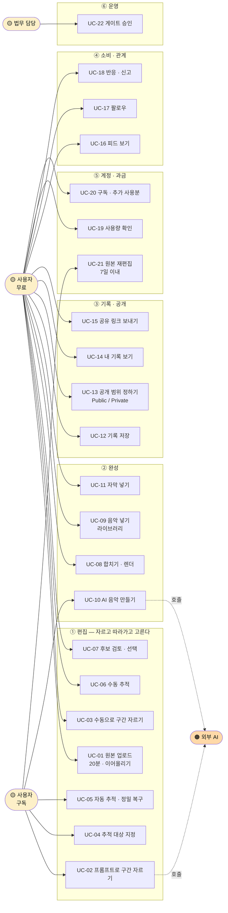
```mermaid
flowchart LR
    A1(["🟡 사용자<br>무료"])
    A2(["🟡 사용자<br>구독"])
    A3(["🟡 법무 담당"])
    A4(["🟠 외부 AI"])

    subgraph B1["① 편집 — 자르고 따라가고 고른다"]
        UC1["UC-01 원본 업로드<br>20분 · 이어올리기"]
        UC2["UC-02 프롬프트로 구간 자르기"]
        UC3["UC-03 수동으로 구간 자르기"]
        UC4["UC-04 추적 대상 지정"]
        UC5["UC-05 자동 추적 · 정밀 복구"]
        UC6["UC-06 수동 추적"]
        UC7["UC-07 후보 검토 · 선택"]
    end
    subgraph B2["② 완성"]
        UC8["UC-08 합치기 · 렌더"]
        UC9["UC-09 음악 넣기<br>라이브러리"]
        UC10["UC-10 AI 음악 만들기"]
        UC11["UC-11 자막 넣기"]
    end
    subgraph B3["③ 기록 · 공개"]
        UC12["UC-12 기록 저장"]
        UC13["UC-13 공개 범위 정하기<br>Public / Private"]
        UC14["UC-14 내 기록 보기"]
        UC15["UC-15 공유 링크 보내기"]
    end
    subgraph B4["④ 소비 · 관계"]
        UC16["UC-16 피드 보기"]
        UC17["UC-17 팔로우"]
        UC18["UC-18 반응 · 신고"]
    end
    subgraph B5["⑤ 계정 · 과금"]
        UC19["UC-19 사용량 확인"]
        UC20["UC-20 구독 · 추가 사용분"]
        UC21["UC-21 원본 재편집<br>7일 이내"]
    end
    subgraph B6["⑥ 운영"]
        UC22["UC-22 게이트 승인"]
    end

    A1 --> UC1 & UC3 & UC6 & UC7 & UC8 & UC9 & UC11 & UC12 & UC13 & UC14 & UC15 & UC16 & UC17 & UC18 & UC19 & UC20
    A2 --> UC2 & UC4 & UC5 & UC10 & UC21
    A3 --> UC22
    UC2 -.호출.-> A4
    UC10 -.호출.-> A4
    style A1 fill:#fdf0c8,color:#111
    style A2 fill:#fdf0c8,color:#111
    style A3 fill:#fdf0c8,color:#111
    style A4 fill:#ffd9a8,color:#111
```

## 1.3 Definitions

| 용어 | 정의 |
| --- | --- |
| **Server Action** | Next.js App Router에서 `'use server'`로 표시된 서버 실행 함수. 클라이언트에서 직접 호출 |
| **Route Handler** | `app/api/**/route.ts`의 HTTP 핸들러 |
| **Serverless Function** | Vercel에서 Route Handler·Server Action이 실행되는 단위. **실행 시간 상한이 있다** |
| **Signed URL** | Supabase Storage가 발급하는 시한부 직접 업로드·다운로드 주소 |
| **Resumable Upload** | 중단 지점부터 재개 가능한 업로드 프로토콜 |
| **RLS** | Row Level Security. PostgreSQL의 행 단위 접근 제어 |
| **인물 추적 (Person Tracking)** | 영상 프레임마다 특정 인물의 위치(bbox)를 산출하고 시간축으로 연결하는 것 |
| **영상 이해 (Video Understanding)** | 영상의 내용을 자연어로 기술하거나 구간을 분류하는 것. **좌표를 산출하지 않는다** |
| 🆕 **프롬프트 컷 (F25)** | 사용자가 특정 행동을 말하면 그 구간을 판정해 **영상을 자르는** 파이프라인 1단계. Gemini 구간 메타데이터 → Claude Haiku 4.5 대조 판정 |
| 🆕 **클립 (VideoSegment)** | F25가 잘라낸 구간. **트래킹의 입력 단위**이며 원본이 아니다 |
| 🆕 **Tracking Health** | 프레임마다 7신호를 모아 만드는 추적 건강도. **정상 구간 / 불확실 구간**을 가른다 [PoC §3.2] |
| 🆕 **정밀 복구 (Cutie)** | 불확실 구간(±4초 클립)만 GPU 서버에서 다시 추적해 궤적을 복원하는 것. **리프레이밍 크롭 경로도 이 단계에서 산출된다** [PoC §3.5] |
| 🆕 **N-Level** | 서버 호출 기준선을 조절하는 원가 손잡이(2 품질 / 3 균형 / 4 비용 방어) [PoC §3.4] |
| 🆕 **OFL** | SIL Open Font License. 상용 배포 가능하되 **표기 의무**가 있다 |

## 1.4 References

| ID | 문서 |
| --- | --- |
| **TREF-01** | 🔴 `PRD/HILiT_PRD_v0_2.md` — **이 문서의 기준 문서** |
| **TREF-02** | `[SRS]hilit-SRSv1.8.md` — 요구사항 ID 원천 |
| **TREF-03** | `[DS]hilit-DSv1.1.md` — 기술 중립 설계 |
| **TREF-04** | 🆕 `HILIT_추적PoC_기술기획서.md` — 추적 모델 4종 · 실측 성능·원가 |
| **TREF-05** | `VPS_v0_3.html` — 차별점 D1~D4 |
| **TREF-06** | Next.js App Router · Vercel · Supabase · Prisma · Vercel AI SDK 공식 문서 ⚠️ **버전별 제한값은 착수 시 재확인** |

## 1.5 Assumptions & Constraints

### 1.5.1 기술 제약 — 확정

**시스템 내부 — 단일 통합 프레임워크**

| ID | 제약 |
| --- | --- |
| **C-TEC-001** | 모든 서비스는 **Next.js (App Router)** 기반 단일 풀스택 프레임워크로 구현한다. 프론트엔드와 백엔드를 별도 분리하지 않는다 |
| **C-TEC-002** | 서버 측 로직(DB 접근·API 호출)은 **Server Actions 또는 Route Handlers**로 구현한다. 별도 백엔드 서버를 두지 않는다 |
| **C-TEC-003** | 데이터베이스는 **Prisma + 로컬 Supabase**로 개발환경을 구성하고, 배포 시 **Supabase(PostgreSQL)** 를 사용한다 |
| **C-TEC-004** | UI·스타일링은 **Tailwind CSS + shadcn/ui**를 사용한다 |

**시스템 외부 — 연결 및 AI 통합**

| ID | 제약 |
| --- | --- |
| **C-TEC-005** | AI 기능은 자체 서버 구축 없이 **Vercel AI SDK**로 Next.js에서 외부 API를 호출하는 형태로 구현한다 🔴 **PRD v0.2 ADR-2와 충돌 — §2.2 ②** |
| **C-TEC-006** | 외부 AI 호출은 **Google Gemini API**를 기본으로 하며, **환경 변수만으로 모델 교체**가 가능하도록 SDK 표준 인터페이스를 준수한다 🟡 **PRD v0.2가 Claude·Suno를 추가 — §2.3** |
| **C-TEC-007** | 배포·인프라는 **Vercel 단일화**하며, CI/CD 설정 없이 **Git Push만으로 배포**한다 |


### 📊 CT-1 · 시스템 경계

> **이 그림이 답하는 질문** — *"어디까지가 우리가 만드는 것이고, 어디부터가 남의 것인가?"*

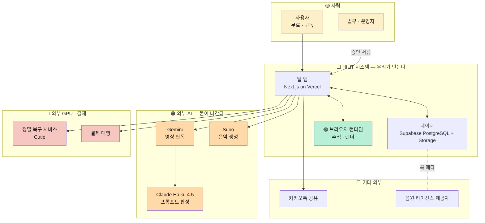
```mermaid
flowchart TB
    subgraph OUT1["🟡 사람"]
        U1["사용자<br>무료 · 구독"]
        U2["법무 · 운영자"]
    end
    subgraph SYS["⬜ HILiT 시스템 — 우리가 만든다"]
        direction TB
        S1["웹 앱<br>Next.js on Vercel"]
        S2["데이터<br>Supabase PostgreSQL + Storage"]
        S3["🟢 브라우저 런타임<br>추적 · 렌더"]
    end
    subgraph OUT2["🟠 외부 AI — 돈이 나간다"]
        E1["Gemini<br>영상 판독"]
        E2["Claude Haiku 4.5<br>프롬프트 판정"]
        E3["Suno<br>음악 생성"]
    end
    subgraph OUT3["🔴 외부 GPU · 결제"]
        E4["정밀 복구 서비스<br>Cutie"]
        E5["결제 대행"]
    end
    subgraph OUT4["⬜ 기타 외부"]
        E6["카카오톡 공유"]
        E7["음원 라이선스 제공자"]
    end
    U1 --> S1
    U2 -.승인 서류.-> S1
    S1 <--> S2
    S1 <--> S3
    S1 --> E1 --> E2
    S1 --> E3
    S1 --> E4
    S1 --> E5
    S1 --> E6
    S2 -.곡 메타.- E7
    style U1 fill:#fdf0c8,color:#111
    style U2 fill:#fdf0c8,color:#111
    style S3 fill:#b9f0d5,color:#111
    style E1 fill:#ffd9a8,color:#111
    style E2 fill:#ffd9a8,color:#111
    style E3 fill:#ffd9a8,color:#111
    style E4 fill:#f6c7c0,color:#111
    style E5 fill:#f6c7c0,color:#111
```

### 1.5.2 제약에서 파생되는 전제

| # | 전제 | 근거 |
| --- | --- | --- |
| **A-T1** | 서버 실행 시간에 **상한이 있다** | Serverless Function의 성질 (C-TEC-002 · 007) |
| **A-T2** | 요청 본문 크기에 **상한이 있다** | 동일 |
| **A-T3** | **장시간 백그라운드 워커를 둘 수 없다** | 별도 서버 금지 (C-TEC-002) |
| **A-T4** | **Vercel에서 GPU를 직접 사용할 수 없다** | 외부 API 호출만 허용 (C-TEC-005) |
| **A-T5** | AI 능력은 **호출 가능한 외부 API가 제공하는 범위**로 한정된다 | C-TEC-006 |
| **A-T6** | 상태 저장은 **PostgreSQL + Supabase Storage**로 한정된다 | C-TEC-003 |
| 🆕 **A-T7** | **"단말"은 이 스택에서 브라우저를 뜻한다** — 네이티브 앱이 없으므로 PRD가 말하는 단말 추적은 **브라우저 런타임**(WASM·WebGPU)에서 실행된다 | C-TEC-001 · 004 |
| 🆕 **A-T8** | **결제는 외부 대행사를 통한다** — 자체 결제 서버를 둘 수 없다 | C-TEC-002 · PRD F28 |
| 🔴 🆕 **A-T9** | **브라우저에서 도는 작업은 "탭이 살아 있는 동안"만 산다** — 라우트 이동은 같은 탭 안이므로 살아남고, **탭·브라우저 종료는 죽인다.** Service Worker 백그라운드 실행은 기각되었다(§6.5.3) | C-TEC-001 · A-T7 · PRD v0.3 F29 |

> ⚠️ **A-T1·A-T2의 구체적 수치는 플랜과 버전에 따라 다르므로 이 문서에 적지 않는다.** 착수 시 실측하고 확정한다. **다만 "20분 영상을 함수 안에서 처리할 수 없다"는 결론은 어떤 플랜에서도 성립한다.**
>
> 🔴 **A-T7이 v3.0의 새 전제다.** PRD v0.2 ADR-2는 추적을 "단말"에서 돌린다고 확정했는데, **PoC의 실측은 데스크톱 CPU 기준**이고 이 스택의 단말은 브라우저다. §2.2 ①이 이 간극을 다룬다.
>
> 🔴 **A-T9가 v3.2의 새 전제다** — 그리고 이것이 **F29를 가능하게 하는 동시에 F29의 한계를 정한다.**
>
> | 사용자 행동 | 브라우저 추적(F2b) | 외부 처리(컷·복구) |
> | --- | :--: | :--: |
> | 편집 화면 → 피드로 이동 *(같은 탭)* | 🟢 **계속 돈다** — F29가 성립하는 이유 | 🟢 무관 |
> | 탭·브라우저 종료 | 🔴 **죽는다** — 끝난 클립만 남는다(R3) | 🟢 무관 — webhook이 DB에 쓴다 |
> | 다른 탭으로 전환 *(백그라운드 탭)* | 🔺 **브라우저가 스로틀링한다** — 느려지지만 죽지는 않는다 `[TBD]` | 🟢 무관 |
>
> **즉 F29는 "앱 안에서의 이동"만 보장한다.** 이 경계를 사용자에게 그대로 전달해야 한다 — **컷 대기에는 "닫아도 됩니다", 추적 대기에는 "이 탭은 열어 두세요"** 로 문구가 갈린다(PRD AC1-8 · AF-14).

---

# 2. 🔴 제약이 PRD v0.2 요구사항에 미치는 영향

**이 절이 이 문서의 존재 이유다.** 판정 대상은 🔴 **PRD §4.3의 기능 23건**이다 *(v0.2 22건 + v0.3 F29)*.

## 2.1 판정 요약

| 판정 | 건수 | 뜻 |
| :--: | ---: | --- |
| ✅ **구현 가능** | **13** | 스택 그대로 만족 |
| 🟡 **설계 변경 후 가능** | 🔴 **8** | 우회 설계 필요. 요구사항은 유지 *(v3.2 · F29 추가)* |
| 🔴 **제약 결정 필요** | **2** | 제약을 풀거나 PRD를 바꿔야 함 |

| 판정 | 기능 |
| :--: | --- |
| ✅ | F3 · F4 · F7 · F8 · F11 · F13 · F19 · F20 · F21 · F22 · F24 · F27 · F28 |
| 🟡 | F1 · F6 · F18a · F18b · F25 · F26 · **F2a** · 🔴 **F29** |
| 🔴 | **F2b**(단말 추적 실행 환경) · **F5a**(Hilit GPU Server) |

> **v2.2와 무엇이 달라졌나** — v2.2는 추적 4건을 "T1(외부 추론 API)로 해소됨"으로 판정했다. PRD v0.2가 **하이브리드**를 확정하면서 판정이 갈라졌다. F2a(재식별)는 단말 OSNet TFLite로 🟡, F2b·F5a는 **어디서 도는가**가 미결이라 🔴다.

> ### 🔴 F29를 🟡로 판정한 이유 — 배선은 되는데 성능이 미지수다 [v3.2]
> F29의 구성 요소는 **전부 이 스택에 이미 있다.** 그런데도 ✅가 아니다.
>
> | 구성 요소 | 이 스택의 수단 | 판정 |
> | --- | --- | :--: |
> | 전역 진행 미니바 | App Router **루트 레이아웃**에 Client Component 1개 | ✅ |
> | 대기 중 상태 수신 | **Supabase Realtime** 구독을 편집 화면 → **전역 레이아웃**으로 승격(§5.1) | ✅ |
> | 복귀 지점 기억 | `ProcessingJob.resume_route`(§4.1) — 서버가 정한다 | ✅ |
> | 라우트 이동 중 추적 유지 | SPA 클라이언트 내비게이션 → **Worker가 살아남는다**(A-T9) | ✅ |
> | 🔴 **추적 + 피드 재생 동시 실행** | **없다** — 자원을 나눠 쓰는 수밖에 없다 | 🔴 **미측정** |
>
> **마지막 한 줄이 판정을 🟡로 끌어내린다.** PoC의 131 fps·161 MB는 **추적 단독** 수치이고(PoC §5.4), 재생과 겹친 값은 이 프로젝트 어디에도 없다. **우회 설계(저부하 피드 모드)는 §6.5.5에 있으나 그 파라미터를 정할 근거가 아직 없다 — 이것이 T7이다.**


## 📊 FC-6 · 미결 결정이 무엇을 막는가

> **이 그림이 답하는 질문** — *"지금 개발을 시작하면 어디서 막히는가?"*

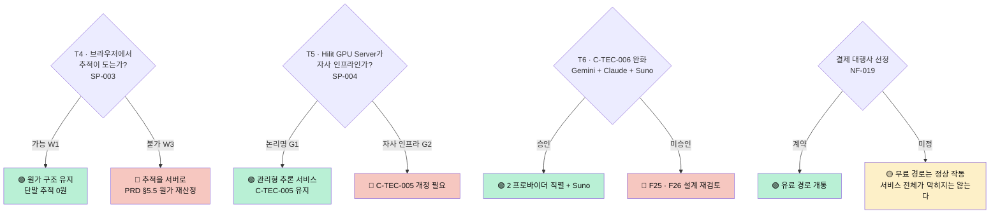
```mermaid
flowchart TD
    T4{"T4 · 브라우저에서<br>추적이 도는가?<br>SP-003"}
    T5{"T5 · Hilit GPU Server가<br>자사 인프라인가?<br>SP-004"}
    T6{"T6 · C-TEC-006 완화<br>Gemini + Claude + Suno"}
    PAY{"결제 대행사 선정<br>NF-019"}

    T4 -->|가능 W1| OK1["🟢 원가 구조 유지<br>단말 추적 0원"]
    T4 -->|불가 W3| NG1["🔴 추적을 서버로<br>PRD §5.5 원가 재산정"]
    T5 -->|논리명 G1| OK2["🟢 관리형 추론 서비스<br>C-TEC-005 유지"]
    T5 -->|자사 인프라 G2| NG2["🔴 C-TEC-005 개정 필요"]
    T6 -->|승인| OK3["🟢 2 프로바이더 직렬 + Suno"]
    T6 -->|미승인| NG3["🔴 F25 · F26 설계 재검토"]
    PAY -->|계약| OK4["🟢 유료 경로 개통"]
    PAY -->|미정| NG4["🟡 무료 경로는 정상 작동<br>서비스 전체가 막히지는 않는다"]

    style OK1 fill:#b9f0d5,color:#111
    style OK2 fill:#b9f0d5,color:#111
    style OK3 fill:#b9f0d5,color:#111
    style OK4 fill:#b9f0d5,color:#111
    style NG1 fill:#f6c7c0,color:#111
    style NG2 fill:#f6c7c0,color:#111
    style NG3 fill:#f6c7c0,color:#111
    style NG4 fill:#fdf0c8,color:#111
```

## 2.2 🔴 제약 결정이 필요한 3건 *(v3.2 — ③ 신설)*

### ① F2b 클립별 추적 — **브라우저에서 도는가**

| 항목 | PRD v0.2가 요구하는 것 | 이 스택의 상태 |
| --- | --- | --- |
| 실행 위치 | **단말** (ADR-2) | A-T7 — 단말 = **브라우저** |
| 모델 | NanoTrack / LightTrack + **OSNet TFLite** | 브라우저 실행 경로는 **ONNX Runtime Web · TFLite WASM · WebGPU** |
| 성능 근거 | **131 fps · peak 161 MB** [PoC §5.4] | 🔴 **개발 PC CPU 실측이며 브라우저 수치가 아니다** |
| 요구 임계 | ≥ 30 fps · ≤ 300 MB (PRD §5.1) | **미측정** |

**무엇이 문제인가** — PRD는 "단말에서 131 fps로 돈다"를 원가 구조의 전제로 삼았다(§5.5: 단말 추적은 원가 0). **그 전제가 브라우저에서도 성립하는지는 아무도 재지 않았다.** WASM은 네이티브 대비 통상 느리고, 모바일 브라우저는 더 느리다.

| 경로 | 설계 | 판정 |
| :--: | --- | :--: |
| **W1** | **ONNX Runtime Web (WASM SIMD + 멀티스레드)** — 모델 4종 중 3종(NanoTrack·OSNet·NanoDet)을 ONNX로 변환해 브라우저 실행 | 🟡 **가장 유력** — 모델이 작다(합계 6.5 MB) |
| **W2** | **WebGPU 백엔드** — 지원 브라우저에서만 가속 | 🟡 보조 — **지원 편차가 크다** |
| **W3** | 추적도 서버로 — 브라우저 추적 포기 | 🔴 **PRD ADR-2를 뒤집는다.** 원가 구조가 무너진다(§5.5) |

> 🔺 **[TBD·결정 필요]** W1을 기본으로 하되, **착수 전에 브라우저 실측(fps·메모리·발열)을 Gate A와 같은 관문에 둔다.** PRD R8(단말 발열 미측정)이 이 스택에서는 **브라우저 탭 성능**으로 구체화된다.

### ② F5a·정밀 복구 — **"Hilit GPU Server"가 C-TEC-005와 충돌한다**

PRD v0.2는 불확실 구간 복구와 **리프레이밍 크롭 경로 산출**을 **"Hilit GPU Server(Cutie)"** 에 둔다. 문구 그대로 읽으면 **자사 GPU 서버**이고, 이는 C-TEC-005(*"자체 서버 구축 없이"*)·A-T4와 정면으로 부딪힌다.

| 구현 경로 | 내용 | C-TEC-005 | 원가 | 판정 |
| :--: | --- | :--: | --- | :--: |
| **G1** | **관리형 추론 서비스에 Cutie를 배포**(Replicate·Modal 등) — "Hilit GPU Server"를 **논리적 이름**으로 읽고 물리 구현은 외부 API | ✅ **유지** — 자체 서버가 아니라 외부 API 하나 | 호출당 과금 · PoC 실측 **10~17원/회** | ✅ **권고** |
| **G2** | 자사 GPU 인스턴스 직접 운영 | 🔴 **위반** | 상시 인스턴스 비용 | 🔴 |
| **G3** | 복구 없이 단말 결과만 사용 | ✅ | 0 | 🔴 **PoC §7.3 — 모바일 재획득(Lv2)이 한 번도 성공하지 못했다.** 복구를 빼면 실패 구간이 그대로 남는다 |

> 🔺 **[TBD·결정 필요]** **G1을 권고한다.** v2.2의 T1 결정(*"전용 추론 서비스는 자체 서버가 아니라 또 하나의 외부 API다"*)이 그대로 적용된다. **다만 PRD의 "Hilit GPU Server"라는 표현이 자사 인프라를 뜻한다면 C-TEC-005를 개정해야 한다** — 문구 확인이 필요하다(§9-1).

### 🔴 ③ F29 대기 중 소비 — **추적과 피드 재생이 같은 브라우저를 나눠 쓴다** 🆕 v3.2

PRD v0.3 F29는 추적이 도는 동안 사용자가 피드를 보게 한다. **이 스택에서 둘은 같은 탭, 같은 프로세스다.**

| 항목 | PRD v0.3이 요구하는 것 | 이 스택의 상태 |
| --- | --- | --- |
| 대기 중 사용자 위치 | 편집 화면 밖 — **피드**(F13·F22) | ✅ SPA 내비게이션이므로 Worker는 살아남는다(A-T9) |
| 추적 실행 | **계속 돈다** | 🟢 돈다 — 다만 **재생과 자원을 다툰다** |
| 피드 재생 | **정상 소비** | 🔴 **`<video>` 디코딩 + 프리페치가 Worker와 CPU·메모리·대역을 나눈다** |
| 요구 임계 | 추적 하락 ≤ 30% · 피드 첫 프레임 p95 ≤ 3초 (PRD §5.1) | 🔴 **둘 다 가설. 측정된 적 없다** |

**무엇이 문제인가** — v3.0 §6.5.3과 FC-5는 *"브라우저 작업은 직렬이고 동시 실행이 없다"* 는 전제로 발열·처리량을 **합산 하나**로 계측하기로 했다. **F29가 이 전제를 깬다.** 합산 계측만으로는 *"추적이 느린 것"* 과 *"재생이 끊기는 것"* 을 구분할 수 없고, 구분하지 못하면 어느 쪽을 낮출지 정할 수 없다.

| 경로 | 설계 | 판정 |
| :--: | --- | :--: |
| **P1** | **추적 우선 · 저부하 피드 모드** — 추적 중에는 재생 해상도 하향 · 프리페치 축소 · **동시 디코딩 1개** · 자동재생 유지 | 🟡 **권고** — 🔴 **추적을 늦추지 않는다.** 추적이 느려지면 대기가 길어지고, 그러면 F29가 풀려던 문제 자체가 커진다 |
| **P2** | **피드 우선 · 추적 스로틀** — 재생 중 추적 fps를 낮춘다 | 🔴 **기각** — 대기 시간이 늘어난다. **F29는 대기를 견디게 하는 기능이지 늘리는 기능이 아니다** |
| **P3** | **정지 이미지 피드** — 추적 중에는 썸네일·정지 프레임만 | 🟡 **저사양 단말의 폴백** — 기본값으로 쓰면 "피드를 본다"가 성립하지 않는다 |
| **P4** | **추적 중 피드 진입 차단** | 🔴 **F29를 끄는 것과 같다** — 최후 수단(PRD ADR-6 되돌리기 조건) |

> 🔺 **[TBD·결정 필요 — T7]** **P1을 기본, P3을 저사양 폴백으로 권고한다.** 다만 **"저부하"의 파라미터(해상도·프리페치 개수·디코딩 동시성)를 정할 근거가 없다.** 🔴 **새 실험을 만들지 않는다** — **SP-003(브라우저 추적 실측)에 "피드 재생 중" 조건을 추가**해 같은 회차에 판정한다(PRD Q21).
>
> 🔴 **그 전까지의 기본값은 보수적으로 P3에 가깝게 둔다.** 근거 없이 P1을 켜면 **추적 실패가 늘어도 원인을 F29로 지목하지 못한다** — 계측이 단독/동시로 나뉘기 전에는 두 원인이 섞인다.


## 📊 FC-5 · 브라우저 자원 — 무엇이 언제 도는가 🔄 **v3.2 재작성**

> **이 그림이 답하는 질문** — *"추적도 브라우저, 피드 재생도 브라우저, 렌더도 브라우저면 폰이 버티는가?"*

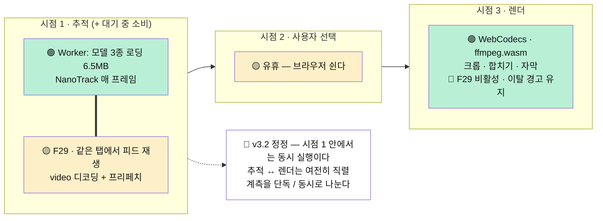
```mermaid
flowchart LR
    subgraph T1["시점 1 · 추적 (+ 대기 중 소비)"]
        direction TB
        A["🟢 Worker: 모델 3종 로딩 6.5MB<br>NanoTrack 매 프레임"]
        A2["🟡 F29 · 같은 탭에서 피드 재생<br>video 디코딩 + 프리페치"]
        A === A2
    end
    subgraph T2["시점 2 · 사용자 선택"]
        B["🟡 유휴 — 브라우저 쉰다"]
    end
    subgraph T3["시점 3 · 렌더"]
        C["🟢 WebCodecs · ffmpeg.wasm<br>크롭 · 합치기 · 자막<br>🔴 F29 비활성 · 이탈 경고 유지"]
    end
    T1 --> T2 --> T3
    N1["🔴 v3.2 정정 — 시점 1 안에서는 동시 실행이다<br>추적 ↔ 렌더는 여전히 직렬<br>계측을 단독 / 동시로 나눈다"]
    T1 -.-> N1
    style A fill:#b9f0d5,color:#111
    style A2 fill:#fdf0c8,color:#111
    style B fill:#fdf0c8,color:#111
    style C fill:#b9f0d5,color:#111
    style N1 fill:#fff,color:#111
```

> ### 🔴 무엇이 바뀌었고 무엇은 그대로인가 [v3.2]
>
> | 관계 | v3.0·v3.1 | **v3.2** |
> | --- | :--: | :--: |
> | 시점1 추적 ↔ 시점3 렌더 | 직렬 | ✅ **그대로 직렬** — 선택이 사이에 있어 겹칠 수 없다 |
> | 시점1 **안**: 추적 ↔ 피드 재생 | *(존재하지 않던 관계)* | 🔴 **동시** — F29가 만든 새 겹침 |
> | 발열·처리량 계측 | 두 단계 **합산** | 🔴 **단독 / 동시로 분리** + 두 단계 합산 |
>
> **`===`(굵은 선)이 동시 실행을 뜻한다.** 화살표가 아닌 이유는 순서가 없기 때문이다 — 둘은 같은 시간에 같은 자원을 쓴다.
>
> 🔴 **시점 3에는 이 겹침이 없다.** 렌더 중에는 F29가 꺼지고 이탈 경고(R1)가 유지되므로, **렌더는 v3.0의 계측 방식이 그대로 유효하다.**

## 2.3 🟡 설계 변경 후 가능 8건 *(v3.2 — F29 추가)*

| 기능 | 요구 | 우회 설계 |
| --- | --- | --- |
| **F1** 업로드 | **20분** 원본 · 이어올리기 | 🟡 **A-T2 우회** — Route Handler를 경유하지 않고 **Supabase Storage로 직접 업로드**(Signed URL) · resumable upload. 🟢 **20분 상한(PRD v0.2)이 v2.2의 40~50분보다 유리하다** |
| **F25** 프롬프트 컷 | Gemini 판독 → Claude Haiku 4.5 판정 | 🟡 **A-T1·A-T3 우회** — 20분 영상 판독을 Serverless Function 안에서 끝낼 수 없다. **작업 큐 + Route Handler webhook**으로 비동기화(§7.3). 🟡 **C-TEC-006 완화 필요** — Gemini 단일이 아니라 **두 프로바이더 직렬** |
| **F2a** 대상 지정·재식별 | OSNet TFLite Re-ID | 🟡 **A-T7** — 브라우저 실행(§2.2 ①). 모델이 0.9 MB로 작아 4종 중 부담이 가장 낮다 |
| **F6** 합치기·렌더 | p95 ≤ 90초 | 🟡 **A-T1.** 서버 렌더 불가 → **클라이언트 렌더**(WebCodecs·ffmpeg.wasm) · 단말 성능 편차가 새 위험(§3.4) |
| **F18a** 음악 라이브러리 | 저작권 정리된 곡만 | 🟡 기술 규모는 낮으나 **차단 요인이 계약**이다 → `MUSIC_LICENSE` 게이트 |
| **F18b** 자막 | 편집 + **OFL 폰트 5종** | 🟡 **OFL 표기 의무**를 앱 내에 노출해야 한다(AC7-2) · 웹폰트 서브셋으로 용량 관리 |
| **F26** AI 음악 | Suno 생성 · 1회 2곡 | 🟡 **C-TEC-006 완화 필요** — Suno는 Vercel AI SDK 프로바이더가 아니므로 **직접 REST 호출**. 생성이 길면 F25와 같은 비동기 패턴 |
| 🔴 **F29** 대기 중 소비 | 미니바 · 대기 중 피드 · 완료 복귀 | 🟡 **A-T9 활용 + 자원 배분 설계 필요** — 배선(전역 레이아웃 미니바 · Realtime 승격 · `resume_route`)은 스택 그대로 되지만, 🔴 **추적과 피드 재생이 같은 탭에서 겹치는 구간의 파라미터가 미결**이다(§2.2 ③ · §6.5.5 · **T7**) |

## 2.4 결정 요약

| # | 대상 | 결정 | 상태 |
| :--: | --- | --- | :--: |
| **T1** *(v2.2 승계)* | 추적 추론 | **외부 관리형 추론 서비스로 위임** — 자체 서버를 두지 않는다 | ✅ 유지 |
| 🆕 **T4** | **F2b 단말 추적** | **W1 — ONNX Runtime Web** 기본 · 브라우저 실측을 Gate A 관문에 포함 | 🔺 **[TBD]** |
| 🆕 **T5** | **Cutie 정밀 복구·F5a** | **G1 — 관리형 추론 서비스** · "Hilit GPU Server"는 논리명으로 읽는다 | 🔺 **[TBD]** |
| 🆕 **T6** | **C-TEC-006 완화** | **Gemini + Claude Haiku 4.5 + Suno** 3개 외부 AI 허용 · AI SDK 표준은 앞의 둘에만 적용 | 🔺 **[TBD]** |
| 🔴 🆕 **T7** | **F29 대기 중 자원 배분** | **P1 — 추적 우선 · 저부하 피드 모드** 기본 · **P3(정지 이미지)** 를 저사양 폴백 · 🔴 **추적을 늦추는 P2는 채택하지 않는다** · 파라미터는 **SP-003에 조건을 추가해** 판정 | 🔺 **[TBD]** *(v3.2)* |

> **T4·T5·T6이 확정되기 전에는 §3 이후의 설계가 가설이다.** 세 결정 모두 **Phase 1 착수 전**이 기한이다(§9).
>
> 🔴 **T7은 성격이 다르다** [v3.2]. T4·T5·T6은 **미확정이면 만들 수 없는** 결정이지만, **T7은 미확정이어도 만들 수 있고 켜기만 못 한다.** F29의 배선(미니바·구독 승격·복귀)은 T7과 무관하게 구현되며, T7이 정하는 것은 **추적 중 피드를 어느 수준으로 돌릴지의 기본값 하나**다. 그래서 T7은 **착수 차단이 아니라 출시 기본값 결정**으로 다룬다 — 보수적 기본값(P3)으로 먼저 내보내고 실측 후 완화한다.

**§3 이후는 T1 · T4(W1) · T5(G1) · T6을 전제로 하며, 🔴 §6.5.5는 T7을 전제로 한다.**

---

# 3. System Architecture

## 3.1 단일 앱 구성 (C-TEC-001 · 002)

> **이 그림이 답하는 질문** — *"코드가 어떤 덩어리로 나뉘고, 각 덩어리는 누구와 이야기하는가?"*

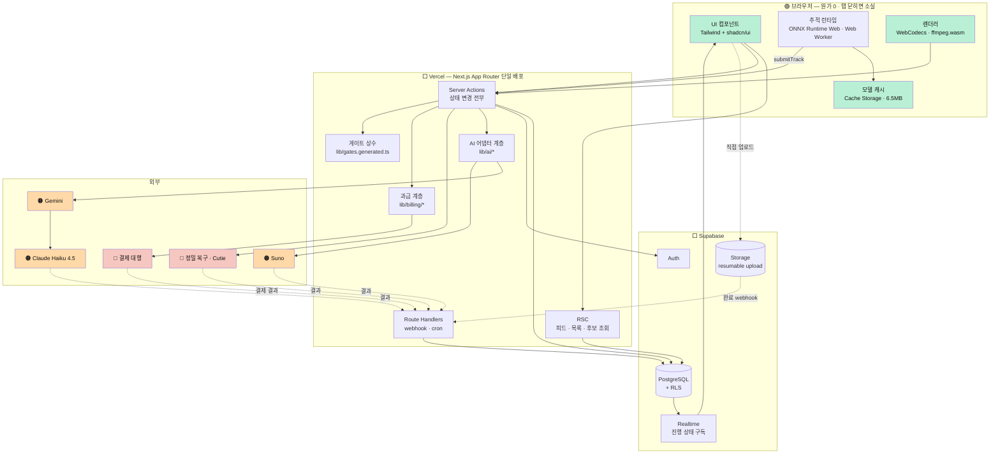
```mermaid
flowchart TB
    subgraph BR["🟢 브라우저 — 원가 0 · 탭 닫히면 소실"]
        direction LR
        C1["UI 컴포넌트<br>Tailwind + shadcn/ui"]
        C2["추적 런타임<br>ONNX Runtime Web · Web Worker"]
        C3["렌더러<br>WebCodecs · ffmpeg.wasm"]
        C4["모델 캐시<br>Cache Storage · 6.5MB"]
    end
    subgraph VC["⬜ Vercel — Next.js App Router 단일 배포"]
        direction LR
        S1["RSC<br>피드 · 목록 · 후보 조회"]
        S2["Server Actions<br>상태 변경 전부"]
        S3["Route Handlers<br>webhook · cron"]
        S4["AI 어댑터 계층<br>lib/ai/*"]
        S5["과금 계층<br>lib/billing/*"]
        S6["게이트 상수<br>lib/gates.generated.ts"]
    end
    subgraph SB["⬜ Supabase"]
        direction LR
        D1[("PostgreSQL<br>+ RLS")]
        D2[("Storage<br>resumable upload")]
        D3["Realtime<br>진행 상태 구독"]
        D4["Auth"]
    end
    subgraph EX["외부"]
        direction LR
        X1["🟠 Gemini"]
        X2["🟠 Claude Haiku 4.5"]
        X3["🟠 Suno"]
        X4["🔴 정밀 복구 · Cutie"]
        X5["🔴 결제 대행"]
    end

    C1 --> S1
    C1 --> S2
    C1 -.직접 업로드.-> D2
    C2 --> C4
    C2 -->|submitTrack| S2
    C3 --> S2
    S1 --> D1
    S2 --> D1
    S2 --> D4
    S3 --> D1
    S2 --> S4 --> X1 --> X2
    S4 --> X3
    S2 --> X4
    S2 --> S5 --> X5
    S2 --> S6
    D2 -.완료 webhook.-> S3
    X2 -.결과.-> S3
    X3 -.결과.-> S3
    X4 -.결과.-> S3
    X5 -.결제 결과.-> S3
    D1 --> D3 --> C1
    style C1 fill:#b9f0d5,color:#111
    style C3 fill:#b9f0d5,color:#111
    style C4 fill:#b9f0d5,color:#111
    style X1 fill:#ffd9a8,color:#111
    style X2 fill:#ffd9a8,color:#111
    style X3 fill:#ffd9a8,color:#111
    style X4 fill:#f6c7c0,color:#111
    style X5 fill:#f6c7c0,color:#111
```

## 3.2 파이프라인 4단계와 실행 위치 🆕

**PRD v0.2 §4.1의 순서를 그대로 옮긴다** — ① 자르고 → ② 자른 것만 추적하고 → ③ 고른 것만 완성한다.

| 단계 | PRD 기능 | 실행 위치 | 이 스택의 구현 | REQ |
| :--: | --- | --- | --- | --- |
| **①** | **F25 프롬프트 컷** | **외부 AI** | Server Action이 큐 등록 → Gemini → Claude Haiku 4.5 → webhook | REQ-FUNC-028 |
| **②** | F2a 대상 지정 · **F2b 클립별 추적** | **브라우저** (T4·W1) | ONNX Runtime Web · 매 프레임 NanoTrack, 20/5프레임 OSNet | REQ-FUNC-002 · 003 |
| **②** | 불확실 구간 **정밀 복구 + F5a 크롭 경로** | **관리형 추론 서비스** (T5·G1) | Route Handler → Cutie → webhook | REQ-FUNC-003 · 006 |
| **②** | F3 후보 · F4 선택 | 서버 · 브라우저 | RSC 조회 + Server Action | REQ-FUNC-004 · 005 |
| **③** | F5a 고화질 적용 · F6 · F18a · F26 · F18b | **브라우저** | WebCodecs · ffmpeg.wasm | REQ-FUNC-006 · 007 · 008 · 026 · 030 |
| **④** | F7 · F8 · F22 | 서버 | Server Action + RLS | REQ-FUNC-009 · 010 · 011 |
| 🔴 **⑦** | **F29 대기 중 소비 · 완료 복귀** *(①·②에 겹쳐 돈다)* | **브라우저 전역 + 서버** | 루트 레이아웃 미니바 · **Realtime 전역 구독** · `ProcessingJob.resume_route` | 🆕 **REQ-FUNC-033 · REQ-NF-018** |

> ### 🔴 각 단계가 다음 단계의 입력을 줄인다 — 이것이 이 스택에서 특히 중요하다
> ```
> 원본 20분
>   │  ① F25 프롬프트 컷 ──→ 클립 N개 (예: 1분)
>   │                          ↑ 브라우저 추적은 여기서부터 — 20분이 아니라 1분을 돈다
>   │  ② 클립별 추적 ─────→ 정상 구간 + 불확실 구간
>   │                          ↑ 외부 추론 호출은 불확실 구간만
>   │  ③ 선택 ───────────→ 고른 클립만
>   │                          ↑ 브라우저 렌더 부담이 여기서 결정된다
>   └─ 완성 ─────────────→ 결과물 1편
> ```
> **A-T1(실행 시간 상한)·A-T7(브라우저 성능)이 동시에 완화된다.** 컷이 앞에 서는 PRD v0.2의 순서가 이 스택에 **구조적으로 유리하다** — 20분을 브라우저에서 추적하는 설계였다면 W1은 성립하기 어려웠다.

> ### 🔴 ⑦은 단계가 아니라 층이다 [v3.2]
> ①~④는 **입력을 줄이며 흘러가는** 단계지만, **⑦은 ①·②가 도는 동안 위에 얹히는 층**이다. 표에서 ⑦을 맨 아래 둔 이유는 순서가 마지막이어서가 아니라 **순서가 없기 때문**이다.
>
> | | ①~④ | **⑦ F29** |
> | --- | --- | --- |
> | 다루는 것 | 영상 데이터 | **사용자 화면의 위치** |
> | 실행 시점 | 순서대로 | ①·② **와 동시에** |
> | ③ 렌더 구간 | 해당 | 🔴 **비활성** — 이탈 시 소실되므로 |
>
> 🔴 **그래서 ⑦은 ①·②의 실행 위치를 바꾸지 않는다.** 컷은 여전히 외부, 추적은 여전히 브라우저다. ⑦이 바꾸는 것은 **그 상태를 어디서 볼 수 있는가**(편집 화면 → 앱 전역)뿐이다.


## 📊 FC-1 · 전체 파이프라인 — 🔴 이 문서에서 가장 먼저 볼 그림

> **이 그림이 답하는 질문** — *"영상을 올리고 나서 결과물이 나오기까지, 순서가 정확히 어떻게 되는가?"*

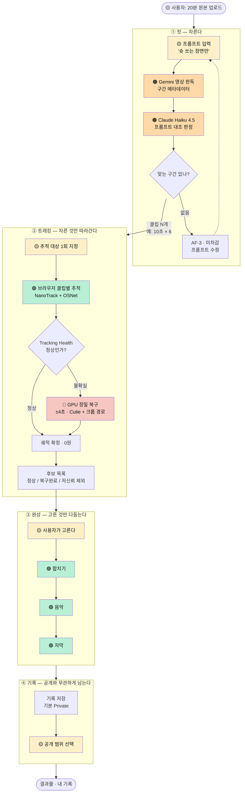
```mermaid
flowchart TD
    START(["🟡 사용자: 20분 원본 업로드"]) --> P1

    subgraph P1["① 컷 — 자른다"]
        direction TB
        A1["🟡 프롬프트 입력<br>'슛 쏘는 장면만'"] --> A2["🟠 Gemini 영상 판독<br>구간 메타데이터"]
        A2 --> A3["🟠 Claude Haiku 4.5<br>프롬프트 대조 판정"]
        A3 --> A4{"맞는 구간 있나?"}
        A4 -->|없음| AF3["AF-3 · 미차감<br>프롬프트 수정"]
        AF3 -.-> A1
    end

    A4 -->|"클립 N개<br>예: 10초 × 6"| P2

    subgraph P2["② 트래킹 — 자른 것만 따라간다"]
        direction TB
        B1["🟡 추적 대상 1회 지정"] --> B2["🟢 브라우저 클립별 추적<br>NanoTrack + OSNet"]
        B2 --> B3{"Tracking Health<br>정상인가?"}
        B3 -->|정상| B5["궤적 확정 · 0원"]
        B3 -->|불확실| B4["🔴 GPU 정밀 복구<br>±4초 · Cutie + 크롭 경로"]
        B4 --> B5
        B5 --> B6["후보 목록<br>정상 / 복구완료 / 저신뢰 제외"]
    end

    B6 --> P3

    subgraph P3["③ 완성 — 고른 것만 다듬는다"]
        direction TB
        C1["🟡 사용자가 고른다"] --> C3["🟢 합치기"]
        C3 --> C4["🟢 음악"] --> C5["🟢 자막"]
    end

    P3 --> P4

    subgraph P4["④ 기록 — 공개와 무관하게 남는다"]
        direction TB
        D1["기록 저장<br>기본 Private"] --> D2["🟡 공개 범위 선택"]
    end

    P4 --> END(["결과물 · 내 기록"])

    style A1 fill:#fdf0c8,color:#111
    style A2 fill:#ffd9a8,color:#111
    style A3 fill:#ffd9a8,color:#111
    style B1 fill:#fdf0c8,color:#111
    style B2 fill:#b9f0d5,color:#111
    style B4 fill:#f6c7c0,color:#111
    style C1 fill:#fdf0c8,color:#111
    style C3 fill:#b9f0d5,color:#111
    style C4 fill:#b9f0d5,color:#111
    style C5 fill:#b9f0d5,color:#111
    style D2 fill:#fdf0c8,color:#111
```

## 📊 CP-2 · 실행 위치 배치도

> **이 그림이 답하는 질문** — *"같은 파이프라인인데 각 단계는 물리적으로 어디서 도는가? 그리고 각각 얼마인가?"*

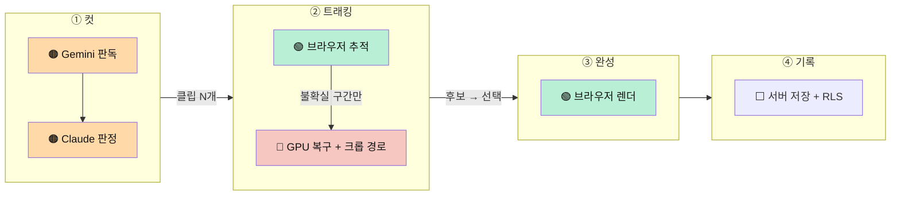
```mermaid
flowchart LR
    subgraph P1["① 컷"]
        direction TB
        A1["🟠 Gemini 판독"] --> A2["🟠 Claude 판정"]
    end
    subgraph P2["② 트래킹"]
        direction TB
        B1["🟢 브라우저 추적"] -->|불확실 구간만| B2["🔴 GPU 복구 + 크롭 경로"]
    end
    subgraph P3["③ 완성"]
        direction TB
        C1["🟢 브라우저 렌더"]
    end
    subgraph P4["④ 기록"]
        direction TB
        D1["⬜ 서버 저장 + RLS"]
    end
    P1 -->|"클립 N개"| P2 -->|"후보 → 선택"| P3 --> P4
    style A1 fill:#ffd9a8,color:#111
    style A2 fill:#ffd9a8,color:#111
    style B1 fill:#b9f0d5,color:#111
    style B2 fill:#f6c7c0,color:#111
    style C1 fill:#b9f0d5,color:#111
```

## 3.3 계층 책임

| 계층 | 구현 | 담당 요구사항 |
| --- | --- | --- |
| **RSC (서버 컴포넌트)** | 피드·기록 목록·후보 목록 조회 · 초기 렌더 | REQ-FUNC-004 · 011 · 014 · REQ-NF-001 |
| **Client Component** | 컷 프롬프트 입력 · 후보 선택 · 자막 편집 · 렌더 진행 | REQ-FUNC-005 · 010 · 026 · 028 |
| 🆕 **브라우저 추적 런타임** | 클립별 인물 추적 · Tracking Health 판정 | **REQ-FUNC-002 · 003** |
| **Server Action** | 상태 변경 전부 (컷 요청·선택·기록·반응·팔로우·사용량) | REQ-FUNC-005 · 009 · 010 · 012 · 015~017 · 028 · 030~032 |
| **Route Handler** | 외부 webhook 수신 · Vercel Cron · 업로드 완료 통지 | REQ-FUNC-001 · 003 · 028 · 031 |
| **Supabase RLS** | 🔴 **공개 범위 강제** | **REQ-NF-009** |
| **Supabase Storage** | 원본·클립·결과물 · 직접 업로드 | REQ-FUNC-001 · REQ-NF-002 · 011 |
| **Supabase Realtime** | 컷·추적·복구 상태 구독 — 🔴 **v3.2: 편집 화면이 아니라 앱 전역(루트 레이아웃)에서 구독한다** | SC-1.F4 · 🆕 **SC-1.F7** |
| 🔴 🆕 **루트 레이아웃 (Client)** | **진행 미니바** — 활성 작업 1건의 단계·진행률·완료 알림 · 모든 라우트에 상주 | 🆕 **REQ-FUNC-033** |
| **Vercel AI SDK** | Gemini · Claude 호출 추상화 | REQ-FUNC-028 |

## 3.4 🔴 서버 렌더를 클라이언트로 옮긴다

**A-T1 때문에 서버에서 영상을 인코딩할 수 없다.** 렌더를 클라이언트로 이전한다.

| 항목 | 서버 렌더(v1.8) | **클라이언트 렌더(v3.0)** |
| --- | --- | --- |
| 실행 위치 | GPU 인프라 | **브라우저** |
| 소요 | p95 ≤ 90초 (REQ-NF-004) | 🔺 **단말 성능에 종속** — 재정의 필요 |
| 실패 처리 | 서버 재시도 3회 | 단말 재시도 · **선택 상태는 서버 보존** |
| 원가 | 편당 GPU | **0** — 사용자 단말 부담 |
| 새 위험 | — | 🔴 **구형 단말에서 완성 불가** · 배터리·발열 |
| 🆕 **경합** | — | 🔴 **같은 브라우저가 추적(§2.2 ①)도 돌린다.** 두 부하가 겹치지 않도록 **단계를 직렬화**한다 · 🔴 **v3.2: 렌더 ↔ 추적은 그대로 직렬이나, 추적 ↔ 피드 재생은 F29로 겹친다**(§6.5.5) |

> **원가가 0이 되는 대신 성공률이 단말에 종속된다.** REQ-NF-004(p95 ≤ 90초)를 **단말 등급별로 재정의**해야 하며, 저사양 단말에서의 실패는 SC-3.F1(선택 상태 보존)로 흡수한다.
>
> 🆕 **v3.0의 새 부담** — 추적과 렌더가 **같은 브라우저에서 순차로** 돈다. 추적이 끝나야 선택이 열리고, 선택이 끝나야 렌더가 시작되므로 **동시 실행은 없다.** 다만 누적 발열은 합산되므로 R8(발열) 계측을 **두 단계 합산**으로 잡는다.
>
> 🔴 **v3.2 보정 — 위 문단의 "동시 실행은 없다"는 추적 ↔ 렌더에만 해당한다.** F29가 들어오면서 **추적 ↔ 피드 재생**이라는 새 겹침이 생겼다. 따라서 계측을 **세 갈래**로 나눈다.
>
> | 계측 | 무엇을 알려주는가 |
> | --- | --- |
> | **추적 단독** | PoC 대비 브라우저 성능 — T4의 원래 질문 |
> | 🔴 **추적 + 피드 재생 동시** | **F29가 추적에 얼마를 물리는가** — T7의 질문 |
> | **추적 + 렌더 누적(세션 전체)** | 발열·배터리 — R8의 원래 질문 |
>
> 🔴 **합산 하나로 재면 세 질문이 섞여 어느 것도 답하지 못한다.** v3.0이 "두 단계 합산"으로 잡은 것은 겹침이 없다는 전제 때문이었고, **그 전제가 사라졌으므로 계측 설계도 함께 바뀐다.**

---

# 4. Data Design (C-TEC-003)

## 4.1 Prisma 스키마 — 핵심 발췌

**PRD §6.1 엔티티를 Prisma·PostgreSQL로 사상한다.** v2.2 대비 **`Group` 삭제 · `CutRequest`·`VideoSegment`·`RecoveryJob`·`Subtitle`·`UsageLedger` 신설**이고, 🔴 **v3.2에서 `ProcessingJob`이 F29 때문에 발췌에 들어왔다** — v3.0까지는 관계 필드로만 등장했으나, **`resume_route`·`progress_num`·`progress_den`이 미니바와 복귀의 유일한 원천**이 되면서 본문에 적을 이유가 생겼다.

```prisma
model User {
  id                String    @id @default(dbgenerated("gen_random_uuid()")) @db.Uuid
  handle            String    @unique @db.VarChar(30)
  displayName       String    @db.VarChar(50)
  birthYear         Int?      @db.SmallInt
  guardianConsentAt DateTime?
  role              Role      @default(user)
  plan              Plan      @default(FREE)          // 🆕 F28
  createdAt         DateTime  @default(now())
  deletedAt         DateTime?

  sourceVideos SourceVideo[]
  records      Record[]
  usage        UsageLedger[]
  @@index([deletedAt])
  @@map("users")
}

model SourceVideo {
  id          String      @id @default(dbgenerated("gen_random_uuid()")) @db.Uuid
  ownerId     String      @db.Uuid
  durationSec Int                                     // 🔴 CHECK (duration_sec <= 1200) — 20분 상한
  sizeBytes   BigInt
  codec       String      @db.VarChar(20)
  storagePath String
  status      VideoStatus @default(UPLOADING)
  retainUntil DateTime?                               // 🆕 F27 — 업로드 + 7일
  createdAt   DateTime    @default(now())

  owner       User          @relation(fields: [ownerId], references: [id], onDelete: Cascade)
  cutRequests CutRequest[]
  segments    VideoSegment[]
  job         ProcessingJob?
  @@index([ownerId, createdAt(sort: Desc)])
  @@index([retainUntil])                              // 🆕 만료 배치용
  @@map("source_videos")
}

/// 🆕 F25 — 사용자 프롬프트 1건. Gemini·Claude 호출 근거이자 원가 귀속 단위
model CutRequest {
  id            String       @id @default(dbgenerated("gen_random_uuid()")) @db.Uuid
  videoId       String       @db.Uuid
  prompt        String       @db.VarChar(500)
  videoModel    String       @db.VarChar(60)          // 예: gemini-2.0-flash
  judgeModel    String       @db.VarChar(60)          // 예: claude-haiku-4-5
  status        CutStatus    @default(QUEUED)
  costKrw       Decimal?     @db.Decimal(10, 2)       // 🔴 Q14 실측 귀속점
  createdAt     DateTime     @default(now())

  video    SourceVideo    @relation(fields: [videoId], references: [id], onDelete: Cascade)
  segments VideoSegment[]
  @@index([videoId, createdAt(sort: Desc)])
  @@map("cut_requests")
}

/// 🆕 F25 출력 = 트래킹의 입력. 원본이 아니라 이 단위로 추적한다
model VideoSegment {
  id           String   @id @default(dbgenerated("gen_random_uuid()")) @db.Uuid
  videoId      String   @db.Uuid
  cutRequestId String   @db.Uuid
  startMs      Int
  endMs        Int                                    // 🔴 CHECK (end_ms > start_ms)
  matchScore   Float                                  // F25 판정 점수
  createdAt    DateTime @default(now())

  video       SourceVideo         @relation(fields: [videoId], references: [id], onDelete: Cascade)
  cutRequest  CutRequest          @relation(fields: [cutRequestId], references: [id], onDelete: Cascade)
  personTrack PersonTrack?
  candidate   HighlightCandidate?
  @@index([videoId, startMs])
  @@map("video_segments")
}

/// 🔴 v3.0 변경 — video 단위가 아니라 segment(클립) 단위다
model PersonTrack {
  id             String   @id @default(dbgenerated("gen_random_uuid()")) @db.Uuid
  segmentId      String   @unique @db.Uuid
  subjectRef     String   @db.VarChar(64)             // F2a 앵커
  bboxTimeline   Json                                 // [{tMs, x, y, w, h}]
  healthTimeline Json                                 // 🆕 Tracking Health 7신호 시계열
  cropPath       Json?                                // 🆕 F5a 크롭 경로 — Cutie 단계 산출
  reidScore      Float?                               // REQ-FUNC-027 판정 입력
  createdAt      DateTime @default(now())

  segment    VideoSegment  @relation(fields: [segmentId], references: [id], onDelete: Cascade)
  recoveries RecoveryJob[]
  @@map("person_tracks")
}

/// 🆕 불확실 구간 1건당 Cutie 복구 작업 — GPU 원가의 계량 단위
model RecoveryJob {
  id            String         @id @default(dbgenerated("gen_random_uuid()")) @db.Uuid
  personTrackId String         @db.Uuid
  clipStartMs   Int
  clipEndMs     Int                                   // 🔴 ±4초 = 8000ms 기본
  nLevel        Int            @default(3)            // 🆕 원가 손잡이 2/3/4
  gpuSeconds    Float?
  costKrw       Decimal?       @db.Decimal(10, 2)
  status        RecoveryStatus @default(QUEUED)
  createdAt     DateTime       @default(now())

  personTrack PersonTrack @relation(fields: [personTrackId], references: [id], onDelete: Cascade)
  @@index([personTrackId])
  @@map("recovery_jobs")
  // 🔴 CHECK — 영상 1편당 40건 상한(MAX_RECOVERIES_PER_VIDEO)은 애플리케이션에서 강제
}

/// 🔴 v3.2 발췌 추가 — F29(REQ-FUNC-033)의 원천. 미니바가 읽고 복귀가 쓴다
model ProcessingJob {
  id          String    @id @default(dbgenerated("gen_random_uuid()")) @db.Uuid
  videoId     String    @unique @db.Uuid
  stage       JobStage  @default(CUTTING)
  status      JobStatus @default(RUNNING)
  retryCount  Int       @default(0)
  failureClass String?  @db.VarChar(20)               // CAPTURE / INFRA — FE-010 분기 입력

  // 🆕 F29 — 진행률을 계산된 값이 아니라 근거와 함께 남긴다
  progressNum Int?                                    // 예: 완료 클립 4
  progressDen Int?                                    // 예: 전체 클립 6
  // 🔴 통합 퍼센트를 저장하지 않는다 — 단계 가중치가 [TBD·Q22]다

  // 🆕 F29 — 복귀 지점은 서버가 정한다. 클라이언트가 추측하면 단계가 바뀐 사이 엇나간다
  resumeRoute String?   @db.VarChar(200)              // 예: /edit/{videoId}/candidates
  notifiedAt  DateTime?                               // 완료 알림이 사용자에게 닿은 시각
  updatedAt   DateTime  @updatedAt

  video SourceVideo @relation(fields: [videoId], references: [id], onDelete: Cascade)
  @@index([status, updatedAt(sort: Desc)])            // 🆕 활성 작업 조회(getActiveJob)
  @@map("processing_jobs")
}

model HighlightCandidate {
  id          String      @id @default(dbgenerated("gen_random_uuid()")) @db.Uuid
  segmentId   String      @unique @db.Uuid
  trackStatus TrackStatus                             // 🆕 정상 / 복구완료 / 저신뢰
  rank        Int
  thumbPath   String?

  segment VideoSegment @relation(fields: [segmentId], references: [id], onDelete: Cascade)
  @@map("highlight_candidates")
}

model Record {
  id               String   @id @default(dbgenerated("gen_random_uuid()")) @db.Uuid
  ownerId          String   @db.Uuid
  generatedVideoId String   @unique @db.Uuid
  sport            String?  @db.VarChar(30)
  createdAt        DateTime @default(now())

  owner      User               @relation(fields: [ownerId], references: [id], onDelete: Cascade)
  visibility VisibilitySetting?
  subtitles  Subtitle[]
  reactions  Reaction[]
  @@index([ownerId, createdAt(sort: Desc)])
  @@map("records")
}

/// 🔴 v3.0 변경 — groupIds 삭제 · scope 2단
model VisibilitySetting {
  recordId  String          @id @db.Uuid
  scope     VisibilityScope @default(private)   // 🔴 DB 기본값 — PRD AC2-4
  updatedAt DateTime        @updatedAt

  record Record @relation(fields: [recordId], references: [id], onDelete: Cascade)
  @@map("visibility_settings")
}

/// 🆕 F18b — OFL 폰트 5종 중 하나
model Subtitle {
  id        String @id @default(dbgenerated("gen_random_uuid()")) @db.Uuid
  recordId  String @db.Uuid
  startMs   Int
  endMs     Int
  text      String @db.VarChar(200)
  fontKey   OflFont @default(PRETENDARD)
  styleRef  Json?

  record Record @relation(fields: [recordId], references: [id], onDelete: Cascade)
  @@index([recordId, startMs])
  @@map("subtitles")
}

model MusicTrack {
  id         String      @id @default(dbgenerated("gen_random_uuid()")) @db.Uuid
  title      String      @db.VarChar(120)
  licenseRef String
  origin     MusicOrigin @default(LIBRARY)             // 🆕 library | ai(Suno)
  @@map("music_tracks")
}

/// 🆕 F28 — 요금제 잔여량·소멸 관리
model UsageLedger {
  id        String     @id @default(dbgenerated("gen_random_uuid()")) @db.Uuid
  userId    String     @db.Uuid
  kind       UsageKind
  amount     Int                                       // 편 · 회
  settlement Settlement @default(INCLUDED)             // 🔴 v3.4 — 이 줄이 어디서 온 사용량인지
  expiresAt  DateTime?                                 // 🔴 선불 구매분만 1달 후 소멸
  billedAt   DateTime?                                 // 🔴 v3.4 — 후불 청구 완료 시각(미청구분 식별)
  createdAt  DateTime   @default(now())

  user User @relation(fields: [userId], references: [id], onDelete: Cascade)
  @@index([userId, kind, expiresAt])
  @@index([userId, settlement, billedAt])          // 🔴 v3.4 — 미청구 후불분 집계
  @@map("usage_ledger")
}

enum VisibilityScope { public private }                 // 🔴 group 삭제
enum VideoStatus     { UPLOADING UPLOADED CUTTING TRACKING READY FAILED }
enum CutStatus       { QUEUED READING JUDGING DONE FAILED }
enum RecoveryStatus  { QUEUED RUNNING DONE FAILED }
enum TrackStatus     { NORMAL RECOVERED LOW_CONFIDENCE }
enum MusicOrigin     { LIBRARY AI }
enum OflFont         { PRETENDARD NOTO_SANS_KR SOURCE_HAN NANUM FREESENTATION }
enum UsageKind       { EDIT AI_MUSIC RECOVERY MANUAL_TRACK }   // 🔴 MANUAL_TRACK: v3.3 신설 — 무료 월 1회(PRD v0.4)
enum Settlement      { INCLUDED PREPAID POSTPAID }             // 🔴 v3.4 — 플랜 기본 제공 / 선불 구매 / 후불 청구 대상
enum Plan            { FREE SUBSCRIPTION }                     // 🔴 v3.4 — PREPAID 폐기(PRD v0.5). 충전은 플랜이 아니라 UsageLedger.settlement 다
enum Role            { user operator }
enum JobStage        { CUTTING TRACKING RECOVERING SELECTING RENDERING DONE }   // 🆕 v3.2 — 미니바 단계 표시
enum JobStatus       { RUNNING SUCCEEDED FAILED }                               // 🆕 v3.2
```

> ### 🔴 `progressNum` / `progressDen`을 나눠 저장하는 이유 [v3.2]
> 퍼센트 하나(`progress: 67`)만 저장하면 **그 숫자가 무엇의 비율인지 잃어버린다.** 분자·분모를 남기면 미니바가 *"추적 중 · 4/6 클립(67%)"* 이라고 **근거와 함께** 말할 수 있고, 나중에 단계 가중치(Q22)를 정할 때 **원자료가 이미 쌓여 있다.**
>
> 🔴 **단계마다 분모의 뜻이 다르다** — 추적은 **클립 수**(실측), 컷은 **2단계 중 몇 번째**(이산)다. 그래서 미니바는 항상 **단계명과 함께** 퍼센트를 낸다. 단계명 없는 퍼센트는 **근거 없는 숫자**다(PRD §4.3 F29).
>
> 🔴 **`JobStage.RENDERING`은 미니바에 뜨지만 F29는 켜지지 않는다** — 렌더 중에는 이탈하면 소실되므로, 미니바가 진행을 보여주되 **피드로 가는 진입점을 제공하지 않는다**(§6.5.3 R1).

| DS 설계 | Prisma·PG 구현 |
| --- | --- |
| ~~ULID PK~~ | ✅ **`uuid` 로 확정** — `gen_random_uuid()` · Prisma·PG 기본 지원 우선 `[확정 2026-08-30 · DS 갱신 완료]` |
| `CHECK` 제약 | Prisma 미지원 → **마이그레이션 SQL에 직접 작성** |
| ~~`uuid[]` 배열~~ | 🔴 **v3.0에서 불필요** — `groupIds` 삭제로 배열 컬럼이 사라졌다 |
| 부분 UNIQUE | Prisma 미지원 → 마이그레이션 SQL |
| 논리/물리 삭제 분리 | `deletedAt` + `onDelete: Cascade` 병용 |

> 🔺 **Prisma가 표현하지 못하는 제약이 있다.** `CHECK (duration_sec <= 1200)`(20분 상한) · `CHECK (end_ms > start_ms)` 같은 것은 마이그레이션 SQL로 넣고 **스키마 파일에 주석으로 남긴다.** 그러지 않으면 다음 `prisma migrate` 때 유실된다.


### 📊 ER-1 · 전체 ERD

> **이 그림이 답하는 질문** — *"테이블이 몇 개고 어떻게 이어지는가?"*

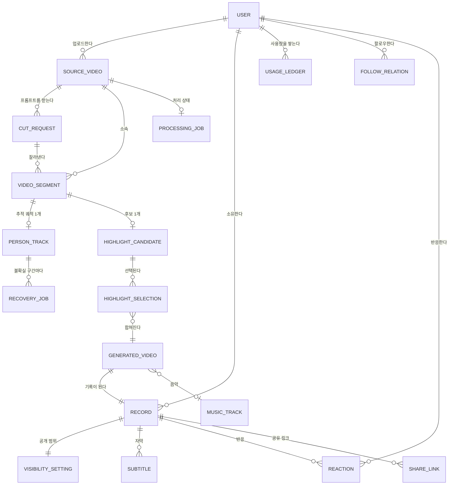
```mermaid
erDiagram
    USER ||--o{ SOURCE_VIDEO : "업로드한다"
    USER ||--o{ RECORD : "소유한다"
    USER ||--o{ USAGE_LEDGER : "사용량을 쌓는다"
    USER ||--o{ FOLLOW_RELATION : "팔로우한다"
    USER ||--o{ REACTION : "반응한다"

    SOURCE_VIDEO ||--o{ CUT_REQUEST : "프롬프트를 받는다"
    CUT_REQUEST ||--o{ VIDEO_SEGMENT : "잘라낸다"
    SOURCE_VIDEO ||--o{ VIDEO_SEGMENT : "소속"

    VIDEO_SEGMENT ||--o| PERSON_TRACK : "추적 궤적 1개"
    PERSON_TRACK ||--o{ RECOVERY_JOB : "불확실 구간마다"
    VIDEO_SEGMENT ||--o| HIGHLIGHT_CANDIDATE : "후보 1개"

    HIGHLIGHT_CANDIDATE ||--o{ HIGHLIGHT_SELECTION : "선택된다"
    HIGHLIGHT_SELECTION }o--|| GENERATED_VIDEO : "합쳐진다"
    GENERATED_VIDEO ||--|| RECORD : "기록이 된다"

    RECORD ||--|| VISIBILITY_SETTING : "공개 범위"
    RECORD ||--o{ SUBTITLE : "자막"
    RECORD ||--o{ REACTION : "반응"
    RECORD ||--o{ SHARE_LINK : "공유 링크"
    GENERATED_VIDEO }o--o| MUSIC_TRACK : "음악"

    SOURCE_VIDEO ||--o| PROCESSING_JOB : "처리 상태"
```

### 📊 ER-2 · 도메인 ① — 컷 · 트래킹

> **이 그림이 답하는 질문** — *"파이프라인 ①②가 만드는 데이터는 정확히 뭔가?"*

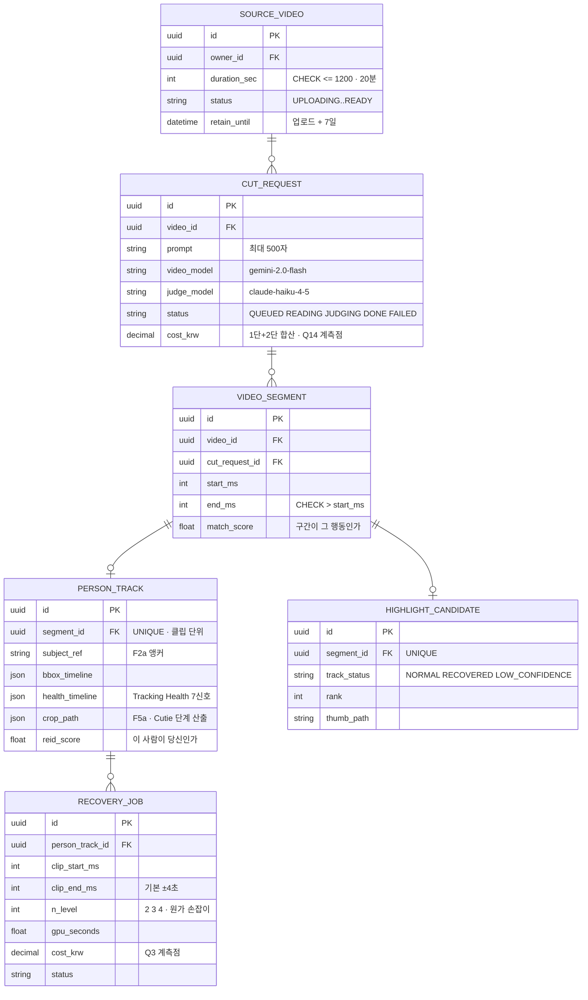
```mermaid
erDiagram
    SOURCE_VIDEO {
        uuid id PK
        uuid owner_id FK
        int duration_sec "CHECK <= 1200 · 20분"
        string status "UPLOADING..READY"
        datetime retain_until "업로드 + 7일"
    }
    CUT_REQUEST {
        uuid id PK
        uuid video_id FK
        string prompt "최대 500자"
        string video_model "gemini-2.0-flash"
        string judge_model "claude-haiku-4-5"
        string status "QUEUED READING JUDGING DONE FAILED"
        decimal cost_krw "1단+2단 합산 · Q14 계측점"
    }
    VIDEO_SEGMENT {
        uuid id PK
        uuid video_id FK
        uuid cut_request_id FK
        int start_ms
        int end_ms "CHECK > start_ms"
        float match_score "구간이 그 행동인가"
    }
    PERSON_TRACK {
        uuid id PK
        uuid segment_id FK "UNIQUE · 클립 단위"
        string subject_ref "F2a 앵커"
        json bbox_timeline
        json health_timeline "Tracking Health 7신호"
        json crop_path "F5a · Cutie 단계 산출"
        float reid_score "이 사람이 당신인가"
    }
    RECOVERY_JOB {
        uuid id PK
        uuid person_track_id FK
        int clip_start_ms
        int clip_end_ms "기본 ±4초"
        int n_level "2 3 4 · 원가 손잡이"
        float gpu_seconds
        decimal cost_krw "Q3 계측점"
        string status
    }
    HIGHLIGHT_CANDIDATE {
        uuid id PK
        uuid segment_id FK "UNIQUE"
        string track_status "NORMAL RECOVERED LOW_CONFIDENCE"
        int rank
        string thumb_path
    }
    SOURCE_VIDEO ||--o{ CUT_REQUEST : ""
    CUT_REQUEST ||--o{ VIDEO_SEGMENT : ""
    VIDEO_SEGMENT ||--o| PERSON_TRACK : ""
    PERSON_TRACK ||--o{ RECOVERY_JOB : ""
    VIDEO_SEGMENT ||--o| HIGHLIGHT_CANDIDATE : ""
```

### 📊 ER-3 · 도메인 ② — 완성 · 기록 · 공개

> **이 그림이 답하는 질문** — *"완성된 영상과 기록은 어떻게 구분되고, 공개 범위는 어디에 붙는가?"*

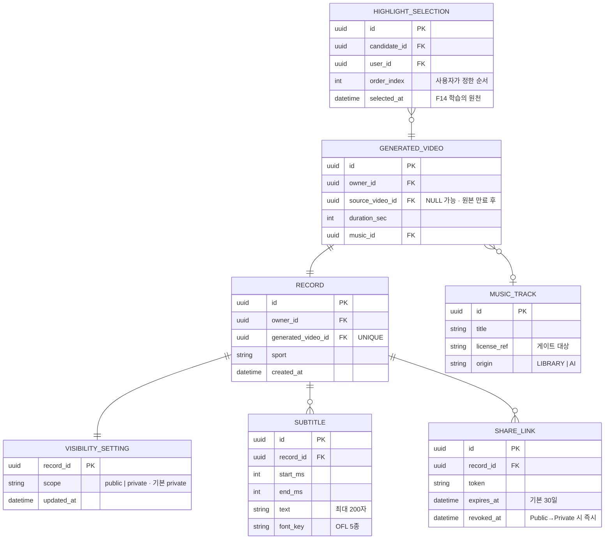
```mermaid
erDiagram
    HIGHLIGHT_SELECTION {
        uuid id PK
        uuid candidate_id FK
        uuid user_id FK
        int order_index "사용자가 정한 순서"
        datetime selected_at "F14 학습의 원천"
    }
    GENERATED_VIDEO {
        uuid id PK
        uuid owner_id FK
        uuid source_video_id FK "NULL 가능 · 원본 만료 후"
        int duration_sec
        uuid music_id FK
    }
    RECORD {
        uuid id PK
        uuid owner_id FK
        uuid generated_video_id FK "UNIQUE"
        string sport
        datetime created_at
    }
    VISIBILITY_SETTING {
        uuid record_id PK
        string scope "public | private · 기본 private"
        datetime updated_at
    }
    SUBTITLE {
        uuid id PK
        uuid record_id FK
        int start_ms
        int end_ms
        string text "최대 200자"
        string font_key "OFL 5종"
    }
    MUSIC_TRACK {
        uuid id PK
        string title
        string license_ref "게이트 대상"
        string origin "LIBRARY | AI"
    }
    SHARE_LINK {
        uuid id PK
        uuid record_id FK
        string token
        datetime expires_at "기본 30일"
        datetime revoked_at "Public→Private 시 즉시"
    }
    HIGHLIGHT_SELECTION }o--|| GENERATED_VIDEO : ""
    GENERATED_VIDEO ||--|| RECORD : ""
    GENERATED_VIDEO }o--o| MUSIC_TRACK : ""
    RECORD ||--|| VISIBILITY_SETTING : ""
    RECORD ||--o{ SUBTITLE : ""
    RECORD ||--o{ SHARE_LINK : ""
```

### 📊 ER-4 · 도메인 ③ — 과금 · 소비

> **이 그림이 답하는 질문** — *"사용량과 소멸은 어떻게 저장되는가?"*

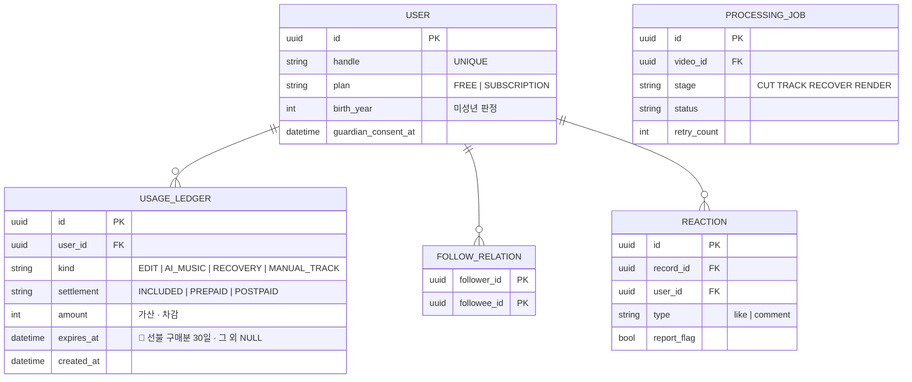
```mermaid
erDiagram
    USER {
        uuid id PK
        string handle "UNIQUE"
        string plan "FREE | SUBSCRIPTION"
        int birth_year "미성년 판정"
        datetime guardian_consent_at
    }
    USAGE_LEDGER {
        uuid id PK
        uuid user_id FK
        string kind "EDIT | AI_MUSIC | RECOVERY | MANUAL_TRACK"
        string settlement "INCLUDED | PREPAID | POSTPAID"
        int amount "가산 · 차감"
        datetime expires_at "🔴 선불 구매분 30일 · 그 외 NULL"
        datetime created_at
    }
    FOLLOW_RELATION {
        uuid follower_id PK
        uuid followee_id PK
    }
    REACTION {
        uuid id PK
        uuid record_id FK
        uuid user_id FK
        string type "like | comment"
        bool report_flag
    }
    PROCESSING_JOB {
        uuid id PK
        uuid video_id FK
        string stage "CUT TRACK RECOVER RENDER"
        string status
        int retry_count
    }
    USER ||--o{ USAGE_LEDGER : ""
    USER ||--o{ FOLLOW_RELATION : ""
    USER ||--o{ REACTION : ""
```

### 📊 ST-1 · 상태 기계 — 원본(SourceVideo)

> **이 그림이 답하는 질문** — *"영상 하나가 업로드부터 만료까지 어떤 상태를 거치는가?"*

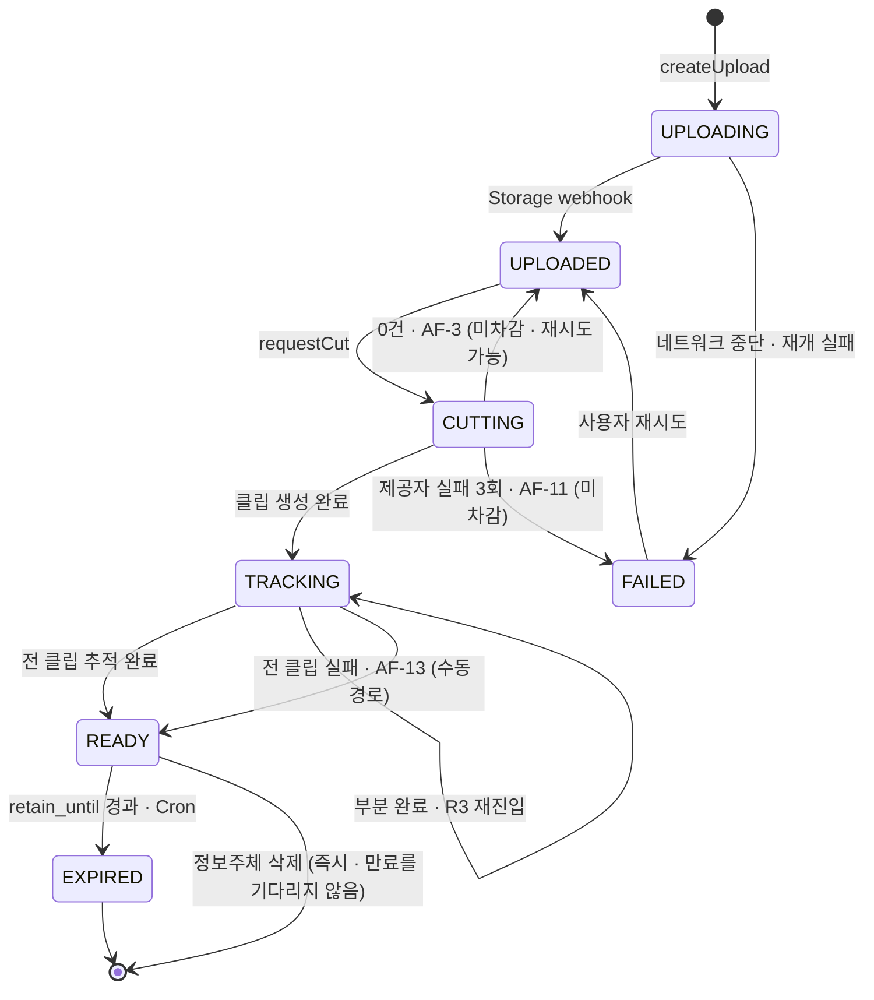
```mermaid
stateDiagram-v2
    [*] --> UPLOADING : createUpload
    UPLOADING --> UPLOADED : Storage webhook
    UPLOADING --> FAILED : 네트워크 중단 · 재개 실패
    UPLOADED --> CUTTING : requestCut
    CUTTING --> TRACKING : 클립 생성 완료
    CUTTING --> UPLOADED : 0건 · AF-3 (미차감 · 재시도 가능)
    CUTTING --> FAILED : 제공자 실패 3회 · AF-11 (미차감)
    TRACKING --> READY : 전 클립 추적 완료
    TRACKING --> TRACKING : 부분 완료 · R3 재진입
    TRACKING --> READY : 전 클립 실패 · AF-13 (수동 경로)
    READY --> EXPIRED : retain_until 경과 · Cron
    READY --> [*] : 정보주체 삭제 (즉시 · 만료를 기다리지 않음)
    EXPIRED --> [*]
    FAILED --> UPLOADED : 사용자 재시도
```

## 4.2 🔴 RLS로 공개 범위를 강제한다 (REQ-NF-009)

**Server Action 계층의 필터링만으로는 REQ-NF-009를 만족하지 못한다.** 새 조회 경로가 추가될 때마다 누락 위험이 생기기 때문이다. **DB 정책에 둔다.**

```sql
alter table records enable row level security;

-- 🔴 v3.0 — 그룹 분기 삭제. Public / Private 2단만 판정한다
create policy record_read on records for select using (
  owner_id = auth.uid()
  or exists (
    select 1 from visibility_settings v
    where v.record_id = records.id
      and v.scope = 'public'
  )
);
```

| REQ-NF-009 요구 | RLS 구현 |
| --- | --- |
| 서버 측 강제 | ✅ **DB 계층** — 애플리케이션 우회 불가 |
| 우회 성공 0건 | ✅ 모든 `select`가 정책을 통과 |
| **건수·존재 유추 정보 반환 금지** | ✅ 정책 미통과 행은 **결과 집합에 없다** — `count(*)`도 자동으로 제외 |
| 감사 로그 100% | 🔺 **RLS는 로그를 남기지 않는다** — 별도 설계 필요(§9-2) |

> **RLS가 SC-4.4(타인 프로필 — 개수에도 미포함)를 구조적으로 해결한다.** 애플리케이션이 `count(*)`를 세도 정책이 걸러낸 뒤의 수만 보인다. **개발자가 실수할 여지가 없다** — 이것이 이 스택의 가장 큰 이점이다.
>
> 🟢 **v3.0에서 정책이 단순해졌다.** 그룹 삭제로 중첩 `exists`와 `group_members` 조인이 사라져 **정책이 한 줄로 줄었다** — 검증 표면이 작아지는 것은 보안 요구사항에서 그 자체로 이득이다.


### 📊 FC-4 · RLS 판정 흐름

> **이 그림이 답하는 질문** — *"누군가 기록을 조회할 때 DB는 어떻게 판단하는가?"*

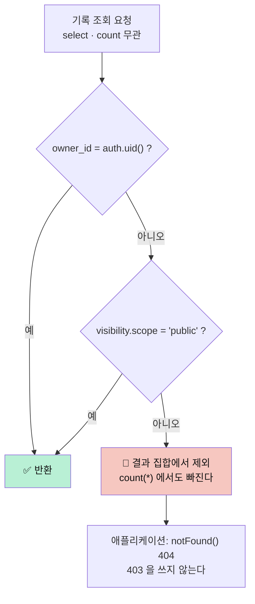
```mermaid
flowchart TD
    Q["기록 조회 요청<br>select · count 무관"] --> R1{"owner_id = auth.uid() ?"}
    R1 -->|예| OK["✅ 반환"]
    R1 -->|아니오| R2{"visibility.scope = 'public' ?"}
    R2 -->|예| OK
    R2 -->|아니오| NO["🔴 결과 집합에서 제외<br>count(*) 에서도 빠진다"]
    NO --> APP["애플리케이션: notFound() 404<br>403 을 쓰지 않는다"]
    style OK fill:#b9f0d5,color:#111
    style NO fill:#f6c7c0,color:#111
```

## 4.3 🆕 요금제 파라미터 (REQ-FUNC-032)

**PRD v0.2 §4.6의 확정값을 구현 상수로 옮긴다.** 금액·한도의 *결정*은 PRD 소관이고, 이 절은 **어디에 어떻게 저장하는가**만 정한다.

| 파라미터 | FREE | SUBSCRIPTION | 저장 위치 |
| --- | ---: | ---: | --- |
| 금액 | 0원 | **9,900원 / 월** | 결제 대행 상품 ID |
| 편집 한도 | 🔴 **첫 달 5회 · 이후 월 2회** | **월 3편** | `UsageLedger(kind=EDIT)` |
| 🔴 **수동 트래킹 한도** | **월 1회** | **무제한** | `UsageLedger(kind=MANUAL_TRACK)` |
| 1편당 길이 | **20분** | **20분** | `CHECK (duration_sec <= 1200)` |
| AI 음악 | 🔴 **0 — 크레딧 구매 시 사용 가능** | **월 3회** | `UsageLedger(kind=AI_MUSIC)` |
| 원본 보관 | — | **7일** | `SourceVideo.retainUntil` |
| 유효 기간 | 🔴 **가입일 기준 월 갱신** · 이월 없음 🔺 **[TBD Q23]** | 월 갱신 | `UsageLedger.expiresAt` |

### 🔴 추가 사용분 — 플랜이 아니라 원장 속성이다 *(v3.4)*

| | FREE | SUBSCRIPTION |
| --- | --- | --- |
| 정산 방식 | 🔴 **선불** — `settlement = PREPAID` | 🔴 **후불** — `settlement = POSTPAID` |
| 추가 업로드 1편(20분) | **[TBD 원 · Q25]** · 🔴 `expiresAt = 구매 + 30d` | **[TBD 원 · Q25]** · 만료 없음 |
| AI 음악 1회(2곡) | **[TBD 원 · Q18]** | **[TBD 원 · Q18]** |
| 청구 시점 | 구매 즉시 | 🔴 **월말 일괄** — `billedAt` 이 `null` 인 행을 모은다 |
| 상한 | 🔴 **구조적으로 불필요**(산 만큼만 쓴다) | 🔴 **필수 — [TBD Q26]** · 미설정 출시 금지 |

> ### 🔴 [v3.4] `PREPAID` 를 플랜에서 원장으로 내린 것이 이 절의 구조 변경이다
> v3.3까지 `Plan` 은 3값이었고 충전 사용자는 **다른 플랜**이었다. 🔴 **v3.4에서 `Plan` 은 2값이고, 충전은 `UsageLedger.settlement` 로 표현된다.**
>
> | | v3.3까지 | 🔴 **v3.4** |
> | --- | --- | --- |
> | 충전 사용자 | `User.plan = PREPAID` | 🔴 `User.plan = FREE` + `UsageLedger(settlement=PREPAID)` 행 |
> | 구독 초과분 | 표현 불가 *(별도 플랜으로 갈아타야 했다)* | 🔴 `UsageLedger(settlement=POSTPAID, billedAt=null)` |
>
> 🔴 **이 변경이 `can(plan, feature)` 를 깬다.** *"무료면 AI 음악 없음"* 이 더는 참이 아니다 — **크레딧을 가진 무료 사용자는 쓸 수 있다.** 접근 판정이 **플랜의 순수 함수에서 플랜 + 잔여의 함수**로 바뀐다.
>
> ```ts
> // 🔴 v3.4 — 플랜만으로 끝나지 않는 유일한 기능이 F26이다
> function canUse(plan: Plan, feature: Feature, remaining: number): boolean {
>   if (feature === 'AI_MUSIC') return remaining > 0;   // 🔴 플랜 무관 — 잔여가 판정한다
>   return can(plan, feature);                          // 나머지는 종전대로 플랜만 본다
> }
> ```
>
> 🔺 **크레딧으로 열리지 않는 것이 있다 — `can()` 이 여전히 막는 넷이다**(F25 · F2a · F2b · F5a). 🔴 **위 분기를 `remaining > 0` 하나로 일반화하면 무료 사용자에게 AI 컷이 열린다.** F26만 예외인 것을 코드에 못 박는다.
>
> 🔴 **후불은 이 문서가 다뤄본 적 없는 방향이다.** 지금까지 `UsageLedger` 는 **먼저 채우고 빼는** 원장이었다(결제 → `amount +N` → 소비). 후불은 **먼저 쓰고 나중에 청구**한다 — `billedAt = null` 인 행이 **미수금**이다(PRD R15 · G16).

```ts
// lib/billing/plans.ts — 🔴 하드코딩하지 않고 한 곳에 모은다
// 🔴 null = 무제한. 0 = 제공하지 않음. 둘을 같은 값으로 표현하면 판정이 뒤집힌다.
export const PLANS = {
  FREE:         { edits: 2, firstMonthEdits: 5,    manualTracks: 1,    maxDurationSec: 1200, aiMusic: 0, retainDays: 0, settlement: 'PREPAID'  },
  SUBSCRIPTION: { edits: 3, firstMonthEdits: null, manualTracks: null, maxDurationSec: 1200, aiMusic: 3, retainDays: 7, settlement: 'POSTPAID' },
} as const;   // 🔴 v3.4 — PREPAID 플랜 폐기. settlement = "이 플랜이 추가분을 어떻게 사는가"

// 🔴 추가 사용분 단가 — 전부 미정(Q18·Q25). 임의 숫자를 채우지 않는다(PRD N3)
export const ADDON_PRICES = {
  EXTRA_EDIT: { FREE: null, SUBSCRIPTION: null },   // [TBD Q25]
  AI_MUSIC:   { FREE: null, SUBSCRIPTION: null },   // [TBD Q18]
} as const;

export const PREPAID_EXPIRES_IN_DAYS = 30;   // 🔴 선불 구매분만 만료된다
export const POSTPAID_CAP = null;            // 🔴 [TBD Q26] — 미설정 출시 금지(R15 · AF-17)

// 🔴 이번 주기의 편집 한도 — "첫 달"의 앵커는 가입일이다(🔺 [TBD Q23]: 캘린더 월 대안)
export function editQuota(plan: Plan, isFirstCycle: boolean): number {
  const p = PLANS[plan];
  return isFirstCycle && p.firstMonthEdits != null ? p.firstMonthEdits : p.edits;
}

// 🔴 무제한(null)을 큰 숫자로 치환하지 않는다 — 잔여 표시가 "9999회 남음"이 된다
export function isUnlimited(plan: Plan, kind: 'manualTracks'): boolean {
  return PLANS[plan][kind] === null;
}

// 🔴 v3.4 — 플랜만으로 끝나지 않는 유일한 기능이 F26이다
export function canUse(plan: Plan, feature: Feature, remaining: number): boolean {
  if (feature === 'AI_MUSIC') return remaining > 0;   // 🔴 플랜 무관 — 잔여가 판정한다
  return can(plan, feature);                          // 나머지는 종전대로 플랜만 본다
}
```

> ### 🔴 [v3.3] 무료 한도가 두 층인 것이 이 절의 유일한 비정형이다
> 다른 파라미터는 **플랜당 값 하나**인데 `edits` 만 **주기에 따라 5 또는 2**다. 🔴 **`edits: 2` 하나만 읽고 구현하면 첫 달 혜택이 통째로 누락된다** — 그래서 상수를 직접 읽지 말고 **`editQuota(plan, isFirstCycle)` 를 거치게 한다.**
>
> 🔴 **`manualTracks: null`(무제한)을 `Infinity`나 `9999`로 바꾸지 않는다.** 잔여 계산이 `한도 - 사용량` 이라 큰 숫자를 넣으면 화면에 **"9998회 남음"** 이 뜨고, 무제한이라는 사실이 사용자에게 전달되지 않는다. **표시 분기는 `isUnlimited()` 로 판정한다.**
>
> 🔺 **`aiMusic: 0`(제공 안 함)과 `manualTracks: null`(무제한)이 같은 필드 모양을 갖는다** — 0과 null의 의미가 반대이므로 **타입이 아니라 규약으로만 구분된다.** 소비자 코드에서 falsy 검사(`if (!limit)`)를 쓰면 **무제한이 "제공 안 함"으로 뒤집힌다.**

| 기능 × 요금제 (PRD §4.6) | FREE | SUBSCRIPTION | 판정 |
| --- | :---: | :---: | --- |
| **F25** 프롬프트 컷 | — | ● | `can()` — 🔴 **크레딧으로 열리지 않는다** |
| **F24** 수동 컷 · 좌우반전 | ● | ● | `can()` |
| 🔴 **F24** 수동 트래킹 | **월 1회** | **무제한** | `canConsume('MANUAL_TRACK')` |
| **F2a·F2b** 자동 추적 · GPU 정밀 복구 | — | ● | `can()` — 🔴 **크레딧으로 열리지 않는다** |
| **F5a** 자동 리프레이밍 | — | ● | `can()` — 🔴 **크레딧으로 열리지 않는다** |
| **F3·F4** 후보 · 선택 | ● | ● | — |
| **F6** 합치기 · 렌더 | ● | ● | — |
| **F18a** 무료 음악 | ● | ● | — |
| 🔴 **F26** AI 음악 | 🔴 **충전 시** | 월 3회 | 🔴 **`remaining > 0`** — **플랜을 보지 않는 유일한 기능** |
| **F18b** 자막 (OFL 5종) | ● | ● | — |
| **F7·F8** 기록 · 공개 범위 | ● | ● | — |
| **F27** 임시 보관 7일 | — | ● | `can()` |
| 🔴 **추가 사용분** | 선불 크레딧 | 후불 종량 | `UsageLedger.settlement` |

> 🔴 **`—` 인 넷(F25·F2a·F2b·F5a)은 크레딧으로도 열리지 않는다.** `canUse()` 의 `AI_MUSIC` 분기를 `remaining > 0` 하나로 일반화하면 **무료 사용자에게 AI 컷이 열린다** — F26만 예외임을 코드에 못 박는다.

> 🔴 **무료 경로가 곧 기술 폴백이다**(§6.5.4). 브라우저가 추적을 못 돌리는 단말에서도 **F24로 완성까지 갈 수 있다** — 요금제 설계와 폴백 설계가 같은 표에서 만난다.

### 🆕 OFL 폰트 5종 (REQ-FUNC-026)

| `OflFont` | 폰트 | 웹 적용 |
| --- | --- | --- |
| `PRETENDARD` | Pretendard | 서브셋 `woff2` · 기본값 |
| `NOTO_SANS_KR` | 본고딕 (Noto Sans KR) | 서브셋 `woff2` |
| `SOURCE_HAN` | 본고딕 (Source Han) | 서브셋 `woff2` |
| `NANUM` | 나눔글꼴 | 서브셋 `woff2` |
| `FREESENTATION` | Freesentation | 서브셋 `woff2` |

> 🔴 **OFL은 표기 의무가 있다.** 앱 내 라이선스 고지 화면에 5종을 모두 명시한다(PRD AC7-2). 🔺 **자막을 브라우저에서 굽기 때문에 폰트가 렌더 파이프라인에도 들어간다** — `document.fonts.ready`를 기다리지 않으면 자막이 대체 폰트로 구워진다.

---


### 📊 FC-2 · 무료 / 유료 분기 + 기술 폴백

> **이 그림이 답하는 질문** — *"돈을 안 냈거나 브라우저가 약하면 어떻게 되는가? 막히는가?"*

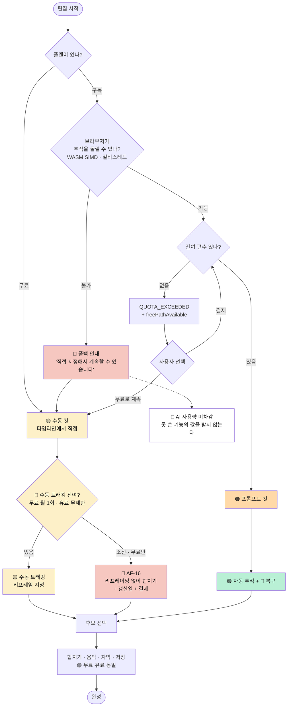
```mermaid
flowchart TD
    S(["편집 시작"]) --> Q1{"플랜이 있나?"}
    Q1 -->|무료| M1["🟡 수동 컷<br>타임라인에서 직접"]
    Q1 -->|구독| Q2{"브라우저가<br>추적을 돌릴 수 있나?<br>WASM SIMD · 멀티스레드"}

    Q2 -->|불가| FB["🔴 폴백 안내<br>'직접 지정해서 계속할 수 있습니다'"]
    FB --> M1
    Note1["🔴 AI 사용량 미차감<br>못 쓴 기능의 값을 받지 않는다"]
    FB -.-> Note1

    Q2 -->|가능| Q3{"잔여 편수 있나?"}
    Q3 -->|없음| QE["QUOTA_EXCEEDED<br>+ freePathAvailable"]
    QE --> CH{"사용자 선택"}
    CH -->|결제| Q3
    CH -->|무료로 계속| M1
    Q3 -->|있음| A1["🟠 프롬프트 컷"]

    M1 --> Q4{"🔴 수동 트래킹 잔여?<br>무료 월 1회 · 유료 무제한"}
    Q4 -->|있음| M2["🟡 수동 트래킹<br>키프레임 지정"]
    Q4 -->|"소진 · 무료만"| MQ["🔴 AF-16<br>리프레이밍 없이 합치기<br>+ 갱신일 + 결제"]
    A1 --> A2["🟢 자동 추적 + 🔴 복구"]

    M2 --> CM["후보 선택"]
    MQ --> CM
    A2 --> CM
    CM --> FIN["합치기 · 음악 · 자막 · 저장<br>🟢 무료·유료 동일"]
    FIN --> E(["완성"])

    style M1 fill:#fdf0c8,color:#111
    style M2 fill:#fdf0c8,color:#111
    style Q4 fill:#fdf0c8,color:#111
    style MQ fill:#f6c7c0,color:#111
    style A1 fill:#ffd9a8,color:#111
    style A2 fill:#b9f0d5,color:#111
    style FB fill:#f6c7c0,color:#111
    style Note1 fill:#fff,color:#111
```

> 🔴 **[v3.3] 무료 갈래에도 한도 분기가 생겼다.** v3.2까지 `M1 → M2` 는 무조건이었다 — 무료 사용자는 **횟수 제한 없이** 수동 경로를 돌 수 있었기 때문이다. PRD v0.4가 **수동 트래킹에 월 1회 한도**를 두면서 이 그림에 `Q4` 가 들어갔다.
>
> 🔴 **`MQ` 가 `CM`(후보 선택)으로 이어지는 화살표가 이 그림의 핵심이다.** 소진돼도 **끝나지 않는다** — 트래킹만 빠지고 합치기·음악·자막·저장은 그대로 간다(AF-16). **이 화살표가 없으면 무료 티어는 "월 1편 이후 잠기는 앱"이 되어 AC7-1·AC7-6과 충돌한다.**
>
> 🔺 **`Q2`(브라우저 폴백)로 들어온 구독 사용자는 `Q4` 에서 걸리지 않는다** — 구독의 수동 트래킹은 무제한이다. **폴백이 한도로 두 번 막히는 경로는 없다.**


### 📊 ST-4 · 상태 기계 — 사용량 원장 항목

> **이 그림이 답하는 질문** — *"충전한 사용량은 언제 사라지는가?"* · 🔴 **v3.4: 이 상태 기계는 `settlement = PREPAID` 인 행에만 해당한다** — 후불(`POSTPAID`) 행은 소멸하지 않고 **청구된다**.

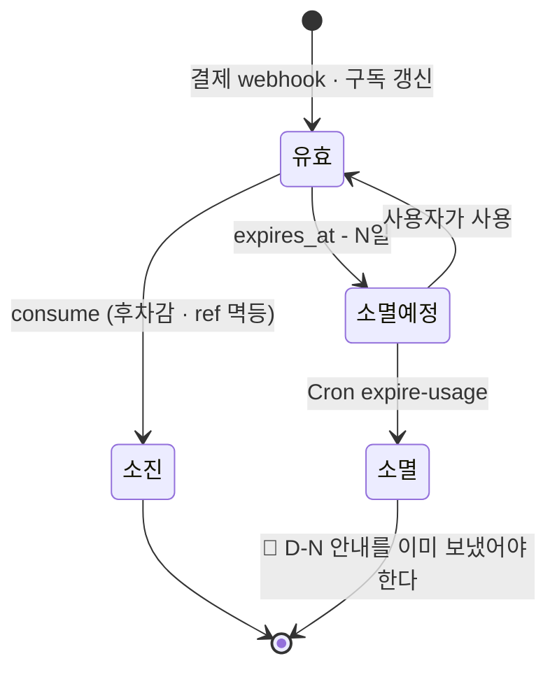
```mermaid
stateDiagram-v2
    [*] --> 유효 : 결제 webhook · 구독 갱신
    유효 --> 소진 : consume (후차감 · ref 멱등)
    유효 --> 소멸예정 : expires_at - N일
    소멸예정 --> 유효 : 사용자가 사용
    소멸예정 --> 소멸 : Cron expire-usage
    소진 --> [*]
    소멸 --> [*] : 🔴 D-N 안내를 이미 보냈어야 한다
```

# 5. Interface Design (C-TEC-002)

## 5.1 Server Action / Route Handler 배분

**원칙** — 사용자가 일으키는 상태 변경은 **Server Action**, 외부가 일으키는 것은 **Route Handler**.
**PRD v0.2 §6.3의 엔드포인트를 이 스택의 호출 방식으로 사상한다.**

**① 하이라이트 컷**

| 기능 | 방식 | 시그니처 | PRD API | REQ |
| --- | --- | --- | --- | --- |
| 업로드 개시 | Server Action | `createUpload(meta) → {videoId, signedUrl}` | `POST /videos` | REQ-FUNC-001 · SC-1.F1 |
| 업로드 완료 통지 | **Route Handler** | `POST /api/webhooks/storage` | — | REQ-FUNC-001 |
| 🆕 **컷 요청** | Server Action | `requestCut(videoId, prompt) → {cutRequestId}` | `POST /videos/{id}/cut` | **REQ-FUNC-028** |
| 🆕 **컷 결과 수신** | **Route Handler** | `POST /api/webhooks/cut` | — | **REQ-FUNC-028** |
| 🆕 **클립 목록 조회** | **RSC 직접 조회** | `getSegments(videoId)` | `GET /videos/{id}/segments` | **REQ-FUNC-028** |

**② 트래킹 편집**

| 기능 | 방식 | 시그니처 | PRD API | REQ |
| --- | --- | --- | --- | --- |
| 대상 지정 | Server Action | `anchorSubject(segmentId, frameMs, bbox)` | `POST /segments/{id}/subject` | REQ-FUNC-002 |
| 🆕 **클립 추적 결과 등록** | Server Action | `submitTrack(segmentId, bboxTimeline, healthTimeline)` — **브라우저가 돌린 결과를 올린다** | `POST /segments/{id}/track` | REQ-FUNC-003 |
| 🆕 **정밀 복구 요청** | Server Action | `requestRecovery(segmentId, clipRange, nLevel) → {recoveryJobId}` | `POST /segments/{id}/recover` | REQ-FUNC-003 · 006 |
| 복구 결과 수신 | **Route Handler** | `POST /api/webhooks/inference` — `{bboxTimeline, cropPath}` | — | REQ-FUNC-003 · 006 |
| 후보 조회 | **RSC 직접 조회** | `getCandidates(videoId)` — `trackStatus` 포함 | `GET /videos/{id}/candidates` | REQ-FUNC-004 |
| 저신뢰 후보 제외 | Server Action 내부 | `reidScore < threshold` → `LOW_CONFIDENCE` 표시 | — | REQ-FUNC-027 |
| 선택 확정 | Server Action | `confirmSelection(videoId, candidateIds)` | — | REQ-FUNC-005 |

**③ 완성 · ④ 기록 · ⑤ 소비**

| 기능 | 방식 | 시그니처 | REQ |
| --- | --- | --- | --- |
| 🆕 **음악 조회** | **RSC 직접 조회** | `getMusic(category)` — `origin=LIBRARY` | REQ-FUNC-007 |
| 🆕 **AI 음악 생성** | Server Action | `generateMusic(prompt) → {jobId}` — **1회 = 2곡** · 사용량 차감 | **REQ-FUNC-030** |
| 🆕 **AI 음악 결과 수신** | **Route Handler** | `POST /api/webhooks/suno` | **REQ-FUNC-030** |
| 🆕 **자막 저장** | Server Action | `saveSubtitles(recordId, lines[])` | REQ-FUNC-026 |
| 렌더 완료 등록 | Server Action | `registerRendered(draftId, storagePath)` | REQ-FUNC-008 · 009 |
| 공개 범위 변경 | Server Action | `setVisibility(recordId, scope)` — 🔴 **`groupIds` 인자 삭제** | REQ-FUNC-010 |
| 팔로우 | Server Action | `follow(followeeId)` · `unfollow(...)` | REQ-FUNC-012 |
| 반응·신고 | Server Action | `react(recordId, type, text?)` · `report(reactionId, reason)` | REQ-FUNC-015 · 016 |
| 공유 링크 | Server Action | `issueShareLink(recordId) → {url, expiresAt}` | REQ-FUNC-017 |
| 🆕 **사용량 조회** | **RSC 직접 조회** | `getUsage()` — 잔여량 · 소멸 예정일 | **REQ-FUNC-032** |
| 🆕 **결제·충전** | Server Action + 외부 | 🔴 `startCheckout({ plan })`(구독) · `startCheckout({ addon, qty })`(선불 충전) → 결제 대행 리다이렉트 | **REQ-FUNC-032** · A-T8 |
| 🆕 **결제 결과 수신** | **Route Handler** | `POST /api/webhooks/payment` | **REQ-FUNC-032** |
| 상태 폴링 대체 | **Supabase Realtime** | `cut_requests` · `recovery_jobs` · `processing_jobs` 구독 — 🔴 **v3.2: 편집 화면이 아니라 루트 레이아웃에서 구독** | SC-1.F4 · **SC-1.F7** |
| 🔴 🆕 **활성 작업 조회** | **RSC 직접 조회** | `getActiveJob() → {stage, progressNum, progressDen, resumeRoute, status} \| null` — **미니바의 초기 상태** · 🔴 **구독은 변경만 주므로 진입 시 1회 조회가 짝으로 필요하다** | 🆕 **REQ-FUNC-033** |
| 🔴 🆕 **편집 복귀** | Server Action | `resumeEditing(jobId) → {route}` — 🔴 **서버가 복귀 지점을 정한다.** 사용자가 피드를 보는 사이 단계가 넘어갔을 수 있으므로 클라이언트가 기억한 경로를 쓰면 엇나간다 | 🆕 **REQ-FUNC-033** |
| 정리 배치 | **Vercel Cron → Route Handler** | `GET /api/cron/expire-shares` | REQ-NF-012 |
| 🆕 **원본 만료 배치** | **Vercel Cron → Route Handler** | `GET /api/cron/expire-sources` — **retainUntil 경과분 삭제 · 삭제 전 안내** | **REQ-FUNC-031** |
| 🆕 **선불분 소멸 배치** | **Vercel Cron → Route Handler** | `GET /api/cron/expire-usage` — 🔴 **`settlement = PREPAID` 만 대상** | **REQ-FUNC-032** |
| 🔴 **후불 정산 배치** *(v3.4)* | **Vercel Cron → Route Handler** | `GET /api/cron/settle-postpaid` — `billedAt IS NULL` 집계 → 대행사 청구 → `billedAt` 기록 | **REQ-FUNC-032** · PRD R15 |
| 🔴 **후불 상한 판정** *(v3.4)* | RSC 직접 조회 + 소비 경로 | `getPostpaidUsage()` — 누적 예상액 · 상한 도달 여부 (AC7-8 · AF-17) | **REQ-FUNC-032** · Q26 |

> 🔴 **`createGroup` · `inviteMember` · `leaveGroup`은 v3.0에서 삭제했다** — PRD v0.2가 F23을 MVP 밖으로 뺐다.

> ### 🔴 v3.2 — 구독을 어디에 붙이느냐가 F29의 전부다
> v3.0은 Realtime 구독을 **처리 진행 화면**에 붙였다. 그 화면을 벗어나면 구독이 끊기므로, **피드에서는 완료를 알 방법이 없다.**
>
> | | v3.0 | **v3.2** |
> | --- | --- | --- |
> | 구독 위치 | 편집·처리 화면 (Client Component) | 🔴 **루트 레이아웃** (`app/layout.tsx`의 Client 자식) |
> | 화면 이동 시 | **구독 해제** | 🟢 **유지** — 레이아웃은 라우트가 바뀌어도 언마운트되지 않는다 |
> | 초기 상태 | 화면 진입 시 조회 | 🔴 **앱 진입 시 `getActiveJob()` 1회** |
> | 구독 대상 | `cut_requests` · `recovery_jobs` | + 🔴 **`processing_jobs`** — 단계·진행률·복귀 지점의 단일 창구 |
>
> 🔴 **RLS는 Realtime 채널에도 적용되어야 한다** — 전역으로 올린다고 해서 남의 작업이 보이면 REQ-NF-009의 우회 경로가 된다. **REST와 다른 경로이므로 별도 테스트로 확인한다**(FR-036 Scenario 3).


### 📊 CLD-1 · Class Diagram — 도메인 책임

> **이 그림이 답하는 질문** — *"코드에서 누가 무엇을 책임지는가? 특히 원가와 보안은 누가 지키는가?"*

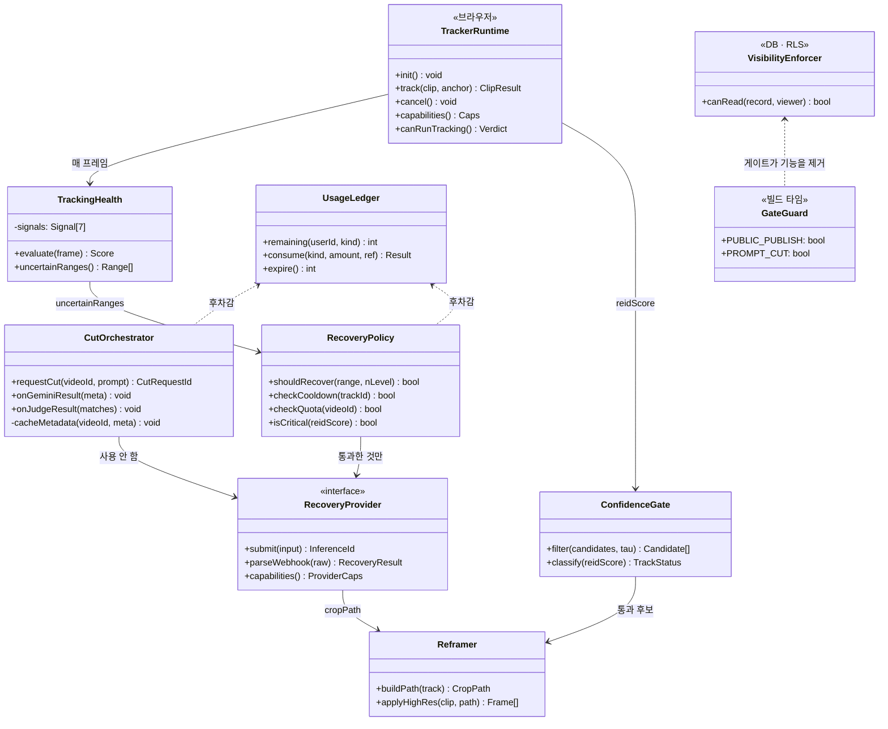
```mermaid
classDiagram
    class CutOrchestrator {
        +requestCut(videoId, prompt) CutRequestId
        +onGeminiResult(meta) void
        +onJudgeResult(matches) void
        -cacheMetadata(videoId, meta) void
        %% 1단 캐시가 재편집 원가를 줄인다
    }
    class TrackerRuntime {
        <<브라우저>>
        +init() void
        +track(clip, anchor) ClipResult
        +cancel() void
        +capabilities() Caps
        +canRunTracking() Verdict
        %% 판정만 · 복구는 부르지 않는다
    }
    class TrackingHealth {
        +evaluate(frame) Score
        +uncertainRanges() Range[]
        -signals: Signal[7]
    }
    class RecoveryPolicy {
        +shouldRecover(range, nLevel) bool
        +checkCooldown(trackId) bool
        +checkQuota(videoId) bool
        +isCritical(reidScore) bool
        %% 억제가 본체 — 쿨다운·40회·N-Level·Critical 우회
    }
    class RecoveryProvider {
        <<interface>>
        +submit(input) InferenceId
        +parseWebhook(raw) RecoveryResult
        +capabilities() ProviderCaps
    }
    class Reframer {
        +buildPath(track) CropPath
        +applyHighRes(clip, path) Frame[]
        %% 경로는 Cutie 단계 · 적용은 선택 후
    }
    class ConfidenceGate {
        +filter(candidates, tau) Candidate[]
        +classify(reidScore) TrackStatus
        %% null을 0/1로 치환하지 않는다
    }
    class VisibilityEnforcer {
        <<DB · RLS>>
        +canRead(record, viewer) bool
        %% 애플리케이션이 아니라 DB가 강제
    }
    class UsageLedger {
        +remaining(userId, kind) int
        +consume(kind, amount, ref) Result
        +expire() int
        %% 후차감 · ref 기준 멱등
    }
    class GateGuard {
        <<빌드 타임>>
        +PUBLIC_PUBLISH: bool
        +PROMPT_CUT: bool
        %% 미승인 기능은 번들에 없다
    }

    CutOrchestrator --> RecoveryProvider : 사용 안 함
    TrackerRuntime --> TrackingHealth : 매 프레임
    TrackingHealth --> RecoveryPolicy : uncertainRanges
    RecoveryPolicy --> RecoveryProvider : 통과한 것만
    RecoveryProvider --> Reframer : cropPath
    TrackerRuntime --> ConfidenceGate : reidScore
    ConfidenceGate --> Reframer : 통과 후보
    UsageLedger <.. CutOrchestrator : 후차감
    UsageLedger <.. RecoveryPolicy : 후차감
    VisibilityEnforcer <.. GateGuard : 게이트가 기능을 제거
```

### 📊 SD-4 · 선택 → 렌더 → 저장

> **이 그림이 답하는 질문** — *"고른 다음에 무엇이 어디서 일어나는가?"*

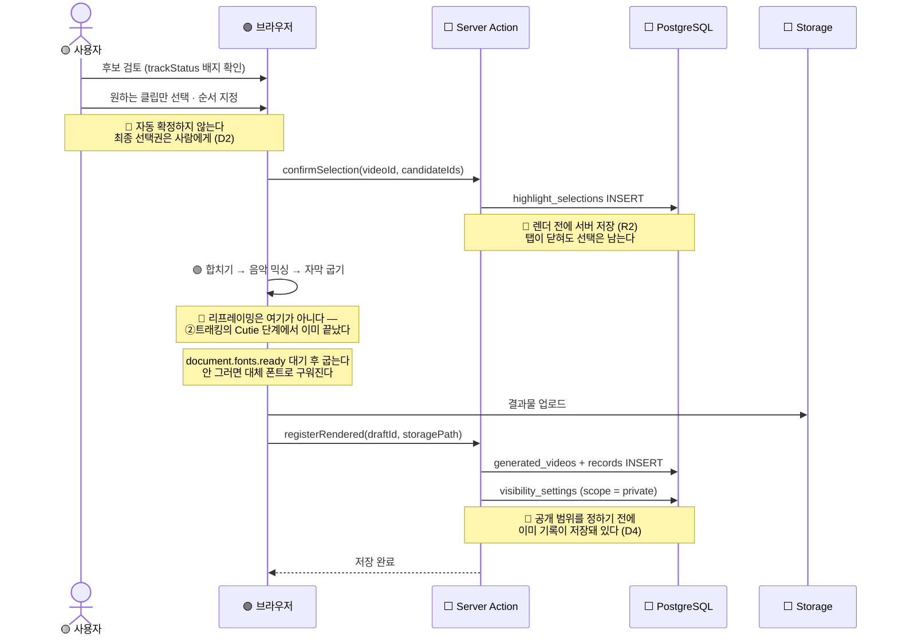
```mermaid
sequenceDiagram
    actor U as 🟡 사용자
    participant C as 🟢 브라우저
    participant SA as ⬜ Server Action
    participant DB as ⬜ PostgreSQL
    participant ST as ⬜ Storage

    U->>C: 후보 검토 (trackStatus 배지 확인)
    U->>C: 원하는 클립만 선택 · 순서 지정
    Note over U,C: 🔴 자동 확정하지 않는다<br/>최종 선택권은 사람에게 (D2)
    C->>SA: confirmSelection(videoId, candidateIds)
    SA->>DB: highlight_selections INSERT
    Note over SA,DB: 🔴 렌더 전에 서버 저장 (R2)<br/>탭이 닫혀도 선택은 남는다

    C->>C: 🟢 합치기 → 음악 믹싱 → 자막 굽기
    Note over C: 🔴 리프레이밍은 여기가 아니다 —<br/>②트래킹의 Cutie 단계에서 이미 끝났다
    Note over C: document.fonts.ready 대기 후 굽는다<br/>안 그러면 대체 폰트로 구워진다

    C->>ST: 결과물 업로드
    C->>SA: registerRendered(draftId, storagePath)
    SA->>DB: generated_videos + records INSERT
    SA->>DB: visibility_settings (scope = private)
    Note over SA,DB: 🔴 공개 범위를 정하기 전에<br/>이미 기록이 저장돼 있다 (D4)
    SA-->>C: 저장 완료
```

### 📊 SD-5 · 공개 범위 변경 + 링크 회수

> **이 그림이 답하는 질문** — *"공개했다가 되돌리면 이미 보낸 링크는 어떻게 되는가?"*

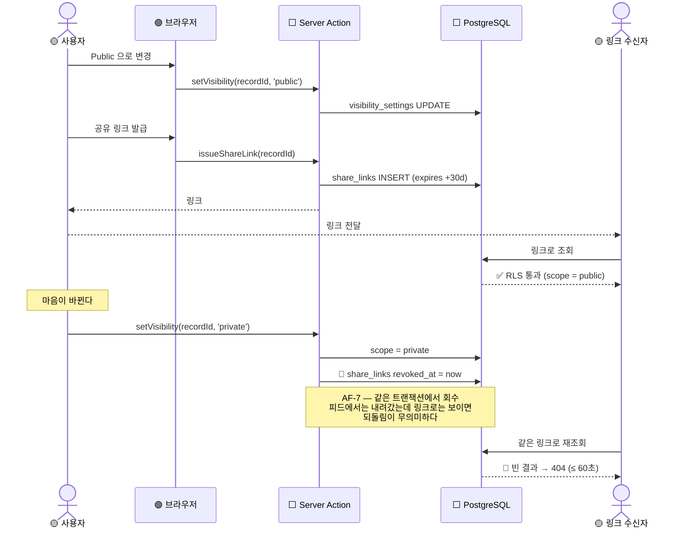
```mermaid
sequenceDiagram
    actor U as 🟡 사용자
    participant C as 🟢 브라우저
    participant SA as ⬜ Server Action
    participant DB as ⬜ PostgreSQL
    actor V as 🟡 링크 수신자

    U->>C: Public 으로 변경
    C->>SA: setVisibility(recordId, 'public')
    SA->>DB: visibility_settings UPDATE
    U->>C: 공유 링크 발급
    C->>SA: issueShareLink(recordId)
    SA->>DB: share_links INSERT (expires +30d)
    SA-->>U: 링크
    U-->>V: 링크 전달
    V->>DB: 링크로 조회
    DB-->>V: ✅ RLS 통과 (scope = public)

    Note over U: 마음이 바뀐다
    U->>SA: setVisibility(recordId, 'private')
    SA->>DB: scope = private
    SA->>DB: 🔴 share_links revoked_at = now
    Note over SA,DB: AF-7 — 같은 트랜잭션에서 회수<br/>피드에서는 내려갔는데 링크로는 보이면<br/>되돌림이 무의미하다
    V->>DB: 같은 링크로 재조회
    DB-->>V: 🔴 빈 결과 → 404 (≤ 60초)
```

### 📊 SD-7 · 🔴 선불 충전 — 결제 → 사용량 *(무료 사용자)*

> **이 그림이 답하는 질문** — *"결제가 끝나면 사용량은 어떻게 늘어나는가? 창을 닫으면?"*
>
> 🔴 **[v3.4] 이 그림에서 사라진 줄이 핵심이다 — `users.plan = PREPAID` 가 없다.** 충전해도 **플랜은 FREE 그대로**이고, 늘어나는 것은 `usage_ledger` 한 줄뿐이다. 🔴 **그래서 충전한 무료 사용자에게 AI 컷·자동 추적이 열리지 않는다** — 열리는 것은 **산 항목 그 자체**뿐이다(PRD AC7-7).

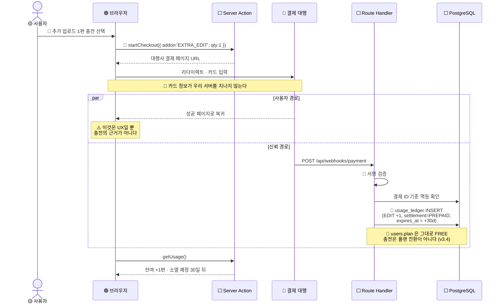
```mermaid
sequenceDiagram
    actor U as 🟡 사용자
    participant C as 🟢 브라우저
    participant SA as ⬜ Server Action
    participant PG as 🔴 결제 대행
    participant RH as ⬜ Route Handler
    participant DB as ⬜ PostgreSQL

    U->>C: 🔴 추가 업로드 1편 충전 선택
    C->>SA: 🔴 startCheckout({ addon:'EXTRA_EDIT', qty:1 })
    SA-->>C: 대행사 결제 페이지 URL
    C->>PG: 리다이렉트 · 카드 입력
    Note over C,PG: 🔴 카드 정보가 우리 서버를 지나지 않는다

    par 사용자 경로
        PG-->>C: 성공 페이지로 복귀
        Note over C: ⚠️ 이것은 UX일 뿐<br/>충전의 근거가 아니다
    and 신뢰 경로
        PG->>RH: POST /api/webhooks/payment
        RH->>RH: 🔴 서명 검증
        RH->>DB: 결제 ID 기준 멱등 확인
        RH->>DB: 🔴 usage_ledger INSERT<br/>(EDIT +1, settlement=PREPAID,<br/>expires_at = +30d)
        Note over RH,DB: 🔴 users.plan 은 그대로 FREE<br/>충전은 플랜 전환이 아니다 (v3.4)
    end
    C->>SA: getUsage()
    SA-->>C: 잔여 +1편 · 소멸 예정 30일 뒤
```

> ### 🔴 [v3.4 신설] 후불 종량은 이 그림의 순서가 뒤집힌다 *(구독 사용자)*
> SD-7은 **결제 → 원장 → 소비** 순이다. 🔴 **후불은 소비 → 원장 → (월말) 결제** 순이다.
>
> | | 선불 (무료) | 🔴 후불 (구독) |
> | --- | --- | --- |
> | 원장 기록 시점 | 결제 webhook 수신 시 | 🔴 **사용 성공 시** — `settlement=POSTPAID, billedAt=null` |
> | 결제 시점 | 사용 전 | 🔴 **월말 일괄** — `GET /api/cron/settle-postpaid` |
> | 실패하면 | 충전이 안 될 뿐 **손실 없음** | 🔴 **이미 쓴 원가가 회수되지 않는다**(R15) |
> | 상한 | 구조적으로 불필요 | 🔴 **필수** — `POSTPAID_CAP` [TBD Q26] |
>
> 🔴 **`billedAt = null` 인 행이 곧 미수금이다.** 소멸 Cron(`expire-usage`)이 이 행을 만료 처리하면 **청구 전에 채권이 사라진다** — 🔴 **만료는 `settlement = PREPAID` 인 행에만 적용한다.**

### 📊 SD-8 · 실패 경로 종합

> **이 그림이 답하는 질문** — *"뭔가 잘못됐을 때 사용자는 무엇을 보는가? 그리고 돈은 빠지는가?"*

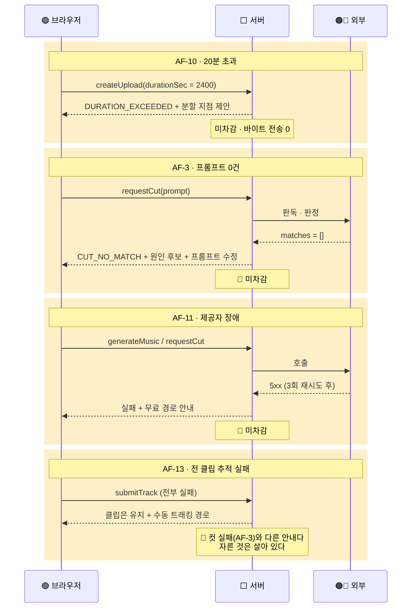
```mermaid
sequenceDiagram
    participant C as 🟢 브라우저
    participant SA as ⬜ 서버
    participant EX as 🟠🔴 외부

    rect rgb(253, 240, 200)
    Note over C,EX: AF-10 · 20분 초과
    C->>SA: createUpload(durationSec = 2400)
    SA-->>C: DURATION_EXCEEDED + 분할 지점 제안
    Note over SA: 미차감 · 바이트 전송 0
    end

    rect rgb(253, 240, 200)
    Note over C,EX: AF-3 · 프롬프트 0건
    C->>SA: requestCut(prompt)
    SA->>EX: 판독 · 판정
    EX-->>SA: matches = []
    SA-->>C: CUT_NO_MATCH + 원인 후보 + 프롬프트 수정
    Note over SA: 🔴 미차감
    end

    rect rgb(253, 240, 200)
    Note over C,EX: AF-11 · 제공자 장애
    C->>SA: generateMusic / requestCut
    SA->>EX: 호출
    EX-->>SA: 5xx (3회 재시도 후)
    SA-->>C: 실패 + 무료 경로 안내
    Note over SA: 🔴 미차감
    end

    rect rgb(253, 240, 200)
    Note over C,EX: AF-13 · 전 클립 추적 실패
    C->>SA: submitTrack (전부 실패)
    SA-->>C: 클립은 유지 + 수동 트래킹 경로
    Note over SA: 🔴 컷 실패(AF-3)와 다른 안내다<br/>자른 것은 살아 있다
    end
```

## 5.2 공통 규약 (C-TEC-002)

| 항목 | 설계 |
| --- | --- |
| 인증 | **Supabase Auth** 세션 → Server Action에서 `auth.uid()` 확보 |
| 권한 없음 | RLS가 **빈 결과**를 반환 → 애플리케이션은 `notFound()` 처리 (DS §3.1.1의 `404` 원칙과 일치) |
| 입력 검증 | **Zod** 스키마 — Server Action 첫 줄에서 파싱 |
| 오류 전달 | Server Action은 **예외를 던지지 않고** `{ok:false, code, message}` 반환 — 클라이언트 UI가 분기 |
| 멱등성 | `Idempotency-Key`를 인자로 받아 `idempotency_keys` 테이블에 기록 |
| 속도 제한 | 🔺 Vercel 미들웨어 또는 DB 카운터. **설계 미확정**(§9-3) |
| 🆕 **사용량 차감** | 🔴 **외부 호출 성공 후 차감한다** — PRD AF-11(제공자 실패 시 미차감)을 만족하려면 선차감이 아니라 **후차감**이어야 한다 |
| 🆕 **한도 초과** | `{ok:false, code:"QUOTA_EXCEEDED", kind, freePathAvailable, resetAt}` — PRD AC7-6에 따라 **무료 경로를 함께 안내**한다 · 🔴 **v3.3: `kind` 가 필수다** — 무엇이 소진됐는지에 따라 되돌릴 곳이 다르다 |

> 🔴 **[v3.3] `QUOTA_EXCEEDED` 는 이제 두 곳에서 난다 — 그리고 되돌릴 곳이 서로 다르다.**
>
> | `kind` | 누가 | 되돌릴 곳 | `freePathAvailable` |
> | --- | --- | --- | :--: |
> | `EDIT` | 전 요금제 | **무료 편집 도구 전체**(F24) — 수동 컷·수동 트래킹 | `true` |
> | 🔴 `MANUAL_TRACK` | **무료만** | 🔴 **리프레이밍 없이 합치기**(AF-16) — *무료 경로 자체가 소진된 것이므로 F24로 되돌릴 수 없다* | 🔴 `false` |
>
> 🔴 **`MANUAL_TRACK` 소진에서 `freePathAvailable: true` 를 반환하면 화면이 "무료 도구로 계속하기"를 띄우고, 눌러도 같은 벽으로 되돌아온다** — 무료 도구가 바로 그 소진된 것이기 때문이다. **두 경우를 같은 플래그로 다루지 않는다.**
>
> 🔺 **`resetAt`(갱신 시각)이 `MANUAL_TRACK` 에서 특히 중요하다.** 결제 외의 유일한 해소 경로가 **기다리는 것**이므로, 언제 풀리는지를 모르면 결제만 남는다.

## 5.3 🔴 20분 업로드 — Route Handler를 우회한다

**A-T2 때문에 서버를 경유할 수 없다.** 🟢 **PRD v0.2의 20분 상한이 v2.2의 40~50분보다 이 설계에 유리하다.**

> **이 그림이 답하는 질문** — *"4GB짜리 파일을 서버가 못 받는데 어떻게 올리는가?"*

```mermaid
sequenceDiagram
    actor U as 🟡 사용자
    participant C as 🟢 브라우저
    participant SA as ⬜ Server Action
    participant ST as ⬜ Supabase Storage
    participant RH as ⬜ Route Handler
    participant DB as ⬜ PostgreSQL

    U->>C: 원본 선택 (메타 추출)
    C->>SA: createUpload({codec, sizeBytes, durationSec})
    alt 미지원 코덱
        SA-->>C: {ok:false, CODEC_UNSUPPORTED}
        Note over SA: 바이트 수신 0 · 외부 호출 0
    else 20분 초과
        SA-->>C: {ok:false, DURATION_EXCEEDED, suggestSplitAt}
        Note over SA: 🔴 AF-10 — 올린 뒤 거부하지 않고<br/>분할 지점을 제안한다
    else 통과
        SA->>DB: source_videos INSERT<br/>(UPLOADING, retain_until = +7d)
        SA->>ST: signed upload URL 발급
        SA-->>C: {videoId, signedUrl}
        C->>ST: 🔴 직접 업로드 (resumable)
        Note over C,ST: 서버를 경유하지 않는다 (A-T2)<br/>중단 시 같은 URL로 재개
        ST->>RH: POST /api/webhooks/storage
        RH->>DB: status = UPLOADED
    end
```

**이 설계가 SC-1.F1·AF-10을 더 잘 만족한다** — 코덱과 길이 판정이 **Signed URL 발급 전**에 일어나므로 바이트가 단 한 번도 전송되지 않는다.

---

# 6. UI Design (C-TEC-004)

| 화면 | shadcn/ui 구성 | REQ |
| --- | --- | --- |
| 앱 셸 **2탭** | `Tabs`(팔로잉·추천) + 하단 고정 네비 · RSC 스트리밍 🔴 **그룹 탭 삭제** | REQ-FUNC-011 · REQ-NF-001 |
| 🆕 **컷 프롬프트** | `Textarea` + `Button` + 예시 `Badge` 칩 · 진행 `Progress` | **REQ-FUNC-028** |
| 🆕 **컷 결과(클립) 목록** | `ScrollArea` + `Card` — 구간·썸네일·판정 점수 | **REQ-FUNC-028** |
| 🆕 **추적 대상 지정** | 프리뷰 위 `bbox` 오버레이 · 클릭 지정 | REQ-FUNC-002 |
| 후보 목록 | `ScrollArea` + `Card` + `Checkbox` · 가상 스크롤 · 🆕 **`Badge`로 `trackStatus`(정상/복구완료/저신뢰) 표시** | REQ-FUNC-004 · 005 · 027 |
| 공개 범위 | `RadioGroup`(**Public / Private 2단**) + `Badge`(글자 배지) | REQ-FUNC-010 · ADR-4 |
| 🆕 **자막 편집** | `Textarea` + 타임코드 `Input` + 폰트 `Select`(OFL 5종) | REQ-FUNC-026 |
| 🆕 **음악** | `Tabs`(무료 라이브러리 · AI 생성) + `Slider` 미리듣기 | REQ-FUNC-007 · 030 |
| 🆕 **요금제·사용량** | 🔴 `Card` **2종(무료·구독)** + **추가 사용분 블록** + `Progress`(잔여량) + 소멸 예정일 · 🔴 **후불은 누적 예상액·상한 표시**(AC7-8) | **REQ-FUNC-032** |
| 마이페이지 | `Tabs` + `ToggleGroup`(필터) | SC-4.3 · 4.5 |
| 반응 | `Sheet`(하단 시트 댓글) | REQ-FUNC-015 · 016 · SC-6.2 |
| 공유 | `Sheet` + OS 공유 API | REQ-FUNC-017 |
| 처리 진행 | `Progress` + Realtime 구독 — 🆕 **컷 · 추적 · 복구 3단계 표시** | SC-1.F4 |
| 🔴 🆕 **전역 진행 미니바** | **루트 레이아웃 상주** — 얇은 `Progress` + 단계 라벨 + 퍼센트 · 완료 시 상태 전환 + 탭 가능 · `Sonner`(toast)로 완료 1회 알림 · 🔴 **`Dialog`를 쓰지 않는다** — 모달은 피드 소비를 끊는다 | 🆕 **REQ-FUNC-033** |

**공개 범위 배지는 `Badge` variant로 고정한다** — 프로토타입이 *"글자 배지 · 영상 가림 없이"* 를 확정했다(ADR-4).

> 🔴 **삭제** — v2.2의 `그룹 | Dialog + Command(멤버 검색)` 행은 PRD v0.2에서 F23이 빠지면서 제거했다.

---

# 6.5 🔴 웹 플랫폼 고유 제약

**브라우저에서만 발생하는 제약 4건이다. 스택 선택의 결과이므로 PRD에는 없다.**

## 6.5.1 자동재생 — 음소거로 시작할 수밖에 없다

브라우저는 **사용자 조작 없는 유성 자동재생을 차단**한다. REQ-FUNC-011(*"로그인 화면 없이 바로 재생"*)을 지키려면 **음소거 시작이 유일한 경로**다.

**문제는 음악이 부가 기능이 아니라는 것이다** — VPS는 F18a를 **O2(완성 전환율 4% → 60%)의 인과 경로**로 지목했다. 만드는 쪽에는 음악이 필수인데 **보는 쪽 첫 접점에서 소리가 나지 않는다.**

### ✅ 채택 — 첫 조작 시 소리 활성

```ts
// app/(feed)/_components/FeedPlayer.tsx
const [muted, setMuted] = useState(true);          // 정책상 필수
useEffect(() => {
  const unmute = () => { setMuted(false); track('first_unmute'); };
  window.addEventListener('scroll', unmute, { once: true, passive: true });
  window.addEventListener('pointerdown', unmute, { once: true });
  return () => { /* cleanup */ };
}, []);
```

| 대안 | 판정 |
| --- | :--: |
| 음소거 + 해제 버튼 | 🟡 첫 인상에서 음악이 없다 |
| **첫 조작(스크롤·탭) 시 활성** | ✅ **채택** — 사용자가 어차피 하는 동작 · 별도 UI 불필요 |
| 진입 화면에서 묻기 | 🔴 REQ-FUNC-011의 *"로그인 화면 없이"* 취지가 흐려진다 |
| 무음 전제 설계(자막·시각 강조) | 🔴 **F18a의 MVP 포함 근거가 무너진다** |

**계측** — `first_unmute` 이벤트로 **무음 재생 시간 비율**을 잰다. 높으면 진입 방식을 재검토한다.

## 6.5.2 F9 폰 용량 회수 — 웹에서는 측정이 불가능하다

| 동작 | 웹 | 근거 |
| --- | :--: | --- |
| 사용자 갤러리 파일 삭제 | 🔴 불가 | 브라우저는 단말 파일 시스템에 쓰지 못한다 |
| 기기 저장공간 조회 | 🔴 불가 | 오리진 할당량만 알 수 있고 갤러리 용량은 알 수 없다 |
| 삭제 안내 | ✅ 가능 | — |
| 삭제 여부 확인 | 🔴 불가 | **자기신고 외 수단 없음** |

### ✅ 채택 — 안내 유지 · O4를 자기신고 지표로

**O4(원본 삭제율 50%)를 관측할 수단이 없다.** 완성 후 1문항으로 묻고 `origin_delete_reported`로 기록한다.

> **"서버에서 원본을 지운다"로 대체하지 않는다.** 사용자가 겪는 문제는 **폰 용량**이며 서버 정리는 사용자에게 아무 변화도 주지 않는다. **문제를 바꿔치기하는 설계다.**
>
> 🆕 **다만 PRD F27(7일 임시 보관)은 별개다.** 그것은 사용자 폰이 아니라 **서버 보관 기간** 정책이며, `retainUntil` + Cron으로 구현된다(§5.1).

## 6.5.3 탭 종료 — 무엇이 살아남는가 🔄 v3.0 재작성

**PRD v0.2의 파이프라인에서 실행 위치가 갈리므로 탭 종료의 영향도 단계별로 다르다.**

| 단계 | 실행 위치 | 탭 종료 시 | 재개 |
| --- | --- | :--: | --- |
| 업로드 | 브라우저 → Storage | 중단 | ✅ resumable upload |
| 🆕 **① 컷 (F25)** | **외부 AI** | 🟢 **영향 없음** | ✅ webhook이 DB에 기록 |
| 🆕 **② 추적 (F2b)** | **브라우저** | 🔴 **소실** | ❌ **다시 실행** — 🔴 **v3.0의 새 위험** |
| ② 정밀 복구 | **외부 추론 서비스** | 🟢 **영향 없음** | ✅ webhook |
| 선택 | 브라우저 | 중단 | ✅ 서버 저장분에서 복원 |
| **③ 렌더** | **브라우저** | 🔴 소실 | ❌ 다시 실행 |

> ### 🔴 v3.2 — "탭 종료"와 "화면 이동"은 다른 사건이다
> 위 표는 **탭 종료**를 다룬다. F29가 들여온 것은 그보다 약한 사건인 **같은 탭 안의 라우트 이동**이며, 결과가 정반대다(A-T9).
>
> | 단계 | 🔴 탭 종료 | 🟢 **화면 이동 (F29)** |
> | --- | :--: | :--: |
> | ① 컷 | 영향 없음 *(외부)* | 영향 없음 |
> | ② **추적** | **소실** — 끝난 클립만 남음(R3) | 🟢 **계속 돈다** — Worker가 살아남는다 |
> | ② 복구 | 영향 없음 *(외부)* | 영향 없음 |
> | ③ **렌더** | 소실 | 🔴 **소실** — 그래서 F29를 켜지 않는다(R1 유지) |
>
> 🔴 **사용자에게는 이 차이가 문구로 나가야 한다.** 컷 대기에는 *"창을 닫아도 계속됩니다"*, 추적 대기에는 *"이 탭은 열어 두세요 — 다른 화면은 보셔도 됩니다"*. **두 문구를 하나로 합치면 둘 다 틀린 말이 된다**(PRD AC1-8 · AF-14).

### ✅ 채택 — R1 + R2 + 🆕 R3 + 🔴 🆕 R4

| # | 설계 |
| --- | --- |
| **R1** | 렌더 중 `beforeunload` 이탈 경고 + 진행률 표시 |
| **R2** | 🔴 **선택·음악·자막 설정을 렌더 시작 전에 서버 저장** — SC-3.F1과 같은 요구 |
| 🆕 **R3** | 🔴 **추적 결과를 클립 단위로 즉시 서버에 올린다** — 클립 6개 중 4개를 끝냈다면 그 4개는 남는다. `submitTrack`을 **클립마다** 호출하고 전체 완료를 기다리지 않는다 |
| 🔴 🆕 **R4** *(v3.2)* | 🔴 **렌더 단계에서는 F29를 끈다** — 미니바에 진행은 표시하되 **피드로 가는 진입점을 제공하지 않고** R1(이탈 경고)을 그대로 유지한다. **컷·추적 대기와 렌더 대기가 같은 미니바를 쓰되 행동이 다르다** |

**R3이 v3.0에서 새로 필요한 이유** — v2.2에서는 탐지가 외부 API였으므로 탭 종료에 영향받지 않았다. **PRD v0.2가 추적을 단말로 옮기면서 가장 긴 브라우저 작업이 하나 더 생겼다.** 클립 단위 저장이 없으면 사용자는 전부를 다시 돌려야 한다.

🔴 **R4가 v3.2에서 새로 필요한 이유** — F29는 *"기다리는 동안 나가도 된다"* 를 앱의 기본 태도로 만든다. **그 태도가 렌더까지 번지면 R1이 무력해진다.** 사용자는 미니바를 한 번 신뢰하고 나면 단계를 구분하지 않으므로, **진입점 자체를 없애는 것이 경고 문구를 늘리는 것보다 확실하다.**

**Service Worker 백그라운드 실행은 기각한다** — 신뢰성이 낮고, 실패 시 사용자가 알 방법이 없다. 🔴 **F29도 이 기각을 뒤집지 않는다** — F29는 **탭이 살아 있는 동안의 앱 내 이동**만 다룬다(A-T9 · PRD §7.2).

## 6.5.4 🆕 브라우저 추적 런타임 — 모델 로딩과 메모리

**모델 4종 중 3종이 브라우저로 내려온다**(Cutie는 서버). 웹에서만 생기는 제약이다.

| 항목 | 값 | 제약 |
| --- | ---: | --- |
| NanoTrack v2 | 1.8 MB | 최초 진입 시 다운로드 |
| OSNet (ONNX) | 0.9 MB | 동일 |
| NanoDet | 3.8 MB | **필요할 때만 지연 로딩** |
| **합계** | **6.5 MB** | 🟡 첫 편집 진입이 느려진다 |

| 설계 | 내용 |
| --- | --- |
| **캐싱** | Cache Storage에 모델을 영구 저장 — 두 번째 편집부터 다운로드 0 |
| **지연 로딩** | NanoDet은 **재획득이 필요할 때만** 받는다(Lv2) |
| **워커 분리** | 추적을 **Web Worker**에서 돌려 UI 스레드를 막지 않는다 |
| **폴백** | WASM SIMD·멀티스레드 미지원 브라우저 → 🔴 **수동 트래킹(F24)로 안내** |

> 🔴 **폴백이 곧 무료 경로다.** PRD F24(수동 트래킹)가 있기 때문에 **브라우저가 추적을 못 돌려도 사용자는 막히지 않는다.** 이 스택에서 F24는 요금제 구분이자 **기술 폴백**이라는 두 역할을 한다.

> ### 🔴 [v3.3] 수동 트래킹에 한도가 생겼는데도 폴백이 성립하는 이유
> PRD v0.4가 수동 트래킹을 **무료 월 1회**로 제한했다. **폴백 대상은 대부분 구독 사용자**(살 수 있어도 브라우저가 못 돌리는 사람)이고, **구독의 수동 트래킹은 무제한**이므로 🟢 **폴백 경로가 한도에 막히는 일은 없다.**
>
> 🔴 **한 경우만 남는다 — 무료 + 미지원 브라우저 + 그달 트래킹 소진.** 이 사용자에게는 자동도 수동도 없다. **그래도 막히지 않는다**: 컷·합치기·자막·무료 음악은 그대로 돌고, **리프레이밍만 빠진 결과물**이 나온다(AF-16). 🔴 **"지원하지 않는 브라우저입니다"로도, "한도를 초과했습니다"로도 끝내지 않는다** — 두 제약이 겹친 사용자가 가장 안내를 필요로 한다.

## 6.5.5 🔴 🆕 대기 중 브라우저 자원 배분 — F29가 만든 새 제약 *(v3.2)*

**§6.5.4는 추적이 브라우저를 혼자 쓴다고 전제했다. F29 이후로는 아니다.** 사용자가 대기 중 피드를 보면 같은 탭에서 두 가지가 동시에 돈다.

| | 추적 (F2b · REQ-FUNC-003) | 피드 재생 (F13·F22 · REQ-FUNC-011·014) |
| --- | --- | --- |
| 실행 | **Web Worker** — ONNX Runtime Web (WASM SIMD) | **메인 스레드 + 브라우저 미디어 파이프라인** — `<video>` 디코딩 |
| 다투는 자원 | CPU 코어 · WASM 힙 · *(WebGPU 백엔드면)* GPU | CPU · **하드웨어 디코더** · GPU 합성 · 네트워크 대역 |
| 임계 | ≥ 30 fps · ≤ 300 MB (PRD §5.1) | 첫 프레임 p95 ≤ 1.5초 (REQ-NF-001) |
| 🔴 **겹쳤을 때** | **[TBD]** — 하락 ≤ 30% *(가설)* | **[TBD]** — 첫 프레임 p95 ≤ 3초 *(가설)* |

### ✅ 채택 — 추적 우선 · 피드 강등 (T7 · P1 + P3)

**두 임계를 동시에 지킬 수 없을 때 무엇을 낮출지 미리 정한다.** 실행 시점에 정하면 매번 다른 결과가 나온다.

| 순위 | 조치 | 이유 |
| :--: | --- | --- |
| **1** | **프리페치 축소** — 다음 영상 미리 받기를 1편으로 | 🟢 **체감 손실이 가장 작다** — 네트워크·메모리만 돌려받는다 |
| **2** | **동시 디코딩 1개** — 화면 밖 영상은 정지 | 🟢 목록형 피드에서 흔한 최적화. 사용자가 알아채기 어렵다 |
| **3** | **재생 해상도 하향** — 대기 중에는 저화질 스트림 | 🟡 눈에 보이는 손실이지만 **재생은 유지된다** |
| **4** | **정지 이미지 모드**(P3) — 썸네일 + 탭하면 재생 | 🔴 **저사양 단말 폴백.** 여기까지 오면 "피드를 본다"의 질이 떨어진다 |
| **—** | ~~추적 fps 하향~~ | 🔴 **하지 않는다** — 추적이 느려지면 대기가 길어지고, **F29가 풀려던 문제 자체가 커진다**(§2.2 ③ P2 기각) |

### 🔴 이 표가 지금 지킬 수 없는 것

**1~4의 발동 조건을 정할 근거가 없다.** *"fps가 얼마 아래로 떨어지면 2단계로 간다"* 의 그 숫자가 측정된 적 없다.

| 미결 | 어떻게 푸는가 |
| --- | --- |
| 🔴 **강등 발동 임계** | **SP-003에 "피드 재생 중" 조건을 추가**해 같은 회차에 측정 — 새 실험을 만들지 않는다 (PRD Q21) |
| 🔴 **단말 등급별 시작점** | 저사양 단말은 1~4를 순차로 밟는 것이 아니라 **처음부터 4에서 시작**해야 할 수 있다. `capabilities()`(CT-009)가 판정 입력 |
| 🔺 **백그라운드 탭 스로틀링** | 사용자가 **다른 탭으로** 전환하면 브라우저가 Worker를 늦춘다. 죽지는 않으나 얼마나 느려지는지 `[TBD]` |

> 🔴 **그래서 출시 기본값은 4(정지 이미지)에 가깝게 둔다.** 근거 없이 1을 켜면 추적 실패가 늘어도 **원인이 F29인지 브라우저 성능인지 가를 수 없다** — 계측이 단독/동시로 분리되기 전까지 두 원인이 섞인다(§3.4).
>
> **이것은 F29를 반쯤 끄고 내보내는 것이 아니다.** 정지 이미지 모드에서도 **미니바·완료 알림·복귀는 그대로 돌고**, 사용자는 피드를 넘겨보며 탭해서 재생할 수 있다. 잃는 것은 **자동재생 하나**이며, 실측 뒤 되돌릴 수 있는 손실이다.

---

# 7. AI Integration (C-TEC-005 · 006)

## 7.1 모델 추상화 (C-TEC-006 — 🔺 완화 필요)

**PRD v0.2는 외부 AI를 셋 쓴다.** C-TEC-006은 *"Gemini API를 기본"* 이라 적었으므로 **T6 완화가 전제**다(§2.4).

```ts
// lib/ai/provider.ts — 환경 변수만으로 교체
import { google } from '@ai-sdk/google';
import { anthropic } from '@ai-sdk/anthropic';

export const videoModel = google(process.env.AI_VIDEO_MODEL ?? 'gemini-2.0-flash');
export const judgeModel = anthropic(process.env.AI_JUDGE_MODEL ?? 'claude-haiku-4-5');
// Suno는 AI SDK 프로바이더가 아니다 — lib/ai/suno.ts에서 직접 REST 호출
```

| C-TEC-006 요구 | 구현 | 판정 |
| --- | --- | :--: |
| Gemini 기본 | `@ai-sdk/google` 프로바이더 | ✅ |
| **환경 변수만으로 교체** | `AI_VIDEO_MODEL` · `AI_JUDGE_MODEL`로 주입 · 프로바이더는 팩토리로 분리 | ✅ |
| SDK 표준 인터페이스 | `generateObject` + Zod 스키마 — 프로바이더 무관 | ✅ **Gemini·Claude** |
| — | **Suno** | 🔺 **SDK 밖** — 직접 REST · 어댑터를 `lib/ai/`에 두어 교체 가능성만 유지 |

## 7.2 세 제공자가 하는 일

| 작업 | Gemini | Claude Haiku 4.5 | Suno | 브라우저 | 추론 서비스 |
| --- | :--: | :--: | :--: | :--: | :--: |
| 영상 판독 → **구간 메타데이터** | ✅ | — | — | — | — |
| 메타데이터 위에서 **프롬프트 대조 판정** | — | ✅ | — | — | — |
| 특정 인물 **프레임별 추적** | 🔴 | 🔴 | — | ✅ | ✅ |
| 가림 후 **동일 인물 재식별** | 🔴 | 🔴 | — | ✅ | ✅ |
| **bbox 좌표 시계열** 산출 | 🔴 | 🔴 | — | ✅ | ✅ |
| 불확실 구간 **정밀 복구 + 크롭 경로** | 🔴 | 🔴 | — | 🔴 | ✅ |
| **음악 생성** | — | — | ✅ | — | — |

> 🔴 **v2.2의 "Gemini는 인물 추적을 하지 않는다"는 판정은 그대로 유효하다.** PRD v0.2는 그 사실을 **아키텍처로 수용했다** — Gemini에게 좌표를 요구하지 않고 **의미 구간만** 시키고, 좌표는 전용 추적 모델에 맡긴다. **v2.2가 지적한 문제가 PRD 설계로 해소된 것이다.**

## 7.3 🆕 F25 프롬프트 컷 — 2단 파이프라인 (REQ-FUNC-028)

**PRD v0.2 파이프라인 1단계.** v2.2 §7.3의 *"T2를 택할 경우의 최소 구현"* 이라는 조건절은 삭제한다 — **선택지가 아니라 필수 경로다.**

```ts
// 1단 — Gemini: 영상을 읽어 구간 메타데이터를 만든다 (프롬프트를 모른 채)
const MetaSchema = z.object({
  segments: z.array(z.object({
    startMs: z.number(),
    endMs: z.number(),
    description: z.string(),     // "골대 앞에서 점프하며 슛"
    actors: z.array(z.string()), // "파란 유니폼 선수"
  })),
});

// 2단 — Claude Haiku 4.5: 텍스트 위에서 사용자 프롬프트와 대조해 판정한다
const JudgeSchema = z.object({
  matches: z.array(z.object({
    segmentIndex: z.number(),
    matchScore: z.number(),      // 🔺 인물 신뢰도가 아니다
    reason: z.string(),
  })),
});
```

> 🔴 **여기서 나오는 `matchScore`는 REQ-FUNC-027의 재식별 신뢰도가 아니다.** *"이 구간이 그 행동인가"* 이지 *"이 사람이 당신인가"* 가 아니다. **두 값을 같은 이름으로 쓰면 요구사항이 조용히 바뀐다.** 스키마 필드명을 `matchScore` / `reidScore`로 분리해 강제한다(§4.1).

**A-T1·A-T3 우회 — 비동기 2단**

> **이 그림이 답하는 질문** — *"20분 영상 판독이 5분 걸리는데, 5초밖에 못 사는 서버 함수가 어떻게 처리하는가?"*

```mermaid
sequenceDiagram
    actor U as 🟡 사용자
    participant C as 🟢 브라우저
    participant SA as ⬜ Server Action
    participant DB as ⬜ PostgreSQL
    participant Q as ⬜ 큐 · Cron
    participant GM as 🟠 Gemini
    participant CL as 🟠 Claude Haiku 4.5
    participant RH as ⬜ Route Handler
    participant RT as ⬜ Realtime

    U->>C: "내가 슛 쏘는 장면만 뽑아줘"
    C->>SA: requestCut(videoId, prompt)
    SA->>DB: 잔여 사전 확인 (차감 아님)
    SA->>DB: cut_requests INSERT (QUEUED)
    SA-->>C: {cutRequestId}
    Note over SA,C: 🔴 초 단위로 반환 (A-T1)<br/>판독을 기다리지 않는다
    C->>RT: 진행 상태 구독

    alt 1단 캐시 있음 (재편집 · 7일 이내)
        Q->>CL: 캐시된 메타데이터 + 프롬프트
        Note over Q,CL: 🟢 Gemini 생략 — 가장 비싼 단계를 건너뛴다
    else 캐시 없음
        Q->>GM: 영상 판독 (Storage signed URL)
        GM-->>RH: 구간 메타데이터 (프롬프트를 모른 채)
        RH->>DB: status = JUDGING · 메타 캐시
        RH->>CL: 메타데이터 + 프롬프트 대조
        Note over RH,CL: 🔴 영상을 다시 보내지 않는다<br/>텍스트만 — 원가·외부 전송 절반
    end

    alt matches 있음
        CL-->>RH: matches[{segmentIndex, matchScore}]
        RH->>DB: video_segments INSERT · status = DONE
        RH->>DB: cost_krw 기록 · 🔴 후차감
        DB->>RT: 통지
        RT-->>C: 클립 목록 표시
    else 0건 (AF-3)
        CL-->>RH: matches = []
        RH->>DB: status = NO_MATCH
        Note over RH,DB: 🔴 사용량 미차감<br/>프롬프트 수정 경로 안내
        DB->>RT: 통지
    end
```

| 항목 | 설계 | 근거 |
| --- | --- | --- |
| **큐** | Supabase 테이블 + Vercel Cron 폴링 또는 제공자 비동기 API | A-T3 — 장시간 워커 불가 |
| **재시도** | 실패 시 3회 · 🔴 **사용량 미차감**(§5.2) | PRD AF-11 |
| **0건 처리** | `matches[]`가 비면 `CUT_NO_MATCH` → **프롬프트 수정 경로 안내 · 미차감** | PRD AF-3 |
| **원가 귀속** | `cut_requests.costKrw`에 편당 실측 기록 | 🔴 **PRD Q14를 푸는 유일한 계측점** |

## 7.4 🆕 F2b 추적 + 정밀 복구 (REQ-FUNC-003 · 006)

**브라우저가 1차로 돌리고, 불확실 구간만 서버로 보낸다.** PRD ADR-2의 4단계 복구 사다리를 이 스택에 사상한다.

| Lv | 방법 | 이 스택의 실행 위치 | 원가 |
| :--: | --- | --- | --- |
| **Lv1** | 모션 예측으로 버티기 | 브라우저 | 0 |
| **Lv2** | NanoDet 검출 + OSNet 재획득 | 브라우저 (모델 지연 로딩) | 0 |
| **Lv3** | **Cutie 정밀 복구 (±4초 클립) + F5a 크롭 경로** | **관리형 추론 서비스** (T5·G1) | **10~17원/회** [PoC §5.5] |
| **Lv4** | 사용자에게 확인 요청 | UI | 사용자 시간 |

> **이 그림이 답하는 질문** — *"추적은 브라우저에서 도는데, 어려운 구간은 어떻게 서버가 돕는가?"*

```mermaid
sequenceDiagram
    participant C as 🟢 브라우저 UI
    participant W as 🟢 Web Worker<br/>추적 런타임
    participant SA as ⬜ Server Action
    participant DB as ⬜ PostgreSQL
    participant TR as 🔴 정밀 복구 (Cutie)
    participant RH as ⬜ Route Handler

    C->>SA: anchorSubject(segmentId, frameMs, bbox)
    Note over C,SA: 🔴 사용자는 1회만 지정<br/>앵커는 전 클립에 공유된다
    SA->>DB: 정규화 좌표 0~1 저장

    loop 클립마다 (예: 6개)
        C->>W: track(clip, anchor)
        W->>W: NanoTrack 매 프레임<br/>OSNet 20/5프레임<br/>Tracking Health 7신호
        W-->>C: clipDone{bboxTimeline, healthTimeline, uncertainRanges}
        C->>SA: submitTrack(segmentId, ...)
        Note over C,SA: 🔴 R3 — 클립 하나가 끝날 때마다 즉시<br/>탭이 닫혀도 끝난 것은 남는다
        SA->>DB: person_tracks UPSERT

        alt 불확실 구간 있음
            SA->>SA: 쿨다운 5초 · 40회 상한 · N-Level 검사
            alt 통과 (또는 reid < 0.35 Critical 우회)
                SA->>DB: recovery_jobs INSERT (QUEUED)
                SA->>TR: POST /predict {clipUrl ±4초, anchor, nLevel}
                TR-->>SA: 202 {inferenceId}
                Note over TR: 🔴 원본 전체를 보내지 않는다<br/>±4초 클립만 — 10~17원/회
                TR->>RH: webhook {bboxTimeline, cropPath, gpuSeconds}
                RH->>DB: 궤적 병합 · crop_path 저장<br/>trackStatus = RECOVERED · cost_krw
            else 상한 초과
                SA->>DB: trackStatus = LOW_CONFIDENCE
                Note over SA,DB: Lv4 — 사용자 확인 경로
            end
        else 전 구간 정상
            SA->>DB: trackStatus = NORMAL
            Note over SA,DB: 🟢 서버를 부르지 않는다 — 0원
        end
    end
    SA->>DB: highlight_candidates INSERT
```

**안전판** — PoC의 두 값을 애플리케이션에서 강제한다.

| 값 | 구현 |
| --- | --- |
| `RECOVERY_COOLDOWN 5초` | 같은 `personTrackId`의 직전 요청 시각을 검사 |
| `MAX_RECOVERIES_PER_VIDEO 40` | `recovery_jobs` 카운트로 차단 · 초과 시 Lv4(사용자 확인)로 전환 |
| **N-Level** | `recovery_jobs.nLevel` — 🔺 **요금제별 차등은 [TBD]**(PRD Q15) |

> **C-TEC-002·007은 유지된다** — 자체 서버를 두지 않고 **외부 API를 호출**할 뿐이며, Vercel에는 webhook 수신 Route Handler만 추가된다. 실행 시간 상한에도 걸리지 않는다.


### 📊 ST-2 · 상태 기계 — 프롬프트 컷(CutRequest)

> **이 그림이 답하는 질문** — *"컷 요청 하나가 두 AI를 거치는 동안 어떤 상태인가?"*

```mermaid
stateDiagram-v2
    [*] --> QUEUED : requestCut (즉시 반환)
    QUEUED --> READING : 🟠 Gemini 영상 판독 시작
    QUEUED --> JUDGING : 🟢 1단 캐시 적중 (재편집)
    READING --> JUDGING : 구간 메타데이터 수신
    READING --> FAILED : 판독 실패 · 3회 재시도 후
    JUDGING --> DONE : 🟠 Claude 판정 → VideoSegment 저장
    JUDGING --> NO_MATCH : matches 빈 배열 · AF-3
    JUDGING --> FAILED : 판정 실패
    DONE --> [*] : cost_krw 기록 · 후차감
    NO_MATCH --> [*] : 🔴 미차감
    FAILED --> [*] : 🔴 미차감
```

### 📊 FC-3 · 복구 판정 — 언제 서버를 부르는가

> **이 그림이 답하는 질문** — *"돈이 나가는 그 순간은 정확히 어떤 조건일 때인가?"*

```mermaid
flowchart TD
    S(["클립 추적 완료"]) --> H["Tracking Health 7신호 집계"]
    H --> C1{"reid_score < 0.35 ?<br>Critical"}
    C1 -->|예| GO["🔴 즉시 복구 호출"]
    Note1["명백히 다른 사람을 잡고 있다<br>N-Level과 무관하게 부른다"]
    C1 -.-> Note1

    C1 -->|아니오| C2{"20프레임 창에서<br>불량 프레임 ≥ N-Level 기준?<br>N=2:10 N=3:14 N=4:15"}
    C2 -->|아니오| OK["🟢 정상 — 서버 호출 0<br>0원"]
    C2 -->|예| C3{"Lv1 모션 예측으로<br>버틸 수 있나?"}
    C3 -->|가능| OK
    C3 -->|불가| C4{"Lv2 NanoDet 재획득<br>성공?"}
    Note2["🔺 PoC에서 0회 성공 (R9)<br>실패가 지속되면 Lv3로 몰린다"]
    C4 -.-> Note2
    C4 -->|성공| OK
    C4 -->|실패| C5{"쿨다운 5초 지났나?"}
    C5 -->|아니오| WAIT["대기"]
    WAIT --> C5
    C5 -->|예| C6{"이 영상 복구 40회 미만?"}
    C6 -->|초과| LV4["Lv4 · 사용자 확인<br>trackStatus = LOW_CONFIDENCE"]
    C6 -->|미만| GO

    GO --> COST["🔴 10~17원 발생<br>cost_krw 기록 · 후차감"]
    COST --> R["복구 궤적 + cropPath 수신<br>trackStatus = RECOVERED"]

    style OK fill:#b9f0d5,color:#111
    style GO fill:#f6c7c0,color:#111
    style COST fill:#f6c7c0,color:#111
    style Note1 fill:#fff,color:#111
    style Note2 fill:#fff,color:#111
```

### 📊 ST-3 · 상태 기계 — 후보의 추적 상태(trackStatus)

> **이 그림이 답하는 질문** — *"후보 하나에 붙는 '정상/복구완료/저신뢰' 딱지는 어떻게 정해지는가?"*

```mermaid
stateDiagram-v2
    [*] --> 평가중 : 클립 추적 완료
    평가중 --> NORMAL : Health 정상 · reid >= tau
    평가중 --> 복구대기 : Health 불확실
    평가중 --> LOW_CONFIDENCE : reid < tau (ConfidenceGate)
    복구대기 --> 복구중 : 쿨다운·상한 통과
    복구대기 --> LOW_CONFIDENCE : 40회 상한 초과 · Lv4
    복구중 --> RECOVERED : Cutie 성공 · cropPath 수신
    복구중 --> LOW_CONFIDENCE : 복구 실패 (미차감)
    NORMAL --> [*] : 후보 목록 상단
    RECOVERED --> [*] : 🔴 구분 표시 (AF-4)
    LOW_CONFIDENCE --> [*] : 🔴 사용자에게 노출하지 않고 제외
```

## 7.5 🆕 F26 AI 음악 (REQ-FUNC-030)

| 항목 | 설계 |
| --- | --- |
| 호출 | `lib/ai/suno.ts` — **직접 REST**(AI SDK 프로바이더 아님) |
| 단위 | 🔴 **1회 생성 = 2곡** · 사용자가 그중 하나를 고른다 (PRD AC7-4) |
| 한도 | 구독 **월 3회** · 🔴 **무료는 보유 크레딧만큼**(v3.4 · 플랜이 아니라 잔여가 판정한다) · 단가 **[TBD] 원/회**(PRD Q18) |
| 차감 | 🔴 **생성 성공 후** 차감 · 실패 시 미차감 (AF-11) |
| 잔여 표시 | 생성 **전에** 잔여 횟수를 보여준다 (AC7-4) |
| 소진 시 | 🔴 **무료 음악 라이브러리(F18a)로 자연스럽게 넘긴다** (AF-12) — 결제만 남기지 않는다 · 🔴 **v3.4: 무료 사용자에게도 같은 경로다** — 크레딧이 떨어졌다고 충전 화면만 남기지 않는다 |
| 라이선스 | 🔴 **`MUSIC_LICENSE` 게이트가 F26에도 걸린다** — 앱 내 생성이라 외부 반입 금지(C3) 위반은 아니지만 **공유·발행까지 포함한 상업 이용 조건**을 대조해야 한다(§8.1.6) |

---


### 📊 SD-6 · AI 음악 생성 (후차감 · 폴백)

> **이 그림이 답하는 질문** — *"AI 음악이 실패하거나 한도를 다 쓰면 사용자는 어디로 가는가?"*

```mermaid
sequenceDiagram
    actor U as 🟡 사용자
    participant C as 🟢 브라우저
    participant SA as ⬜ Server Action
    participant DB as ⬜ PostgreSQL
    participant SU as 🟠 Suno
    participant RH as ⬜ Route Handler

    C->>SA: getUsage()
    SA-->>C: 잔여 AI 음악 1회
    Note over C: 🔴 누르기 전에 잔여를 보여준다

    U->>C: "밝고 신나는 브이로그 음악"
    C->>SA: generateMusic(prompt)
    SA->>DB: 잔여 확인 (차감 아님)
    SA->>SU: 생성 요청
    SA-->>C: {jobId} — 즉시 반환

    alt 성공
        SU->>RH: webhook — 🔴 2곡
        RH->>DB: music_tracks INSERT (origin = AI)
        RH->>DB: 🔴 UsageLedger consume (후차감 · ref 멱등)
        RH-->>C: 2곡 제시 → 사용자가 1곡 선택
        Note over RH,C: 소비 단위는 "생성"이 아니라 "채택"<br/>music_ai_applied ÷ music_generated 계측
    else 실패 (AF-11)
        SU-->>RH: 5xx · 3회 재시도 후 실패
        RH->>DB: 🔴 미차감
        RH-->>C: 무료 라이브러리 경로 안내
    else 한도 소진 (AF-12)
        SA-->>C: {QUOTA_EXCEEDED, freePathAvailable:true}
        Note over SA,C: 🔴 결제 버튼만 남기지 않는다<br/>무료 라이브러리로 자연스럽게 넘긴다
    end
```

# 8. Deployment (C-TEC-007)

| 항목 | 설계 |
| --- | --- |
| 배포 | Vercel Git 연동 · **`main` push → 프로덕션** · PR → Preview |
| 마이그레이션 | 🔺 `prisma migrate deploy`를 **빌드 단계에 넣지 않는다** — 롤백 불가. **수동 실행 후 배포** |
| 환경 변수 | Vercel 대시보드 · `AI_VIDEO_MODEL` · 🆕 `AI_JUDGE_MODEL` · `SUNO_API_KEY` · `INFERENCE_API_URL` · `PAYMENT_*` |
| 로컬 | Supabase CLI 로컬 스택 + `prisma migrate dev` |
| 배포 게이트 | ✅ **빌드 타임 검증 + 저장소 보호 + 킬 스위치** — §8.1 |

## 8.1 🔴 C-TEC-007과 배포 게이트의 충돌

SRS v1.8은 **얼굴 정보·미성년자·음원 증빙이 미승인이면 CI가 배포를 차단**하도록 요구한다(REQ-NF-010 · 016 · 017 · REQ-FUNC-007). **CI 설정 없이 Git Push만으로 배포하면 이 차단이 작동하지 않는다.**

### 8.1.1 대안 비교

| # | 대안 | 차단 시점 | 강도 | C-TEC-007 위반 | 판정 |
| :--: | --- | --- | :--: | :--: | :--: |
| **A** | 런타임 기능 플래그 (환경 변수) | 실행 시 | 🟡 약 | 아니오 | 보조 |
| **B** | **빌드 타임 게이트 검증** (`prebuild` 스크립트) | **빌드 시** | 🟢 **강** | **아니오** | ✅ **채택** |
| **C** | **저장소 브랜치 보호 + CODEOWNERS** | 병합 시 | 🟢 **강** | **아니오** | ✅ **채택** |
| D | Vercel Deployment Protection | 배포 승인 | 🟡 중 | 아니오 | 기각 — 플랜 의존 · 승인자가 산출물을 본다는 보장 없음 |
| E | DB 기반 런타임 게이트 조회 | 매 요청 | 🟡 약 | 아니오 | 기각 — 조회 비용 · 여전히 사람이 켬 |

**A의 한계** — 배포는 되고 기능만 꺼진다. **환경 변수를 켜는 사람이 승인 여부를 확인해야 하고**, 그 확인이 문서가 아니라 사람의 기억에 남는다.

**D를 기각한 이유** — 승인 버튼을 누르는 것과 **산출물을 실제로 확인하는 것**은 다르다. 게이트가 형식만 남는다.

### 8.1.2 ✅ 채택 — B + C + A 3중 구조

| 층 | 막는 실패 |
| --- | --- |
| **B 빌드 타임** | *"승인 안 된 걸 잊고 배포했다"* |
| **C 저장소 보호** | *"개발자가 승인 파일을 임의로 만들었다"* |
| **A 런타임 플래그** | *"배포한 뒤에 문제를 발견했다"* — 긴급 차단 |

### 8.1.3 B — 빌드 타임 게이트 검증

🔴 **핵심 통찰 — 이것은 CI가 아니다.** `package.json`의 스크립트일 뿐이고, **Vercel은 어차피 빌드를 실행한다.** CI 설정 파일이 하나도 없이 실질 차단이 작동한다.

```
gates/
  face-consent.gate.json      # REQ-NF-010 · 🔴 산출물 5종 (PRD Q4 확장)
  minor-policy.gate.json      # REQ-NF-016 · 산출물 3종
  minor-subject.gate.json     # REQ-NF-017 · 산출물 3종
  music-license.gate.json     # REQ-FUNC-007 · 030 · 증빙 3종
```

```json
{
  "gateId": "FACE_CONSENT",
  "requirement": "REQ-NF-010",
  "status": "PENDING",
  "requiredArtifacts": 5,
  "artifacts": [],
  "blocks": ["PUBLIC_PUBLISH", "PROMPT_CUT"],
  "expiresAt": null
}
```

**검증 스크립트** `[PROPOSED]`

```ts
// scripts/verify-gates.ts — package.json: "prebuild": "tsx scripts/verify-gates.ts"
const gates = loadGates('gates/*.gate.json');
const blocked = new Set<string>();

for (const g of gates) {
  const ok =
    g.status === 'APPROVED' &&
    g.artifacts.length === g.requiredArtifacts &&
    g.artifacts.every(a => fileExists(a.ref) && sha256(a.ref) === a.sha256) &&
    (!g.expiresAt || new Date(g.expiresAt) > new Date());

  if (!ok) {
    console.error(`⛔ ${g.gateId} (${g.requirement}) — 차단: ${g.blocks.join(', ')}`);
    g.blocks.forEach(f => blocked.add(f));
  }
}

// 🔴 기능 상수를 생성한다 — 미승인 기능은 빌드 산출물에 포함되지 않는다
writeFileSync('lib/gates.generated.ts',
  `export const BLOCKED = ${JSON.stringify([...blocked])} as const;\n` +
  [...ALL_FEATURES].map(f =>
    `export const ${f} = ${!blocked.has(f)};`).join('\n'));
```

```ts
// app/(feed)/publish/page.tsx
import { PUBLIC_PUBLISH } from '@/lib/gates.generated';
if (!PUBLIC_PUBLISH) notFound();   // 상수 false → 번들에서 제거됨
```

> 🔴 **런타임 플래그보다 강한 이유** — 플래그는 **켤 수 있지만, 없는 코드는 켤 수 없다.** 상수가 `false`면 해당 분기가 트리 셰이킹으로 사라지고 **미승인 기능의 라우트가 빌드 산출물에 존재하지 않는다.**


### 📊 FC-7 · 빌드 타임 게이트 — 승인 없으면 기능이 없다

> **이 그림이 답하는 질문** — *"법무 승인이 안 났는데 기능이 배포되는 사고를 어떻게 막는가?"*

```mermaid
flowchart TD
    PUSH(["git push → Vercel 빌드 시작"]) --> PRE["prebuild: verify-gates.ts"]
    PRE --> G1{"gates/*.gate.json<br>status = APPROVED ?"}
    G1 -->|아니오| BLOCK["blocked 목록에 추가"]
    G1 -->|예| G2{"artifacts 개수 일치<br>+ sha256 일치<br>+ 만료 전?"}
    G2 -->|아니오| BLOCK
    G2 -->|예| PASS["통과"]
    BLOCK --> GEN
    PASS --> GEN["lib/gates.generated.ts 생성<br>export const PROMPT_CUT = false"]
    GEN --> BUILD["Next.js 빌드"]
    BUILD --> TREE["🔴 상수가 false → 트리 셰이킹<br>해당 라우트가 번들에 없다"]
    TREE --> DEPLOY(["배포 — 기능이 물리적으로 부재"])
    style BLOCK fill:#f6c7c0,color:#111
    style TREE fill:#f6c7c0,color:#111
    style PASS fill:#b9f0d5,color:#111
```

### 8.1.4 C — 저장소 보호로 승인 주체를 강제

```
# .github/CODEOWNERS
/gates/     @법무-담당자 @제품-리드
/legal/     @법무-담당자
```

| 설정 | 효과 |
| --- | --- |
| `main` 직접 push 금지 | 모든 변경이 PR을 거친다 |
| PR 승인 1인 이상 필수 | 단독 병합 불가 |
| **CODEOWNERS 승인 필수** | 🔴 **`gates/` 변경에는 법무 승인이 반드시 붙는다** |
| 강제 푸시 금지 | 승인 이력이 히스토리에서 지워지지 않는다 |

> **이것은 CI 설정이 아니라 저장소 설정이다.** C-TEC-007은 *"CI/CD 설정 없이 Git Push만으로 배포"* 를 요구했고, 브랜치 보호는 **배포 파이프라인이 아니라 협업 규칙**이다. **제약과 충돌하지 않는다.**

### 8.1.5 A — 런타임 킬 스위치 (보조)

```ts
// 환경 변수 하나. 켜는 용도가 아니라 끄는 용도다.
export const killSwitch = (f: Feature) =>
  process.env.KILL_SWITCH?.split(',').includes(f) ?? false;
```

**빌드 타임 상수가 `false`면 킬 스위치와 무관하게 기능이 없다.** 킬 스위치는 **승인된 기능을 긴급히 내리는 데만** 쓴다.

### 8.1.6 게이트 ↔ 기능 매핑 🔄 v3.0 갱신

| 게이트 | 요구사항 | 차단 대상 | 산출물 |
| --- | --- | --- | :--: |
| `FACE_CONSENT` | REQ-NF-010 | 공개 발행 · 🆕 **프롬프트 컷(F25)** | 🔴 **5종** |
| `MINOR_POLICY` | REQ-NF-016 | **가입 플로우** | 3종 |
| `MINOR_SUBJECT` | REQ-NF-017 | 공개 발행 | 3종 |
| `MUSIC_LICENSE` | REQ-FUNC-007 · 🆕 **030** | 음악 라이브러리 · 🆕 **AI 음악(Suno)** | 3종 |

> 🔴 **v3.0의 두 확장 — 둘 다 PRD v0.2가 만든 것이다.**
>
> **① `FACE_CONSENT`가 F25를 차단한다.** PRD G14: **F25는 원본 영상을 외부 제공자(Gemini)로 보내고, 그 영상에는 타인의 얼굴이 함께 나간다.** Q4 게이트의 판정 범위가 자사 서버를 넘어서므로 **산출물에 "외부 AI 제공자 전송 방침"이 5번째로 추가**된다.
> **② `MUSIC_LICENSE`가 F26을 차단한다.** Suno 생성곡도 라이브러리 곡과 같은 증빙 3종(권리자·사용 범위·만료/회수)을 통과해야 한다.
>
> **`MINOR_POLICY`가 가입 플로우를 막는다는 것은 서비스 자체가 열리지 않는다는 뜻이다.** 이 게이트만은 **베타 초대 경로에도 적용**해야 한다 — 초대도 가입이다.
>
> 🔴 **삭제** — 차단 대상의 *"그룹 공개"* 는 F23 제외로 사라졌다.

---

# 9. 🔺 상위 문서 개정 요청

| # | 내용 | 대상 | 사유 |
| :--: | --- | --- | --- |
| 🆕 **9-1** | 🔴 **"Hilit GPU Server"가 자사 인프라인지 확인** — 자사면 **C-TEC-005 개정**, 논리명이면 관리형 추론 서비스(G1)로 확정 | **PRD v0.2 ADR-2** · C-TEC-005 | §2.2 ② — **T5 미결이면 §7.4 설계가 가설** |
| 🆕 **9-2** | 🔴 **단말 추적의 "단말"이 브라우저임을 명시** — PoC 실측(131 fps)은 데스크톱 CPU 기준이고 **브라우저 수치가 없다** | PRD v0.2 §5.1 · R8 | §2.2 ① — **브라우저 실측을 Gate A 관문에 포함** |
| 🆕 **9-3** | **C-TEC-006 완화 승인** — Gemini 단일 → **Gemini + Claude Haiku 4.5 + Suno** | C-TEC-006 | §7.1 · T6 |
| **9-4** | **RLS 감사 로그** — RLS는 접근 거부를 기록하지 않는다 | SRS REQ-NF-009 | 감사 로그 100% 요구를 별도 설계로 충족해야 함 |
| **9-5** | 속도 제한 구현 방식 미확정 | DS §3.1.3 | Vercel 미들웨어 vs DB 카운터 |
| **9-6** | **REQ-NF-004(렌더 p95 ≤ 90초)를 단말 기준으로 재정의** | SRS | 클라이언트 렌더 전환(§3.4) |
| 🆕 **9-7** | **REQ-NF-003을 3분할로 재정의** — 컷 p95 ≤ 5분 · 추적 p95 ≤ 3분 · **합산 ≤ 8분** · 대상은 **20분 원본** | SRS REQ-NF-003 | PRD v0.2 §5.1 · AC1-6 |
| 🆕 **9-8** | **REQ-NF-013 원가 구조 재산정** — GPU 원가 → **① 컷(Gemini+Claude, 편당 고정비) ② 복구(10~17원/회 · 상한 40회) ③ AI 음악(75원/회) ④ 렌더(단말 0원)** 4분할 | SRS REQ-NF-013 | PRD v0.2 §5.5 · **Q14가 최대 미지수** |
| 🆕 **9-9** | **REQ-FUNC-013(그룹) 폐기 · REQ-FUNC-010을 2단으로 개정 · REQ-FUNC-011을 2탭으로 개정 · REQ-NF-005의 그룹 멤버 필터 삭제** | SRS v1.8 | PRD v0.2 그룹 제외 |
| 🆕 **9-10** | **REQ-FUNC-026(자막)을 Won't Have → Must Have로 승격** | SRS v1.8 | PRD v0.2 F18b P0 |
| 🆕 **9-11** | **REQ-FUNC-028~032 신설 등재** — 프롬프트 컷 · 기본 편집 · AI 음악 · 임시 보관 · 요금제 | SRS v1.8 | PRD v0.2 §4.3 ④⑥ |
| 🆕 **9-12** | **REQ-FUNC-004의 "약 30개" 재정의** — 후보 개수는 **프롬프트가 정한다** | SRS v1.8 · PRD G15 | PRD Q19 |
| 🆕 **9-13** | **O9 정의 변경 등재** — "등장 구간 탐지율" → **"추적 유지율"** · 구간 판정은 Gate C(F25) 소관 | SRS v1.8 · KPI | PRD v0.2 §5.3 |
| **9-14** | 🔺 **"CI가 배포를 차단한다" → "미승인 기능은 빌드 산출물에 포함되지 않는다"** 로 문구 개정 | SRS REQ-NF-010 · 016 · 017 | §8.1.3 — **실질 보장이 더 강하다** |
| 🆕 **9-15** | **결제 대행사 선정** — F28은 외부 대행 없이는 구현 불가 | PRD v0.2 · 사업 | A-T8 |
| 🔴 🆕 **9-16** | **REQ-FUNC-033 신설 등재** — 대기 중 소비 · 완료 복귀 *(PRD F29)* | SRS v1.8 | PRD v0.3 §4.3 ⑦ |
| 🔴 🆕 **9-17** | **REQ-NF-018 신설 등재** — 대기 중 브라우저 자원 예산 *(추적 하락 ≤ 30% · 대기 중 피드 첫 프레임 p95 ≤ 3초)* · 🔴 **두 값 모두 가설이며 SP-003 실측으로 확정** | SRS v1.8 · PRD §5.1 | §6.5.5 · T7 |
| 🔴 🆕 **9-18** | 🔴 **REQ-NF-001의 "첫 프레임 p95 ≤ 1.5초"에 조건을 붙인다** — **추적이 도는 동안에는 해당하지 않는다.** 지금 문구대로면 F29가 켜지는 순간 이 요구사항이 상시 위반 상태가 된다 | SRS REQ-NF-001 | §6.5.5 — **대기 중 별도 임계(≤ 3초)를 둔다** |
| 🔴 🆕 **9-19** | **R8(발열) 계측 설계 개정** — "두 단계 합산" → 🔴 **단독 / 추적+재생 동시 / 세션 누적 3분할** | PRD R8 · SRS | §3.4 — **합산 하나로는 T7을 못 푼다** |

---

# 10. 판정 종합

| 계층 | PRD 기능 | 이 스택 적합도 | 근거 |
| --- | --- | :--: | --- |
| **① 하이라이트 컷** | F1 · F25 | 🟡 **조건부 적합** | 비동기 2단으로 A-T1 우회 · 🔴 **원가(Q14) 미산정** |
| **② 트래킹 — 브라우저** | F2a · F2b | 🔺 **결정 필요** | ONNX Runtime Web 유력하나 **브라우저 실측 없음**(T4) |
| **② 트래킹 — 정밀 복구·리프레이밍** | F5a · 복구 | 🔺 **결정 필요** | 관리형 추론 서비스면 적합(T5·G1) · 자사 GPU면 **C-TEC-005 위반** |
| **② 후보·선택** | F3 · F4 | 🟢 **매우 적합** | RSC 조회 + Server Action |
| **③ 완성** | F6 · F18a · F18b · F26 | 🟡 적합 | 클라이언트 렌더 · 단말 종속 · Suno는 SDK 밖 |
| **④ 기록·보관** | F7 · F8 · F27 | 🟢 **매우 적합** | RLS가 공개 범위를 구조적으로 보장 · `retainUntil` + Cron |
| **⑤ 소비·관계** | F11 · F13 · F19 · F20 · F21 · F22 | 🟢 **매우 적합** | RSC + Server Action의 전형적 영역 |
| **⑥ 무료 편집·과금** | F24 · F28 | 🟢 적합 | F24는 **기술 폴백을 겸한다**(§6.5.4) · F28은 외부 대행 필요(9-15) |
| 🔴 **⑦ 대기 경험** | **F29** | 🟡 **조건부 적합** | 배선은 스택의 강점 영역(레이아웃 상주 · Realtime · RSC) · 🔴 **추적과 피드 재생이 같은 탭에서 겹치는 구간이 미측정**(T7 · §6.5.5) |
| **배포 게이트** | — | 🟢 **적합** | 빌드 타임 검증이 CI 차단보다 강한 보장 |

> **이 스택은 잘못된 선택이 아니다.** 이 제품의 **기록·소비 계층에는 오히려 강점**이 있고, PRD v0.2의 **그룹 제외로 RLS 정책이 한 줄로 줄어** 검증 표면이 더 작아졌다.
>
> 🟢 **PRD v0.2의 파이프라인 순서 정정이 이 스택에 구조적으로 유리하다.** 컷이 앞에 서면서 브라우저가 추적할 분량이 **20분에서 컷 결과(예: 1분)로** 줄었다. 순서가 반대였다면 §2.2 ①(브라우저 추적)은 성립하기 어려웠다.
>
> 🔴 **남은 것은 두 결정뿐이다** — **T4(브라우저 추적 실측)** 와 **T5("Hilit GPU Server"의 정체)**. 둘 다 **Phase 1 착수 전**에 정해야 하며, 정해지기 전까지 §3·§7의 설계는 가설이다.
>
> 🔴 **v3.2가 세 번째를 더한다 — 다만 성격이 다르다.** **T7(대기 중 자원 배분)** 은 **착수를 막지 않는다.** F29의 배선은 T7과 무관하게 만들 수 있고, T7이 정하는 것은 **출시 기본값 하나**다. 그래서 **T4·T5는 "정해질 때까지 설계가 가설"이지만, T7은 "정해질 때까지 기본값이 보수적"** 이다.
>
> 🔴 **그리고 T7은 T4에 얹혀 있다.** 브라우저에서 추적이 도는지(T4)를 모르는 채로 *"추적 + 재생이 겹치면 어떻게 되는가"* 를 물을 수 없다. **SP-003 한 회차에서 두 조건(단독 / 재생 중)을 함께 재는 것이 유일하게 합리적인 순서**이며, 이것이 새 스파이크를 만들지 않은 이유다.

---

# 11. Traceability — PRD ↔ REQ ↔ 구현

| PRD 기능 | REQ | 판정 | 구현 위치 | 게이트 |
| --- | --- | :--: | --- | --- |
| **F1** 원본 업로드(20분) | REQ-FUNC-001 · NF-002 | 🟡 | §5.3 Storage 직접 업로드 | — |
| **F25** 프롬프트 컷 | 🆕 **REQ-FUNC-028** | 🟡 | §7.3 Gemini → Claude 2단 | **Gate C** · `FACE_CONSENT` |
| **F2a** 대상 지정·재식별 | REQ-FUNC-002 | 🟡 | §6.5.4 브라우저 OSNet | Gate A |
| **F2b** 클립별 추적 | REQ-FUNC-003 | 🔴 | §7.4 브라우저 + 복구 | **Gate A** |
| **F5a** 리프레이밍 | REQ-FUNC-006 | 🔴 | §7.4 Cutie 크롭 경로 → §3.4 고화질 적용 | Gate A |
| **F3** 후보 목록 | REQ-FUNC-004 · 027 | ✅ | §5.1 RSC 조회 · `trackStatus` | — |
| **F4** 사용자 선택 | REQ-FUNC-005 | ✅ | §5.1 `confirmSelection` | — |
| **F6** 합치기·렌더 | REQ-FUNC-008 · NF-004 | 🟡 | §3.4 클라이언트 렌더 | — |
| **F18a** 음악 라이브러리 | REQ-FUNC-007 | 🟡 | §5.1 `getMusic` | `MUSIC_LICENSE` |
| **F26** AI 음악 | 🆕 **REQ-FUNC-030** | 🟡 | §7.5 Suno REST | `MUSIC_LICENSE` |
| **F18b** 자막(OFL 5종) | REQ-FUNC-026 *(승격)* | 🟡 | §5.1 `saveSubtitles` · §4.1 `Subtitle` | — |
| **F7** 기록 저장 | REQ-FUNC-009 · NF-007 | ✅ | §5.1 `registerRendered` | — |
| **F8** 공개 범위 2단 | REQ-FUNC-010 · NF-009 | ✅ | §4.2 RLS | `FACE_CONSENT` · `MINOR_SUBJECT` |
| **F22** 앱 셸 2탭 | REQ-FUNC-011 · NF-001 | ✅ | §6 · §6.5.1 | — |
| **F11** 팔로우 | REQ-FUNC-012 | ✅ | §5.1 | — |
| **F13** 추천 피드 | REQ-FUNC-014 | ✅ | §3.3 RSC | — |
| **F19** 좋아요 | REQ-FUNC-015 | ✅ | §5.1 | — |
| **F20** 댓글·신고 | REQ-FUNC-016 | ✅ | §5.1 | — |
| **F21** 공유 | REQ-FUNC-017 · NF-012 | ✅ | §5.1 · Cron | — |
| **F24** 기본 편집 | 🆕 **REQ-FUNC-029** | ✅ | §6.5.4 — **기술 폴백 겸용** | — |
| **F27** 임시 보관 7일 | 🆕 **REQ-FUNC-031** | ✅ | §4.1 `retainUntil` + Cron | — |
| **F28** 요금제·사용량 | 🆕 **REQ-FUNC-032** | ✅ | §4.1 `UsageLedger` · §5.2 후차감 | 9-15 결제 대행 |
| 🔴 **F29** 대기 중 소비·복귀 | 🆕 **REQ-FUNC-033 · NF-018** | 🟡 | §3.3 루트 레이아웃 · §5.1 `getActiveJob`·`resumeEditing` · §6.5.5 자원 배분 | 🔴 **T7** |
| ~~F23 그룹~~ | ~~REQ-FUNC-013~~ | 🔴 **폐기** | — | — |

**게이트 대응**

| Gate | PRD 위치 | 이 문서의 판정 대상 |
| --- | --- | --- |
| **Gate C** | ① 컷 | F25 프롬프트 판정 정확도 — §7.3 |
| **Gate A** | ② 트래킹 | F2a·F2b·F5a 추적 유지율 — §7.4 · **T4·T5 결정 후 측정 가능** |
| **Gate B** | ④ 기록 | F7·F8·F22 — §4.2 RLS로 구조적 보장 |
| 🔴 **(게이트 아님)** | ⑦ 대기 | **F29** — 🔴 **배포 게이트가 아니다.** 실패해도 파이프라인은 돌아가고, 대신 **완주율이 조용히 샌다**(PRD R13). 판정은 베타에서 **S-복귀와 O2를 함께 관측**해 내린다 |

---

*작성자: 제품 아키텍트 · 검토자: AI 리드 · 백엔드 리드 · 승인자: 제품 리드 (PM)*
*이 문서는 `[SRS]hilit-SRSv1.8.md`를 대체하지 않는다. **v3.0부터 기준 문서는 `PRD/HILiT_PRD_v0_2.md`이며**, 요구사항 ID의 원천은 v1.8이다. 이 문서는 지정된 기술 제약 하에서의 실현 가능성과 설계를 다룬다.*
*PRD v0.2에 없는 내용(그룹·T2/T3 선택지·후보 30개 고정)은 v3.0에서 삭제했고, PRD v0.2에만 있던 내용(컷·과금·자막·보관·하이브리드 추적)은 전부 반영했다. 대조 결과는 §11에 있다.*
*🔴 **v3.2는 PRD v0.3의 F29 한 건을 반영하면서 v3.0의 전제 하나(브라우저 작업 직렬 실행)를 부분 폐기했다.** 폐기된 서술을 지우지 않고 §6.5.3·FC-5·§3.4에 정정 블록으로 남긴 이유는, 무엇이 왜 바뀌었는지가 없으면 다음 판에서 같은 가정이 되살아나기 때문이다.*
