# Software Design Description (SDD) — 다이어그램 판

**Document ID:** DS-HILIT-MVP-002

**version:** 2.3

**Date:** 2026-09-02

**Standard:** IEEE 1016 설계 관점(Design Viewpoints) 구조

**상위 문서:** `SRS/[SRS]hilit-SRSv2.0-nextjs.md` **v3.4** · `PRD/HILiT_PRD_v0_2.md` **v0.5**

---

## 판 이력

| 판 | 날짜 | 변경 | 근거 |
| --- | --- | --- | --- |
| 1.0~1.1 | 2026-08-30 | API 스키마 · 엔티티 속성 · 도메인 클래스를 **글로** 확정 | SRS v1.8 |
| **2.0** | **2026-09-01** | 🔴 **같은 내용을 그림으로 다시 세운다.** SRS v3.0 기준으로 **UseCase · ERD · CLD · Component · Sequence · Flowchart · State 총 28개 다이어그램**을 작성하고, **SRS 챕터에 1:1로 매핑**했다. 그룹(F23) 제거 · 컷 선행 파이프라인 · 과금 6기능이 전부 반영된다 | `SRS v3.0` · `PRD v0.2` |
| 🔴 **2.1** | **2026-09-02** | 🔴 **F29(대기 중 소비 · 완료 복귀)를 반영한다. 28개 → 31개.** ① **FC-5 재작성** — *"직렬이다, 동시 실행 없음"* 을 정정 ② **SD-9 신설**(대기 중 소비 → 완료 복귀) · **FC-8 신설**(단계별 이탈 허용 판정) · **ST-5 신설**(ProcessingJob 상태 기계) ③ CT-2에 **UC-23** · CP-1에 **진행 미니바** 추가 ④ ER-4에 `ProcessingJob` 추가 | `SRS v3.2` · `PRD v0.3` F29 · ADR-6 |
| 🔴 **2.2** | **2026-09-02** | 🔴 **PRD v0.4 · SRS v3.3의 과금 경계 정정을 반영한다. 그림 수는 31개 그대로.** ① 🔴 **FC-2 재작성** — 무료 갈래에 **수동 트래킹 잔여 판정(`Q4`)** 과 **소진 경로(`MQ` → 후보 선택)** 추가. v2.1까지 무료 갈래는 한도 없이 직진했다 ② **CT-3 권한 매트릭스 정정** — UC-01 업로드 `2회` → **첫 달 5회 · 이후 월 2회** · UC-06 수동 추적 `●` → **무료 월 1회 / 유료 무제한** ③ **ER-3 `usage_ledger.kind` 에 `MANUAL_TRACK` 추가** | `SRS v3.3` · `PRD v0.4` §4.6 · AF-16 |
| 🔴 **2.3** | **2026-09-02** | 🔴 **PRD v0.5 · SRS v3.4의 요금제 구조 정정을 반영한다. 그림 수는 31개 그대로.** ① 🔴 **SD-7 재작성** — `users.plan = PREPAID` 줄이 사라진다. **충전은 플랜 전환이 아니라 원장 한 줄**이고, 뒤에 **후불 대조표**를 붙였다 ② **CT-3 권한 매트릭스에서 충전 열 삭제** — 2열이 되고 **F26 무료 칸이 `—` → "충전 시"** ③ **ER-3 `users.plan` 2값 · `usage_ledger.settlement` 추가** ④ CT-2·CP-1·FC-2의 액터·분기에서 "충전" 표현 정리 | `SRS v3.4` · `PRD v0.5` §4.6 · AC7-7 · R15 |

> ### 🔴 v2.1은 그림을 더하기만 한 판이 아니다 — FC-5의 결론이 뒤집혔다
> v2.0의 FC-5는 *"브라우저 작업은 직렬이므로 동시 실행이 없다"* 로 끝났다. **F29 이후 추적과 피드 재생은 동시에 돈다.** 그림 하나가 틀리면 그 그림을 근거로 정한 계측 설계(발열 합산)도 함께 틀린다 — **FC-5를 고치고, 무엇이 왜 바뀌었는지를 그림 아래에 남겼다.**

---

## 이 문서가 존재하는 이유

DS v1.1은 설계를 **표와 문장**으로 확정했다. 정확하지만 **처음 보는 사람이 전체 그림을 잡기 어렵다** — 특히 v3.0에서 파이프라인 순서가 바뀌고 기능이 6개 늘면서, 글만으로는 *"무엇이 무엇 다음에 오는가"* 가 잘 보이지 않게 됐다.

**이 문서는 새 결정을 만들지 않는다.** SRS v3.0에 이미 있는 결정을 **그림으로 옮기고, 그림이 답하는 질문을 한 줄씩 붙였을 뿐**이다. 그림과 SRS가 어긋나면 **SRS가 정본**이다.

---

## 이 문서를 읽는 법

### 다이어그램 6종 — 각각이 답하는 질문

| 종류 | 답하는 질문 | 이 문서의 위치 |
| --- | --- | --- |
| **UseCase** | **누가** 이 시스템으로 **무엇을** 하는가 | §1 |
| **Component** | 시스템이 **어떤 덩어리**로 나뉘고 어디서 도는가 | §2 |
| **ERD** | 데이터가 **어떤 모양**으로 저장되는가 | §3.1~3.2 |
| **CLD** *(Class Diagram)* | 코드의 **책임이 어떻게 나뉘는가** | §3.3 |
| **State** | 하나의 대상이 **어떤 상태를 거치는가** | §3.4 |
| **Sequence** | 여러 참여자가 **시간 순서로 어떻게 주고받는가** | §4 |
| **Flowchart** | **판단과 분기**가 어떻게 이어지는가 | §5 |

### 색 범례 — 전 문서 공통

| 색 | 뜻 | 예 |
| --- | --- | --- |
| 🟠 **주황** | **외부 AI 제공자** — 우리가 만들지 않았고 돈이 나간다 | Gemini · Claude Haiku 4.5 · Suno |
| 🟢 **민트** | **사용자 단말(브라우저)** — 원가가 0이고 탭이 닫히면 사라진다 | 추적 런타임 · 렌더러 |
| 🔴 **분홍** | **GPU 서버** — 호출당 과금 · 불확실 구간만 부른다 | Cutie 정밀 복구 |
| ⬜ **회색** | **우리 서버(Vercel) 또는 DB** | Server Action · Supabase |
| 🟡 **노랑** | **사람의 판단이 필요한 지점** | 프롬프트 입력 · 후보 선택 · 🔴 **복귀할지 계속 볼지**(F29) |

> 🔴 **색이 곧 원가 구조다.** 주황과 분홍에서만 돈이 나가고, 민트는 0원이다. 이 문서의 거의 모든 설계 결정은 **"어떻게 하면 주황·분홍을 덜 부를까"** 로 수렴한다.

### 표기

| 태그 | 뜻 |
| --- | --- |
| `[SOURCE·SRS]` | SRS v3.0에 명시된 값을 그대로 옮김 |
| `[PROPOSED]` | 이 문서가 새로 제안하는 설계값 |
| `[TBD]` | 설계 결정이 남음 |
| 🔺 | **SRS 개정 필요** — §8에 모음 |

---

## SRS 챕터 ↔ 다이어그램 매핑

**SRS를 읽다가 막히면 이 표에서 해당 그림을 찾는다.**

| SRS v3.0 챕터 | 이 문서의 다이어그램 | 왜 필요한가 |
| --- | --- | --- |
| §1.5 제약 · 파생 전제 | **CT-1** 시스템 경계 | 무엇이 우리 안이고 밖인지가 제약의 출발점 |
| §2 제약이 요구사항에 미치는 영향 | **FC-2** 무료/유료 분기 · **FC-6** 결정 트리 | 🔴 T4·T5 미결이 무엇을 막는지 |
| §3.1 단일 앱 구성 | **CP-1** Component · **CP-2** 실행 위치 배치 | 계층이 어디서 도는지 |
| §3.2 파이프라인 4단계 | **FC-1** 전체 파이프라인 | 🔴 **이 문서에서 가장 먼저 볼 그림** |
| §3.4 클라이언트 렌더 | **SD-4** 렌더 · **FC-5** 브라우저 자원 | 추적과 렌더가 같은 브라우저에서 돈다 |
| §4.1 Prisma 스키마 | **ER-1** 전체 ERD · **ER-2~4** 도메인 3분할 | 15개 테이블을 한눈에 · 도메인별로 나눠서 |
| §4.2 RLS | **FC-4** RLS 판정 흐름 | DB가 어떤 순서로 판단하는지 |
| §4.3 요금제 파라미터 | **CT-3** 요금제별 권한 매트릭스 | 돈을 내면 정확히 뭐가 달라지는지 |
| §5.1 Action/Handler 배분 | **SD-1~8** 시퀀스 8종 | 표로 본 배분을 시간 순서로 |
| §5.3 20분 업로드 | **SD-1** 업로드 | 4GB를 서버 없이 올리는 법 |
| §6.5 웹 플랫폼 제약 | **ST-1** 처리 상태 기계 · **FC-5** 브라우저 자원 | 탭이 닫히면 무엇이 사라지는지 |
| §7.3 프롬프트 컷 | **SD-2** 컷 2단 · **ST-2** 컷 상태 | 왜 Gemini와 Claude를 나눠 부르는지 |
| §7.4 추적 + 복구 | **SD-3** 추적·복구 · **ST-3** 후보 상태 · **FC-3** 복구 판정 | 🔴 돈이 나가는 조건이 어디인지 |
| §7.5 AI 음악 | **SD-6** AI 음악 | 실패·소진 시 사용자가 가는 곳 |
| §8.1 배포 게이트 | **FC-7** 빌드 타임 게이트 | 미승인 기능이 어떻게 사라지는지 |
| §11 Traceability | §7 추적성 매핑 | PRD 기능 ↔ 다이어그램 ↔ 태스크 |

---

## 용어 사전 — 배경지식이 없어도 읽히도록

**이 문서를 처음 보는 사람이 걸리는 단어만 골랐다.**

| 용어 | 한 줄 설명 | 왜 이 제품에 나오는가 |
| --- | --- | --- |
| **클립 (VideoSegment)** | 원본에서 **잘라낸 한 토막** | 추적은 원본 전체가 아니라 **이 토막 단위**로 돈다 |
| **프롬프트 컷** | *"슛 쏘는 장면만 뽑아줘"* 를 받아 **영상을 자르는 첫 단계** | 파이프라인의 입구. 여기서 자른 것만 뒤로 넘어간다 |
| **트래킹(추적)** | 영상에서 **특정 사람의 위치를 프레임마다 따라가는 것** | 화면 구석의 나를 주인공으로 만들려면 좌표가 필요하다 |
| **Re-ID (재식별)** | 가려졌다 다시 나타난 사람이 **같은 사람인지 판정** | 이게 틀리면 **남의 장면이 내 하이라이트에 섞인다** |
| **Tracking Health** | 추적이 **얼마나 잘 되고 있는지**를 7개 신호로 매긴 값 | 이 값이 낮은 구간만 서버로 보낸다 — **원가의 분기점** |
| **정밀 복구 (Cutie)** | 추적이 흔들린 구간만 **서버에서 다시 정확히 따라가는 것** | 호출당 10~17원. 정상 구간은 부르지 않는다 |
| **리프레이밍** | 추적 좌표로 **화면을 인물 중심으로 다시 잘라내는 것** | 구석에 작게 잡힌 사람을 크게 만든다 |
| **RLS** | DB가 **행 단위로 접근을 막는 기능** | 개발자가 실수해도 비공개 기록이 새지 않는다 |
| **Server Action** | 브라우저에서 **직접 부를 수 있는 서버 함수** | 별도 백엔드 서버 없이 서버 로직을 둔다 |
| **Serverless Function** | **요청이 올 때만 잠깐 깨어나는 서버** | 오래 못 산다 → 긴 작업은 전부 비동기 |
| **후차감** | 외부 호출이 **성공한 뒤에** 사용량을 빼는 것 | 실패했는데 차감하면 사용자는 두 번 손해다 |
| **게이트** | 승인 서류가 없으면 **그 기능이 빌드에 아예 안 들어가는 장치** | 법무 미승인 기능이 실수로 나가는 것을 막는다 |

---

# 1. Context Viewpoint — 누가 무엇을 하는가

> **대응 SRS**: §1.5 제약 · §4.3 요금제 파라미터

## CT-1 · 시스템 경계

> **이 그림이 답하는 질문** — *"어디까지가 우리가 만드는 것이고, 어디부터가 남의 것인가?"*

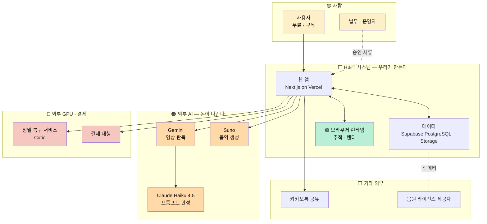
```mermaid
flowchart TB
    subgraph OUT1["🟡 사람"]
        U1["사용자<br>무료 · 구독"]
        U2["법무 · 운영자"]
    end
    subgraph SYS["⬜ HILiT 시스템 — 우리가 만든다"]
        direction TB
        S1["웹 앱<br>Next.js on Vercel"]
        S2["데이터<br>Supabase PostgreSQL + Storage"]
        S3["🟢 브라우저 런타임<br>추적 · 렌더"]
    end
    subgraph OUT2["🟠 외부 AI — 돈이 나간다"]
        E1["Gemini<br>영상 판독"]
        E2["Claude Haiku 4.5<br>프롬프트 판정"]
        E3["Suno<br>음악 생성"]
    end
    subgraph OUT3["🔴 외부 GPU · 결제"]
        E4["정밀 복구 서비스<br>Cutie"]
        E5["결제 대행"]
    end
    subgraph OUT4["⬜ 기타 외부"]
        E6["카카오톡 공유"]
        E7["음원 라이선스 제공자"]
    end
    U1 --> S1
    U2 -.승인 서류.-> S1
    S1 <--> S2
    S1 <--> S3
    S1 --> E1 --> E2
    S1 --> E3
    S1 --> E4
    S1 --> E5
    S1 --> E6
    S2 -.곡 메타.- E7
    style U1 fill:#fdf0c8,color:#111
    style U2 fill:#fdf0c8,color:#111
    style S3 fill:#b9f0d5,color:#111
    style E1 fill:#ffd9a8,color:#111
    style E2 fill:#ffd9a8,color:#111
    style E3 fill:#ffd9a8,color:#111
    style E4 fill:#f6c7c0,color:#111
    style E5 fill:#f6c7c0,color:#111
```

| 경계 | 안에 있는 것 | 밖에 있는 것 |
| --- | --- | --- |
| **우리가 만든다** | 웹 앱 · DB · 브라우저 런타임 | — |
| **우리가 부른다** | — | Gemini · Claude · Suno · 복구 서비스 · 결제 대행 · 카카오 |
| **우리가 안 한다** | — | 🔴 **촬영** · 자체 GPU 운영 · 결제 정보 보관 |

> 🔴 **밖에 있는 것이 많다는 게 이 설계의 성격이다.** 제약 C-TEC-002(별도 백엔드 서버 금지)·C-TEC-005(자체 서버 구축 없이) 때문에 **무거운 일은 전부 남에게 맡기고 우리는 오케스트레이션만** 한다.

## CT-2 · UseCase Diagram

> **이 그림이 답하는 질문** — *"사용자가 이 앱으로 할 수 있는 일이 전부 뭔가?"*

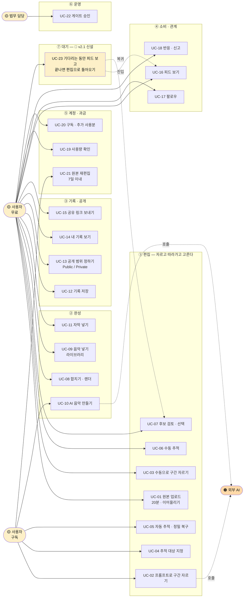
```mermaid
flowchart LR
    A1(["🟡 사용자<br>무료"])
    A2(["🟡 사용자<br>구독"])
    A3(["🟡 법무 담당"])
    A4(["🟠 외부 AI"])

    subgraph B1["① 편집 — 자르고 따라가고 고른다"]
        UC1["UC-01 원본 업로드<br>20분 · 이어올리기"]
        UC2["UC-02 프롬프트로 구간 자르기"]
        UC3["UC-03 수동으로 구간 자르기"]
        UC4["UC-04 추적 대상 지정"]
        UC5["UC-05 자동 추적 · 정밀 복구"]
        UC6["UC-06 수동 추적"]
        UC7["UC-07 후보 검토 · 선택"]
    end
    subgraph B2["② 완성"]
        UC8["UC-08 합치기 · 렌더"]
        UC9["UC-09 음악 넣기<br>라이브러리"]
        UC10["UC-10 AI 음악 만들기"]
        UC11["UC-11 자막 넣기"]
    end
    subgraph B3["③ 기록 · 공개"]
        UC12["UC-12 기록 저장"]
        UC13["UC-13 공개 범위 정하기<br>Public / Private"]
        UC14["UC-14 내 기록 보기"]
        UC15["UC-15 공유 링크 보내기"]
    end
    subgraph B4["④ 소비 · 관계"]
        UC16["UC-16 피드 보기"]
        UC17["UC-17 팔로우"]
        UC18["UC-18 반응 · 신고"]
    end
    subgraph B5["⑤ 계정 · 과금"]
        UC19["UC-19 사용량 확인"]
        UC20["UC-20 구독 · 추가 사용분"]
        UC21["UC-21 원본 재편집<br>7일 이내"]
    end
    subgraph B6["⑥ 운영"]
        UC22["UC-22 게이트 승인"]
    end
    subgraph B7["⑦ 대기 — 🔴 v2.1 신설"]
        UC23["UC-23 기다리는 동안 피드 보고<br>끝나면 편집으로 돌아오기"]
    end

    A1 --> UC1 & UC3 & UC6 & UC7 & UC8 & UC9 & UC11 & UC12 & UC13 & UC14 & UC15 & UC16 & UC17 & UC18 & UC19 & UC20 & UC23
    A2 --> UC2 & UC4 & UC5 & UC10 & UC21
    UC23 -.진입.-> UC16
    UC23 -.복귀.-> UC7
    A3 --> UC22
    UC2 -.호출.-> A4
    UC10 -.호출.-> A4
    style A1 fill:#fdf0c8,color:#111
    style A2 fill:#fdf0c8,color:#111
    style A3 fill:#fdf0c8,color:#111
    style A4 fill:#ffd9a8,color:#111
    style UC23 fill:#fdf0c8,color:#111
```

> 🔴 **무료 사용자도 완성까지 간다.** UC-03(수동 컷)·UC-06(수동 추적)이 UC-02·UC-05의 **수동 짝**이라, 유료 기능이 없어도 **같은 순서로 끝까지** 갈 수 있다. 이것이 SRS §4.3의 설계 의도다.

> 🔴 **UC-23은 다른 UseCase와 성격이 다르다** [v2.1]. 나머지 22개는 사용자가 **하려는 일**이지만, UC-23은 **우리가 만든 대기에 대한 대응**이다. 그래서 **무료 화살표(A1)에만 걸어 두었다** — 요금제로 가르지 않는다는 뜻이고, 구독 사용자도 A1 경로의 UseCase를 모두 쓴다(CT-3).
>
> **점선 둘이 UC-23의 전부다** — UC-16(피드)으로 **나갔다가**, UC-07(후보 선택)으로 **돌아온다.** 🔴 **돌아오는 점선이 끊기면 이 UseCase는 실패다**(PRD R13).

## CT-3 · 요금제별 권한 매트릭스

> **이 표가 답하는 질문** — *"돈을 내면 정확히 무엇이 달라지는가?"*

| UseCase | 무료 | 구독 | 근거 |
| --- | :---: | :---: | --- |
| UC-01 업로드 | 🔴 **첫 달 5회 · 이후 월 2회** · 20분 | **월 3편** · 20분 | SRS §4.3 |
| **UC-02 프롬프트 컷** | — | ● | 🟠 Gemini + Claude |
| UC-03 수동 컷 | ● | ● | UC-02의 수동 짝 |
| **UC-04·05 자동 추적 · 복구** | — | ● | 🟢🔴 브라우저 + GPU |
| 🔴 **UC-06 수동 추적** | **월 1회** | **무제한** | UC-05의 수동 짝 · **폴백 겸용** |
| UC-07 선택 | ● | ● | 🔴 최종 선택권은 항상 사람에게 |
| UC-08 렌더 · UC-09 음악 · UC-11 자막 | ● | ● | 🟢 브라우저 렌더 = 0원 |
| 🔴 **UC-10 AI 음악** | 🔴 **충전 시** | 월 3회 | 🟠 Suno 75원/회 · **v2.3: 플랜이 아니라 잔여가 판정** |
| UC-12~18 기록 · 소비 | ● | ● | 서버 원가만 |
| **UC-21 재편집(7일)** | — | ● | 스토리지 원가 |
| 🔴 **UC-20 추가 사용분** | **크레딧 충전(선불)** | **사용량 종량(후불)** | **v2.3 신설** · `UsageLedger.settlement` |

> 🔴 **돈을 내면 사라지는 것은 "직접 하는 시간"이다.** 위 표에서 갈리는 줄은 **컷 · 추적 · 리프레이밍 · AI 음악** 넷뿐이고, 나머지는 전부 무료에 있다.
>
> 🔴 **[v2.3] 열이 하나 줄고, 갈리던 줄 하나가 합쳐졌다.** 충전 열이 사라진 것은 **충전이 요금제가 아니게 됐기 때문**이고(SRS §4.3), **UC-10(AI 음악)이 무료에서도 열린 것**은 크레딧으로 살 수 있게 됐기 때문이다. 🔴 **그래서 이 표는 더 이상 "플랜 → 권한"의 완전한 함수가 아니다** — UC-10 칸의 "충전 시"는 **플랜이 아니라 잔여를 보라는 뜻**이다.
>
> 🔺 **`—` 인 줄(UC-02 · UC-04·05)은 충전해도 열리지 않는다.** 표에서 `—` 와 "충전 시"가 나란히 보이므로, **화면에서 둘을 같은 회색으로 그리면 사용자가 "충전하면 다 열린다"로 읽는다**(PRD AC7-7).

> 🔴 **[v2.2] 다섯 번째 줄이 갈렸다 — UC-06(수동 추적)이다. 다만 성격이 다르다.** 앞의 넷은 **있고/없고**로 갈리지만, UC-06은 **횟수**로 갈린다(무료 월 1회 · 유료 무제한). 🔴 **그래서 이 줄만 "—"가 아니라 숫자로 적혀 있다** — 무료 사용자에게도 기능 자체는 열려 있다는 뜻이고, 화면 문구도 *"쓸 수 없습니다"* 가 아니라 *"이번 달 1회를 썼습니다"* 가 되어야 한다.
>
> 🔺 **UC-01(업로드) 무료 칸이 두 값인 것도 v2.2에서 생긴 비정형이다** — 가입 첫 주기만 5회다. **표 한 칸에 값이 둘이면 구현이 하나만 읽는다**(SRS §4.3의 `editQuota()` 가 그 방지선이다).

---

# 2. Composition Viewpoint — 무엇으로 나뉘고 어디서 도는가

> **대응 SRS**: §3.1 단일 앱 구성 · §3.3 계층 책임

## CP-1 · Component Diagram

> **이 그림이 답하는 질문** — *"코드가 어떤 덩어리로 나뉘고, 각 덩어리는 누구와 이야기하는가?"*

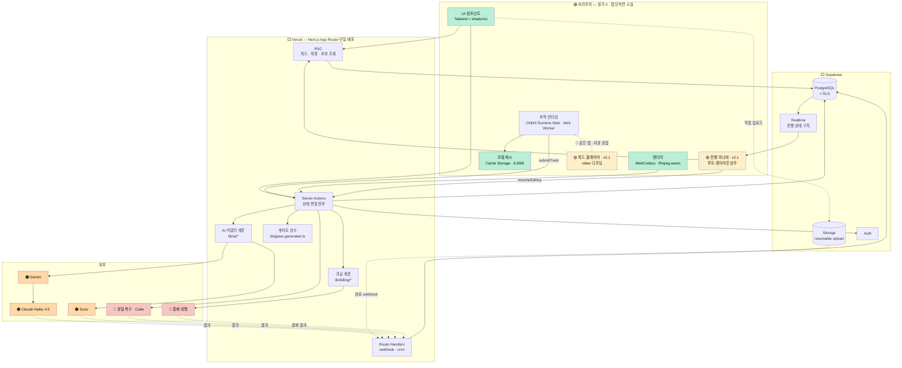
```mermaid
flowchart TB
    subgraph BR["🟢 브라우저 — 원가 0 · 탭 닫히면 소실"]
        direction LR
        C1["UI 컴포넌트<br>Tailwind + shadcn/ui"]
        C2["추적 런타임<br>ONNX Runtime Web · Web Worker"]
        C3["렌더러<br>WebCodecs · ffmpeg.wasm"]
        C4["모델 캐시<br>Cache Storage · 6.5MB"]
        C5["🟡 진행 미니바 · v2.1<br>루트 레이아웃 상주"]
        C6["🟡 피드 플레이어 · v2.1<br>video 디코딩"]
    end
    subgraph VC["⬜ Vercel — Next.js App Router 단일 배포"]
        direction LR
        S1["RSC<br>피드 · 목록 · 후보 조회"]
        S2["Server Actions<br>상태 변경 전부"]
        S3["Route Handlers<br>webhook · cron"]
        S4["AI 어댑터 계층<br>lib/ai/*"]
        S5["과금 계층<br>lib/billing/*"]
        S6["게이트 상수<br>lib/gates.generated.ts"]
    end
    subgraph SB["⬜ Supabase"]
        direction LR
        D1[("PostgreSQL<br>+ RLS")]
        D2[("Storage<br>resumable upload")]
        D3["Realtime<br>진행 상태 구독"]
        D4["Auth"]
    end
    subgraph EX["외부"]
        direction LR
        X1["🟠 Gemini"]
        X2["🟠 Claude Haiku 4.5"]
        X3["🟠 Suno"]
        X4["🔴 정밀 복구 · Cutie"]
        X5["🔴 결제 대행"]
    end

    C1 --> S1
    C1 --> S2
    C1 -.직접 업로드.-> D2
    C2 --> C4
    C2 -->|submitTrack| S2
    C3 --> S2
    S1 --> D1
    S2 --> D1
    S2 --> D4
    S3 --> D1
    S2 --> S4 --> X1 --> X2
    S4 --> X3
    S2 --> X4
    S2 --> S5 --> X5
    S2 --> S6
    D2 -.완료 webhook.-> S3
    X2 -.결과.-> S3
    X3 -.결과.-> S3
    X4 -.결과.-> S3
    X5 -.결제 결과.-> S3
    D1 --> D3 --> C5
    C5 --> S1
    C5 -->|resumeEditing| S2
    C2 -. 🔴 같은 탭 · 자원 경합 .- C6
    style C1 fill:#b9f0d5,color:#111
    style C3 fill:#b9f0d5,color:#111
    style C4 fill:#b9f0d5,color:#111
    style C5 fill:#fdf0c8,color:#111
    style C6 fill:#fdf0c8,color:#111
    style X1 fill:#ffd9a8,color:#111
    style X2 fill:#ffd9a8,color:#111
    style X3 fill:#ffd9a8,color:#111
    style X4 fill:#f6c7c0,color:#111
    style X5 fill:#f6c7c0,color:#111
```

| 컴포넌트 | 책임 | 🔴 하지 않는 일 |
| --- | --- | --- |
| **RSC** | 읽기 전용 조회(피드 · 목록 · 후보) | 상태를 바꾸지 않는다 |
| **Server Action** | 사용자가 일으키는 **모든 상태 변경** | **외부 응답을 기다리지 않는다**(A-T1) |
| **Route Handler** | 외부가 일으키는 것 — webhook · cron | 여기서 후보 생성까지 하지 않는다 |
| **AI 어댑터** | 제공자별 형식 흡수 · 정규화 | **재시도 정책을 갖지 않는다** |
| **과금 계층** | 잔여 계산 · **후차감** · 소멸 | 결제 정보를 저장하지 않는다 |
| **게이트 상수** | 빌드 시 생성 · 미승인 기능 제거 | 런타임에 켜지지 않는다 |
| 🔴 **진행 미니바** *(v2.1)* | 활성 작업 1건의 **단계·진행률·완료 알림** · 탭하면 `resumeEditing` 호출 | 🔴 **작업을 만들지도 바꾸지도 않는다** — 읽고 전달만 한다 · 🔴 **렌더 단계에서는 피드 진입점을 내주지 않는다**(R4) |

> ### 🔴 v2.1이 이 그림에 더한 선 두 개 [F29]
> **① `D3 → C5`** — Realtime 구독이 `C1`(UI 컴포넌트)이 아니라 **`C5`(미니바)** 로 들어온다. v2.0에서는 편집 화면이 구독했고, **그 화면을 벗어나면 끊겼다.** 미니바는 루트 레이아웃에 상주하므로 라우트가 바뀌어도 언마운트되지 않는다(SRS §5.1).
>
> **② `C2 --- C6`** *(굵은 점선 · 화살표 없음)* — 🔴 **추적 런타임과 피드 플레이어 사이에는 데이터가 흐르지 않는다.** 둘은 서로를 호출하지 않는다. **그런데도 선을 그은 이유는 같은 탭의 CPU·디코더·대역을 나눠 쓰기 때문**이다. **화살표가 없는 유일한 선이며, 이 문서에서 유일하게 "호출 관계가 아닌 관계"** 다(SRS §6.5.5 · T7).
| **🟢 추적 런타임** | 클립별 추적 · Tracking Health 판정 | 🔴 **복구를 직접 호출하지 않는다** |
| **🟢 렌더러** | 합치기 · 자막 굽기 · 크롭 적용 | 서버로 인코딩을 보내지 않는다 |

## CP-2 · 실행 위치 배치도

> **이 그림이 답하는 질문** — *"같은 파이프라인인데 각 단계는 물리적으로 어디서 도는가? 그리고 각각 얼마인가?"*

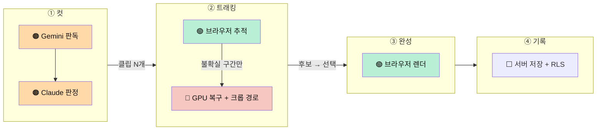
```mermaid
flowchart LR
    subgraph P1["① 컷"]
        direction TB
        A1["🟠 Gemini 판독"] --> A2["🟠 Claude 판정"]
    end
    subgraph P2["② 트래킹"]
        direction TB
        B1["🟢 브라우저 추적"] -->|불확실 구간만| B2["🔴 GPU 복구 + 크롭 경로"]
    end
    subgraph P3["③ 완성"]
        direction TB
        C1["🟢 브라우저 렌더"]
    end
    subgraph P4["④ 기록"]
        direction TB
        D1["⬜ 서버 저장 + RLS"]
    end
    P1 -->|"클립 N개"| P2 -->|"후보 → 선택"| P3 --> P4
    style A1 fill:#ffd9a8,color:#111
    style A2 fill:#ffd9a8,color:#111
    style B1 fill:#b9f0d5,color:#111
    style B2 fill:#f6c7c0,color:#111
    style C1 fill:#b9f0d5,color:#111
```

| 단계 | 실행 위치 | 편당 원가 | 근거 |
| --- | --- | --- | --- |
| ① 컷 | 🟠 외부 AI | **[TBD] — 최대 미지수** | 편집 1건마다 **반드시** 발생하는 고정비 · SRS Q14 |
| ② 추적 | 🟢 브라우저 | **0원** | 🔺 단, **브라우저 실측이 없다**(T4 · SP-003) |
| ② 복구 | 🔴 GPU | **10~17원/회** · 상한 40회 | 불확실 구간만 · SRS §5.5 |
| ③ 렌더 | 🟢 브라우저 | **0원** | 대신 성공률이 단말에 종속 |
| ④ 기록 | ⬜ 서버 | 스토리지 | — |

> 🔴 **원가를 줄이는 유일한 방법은 ①에서 짧게 자르는 것이다.** ②③의 부담이 전부 ①의 출력 길이에 비례한다.

---

# 3. Information Viewpoint — 데이터가 어떤 모양인가

> **대응 SRS**: §4.1 Prisma 스키마 · §4.2 RLS · §4.3 요금제 파라미터

## ER-1 · 전체 ERD

> **이 그림이 답하는 질문** — *"테이블이 몇 개고 어떻게 이어지는가?"*

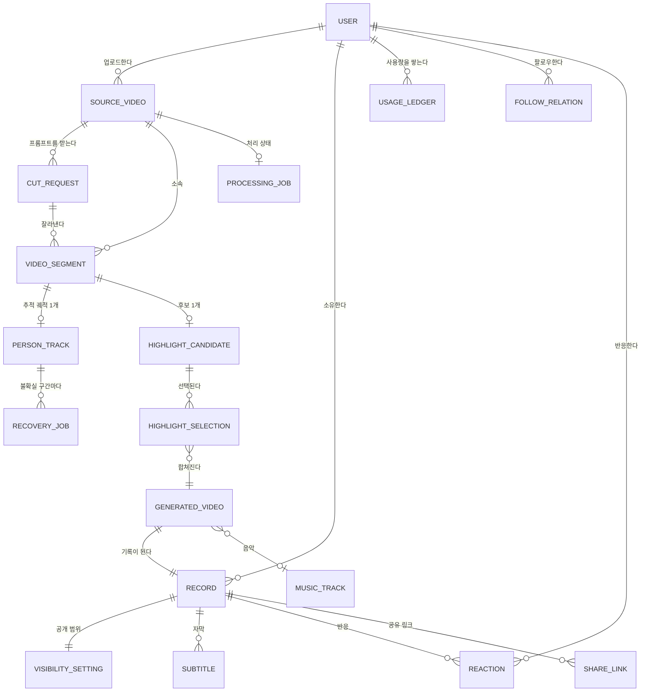
```mermaid
erDiagram
    USER ||--o{ SOURCE_VIDEO : "업로드한다"
    USER ||--o{ RECORD : "소유한다"
    USER ||--o{ USAGE_LEDGER : "사용량을 쌓는다"
    USER ||--o{ FOLLOW_RELATION : "팔로우한다"
    USER ||--o{ REACTION : "반응한다"

    SOURCE_VIDEO ||--o{ CUT_REQUEST : "프롬프트를 받는다"
    CUT_REQUEST ||--o{ VIDEO_SEGMENT : "잘라낸다"
    SOURCE_VIDEO ||--o{ VIDEO_SEGMENT : "소속"

    VIDEO_SEGMENT ||--o| PERSON_TRACK : "추적 궤적 1개"
    PERSON_TRACK ||--o{ RECOVERY_JOB : "불확실 구간마다"
    VIDEO_SEGMENT ||--o| HIGHLIGHT_CANDIDATE : "후보 1개"

    HIGHLIGHT_CANDIDATE ||--o{ HIGHLIGHT_SELECTION : "선택된다"
    HIGHLIGHT_SELECTION }o--|| GENERATED_VIDEO : "합쳐진다"
    GENERATED_VIDEO ||--|| RECORD : "기록이 된다"

    RECORD ||--|| VISIBILITY_SETTING : "공개 범위"
    RECORD ||--o{ SUBTITLE : "자막"
    RECORD ||--o{ REACTION : "반응"
    RECORD ||--o{ SHARE_LINK : "공유 링크"
    GENERATED_VIDEO }o--o| MUSIC_TRACK : "음악"

    SOURCE_VIDEO ||--o| PROCESSING_JOB : "처리 상태"
```

> 🔴 **이 ERD에서 가장 중요한 선은 `VIDEO_SEGMENT ||--o| PERSON_TRACK` 이다.** 추적이 **원본이 아니라 클립에 걸려 있다** — v2.2에서는 `SOURCE_VIDEO`에 걸려 있었고, 파이프라인 순서가 바뀌면서 옮겨졌다.

**엔티티 15종 — 한 줄 설명**

| 엔티티 | 무엇인가 | 🆕 v3.0 |
| --- | --- | :---: |
| `USER` | 계정 · 현재 플랜 | |
| `SOURCE_VIDEO` | 업로드한 원본 · **20분 상한** · 7일 보관 | |
| **`CUT_REQUEST`** | 사용자 프롬프트 1건 · **원가 귀속 단위** | 🆕 |
| **`VIDEO_SEGMENT`** | 잘라낸 클립 · **트래킹의 입력** | 🆕 |
| `PERSON_TRACK` | **클립 하나**의 추적 궤적 + Health + 크롭 경로 | 🔄 단위 변경 |
| **`RECOVERY_JOB`** | 불확실 구간 1건의 GPU 복구 · **원가 계량 단위** | 🆕 |
| `HIGHLIGHT_CANDIDATE` | 사용자에게 보여줄 후보 · `trackStatus` | 🔄 |
| `HIGHLIGHT_SELECTION` | 사용자가 고른 것 | |
| `GENERATED_VIDEO` | 완성 영상 | |
| `RECORD` | 개인 기록 — **공개와 무관하게 존재** | |
| `VISIBILITY_SETTING` | **Public / Private 2단** · 기본 private | 🔄 그룹 삭제 |
| **`SUBTITLE`** | 자막 1줄 · OFL 폰트 5종 | 🆕 |
| `MUSIC_TRACK` | 곡 · `origin`(라이브러리 / AI) | 🔄 |
| **`USAGE_LEDGER`** | 사용량 · **소멸 예정일** | 🆕 |
| `SHARE_LINK` · `REACTION` · `FOLLOW_RELATION` · `PROCESSING_JOB` | 공유 · 반응 · 관계 · 작업 | |

## ER-2 · 도메인 ① — 컷 · 트래킹

> **이 그림이 답하는 질문** — *"파이프라인 ①②가 만드는 데이터는 정확히 뭔가?"*

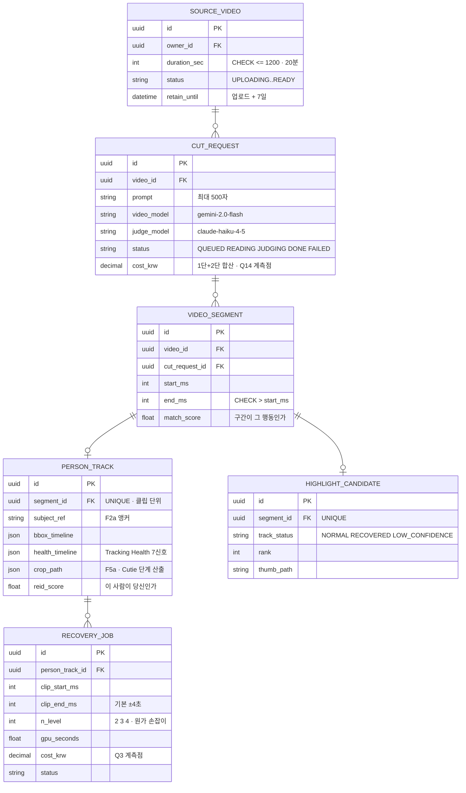
```mermaid
erDiagram
    SOURCE_VIDEO {
        uuid id PK
        uuid owner_id FK
        int duration_sec "CHECK <= 1200 · 20분"
        string status "UPLOADING..READY"
        datetime retain_until "업로드 + 7일"
    }
    CUT_REQUEST {
        uuid id PK
        uuid video_id FK
        string prompt "최대 500자"
        string video_model "gemini-2.0-flash"
        string judge_model "claude-haiku-4-5"
        string status "QUEUED READING JUDGING DONE FAILED"
        decimal cost_krw "1단+2단 합산 · Q14 계측점"
    }
    VIDEO_SEGMENT {
        uuid id PK
        uuid video_id FK
        uuid cut_request_id FK
        int start_ms
        int end_ms "CHECK > start_ms"
        float match_score "구간이 그 행동인가"
    }
    PERSON_TRACK {
        uuid id PK
        uuid segment_id FK "UNIQUE · 클립 단위"
        string subject_ref "F2a 앵커"
        json bbox_timeline
        json health_timeline "Tracking Health 7신호"
        json crop_path "F5a · Cutie 단계 산출"
        float reid_score "이 사람이 당신인가"
    }
    RECOVERY_JOB {
        uuid id PK
        uuid person_track_id FK
        int clip_start_ms
        int clip_end_ms "기본 ±4초"
        int n_level "2 3 4 · 원가 손잡이"
        float gpu_seconds
        decimal cost_krw "Q3 계측점"
        string status
    }
    HIGHLIGHT_CANDIDATE {
        uuid id PK
        uuid segment_id FK "UNIQUE"
        string track_status "NORMAL RECOVERED LOW_CONFIDENCE"
        int rank
        string thumb_path
    }
    SOURCE_VIDEO ||--o{ CUT_REQUEST : ""
    CUT_REQUEST ||--o{ VIDEO_SEGMENT : ""
    VIDEO_SEGMENT ||--o| PERSON_TRACK : ""
    PERSON_TRACK ||--o{ RECOVERY_JOB : ""
    VIDEO_SEGMENT ||--o| HIGHLIGHT_CANDIDATE : ""
```

> 🔴 **`match_score` 와 `reid_score` 는 다른 테이블의 다른 컬럼이다.**
> - `match_score`(VIDEO_SEGMENT) = *"이 구간이 **그 행동**인가"* — F25가 판정
> - `reid_score`(PERSON_TRACK) = *"이 사람이 **당신**인가"* — 추적이 판정
>
> **섞이면 저신뢰 제외 판정이 조용히 틀린다.** 스키마가 이를 물리적으로 막는다.

## ER-3 · 도메인 ② — 완성 · 기록 · 공개

> **이 그림이 답하는 질문** — *"완성된 영상과 기록은 어떻게 구분되고, 공개 범위는 어디에 붙는가?"*

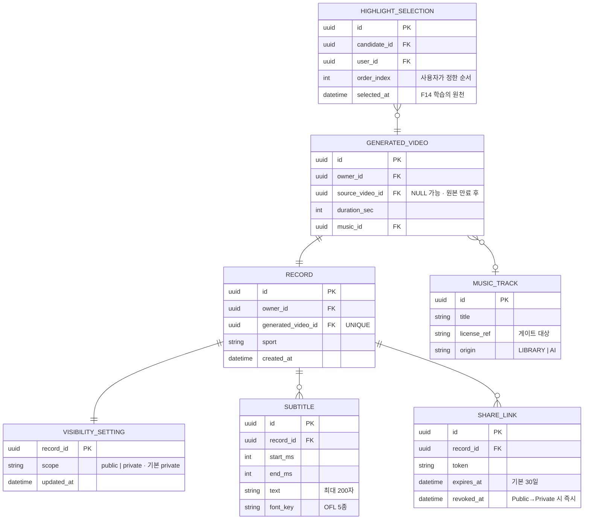
```mermaid
erDiagram
    HIGHLIGHT_SELECTION {
        uuid id PK
        uuid candidate_id FK
        uuid user_id FK
        int order_index "사용자가 정한 순서"
        datetime selected_at "F14 학습의 원천"
    }
    GENERATED_VIDEO {
        uuid id PK
        uuid owner_id FK
        uuid source_video_id FK "NULL 가능 · 원본 만료 후"
        int duration_sec
        uuid music_id FK
    }
    RECORD {
        uuid id PK
        uuid owner_id FK
        uuid generated_video_id FK "UNIQUE"
        string sport
        datetime created_at
    }
    VISIBILITY_SETTING {
        uuid record_id PK
        string scope "public | private · 기본 private"
        datetime updated_at
    }
    SUBTITLE {
        uuid id PK
        uuid record_id FK
        int start_ms
        int end_ms
        string text "최대 200자"
        string font_key "OFL 5종"
    }
    MUSIC_TRACK {
        uuid id PK
        string title
        string license_ref "게이트 대상"
        string origin "LIBRARY | AI"
    }
    SHARE_LINK {
        uuid id PK
        uuid record_id FK
        string token
        datetime expires_at "기본 30일"
        datetime revoked_at "Public→Private 시 즉시"
    }
    HIGHLIGHT_SELECTION }o--|| GENERATED_VIDEO : ""
    GENERATED_VIDEO ||--|| RECORD : ""
    GENERATED_VIDEO }o--o| MUSIC_TRACK : ""
    RECORD ||--|| VISIBILITY_SETTING : ""
    RECORD ||--o{ SUBTITLE : ""
    RECORD ||--o{ SHARE_LINK : ""
```

> 🔴 **`RECORD` 와 `SOURCE_VIDEO` 의 생명주기가 다르다.** 원본은 7일 뒤 사라지지만 기록은 남는다(`source_video_id` 가 `NULL` 이 될 수 있다). **이것이 D4 "기록이 먼저고 공개가 선택"의 물리적 표현**이다.

## ER-4 · 도메인 ③ — 과금 · 소비

> **이 그림이 답하는 질문** — *"사용량과 소멸은 어떻게 저장되는가?"*

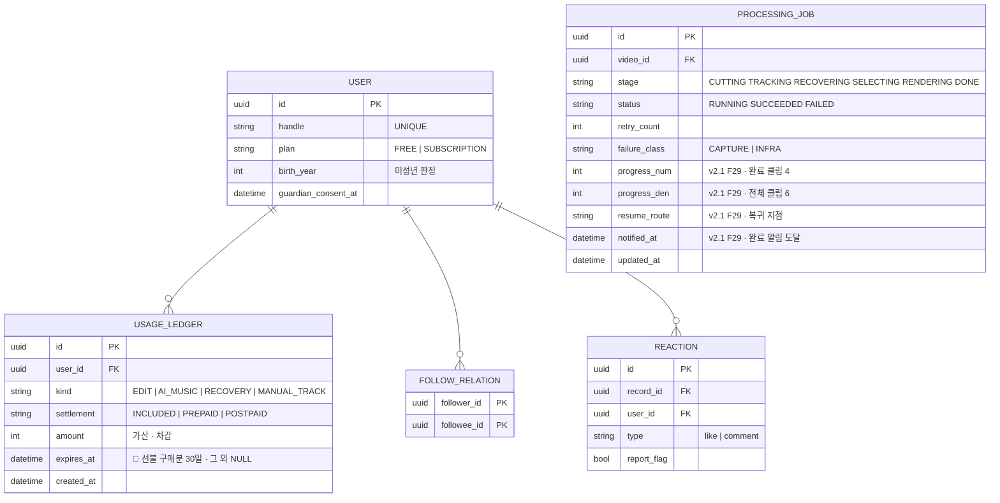
```mermaid
erDiagram
    USER {
        uuid id PK
        string handle "UNIQUE"
        string plan "FREE | SUBSCRIPTION"
        int birth_year "미성년 판정"
        datetime guardian_consent_at
    }
    USAGE_LEDGER {
        uuid id PK
        uuid user_id FK
        string kind "EDIT | AI_MUSIC | RECOVERY | MANUAL_TRACK"
        string settlement "INCLUDED | PREPAID | POSTPAID"
        int amount "가산 · 차감"
        datetime expires_at "🔴 선불 구매분 30일 · 그 외 NULL"
        datetime created_at
    }
    FOLLOW_RELATION {
        uuid follower_id PK
        uuid followee_id PK
    }
    REACTION {
        uuid id PK
        uuid record_id FK
        uuid user_id FK
        string type "like | comment"
        bool report_flag
    }
    PROCESSING_JOB {
        uuid id PK
        uuid video_id FK
        string stage "CUTTING TRACKING RECOVERING SELECTING RENDERING DONE"
        string status "RUNNING SUCCEEDED FAILED"
        int retry_count
        string failure_class "CAPTURE | INFRA"
        int progress_num "v2.1 F29 · 완료 클립 4"
        int progress_den "v2.1 F29 · 전체 클립 6"
        string resume_route "v2.1 F29 · 복귀 지점"
        datetime notified_at "v2.1 F29 · 완료 알림 도달"
        datetime updated_at
    }
    USER ||--o{ USAGE_LEDGER : ""
    USER ||--o{ FOLLOW_RELATION : ""
    USER ||--o{ REACTION : ""
```

> 🔴 **`USAGE_LEDGER` 는 잔액이 아니라 원장(ledger)이다.** 현재 잔여는 *"만료되지 않은 행의 합"* 으로 계산한다 — 잔액 컬럼 하나를 두면 **동시 요청에서 음수가 생기고, 소멸을 표현할 수 없다.**

## CLD-1 · Class Diagram — 도메인 책임

> **이 그림이 답하는 질문** — *"코드에서 누가 무엇을 책임지는가? 특히 원가와 보안은 누가 지키는가?"*

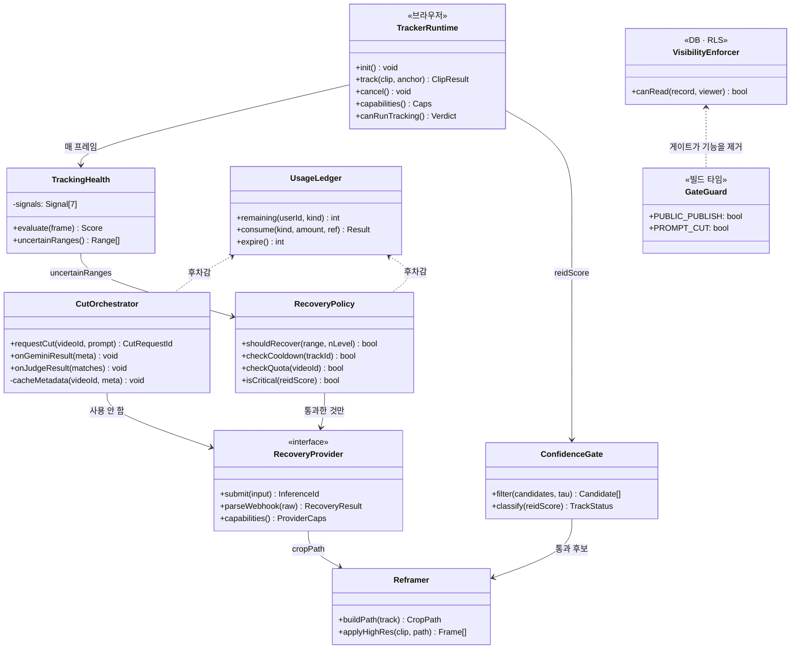
```mermaid
classDiagram
    class CutOrchestrator {
        +requestCut(videoId, prompt) CutRequestId
        +onGeminiResult(meta) void
        +onJudgeResult(matches) void
        -cacheMetadata(videoId, meta) void
        %% 1단 캐시가 재편집 원가를 줄인다
    }
    class TrackerRuntime {
        <<브라우저>>
        +init() void
        +track(clip, anchor) ClipResult
        +cancel() void
        +capabilities() Caps
        +canRunTracking() Verdict
        %% 판정만 · 복구는 부르지 않는다
    }
    class TrackingHealth {
        +evaluate(frame) Score
        +uncertainRanges() Range[]
        -signals: Signal[7]
    }
    class RecoveryPolicy {
        +shouldRecover(range, nLevel) bool
        +checkCooldown(trackId) bool
        +checkQuota(videoId) bool
        +isCritical(reidScore) bool
        %% 억제가 본체 — 쿨다운·40회·N-Level·Critical 우회
    }
    class RecoveryProvider {
        <<interface>>
        +submit(input) InferenceId
        +parseWebhook(raw) RecoveryResult
        +capabilities() ProviderCaps
    }
    class Reframer {
        +buildPath(track) CropPath
        +applyHighRes(clip, path) Frame[]
        %% 경로는 Cutie 단계 · 적용은 선택 후
    }
    class ConfidenceGate {
        +filter(candidates, tau) Candidate[]
        +classify(reidScore) TrackStatus
        %% null을 0/1로 치환하지 않는다
    }
    class VisibilityEnforcer {
        <<DB · RLS>>
        +canRead(record, viewer) bool
        %% 애플리케이션이 아니라 DB가 강제
    }
    class UsageLedger {
        +remaining(userId, kind) int
        +consume(kind, amount, ref) Result
        +expire() int
        %% 후차감 · ref 기준 멱등
    }
    class GateGuard {
        <<빌드 타임>>
        +PUBLIC_PUBLISH: bool
        +PROMPT_CUT: bool
        %% 미승인 기능은 번들에 없다
    }

    CutOrchestrator --> RecoveryProvider : 사용 안 함
    TrackerRuntime --> TrackingHealth : 매 프레임
    TrackingHealth --> RecoveryPolicy : uncertainRanges
    RecoveryPolicy --> RecoveryProvider : 통과한 것만
    RecoveryProvider --> Reframer : cropPath
    TrackerRuntime --> ConfidenceGate : reidScore
    ConfidenceGate --> Reframer : 통과 후보
    UsageLedger <.. CutOrchestrator : 후차감
    UsageLedger <.. RecoveryPolicy : 후차감
    VisibilityEnforcer <.. GateGuard : 게이트가 기능을 제거
```

| 클래스 | 지키는 것 | 🔴 깨지면 |
| --- | --- | --- |
| `RecoveryPolicy` | **원가** — 쿨다운 · 40회 상한 · N-Level | 어려운 영상에서 호출 폭주 → 편당 원가 폭증 |
| `ConfidenceGate` | **신뢰** — 타인 장면 혼입 0건 | 남의 장면이 내 하이라이트에 섞인다(R2) |
| `VisibilityEnforcer` | **프라이버시** — 개수 유추까지 차단 | 비공개 기록의 존재가 노출된다(REQ-NF-009) |
| `UsageLedger` | **공정성** — 실패는 차감하지 않는다 | 사용자가 두 번 손해를 본다(AF-11) |
| `GateGuard` | **법적 안전** — 미승인 기능은 빌드에 없다 | 승인 전 기능이 실수로 배포된다 |
| `TrackerRuntime` | **경계** — 판정만 하고 서버를 부르지 않는다 | A-T1 안에서 끝나지 않는다 |

## ST-1 · 상태 기계 — 원본(SourceVideo)

> **이 그림이 답하는 질문** — *"영상 하나가 업로드부터 만료까지 어떤 상태를 거치는가?"*

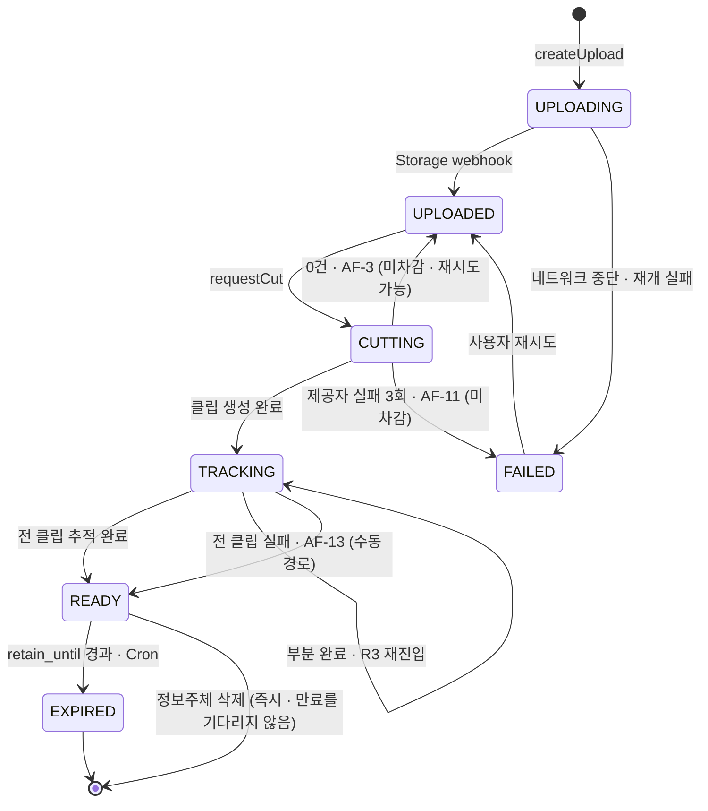
```mermaid
stateDiagram-v2
    [*] --> UPLOADING : createUpload
    UPLOADING --> UPLOADED : Storage webhook
    UPLOADING --> FAILED : 네트워크 중단 · 재개 실패
    UPLOADED --> CUTTING : requestCut
    CUTTING --> TRACKING : 클립 생성 완료
    CUTTING --> UPLOADED : 0건 · AF-3 (미차감 · 재시도 가능)
    CUTTING --> FAILED : 제공자 실패 3회 · AF-11 (미차감)
    TRACKING --> READY : 전 클립 추적 완료
    TRACKING --> TRACKING : 부분 완료 · R3 재진입
    TRACKING --> READY : 전 클립 실패 · AF-13 (수동 경로)
    READY --> EXPIRED : retain_until 경과 · Cron
    READY --> [*] : 정보주체 삭제 (즉시 · 만료를 기다리지 않음)
    EXPIRED --> [*]
    FAILED --> UPLOADED : 사용자 재시도
```

> 🔴 **`CUTTING → UPLOADED` 로 돌아가는 화살표가 AF-3이다.** 프롬프트에 맞는 구간이 0건이어도 **실패가 아니라 되돌아가는 것**이며, 사용량도 차감하지 않는다. 이 화살표가 없으면 사용자는 프롬프트를 고쳐 다시 시도할 수 없다.
>
> 🔴 **`TRACKING → TRACKING` 자기 루프가 R3다.** 탭이 닫혀 부분 완료로 남았다가 재진입하면 **남은 클립만** 돈다.

## ST-2 · 상태 기계 — 프롬프트 컷(CutRequest)

> **이 그림이 답하는 질문** — *"컷 요청 하나가 두 AI를 거치는 동안 어떤 상태인가?"*

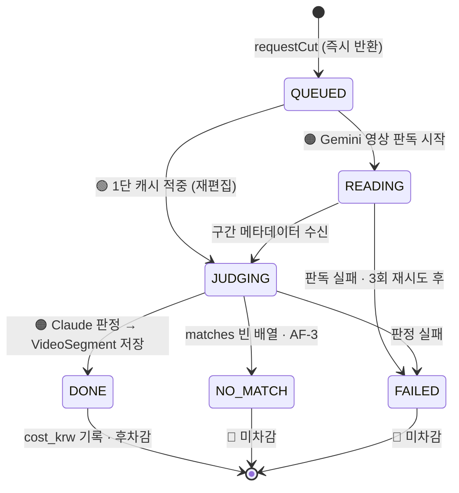
```mermaid
stateDiagram-v2
    [*] --> QUEUED : requestCut (즉시 반환)
    QUEUED --> READING : 🟠 Gemini 영상 판독 시작
    QUEUED --> JUDGING : 🟢 1단 캐시 적중 (재편집)
    READING --> JUDGING : 구간 메타데이터 수신
    READING --> FAILED : 판독 실패 · 3회 재시도 후
    JUDGING --> DONE : 🟠 Claude 판정 → VideoSegment 저장
    JUDGING --> NO_MATCH : matches 빈 배열 · AF-3
    JUDGING --> FAILED : 판정 실패
    DONE --> [*] : cost_krw 기록 · 후차감
    NO_MATCH --> [*] : 🔴 미차감
    FAILED --> [*] : 🔴 미차감
```

> 🟢 **`QUEUED → JUDGING` 지름길이 재편집의 실익이다.** 7일 보관(F27) 안에 다른 프롬프트로 다시 자르면 **Gemini를 건너뛴다** — 가장 비싼 단계를 생략하는 유일한 경로다.

## ST-3 · 상태 기계 — 후보의 추적 상태(trackStatus)

> **이 그림이 답하는 질문** — *"후보 하나에 붙는 '정상/복구완료/저신뢰' 딱지는 어떻게 정해지는가?"*

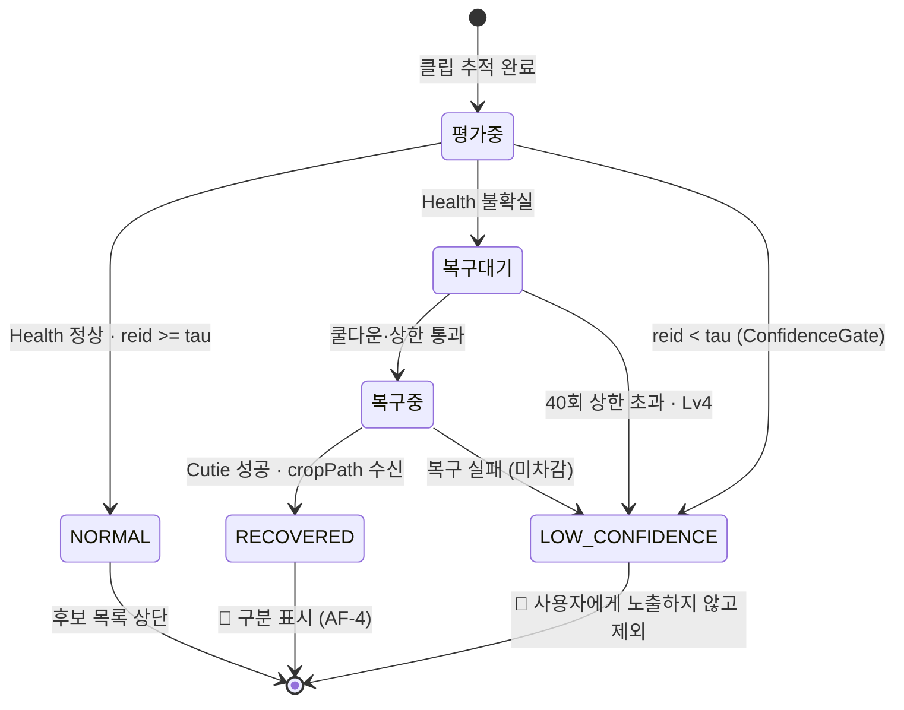
```mermaid
stateDiagram-v2
    [*] --> 평가중 : 클립 추적 완료
    평가중 --> NORMAL : Health 정상 · reid >= tau
    평가중 --> 복구대기 : Health 불확실
    평가중 --> LOW_CONFIDENCE : reid < tau (ConfidenceGate)
    복구대기 --> 복구중 : 쿨다운·상한 통과
    복구대기 --> LOW_CONFIDENCE : 40회 상한 초과 · Lv4
    복구중 --> RECOVERED : Cutie 성공 · cropPath 수신
    복구중 --> LOW_CONFIDENCE : 복구 실패 (미차감)
    NORMAL --> [*] : 후보 목록 상단
    RECOVERED --> [*] : 🔴 구분 표시 (AF-4)
    LOW_CONFIDENCE --> [*] : 🔴 사용자에게 노출하지 않고 제외
```

> 🔴 **`LOW_CONFIDENCE` 는 배지가 아니라 제외다.** REQ-FUNC-027은 *"저신뢰 표시로 사용자에게 판단을 넘기지 않는다"* 고 못박았다. 반면 **`RECOVERED` 는 보여준다** — 서버가 개입한 사실은 사용자가 알아야 한다(AF-4).

## ST-4 · 상태 기계 — 사용량 원장 항목

> **이 그림이 답하는 질문** — *"충전한 사용량은 언제 사라지는가?"* · 🔴 **v2.3: `settlement = PREPAID` 인 행만 해당한다** — 후불 행은 소멸하지 않고 **청구된다**.

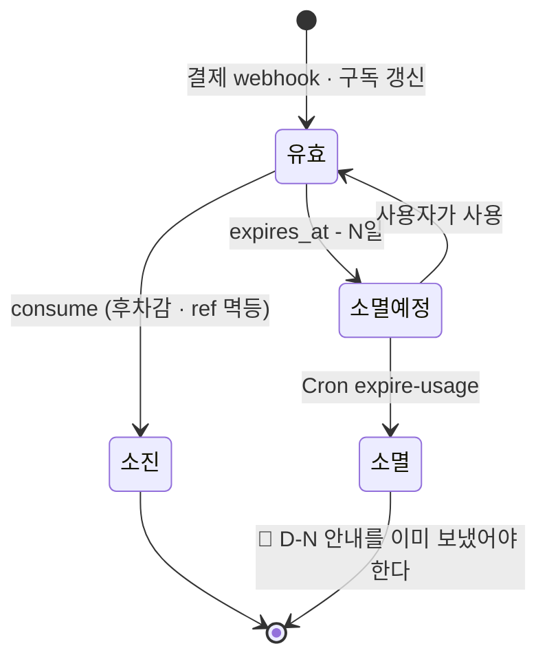
```mermaid
stateDiagram-v2
    [*] --> 유효 : 결제 webhook · 구독 갱신
    유효 --> 소진 : consume (후차감 · ref 멱등)
    유효 --> 소멸예정 : expires_at - N일
    소멸예정 --> 유효 : 사용자가 사용
    소멸예정 --> 소멸 : Cron expire-usage
    소진 --> [*]
    소멸 --> [*] : 🔴 D-N 안내를 이미 보냈어야 한다
```

## 🔴 ST-5 · 상태 기계 — 처리 작업(ProcessingJob) 🆕 v2.1

> **이 그림이 답하는 질문** — *"미니바가 읽는 그 상태는 어떻게 움직이고, 어느 상태에서 피드로 나가도 되는가?"*

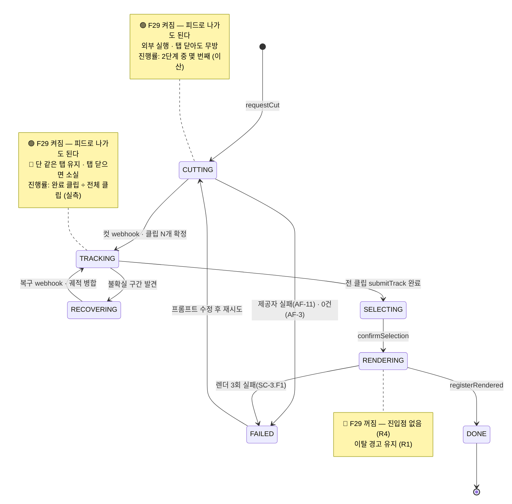
```mermaid
stateDiagram-v2
    [*] --> CUTTING : requestCut
    CUTTING --> TRACKING : 컷 webhook · 클립 N개 확정
    CUTTING --> FAILED : 제공자 실패(AF-11) · 0건(AF-3)
    TRACKING --> RECOVERING : 불확실 구간 발견
    RECOVERING --> TRACKING : 복구 webhook · 궤적 병합
    TRACKING --> SELECTING : 전 클립 submitTrack 완료
    SELECTING --> RENDERING : confirmSelection
    RENDERING --> DONE : registerRendered
    RENDERING --> FAILED : 렌더 3회 실패(SC-3.F1)
    FAILED --> CUTTING : 프롬프트 수정 후 재시도
    DONE --> [*]

    note left of CUTTING
        🟢 F29 켜짐 — 피드로 나가도 된다
        외부 실행 · 탭 닫아도 무방
        진행률: 2단계 중 몇 번째 (이산)
    end note
    note left of TRACKING
        🟢 F29 켜짐 — 피드로 나가도 된다
        🔴 단 같은 탭 유지 · 탭 닫으면 소실
        진행률: 완료 클립 ÷ 전체 클립 (실측)
    end note
    note right of RENDERING
        🔴 F29 꺼짐 — 진입점 없음 (R4)
        이탈 경고 유지 (R1)
    end note
```

> ### 🔴 이 그림이 F29의 실행 규칙을 전부 담고 있다 [v2.1]
>
> | 상태 | F29 | 사용자에게 하는 말 | 근거 |
> | --- | :--: | --- | --- |
> | `CUTTING` | 🟢 켜짐 | *"창을 닫아도 계속됩니다"* | 외부 AI 실행 · A-T9 무관 |
> | `TRACKING` · `RECOVERING` | 🟢 켜짐 | 🔴 *"이 탭은 열어 두세요 — 다른 화면은 보셔도 됩니다"* | 브라우저 실행 · **A-T9** |
> | `SELECTING` | — | 사용자 차례다. 대기가 아니다 | — |
> | `RENDERING` | 🔴 **꺼짐** | *"완료까지 이 화면에 머물러 주세요"* | **R1 · R4** |
> | `FAILED` | 🟢 켜짐 | 🔴 **피드 위에서 실패를 알린다**(AF-15) — 편집 화면에 들어와야만 알게 두지 않는다 | PRD AF-15 |
>
> 🔴 **`RECOVERING → TRACKING`이 되돌아가는 화살표인 이유** — 복구는 별도 단계가 아니라 **추적 안에서 일어나는 왕복**이다. 미니바는 이 왕복을 **"추적 중"으로 묶어 보여준다** — 사용자에게 `RECOVERING`은 의미 없는 내부 용어이고, 단계가 왔다 갔다 하는 표시는 **멈춘 것보다 더 불안하게 보인다.**

## FC-4 · RLS 판정 흐름

> **이 그림이 답하는 질문** — *"누군가 기록을 조회할 때 DB는 어떻게 판단하는가?"*

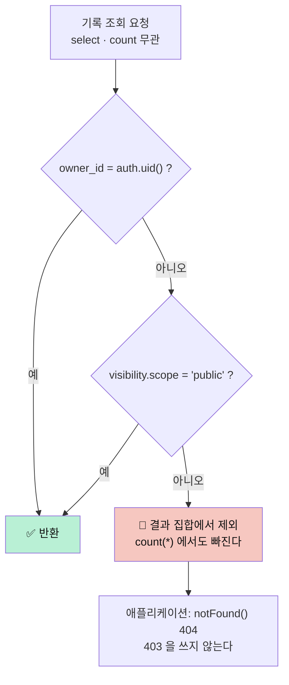
```mermaid
flowchart TD
    Q["기록 조회 요청<br>select · count 무관"] --> R1{"owner_id = auth.uid() ?"}
    R1 -->|예| OK["✅ 반환"]
    R1 -->|아니오| R2{"visibility.scope = 'public' ?"}
    R2 -->|예| OK
    R2 -->|아니오| NO["🔴 결과 집합에서 제외<br>count(*) 에서도 빠진다"]
    NO --> APP["애플리케이션: notFound() 404<br>403 을 쓰지 않는다"]
    style OK fill:#b9f0d5,color:#111
    style NO fill:#f6c7c0,color:#111
```

> 🟢 **v3.0에서 이 판단이 두 갈래로 줄었다.** 그룹이 있던 시절에는 `group_members` 조인과 `left_at is null` 조건이 더 붙었다. **조건이 하나 줄면 틀릴 자리도 하나 준다** — 보안 요구사항에서 검증 표면 축소는 그 자체로 성과다.
>
> 🔴 **`403` 이 아니라 `404` 인 이유** — `403`은 *"그 자원은 있는데 당신은 못 본다"* 를 알려준다. REQ-NF-009는 **존재를 유추할 수 있는 정보도 금지**하므로 `403`은 위반이다.

---

# 4. Interaction Viewpoint — 시간 순서로 무엇이 오가는가

> **대응 SRS**: §5.1 Action/Handler 배분 · §5.3 업로드 · §7.3 컷 · §7.4 추적 · §7.5 음악

**시퀀스 다이어그램 읽는 법** — 세로선은 참여자, 가로 화살표는 호출, `-->>` 는 응답이다. **`Note` 로 표시한 곳이 이 설계의 급소**다.

## SD-1 · 원본 업로드 (20분 상한)

> **이 그림이 답하는 질문** — *"4GB짜리 파일을 서버가 못 받는데 어떻게 올리는가?"*

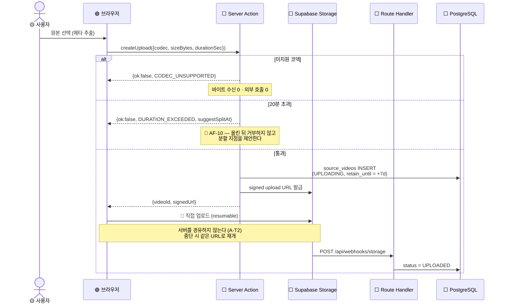
```mermaid
sequenceDiagram
    actor U as 🟡 사용자
    participant C as 🟢 브라우저
    participant SA as ⬜ Server Action
    participant ST as ⬜ Supabase Storage
    participant RH as ⬜ Route Handler
    participant DB as ⬜ PostgreSQL

    U->>C: 원본 선택 (메타 추출)
    C->>SA: createUpload({codec, sizeBytes, durationSec})
    alt 미지원 코덱
        SA-->>C: {ok:false, CODEC_UNSUPPORTED}
        Note over SA: 바이트 수신 0 · 외부 호출 0
    else 20분 초과
        SA-->>C: {ok:false, DURATION_EXCEEDED, suggestSplitAt}
        Note over SA: 🔴 AF-10 — 올린 뒤 거부하지 않고<br/>분할 지점을 제안한다
    else 통과
        SA->>DB: source_videos INSERT<br/>(UPLOADING, retain_until = +7d)
        SA->>ST: signed upload URL 발급
        SA-->>C: {videoId, signedUrl}
        C->>ST: 🔴 직접 업로드 (resumable)
        Note over C,ST: 서버를 경유하지 않는다 (A-T2)<br/>중단 시 같은 URL로 재개
        ST->>RH: POST /api/webhooks/storage
        RH->>DB: status = UPLOADED
    end
```

> 🔴 **판정이 업로드보다 먼저 온다.** 코덱과 길이를 Signed URL 발급 **전**에 검사하므로 **거부되는 파일은 바이트가 단 한 번도 전송되지 않는다.**

## SD-2 · 프롬프트 컷 — 2단 비동기

> **이 그림이 답하는 질문** — *"20분 영상 판독이 5분 걸리는데, 5초밖에 못 사는 서버 함수가 어떻게 처리하는가?"*

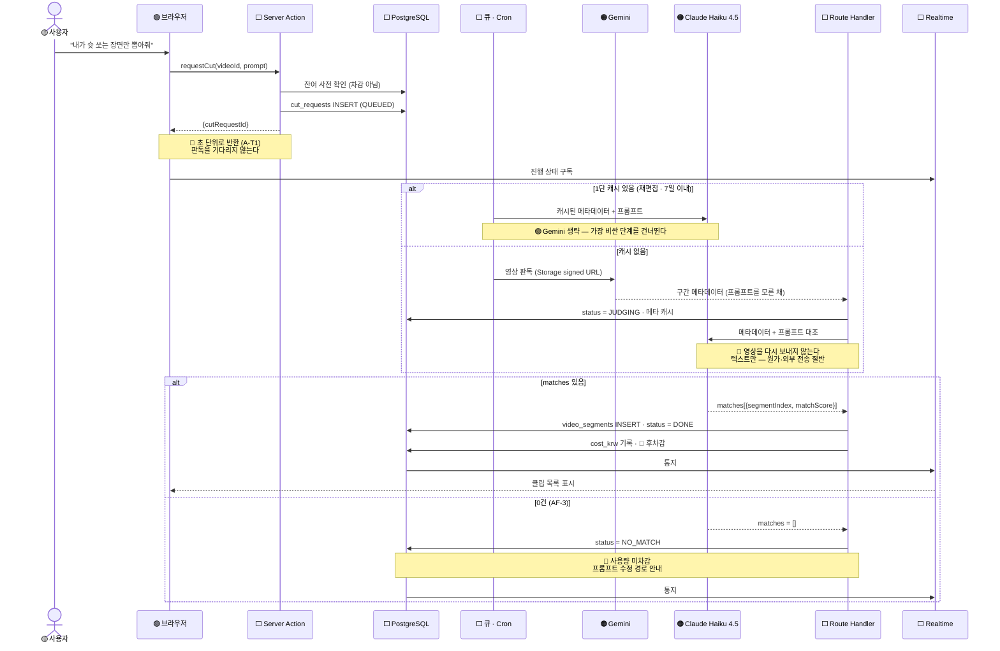
```mermaid
sequenceDiagram
    actor U as 🟡 사용자
    participant C as 🟢 브라우저
    participant SA as ⬜ Server Action
    participant DB as ⬜ PostgreSQL
    participant Q as ⬜ 큐 · Cron
    participant GM as 🟠 Gemini
    participant CL as 🟠 Claude Haiku 4.5
    participant RH as ⬜ Route Handler
    participant RT as ⬜ Realtime

    U->>C: "내가 슛 쏘는 장면만 뽑아줘"
    C->>SA: requestCut(videoId, prompt)
    SA->>DB: 잔여 사전 확인 (차감 아님)
    SA->>DB: cut_requests INSERT (QUEUED)
    SA-->>C: {cutRequestId}
    Note over SA,C: 🔴 초 단위로 반환 (A-T1)<br/>판독을 기다리지 않는다
    C->>RT: 진행 상태 구독

    alt 1단 캐시 있음 (재편집 · 7일 이내)
        Q->>CL: 캐시된 메타데이터 + 프롬프트
        Note over Q,CL: 🟢 Gemini 생략 — 가장 비싼 단계를 건너뛴다
    else 캐시 없음
        Q->>GM: 영상 판독 (Storage signed URL)
        GM-->>RH: 구간 메타데이터 (프롬프트를 모른 채)
        RH->>DB: status = JUDGING · 메타 캐시
        RH->>CL: 메타데이터 + 프롬프트 대조
        Note over RH,CL: 🔴 영상을 다시 보내지 않는다<br/>텍스트만 — 원가·외부 전송 절반
    end

    alt matches 있음
        CL-->>RH: matches[{segmentIndex, matchScore}]
        RH->>DB: video_segments INSERT · status = DONE
        RH->>DB: cost_krw 기록 · 🔴 후차감
        DB->>RT: 통지
        RT-->>C: 클립 목록 표시
    else 0건 (AF-3)
        CL-->>RH: matches = []
        RH->>DB: status = NO_MATCH
        Note over RH,DB: 🔴 사용량 미차감<br/>프롬프트 수정 경로 안내
        DB->>RT: 통지
    end
```

> 🔴 **1단과 2단을 나누는 이유는 캐시다.** Gemini에게 프롬프트를 함께 주면 메타데이터가 프롬프트에 종속되어 **재사용할 수 없다.** 나눠두면 같은 영상에 다른 프롬프트를 넣을 때 **가장 비싼 단계를 건너뛴다.**

## SD-3 · 브라우저 추적 + 정밀 복구

> **이 그림이 답하는 질문** — *"추적은 브라우저에서 도는데, 어려운 구간은 어떻게 서버가 돕는가?"*

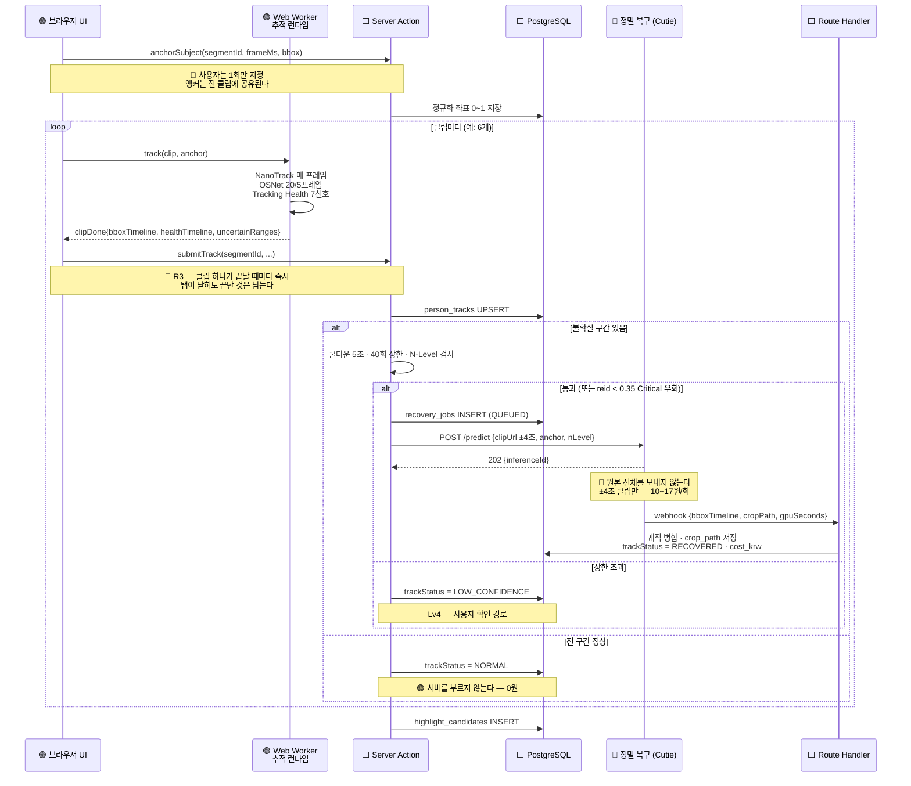
```mermaid
sequenceDiagram
    participant C as 🟢 브라우저 UI
    participant W as 🟢 Web Worker<br/>추적 런타임
    participant SA as ⬜ Server Action
    participant DB as ⬜ PostgreSQL
    participant TR as 🔴 정밀 복구 (Cutie)
    participant RH as ⬜ Route Handler

    C->>SA: anchorSubject(segmentId, frameMs, bbox)
    Note over C,SA: 🔴 사용자는 1회만 지정<br/>앵커는 전 클립에 공유된다
    SA->>DB: 정규화 좌표 0~1 저장

    loop 클립마다 (예: 6개)
        C->>W: track(clip, anchor)
        W->>W: NanoTrack 매 프레임<br/>OSNet 20/5프레임<br/>Tracking Health 7신호
        W-->>C: clipDone{bboxTimeline, healthTimeline, uncertainRanges}
        C->>SA: submitTrack(segmentId, ...)
        Note over C,SA: 🔴 R3 — 클립 하나가 끝날 때마다 즉시<br/>탭이 닫혀도 끝난 것은 남는다
        SA->>DB: person_tracks UPSERT

        alt 불확실 구간 있음
            SA->>SA: 쿨다운 5초 · 40회 상한 · N-Level 검사
            alt 통과 (또는 reid < 0.35 Critical 우회)
                SA->>DB: recovery_jobs INSERT (QUEUED)
                SA->>TR: POST /predict {clipUrl ±4초, anchor, nLevel}
                TR-->>SA: 202 {inferenceId}
                Note over TR: 🔴 원본 전체를 보내지 않는다<br/>±4초 클립만 — 10~17원/회
                TR->>RH: webhook {bboxTimeline, cropPath, gpuSeconds}
                RH->>DB: 궤적 병합 · crop_path 저장<br/>trackStatus = RECOVERED · cost_krw
            else 상한 초과
                SA->>DB: trackStatus = LOW_CONFIDENCE
                Note over SA,DB: Lv4 — 사용자 확인 경로
            end
        else 전 구간 정상
            SA->>DB: trackStatus = NORMAL
            Note over SA,DB: 🟢 서버를 부르지 않는다 — 0원
        end
    end
    SA->>DB: highlight_candidates INSERT
```

> 🔴 **이 그림에 원가 구조가 전부 들어 있다.** 🟢 브라우저는 매 프레임 돌지만 0원이고, 🔴 서버는 **불확실 구간에만 · ±4초만** 불린다. `else 전 구간 정상` 가지가 실행될 때마다 10~17원을 아낀다.

## SD-4 · 선택 → 렌더 → 저장

> **이 그림이 답하는 질문** — *"고른 다음에 무엇이 어디서 일어나는가?"*

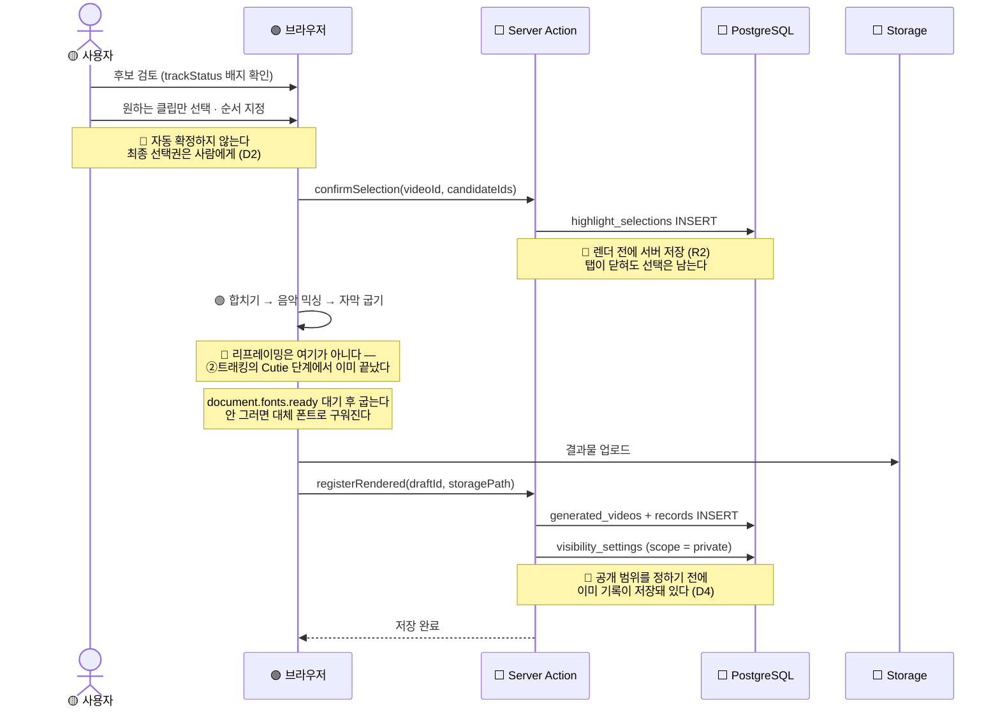
```mermaid
sequenceDiagram
    actor U as 🟡 사용자
    participant C as 🟢 브라우저
    participant SA as ⬜ Server Action
    participant DB as ⬜ PostgreSQL
    participant ST as ⬜ Storage

    U->>C: 후보 검토 (trackStatus 배지 확인)
    U->>C: 원하는 클립만 선택 · 순서 지정
    Note over U,C: 🔴 자동 확정하지 않는다<br/>최종 선택권은 사람에게 (D2)
    C->>SA: confirmSelection(videoId, candidateIds)
    SA->>DB: highlight_selections INSERT
    Note over SA,DB: 🔴 렌더 전에 서버 저장 (R2)<br/>탭이 닫혀도 선택은 남는다

    C->>C: 🟢 합치기 → 음악 믹싱 → 자막 굽기
    Note over C: 🔴 리프레이밍은 여기가 아니다 —<br/>②트래킹의 Cutie 단계에서 이미 끝났다
    Note over C: document.fonts.ready 대기 후 굽는다<br/>안 그러면 대체 폰트로 구워진다

    C->>ST: 결과물 업로드
    C->>SA: registerRendered(draftId, storagePath)
    SA->>DB: generated_videos + records INSERT
    SA->>DB: visibility_settings (scope = private)
    Note over SA,DB: 🔴 공개 범위를 정하기 전에<br/>이미 기록이 저장돼 있다 (D4)
    SA-->>C: 저장 완료
```

## SD-5 · 공개 범위 변경 + 링크 회수

> **이 그림이 답하는 질문** — *"공개했다가 되돌리면 이미 보낸 링크는 어떻게 되는가?"*

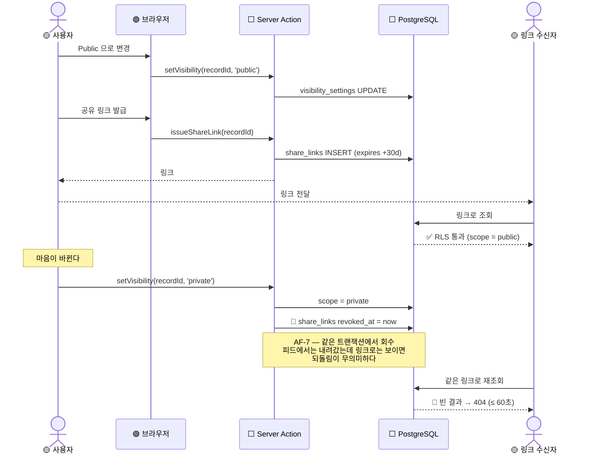
```mermaid
sequenceDiagram
    actor U as 🟡 사용자
    participant C as 🟢 브라우저
    participant SA as ⬜ Server Action
    participant DB as ⬜ PostgreSQL
    actor V as 🟡 링크 수신자

    U->>C: Public 으로 변경
    C->>SA: setVisibility(recordId, 'public')
    SA->>DB: visibility_settings UPDATE
    U->>C: 공유 링크 발급
    C->>SA: issueShareLink(recordId)
    SA->>DB: share_links INSERT (expires +30d)
    SA-->>U: 링크
    U-->>V: 링크 전달
    V->>DB: 링크로 조회
    DB-->>V: ✅ RLS 통과 (scope = public)

    Note over U: 마음이 바뀐다
    U->>SA: setVisibility(recordId, 'private')
    SA->>DB: scope = private
    SA->>DB: 🔴 share_links revoked_at = now
    Note over SA,DB: AF-7 — 같은 트랜잭션에서 회수<br/>피드에서는 내려갔는데 링크로는 보이면<br/>되돌림이 무의미하다
    V->>DB: 같은 링크로 재조회
    DB-->>V: 🔴 빈 결과 → 404 (≤ 60초)
```

## SD-6 · AI 음악 생성 (후차감 · 폴백)

> **이 그림이 답하는 질문** — *"AI 음악이 실패하거나 한도를 다 쓰면 사용자는 어디로 가는가?"*

```mermaid
sequenceDiagram
    actor U as 🟡 사용자
    participant C as 🟢 브라우저
    participant SA as ⬜ Server Action
    participant DB as ⬜ PostgreSQL
    participant SU as 🟠 Suno
    participant RH as ⬜ Route Handler

    C->>SA: getUsage()
    SA-->>C: 잔여 AI 음악 1회
    Note over C: 🔴 누르기 전에 잔여를 보여준다

    U->>C: "밝고 신나는 브이로그 음악"
    C->>SA: generateMusic(prompt)
    SA->>DB: 잔여 확인 (차감 아님)
    SA->>SU: 생성 요청
    SA-->>C: {jobId} — 즉시 반환

    alt 성공
        SU->>RH: webhook — 🔴 2곡
        RH->>DB: music_tracks INSERT (origin = AI)
        RH->>DB: 🔴 UsageLedger consume (후차감 · ref 멱등)
        RH-->>C: 2곡 제시 → 사용자가 1곡 선택
        Note over RH,C: 소비 단위는 "생성"이 아니라 "채택"<br/>music_ai_applied ÷ music_generated 계측
    else 실패 (AF-11)
        SU-->>RH: 5xx · 3회 재시도 후 실패
        RH->>DB: 🔴 미차감
        RH-->>C: 무료 라이브러리 경로 안내
    else 한도 소진 (AF-12)
        SA-->>C: {QUOTA_EXCEEDED, freePathAvailable:true}
        Note over SA,C: 🔴 결제 버튼만 남기지 않는다<br/>무료 라이브러리로 자연스럽게 넘긴다
    end
```

## SD-7 · 🔴 선불 충전 — 결제 → 사용량 *(무료 사용자)*

> **이 그림이 답하는 질문** — *"결제가 끝나면 사용량은 어떻게 늘어나는가? 창을 닫으면?"*

```mermaid
sequenceDiagram
    actor U as 🟡 사용자
    participant C as 🟢 브라우저
    participant SA as ⬜ Server Action
    participant PG as 🔴 결제 대행
    participant RH as ⬜ Route Handler
    participant DB as ⬜ PostgreSQL

    U->>C: 🔴 추가 업로드 1편 충전 선택
    C->>SA: 🔴 startCheckout({ addon:'EXTRA_EDIT', qty:1 })
    SA-->>C: 대행사 결제 페이지 URL
    C->>PG: 리다이렉트 · 카드 입력
    Note over C,PG: 🔴 카드 정보가 우리 서버를 지나지 않는다

    par 사용자 경로
        PG-->>C: 성공 페이지로 복귀
        Note over C: ⚠️ 이것은 UX일 뿐<br/>충전의 근거가 아니다
    and 신뢰 경로
        PG->>RH: POST /api/webhooks/payment
        RH->>RH: 🔴 서명 검증
        RH->>DB: 결제 ID 기준 멱등 확인
        RH->>DB: 🔴 usage_ledger INSERT<br/>(EDIT +1, settlement=PREPAID,<br/>expires_at = +30d)
        Note over RH,DB: 🔴 users.plan 은 그대로 FREE<br/>충전은 플랜 전환이 아니다 (v2.3)
    end
    C->>SA: getUsage()
    SA-->>C: 잔여 3편 · 소멸 예정 30일 뒤
```

> 🔴 **webhook만이 충전의 근거다.** 리다이렉트는 조작 가능하고, 사용자가 창을 닫으면 오지 않는다.
>
> 🔴 **[v2.3] 이 그림에서 사라진 줄이 핵심이다 — `users.plan = PREPAID` 가 없다.** 충전해도 **플랜은 FREE 그대로**이고 늘어나는 것은 `usage_ledger` 한 줄뿐이다. 🔴 **그래서 충전한 무료 사용자에게 AI 컷·자동 추적이 열리지 않는다** — 열리는 것은 **산 항목 그 자체**뿐이다(PRD AC7-7).
>
> ### 🔴 [v2.3] 후불 종량은 이 그림의 순서가 뒤집힌다 *(구독 사용자)*
>
> | | 선불 (무료) | 🔴 후불 (구독) |
> | --- | --- | --- |
> | 원장 기록 시점 | 결제 webhook 수신 시 | 🔴 **사용 성공 시** — `settlement=POSTPAID, billedAt=null` |
> | 결제 시점 | 사용 전 | 🔴 **월말 일괄** — `GET /api/cron/settle-postpaid` |
> | 실패하면 | 충전이 안 될 뿐 **손실 없음** | 🔴 **이미 쓴 원가가 회수되지 않는다**(PRD R15) |
> | 상한 | 구조적으로 불필요 | 🔴 **필수** — `POSTPAID_CAP` [TBD Q26] |
>
> 🔴 **`billedAt = null` 인 행이 곧 미수금이다.** 소멸 Cron(`expire-usage`)이 이 행을 만료 처리하면 **청구 전에 채권이 사라진다** — 🔴 **만료는 `settlement = PREPAID` 인 행에만 적용한다.**

## SD-8 · 실패 경로 종합

> **이 그림이 답하는 질문** — *"뭔가 잘못됐을 때 사용자는 무엇을 보는가? 그리고 돈은 빠지는가?"*

```mermaid
sequenceDiagram
    participant C as 🟢 브라우저
    participant SA as ⬜ 서버
    participant EX as 🟠🔴 외부

    rect rgb(253, 240, 200)
    Note over C,EX: AF-10 · 20분 초과
    C->>SA: createUpload(durationSec = 2400)
    SA-->>C: DURATION_EXCEEDED + 분할 지점 제안
    Note over SA: 미차감 · 바이트 전송 0
    end

    rect rgb(253, 240, 200)
    Note over C,EX: AF-3 · 프롬프트 0건
    C->>SA: requestCut(prompt)
    SA->>EX: 판독 · 판정
    EX-->>SA: matches = []
    SA-->>C: CUT_NO_MATCH + 원인 후보 + 프롬프트 수정
    Note over SA: 🔴 미차감
    end

    rect rgb(253, 240, 200)
    Note over C,EX: AF-11 · 제공자 장애
    C->>SA: generateMusic / requestCut
    SA->>EX: 호출
    EX-->>SA: 5xx (3회 재시도 후)
    SA-->>C: 실패 + 무료 경로 안내
    Note over SA: 🔴 미차감
    end

    rect rgb(253, 240, 200)
    Note over C,EX: AF-13 · 전 클립 추적 실패
    C->>SA: submitTrack (전부 실패)
    SA-->>C: 클립은 유지 + 수동 트래킹 경로
    Note over SA: 🔴 컷 실패(AF-3)와 다른 안내다<br/>자른 것은 살아 있다
    end
```

> 🔴 **네 경로의 공통 규칙 두 가지** — ① **결과를 못 받았으면 차감하지 않는다** ② **빈 화면 대신 다음에 할 수 있는 것을 준다.** 이 둘이 무너지면 사용자는 손해를 봤다고 느끼고, 그 느낌이 해지로 이어진다(이준혁 페르소나).

## 🔴 SD-9 · 대기 중 소비 → 완료 복귀 🆕 v2.1

> **이 그림이 답하는 질문** — *"편집 화면을 나갔는데 처리가 끝났다. 사용자는 그걸 어떻게 알고 어떻게 돌아오는가?"*

```mermaid
sequenceDiagram
    participant U as 🟡 사용자
    participant MB as 🟡 진행 미니바<br/>루트 레이아웃
    participant FD as 🟡 피드 화면
    participant W as 🟢 Web Worker<br/>추적 런타임
    participant SA as ⬜ Server Action
    participant DB as ⬜ PostgreSQL
    participant RT as ⬜ Realtime

    U->>MB: 앱 진입
    MB->>SA: getActiveJob()
    SA->>DB: SELECT ... WHERE status='RUNNING'
    DB-->>MB: {stage:TRACKING, 2/6, resumeRoute}
    MB->>RT: subscribe(processing_jobs)
    Note over MB,RT: 🔴 구독은 변경만 준다<br/>초기 1회 조회가 반드시 짝으로

    U->>FD: 피드로 이동 (같은 탭)
    Note over W: 🟢 Worker는 살아남는다 (A-T9)<br/>🔴 다만 재생과 자원을 다툰다 (T7)
    FD-->>U: 저부하 모드로 재생

    loop 클립마다
        W->>SA: submitTrack(segmentId, ...)  (R3)
        SA->>DB: person_tracks UPSERT<br/>progress_num += 1
        DB->>RT: 변경 전파
        RT-->>MB: {stage:TRACKING, 3/6}
        MB-->>U: 🔴 피드를 가리지 않고 상단에만 갱신
    end

    SA->>DB: stage=SELECTING · resume_route=/edit/{id}/candidates
    DB->>RT: 변경 전파
    RT-->>MB: {stage:SELECTING, 완료}
    MB-->>U: 완료 상태 + toast 1회
    Note over MB,U: 🔴 자동 전환하지 않는다<br/>보던 영상을 끊지 않는다 (ADR-6)

    U->>MB: 탭
    MB->>SA: resumeEditing(jobId)
    SA->>DB: 현재 stage 재확인
    SA-->>MB: {route:/edit/{id}/candidates}
    Note over SA: 🔴 서버가 정한다 — 사용자가 피드를 보는 사이<br/>단계가 넘어갔을 수 있다
    MB->>U: 후보 목록으로 이동 · notified_at 기록
```

> ### 🔴 이 그림에서 놓치면 안 되는 세 지점
> **① `getActiveJob()` 과 `subscribe` 가 짝이다.** 구독만 걸면 **다음 변경이 올 때까지 미니바가 비어 있다.** 앱을 다시 열었을 때 이미 진행 중이던 작업이 안 보이면 사용자는 처리가 사라진 줄 안다(SC-1.F4의 F29 판).
>
> **② `resumeEditing`이 경로를 다시 계산한다.** 미니바가 들고 있던 `resumeRoute`는 **몇 분 전 값**이다. 그 사이 `TRACKING → SELECTING`으로 넘어갔다면 옛 경로는 **한 단계 뒤로 떨어뜨린다** — SRS §5.2의 *"복귀 지점 정확도 100%"* 가 이 한 줄에 걸려 있다.
>
> **③ 완료 알림 다음에 화살표가 없다.** `MB-->>U: 완료 상태 + toast` 이후 **시스템은 아무것도 하지 않는다.** 다음 화살표는 `U->>MB: 탭` 이며, **사용자가 누를 때까지 기다린다.** 이 공백이 ADR-6에서 대안 D(강제 전환)를 기각한 결과다 — 🔴 **그리고 이 공백이 R13(돌아오지 않음)이 사는 자리이기도 하다.**

---

# 5. Behavioral Viewpoint — 판단과 분기

> **대응 SRS**: §3.2 파이프라인 · §2 제약 영향 · §6.5 웹 제약 · §8.1 게이트

## FC-1 · 전체 파이프라인 — 🔴 이 문서에서 가장 먼저 볼 그림

> **이 그림이 답하는 질문** — *"영상을 올리고 나서 결과물이 나오기까지, 순서가 정확히 어떻게 되는가?"*

```mermaid
flowchart TD
    START(["🟡 사용자: 20분 원본 업로드"]) --> P1

    subgraph P1["① 컷 — 자른다"]
        direction TB
        A1["🟡 프롬프트 입력<br>'슛 쏘는 장면만'"] --> A2["🟠 Gemini 영상 판독<br>구간 메타데이터"]
        A2 --> A3["🟠 Claude Haiku 4.5<br>프롬프트 대조 판정"]
        A3 --> A4{"맞는 구간 있나?"}
        A4 -->|없음| AF3["AF-3 · 미차감<br>프롬프트 수정"]
        AF3 -.-> A1
    end

    A4 -->|"클립 N개<br>예: 10초 × 6"| P2

    subgraph P2["② 트래킹 — 자른 것만 따라간다"]
        direction TB
        B1["🟡 추적 대상 1회 지정"] --> B2["🟢 브라우저 클립별 추적<br>NanoTrack + OSNet"]
        B2 --> B3{"Tracking Health<br>정상인가?"}
        B3 -->|정상| B5["궤적 확정 · 0원"]
        B3 -->|불확실| B4["🔴 GPU 정밀 복구<br>±4초 · Cutie + 크롭 경로"]
        B4 --> B5
        B5 --> B6["후보 목록<br>정상 / 복구완료 / 저신뢰 제외"]
    end

    B6 --> P3

    subgraph P3["③ 완성 — 고른 것만 다듬는다"]
        direction TB
        C1["🟡 사용자가 고른다"] --> C3["🟢 합치기"]
        C3 --> C4["🟢 음악"] --> C5["🟢 자막"]
    end

    P3 --> P4

    subgraph P4["④ 기록 — 공개와 무관하게 남는다"]
        direction TB
        D1["기록 저장<br>기본 Private"] --> D2["🟡 공개 범위 선택"]
    end

    P4 --> END(["결과물 · 내 기록"])

    style A1 fill:#fdf0c8,color:#111
    style A2 fill:#ffd9a8,color:#111
    style A3 fill:#ffd9a8,color:#111
    style B1 fill:#fdf0c8,color:#111
    style B2 fill:#b9f0d5,color:#111
    style B4 fill:#f6c7c0,color:#111
    style C1 fill:#fdf0c8,color:#111
    style C3 fill:#b9f0d5,color:#111
    style C4 fill:#b9f0d5,color:#111
    style C5 fill:#b9f0d5,color:#111
    style D2 fill:#fdf0c8,color:#111
```

### 각 단계가 다음 단계의 입력을 줄인다

```
원본 20분
  │  ① 프롬프트 컷 ────────→  클립 N개 (예: 1분)
  │                            ↑ 브라우저 추적은 여기서부터 — 20분이 아니라 1분
  │  ② 클립별 추적 ────────→  정상 구간 + 불확실 구간
  │                            ↑ GPU는 불확실 구간에만 · ±4초씩
  │  ③ 사용자 선택 ────────→  고른 클립만
  │                            ↑ 렌더 부담이 여기서 결정된다
  └─ 완성 ────────────────→  결과물 1편
```

> 🔴 **v0.1·v0.2 초안은 이 순서를 반대로 적었다.** 트래킹이 원본 전체를 훑고 그 위에 프롬프트를 얹는 구조였다. **순서가 뒤집히면서 원가·게이트·엔티티가 전부 따라 바뀌었다** — 이 그림 하나가 그 변경의 요약이다.

> ### 🔴 이 그림에 F29를 그리지 않은 이유 [v2.1]
> F29는 **①·② 옆에 나란히 서는 단계가 아니라 그 위에 얹히는 층**이다. 위 파이프라인에서 줄어드는 것은 **영상 분량**이고, F29가 다루는 것은 **사용자가 그동안 어디에 있는가**다. 같은 그림에 넣으면 **"컷 다음에 대기가 온다"** 로 읽혀 순서를 오해하게 된다.
>
> **F29를 보려면 세 그림을 읽는다** — **ST-5**(어느 상태에서 나가도 되나) · **FC-8**(나갈 때 뭐라고 말하나) · **SD-9**(끝나면 어떻게 돌아오나).

## FC-2 · 무료 / 유료 분기 + 기술 폴백

> **이 그림이 답하는 질문** — *"돈을 안 냈거나 브라우저가 약하면 어떻게 되는가? 막히는가?"*

```mermaid
flowchart TD
    S(["편집 시작"]) --> Q1{"플랜이 있나?"}
    Q1 -->|무료| M1["🟡 수동 컷<br>타임라인에서 직접"]
    Q1 -->|구독| Q2{"브라우저가<br>추적을 돌릴 수 있나?<br>WASM SIMD · 멀티스레드"}

    Q2 -->|불가| FB["🔴 폴백 안내<br>'직접 지정해서 계속할 수 있습니다'"]
    FB --> M1
    Note1["🔴 AI 사용량 미차감<br>못 쓴 기능의 값을 받지 않는다"]
    FB -.-> Note1

    Q2 -->|가능| Q3{"잔여 편수 있나?"}
    Q3 -->|없음| QE["QUOTA_EXCEEDED<br>+ freePathAvailable"]
    QE --> CH{"사용자 선택"}
    CH -->|결제| Q3
    CH -->|무료로 계속| M1
    Q3 -->|있음| A1["🟠 프롬프트 컷"]

    M1 --> Q4{"🔴 수동 트래킹 잔여?<br>무료 월 1회 · 유료 무제한"}
    Q4 -->|있음| M2["🟡 수동 트래킹<br>키프레임 지정"]
    Q4 -->|"소진 · 무료만"| MQ["🔴 AF-16<br>리프레이밍 없이 합치기<br>+ 갱신일 + 결제"]
    A1 --> A2["🟢 자동 추적 + 🔴 복구"]

    M2 --> CM["후보 선택"]
    MQ --> CM
    A2 --> CM
    CM --> FIN["합치기 · 음악 · 자막 · 저장<br>🟢 무료·유료 동일"]
    FIN --> E(["완성"])

    style M1 fill:#fdf0c8,color:#111
    style M2 fill:#fdf0c8,color:#111
    style Q4 fill:#fdf0c8,color:#111
    style MQ fill:#f6c7c0,color:#111
    style A1 fill:#ffd9a8,color:#111
    style A2 fill:#b9f0d5,color:#111
    style FB fill:#f6c7c0,color:#111
    style Note1 fill:#fff,color:#111
```

> 🔴 **[v3.3] 무료 갈래에도 한도 분기가 생겼다.** v3.2까지 `M1 → M2` 는 무조건이었다 — 무료 사용자는 **횟수 제한 없이** 수동 경로를 돌 수 있었기 때문이다. PRD v0.4가 **수동 트래킹에 월 1회 한도**를 두면서 이 그림에 `Q4` 가 들어갔다.
>
> 🔴 **`MQ` 가 `CM`(후보 선택)으로 이어지는 화살표가 이 그림의 핵심이다.** 소진돼도 **끝나지 않는다** — 트래킹만 빠지고 합치기·음악·자막·저장은 그대로 간다(AF-16). **이 화살표가 없으면 무료 티어는 "월 1편 이후 잠기는 앱"이 되어 AC7-1·AC7-6과 충돌한다.**
>
> 🔺 **`Q2`(브라우저 폴백)로 들어온 구독 사용자는 `Q4` 에서 걸리지 않는다** — 구독의 수동 트래킹은 무제한이다. **폴백이 한도로 두 번 막히는 경로는 없다.**


> 🔴 **어느 갈래로 가도 `완성`에 도달한다.** 무료 티어는 기능이 잘린 체험판이 아니라 **수동 편집기**이고, 동시에 **미지원 브라우저의 유일한 경로**다. 이 이중 역할이 수동 도구를 P0로 만든다.

## FC-3 · 복구 판정 — 언제 서버를 부르는가

> **이 그림이 답하는 질문** — *"돈이 나가는 그 순간은 정확히 어떤 조건일 때인가?"*

```mermaid
flowchart TD
    S(["클립 추적 완료"]) --> H["Tracking Health 7신호 집계"]
    H --> C1{"reid_score < 0.35 ?<br>Critical"}
    C1 -->|예| GO["🔴 즉시 복구 호출"]
    Note1["명백히 다른 사람을 잡고 있다<br>N-Level과 무관하게 부른다"]
    C1 -.-> Note1

    C1 -->|아니오| C2{"20프레임 창에서<br>불량 프레임 ≥ N-Level 기준?<br>N=2:10 N=3:14 N=4:15"}
    C2 -->|아니오| OK["🟢 정상 — 서버 호출 0<br>0원"]
    C2 -->|예| C3{"Lv1 모션 예측으로<br>버틸 수 있나?"}
    C3 -->|가능| OK
    C3 -->|불가| C4{"Lv2 NanoDet 재획득<br>성공?"}
    Note2["🔺 PoC에서 0회 성공 (R9)<br>실패가 지속되면 Lv3로 몰린다"]
    C4 -.-> Note2
    C4 -->|성공| OK
    C4 -->|실패| C5{"쿨다운 5초 지났나?"}
    C5 -->|아니오| WAIT["대기"]
    WAIT --> C5
    C5 -->|예| C6{"이 영상 복구 40회 미만?"}
    C6 -->|초과| LV4["Lv4 · 사용자 확인<br>trackStatus = LOW_CONFIDENCE"]
    C6 -->|미만| GO

    GO --> COST["🔴 10~17원 발생<br>cost_krw 기록 · 후차감"]
    COST --> R["복구 궤적 + cropPath 수신<br>trackStatus = RECOVERED"]

    style OK fill:#b9f0d5,color:#111
    style GO fill:#f6c7c0,color:#111
    style COST fill:#f6c7c0,color:#111
    style Note1 fill:#fff,color:#111
    style Note2 fill:#fff,color:#111
```

| 억제 장치 | 값 | 없으면 |
| --- | --- | --- |
| **N-Level** | 2 품질 / **3 균형** / 4 비용방어 | 요금제별 원가 차등이 불가능 |
| **Critical 우회** | `reid < 0.35` | 명백한 오인식을 원가 때문에 방치 |
| **쿨다운** | 5초 | 어려운 장면에서 호출 폭주 |
| **편당 상한** | 40회 | 한 영상이 원가를 무한히 소비 |
| **클립 길이** | ±4초 | 🔴 ±10초면 **원가 2.5배** |

## FC-5 · 브라우저 자원 — 무엇이 언제 도는가 🔄 **v2.1 재작성**

> **이 그림이 답하는 질문** — *"추적도 브라우저, 피드 재생도 브라우저, 렌더도 브라우저면 폰이 버티는가?"*

```mermaid
flowchart LR
    subgraph T1["시점 1 · 추적 (+ F29 대기 중 소비)"]
        direction TB
        A["🟢 Worker: 모델 3종 로딩 6.5MB<br>NanoTrack 매 프레임"]
        A2["🟡 피드 재생 · video 디코딩<br>프리페치 · GPU 합성"]
        A === A2
    end
    subgraph T2["시점 2 · 사용자 선택"]
        B["🟡 유휴 — 브라우저 쉰다"]
    end
    subgraph T3["시점 3 · 렌더"]
        C["🟢 WebCodecs · ffmpeg.wasm<br>크롭 · 합치기 · 자막<br>🔴 F29 꺼짐 · 이탈 경고 유지"]
    end
    T1 --> T2 --> T3
    N1["🔴 v2.1 정정<br>시점 1 안에서는 동시 실행이다<br>추적 ↔ 렌더는 여전히 직렬<br>계측: 단독 / 동시 / 세션누적 3분할"]
    T1 -.-> N1
    style A fill:#b9f0d5,color:#111
    style A2 fill:#fdf0c8,color:#111
    style B fill:#fdf0c8,color:#111
    style C fill:#b9f0d5,color:#111
    style N1 fill:#fff,color:#111
```

> ### 🔴 v2.0의 이 그림은 틀렸다 — 무엇이 왜 바뀌었나
> v2.0은 *"직렬이다 — 동시 실행 없음"* 으로 끝냈고, 그 결론 위에서 **발열 계측을 두 단계 합산**으로 정했다. **F29가 시점 1 안에 두 번째 부하를 집어넣으면서 전제가 사라졌다.**
>
> | 관계 | v2.0 | **v2.1** |
> | --- | :--: | :--: |
> | 추적 ↔ 렌더 | 직렬 | ✅ **그대로** — 사용자 선택이 사이에 있어 겹칠 수 없다 |
> | 추적 ↔ **피드 재생** | *(관계 자체가 없었다)* | 🔴 **동시** |
> | 계측 | 두 단계 합산 | 🔴 **단독 / 동시 / 세션누적 3분할** |
>
> **`===`(굵은 선)은 화살표가 아니다** — 순서가 없기 때문이다. 둘은 **같은 시간에 같은 자원을 쓴다.**

| 브라우저 제약 | 대응 | SRS |
| --- | --- | --- |
| 탭 닫으면 추적 소실 | 🔴 **R3** — 클립 단위 즉시 서버 저장 | §6.5.3 |
| 탭 닫으면 렌더 소실 | **R1** 이탈 경고 · **R2** 선택 상태 사전 저장 | §6.5.3 |
| 🔴 **화면 이동은 추적을 죽이지 않는다** *(v2.1)* | **A-T9** — SPA 내비게이션은 같은 탭 · Worker 생존 → **F29가 성립하는 근거** | §1.5.2 · §6.5.3 |
| 🔴 **렌더 중 이탈 유혹** *(v2.1)* | **R4** — 렌더 단계에서는 미니바가 **피드 진입점을 내주지 않는다** | §6.5.3 |
| 🔴 **추적 ↔ 재생 자원 경합** *(v2.1)* | **T7** — 추적 우선 · 피드 4단계 강등(프리페치 → 동시디코딩 → 해상도 → 정지이미지) | **§6.5.5** |
| 모델 6.5MB 다운로드 | Cache Storage 영구 캐싱 · NanoDet 지연 로딩 | §6.5.4 |
| 미지원 브라우저 | 🔴 수동 경로 폴백 | §6.5.4 |
| 유성 자동재생 차단 | 첫 조작(스크롤·탭) 시 소리 활성 | §6.5.1 |

## 🔴 FC-8 · 대기 중 이탈 허용 판정 — 지금 나가도 되는가 🆕 v2.1

> **이 그림이 답하는 질문** — *"사용자가 편집 화면을 벗어나려 한다. 보내도 되는가, 뭐라고 말해야 하는가?"*

```mermaid
flowchart TD
    START(["🟡 사용자가 편집 화면을 벗어나려 한다"]) --> Q1{"현재 stage?"}

    Q1 -->|RENDERING| R1["🔴 F29 꺼짐<br>진입점 없음 (R4)"]
    R1 --> R2["beforeunload 이탈 경고 (R1)<br>'완료까지 머물러 주세요'"]

    Q1 -->|CUTTING| C1["🟢 보낸다"]
    C1 --> C2["안내: '창을 닫아도 계속됩니다'<br>외부 AI 실행 · 탭 종료 무관"]

    Q1 -->|TRACKING · RECOVERING| T1{"브라우저가 추적을<br>돌리고 있나?"}
    T1 -->|아니오 · 수동 트래킹| C1
    T1 -->|예| T2["🟢 보낸다 — 단 조건부"]
    T2 --> T3["🔴 안내: '이 탭은 열어 두세요<br>다른 화면은 보셔도 됩니다'"]
    T3 --> T4{"단말 등급 · capabilities()"}
    T4 -->|충분| T5["저부하 피드 모드<br>프리페치 축소 · 동시 디코딩 1개"]
    T4 -->|부족| T6["🔴 정지 이미지 모드 (P3)<br>탭하면 재생"]

    Q1 -->|SELECTING| S1["대기가 아니다 — 사용자 차례<br>미니바는 완료 상태"]
    Q1 -->|FAILED| F1["🔴 피드 위에서 실패 전달 (AF-15)<br>CAPTURE→재지정 · INFRA→재시도"]

    style START fill:#fdf0c8,color:#111
    style R1 fill:#f6c7c0,color:#111
    style R2 fill:#f6c7c0,color:#111
    style T3 fill:#fdf0c8,color:#111
    style T6 fill:#fdf0c8,color:#111
    style F1 fill:#f6c7c0,color:#111
```

> ### 🔴 이 그림이 막는 두 가지 실수
> **① 모든 단계에 같은 문구를 쓰는 것.** *"앱을 닫아도 됩니다"* 는 컷에서는 참이고 **추적에서는 거짓**이다. 한 문구로 통일하면 사용자는 추적 중 탭을 닫고, **끝난 클립을 뺀 나머지를 다시 돌리게 된다**(AF-14).
>
> **② 렌더에도 미니바를 그대로 두는 것.** 미니바는 모든 단계에 뜨지만 **렌더에서는 클릭 가능한 피드 진입점이 사라진다.** 🔴 **사용자는 미니바를 한 번 신뢰하고 나면 단계를 구분하지 않으므로, 경고 문구를 늘리는 것보다 진입점을 없애는 편이 확실하다**(R4).
>
> 🔺 **`T1`(수동 트래킹이면 컷과 같이 취급) 가지는 F24 사용자를 위한 것이다** — 수동 트래킹은 브라우저 추론을 돌리지 않으므로 자원 경합이 없고, 탭 종료에도 서버 저장분이 남는다.

## FC-6 · 미결 결정이 무엇을 막는가

> **이 그림이 답하는 질문** — *"지금 개발을 시작하면 어디서 막히는가?"*

```mermaid
flowchart TD
    T4{"T4 · 브라우저에서<br>추적이 도는가?<br>SP-003"}
    T5{"T5 · Hilit GPU Server가<br>자사 인프라인가?<br>SP-004"}
    T6{"T6 · C-TEC-006 완화<br>Gemini + Claude + Suno"}
    PAY{"결제 대행사 선정<br>NF-019"}

    T4 -->|가능 W1| OK1["🟢 원가 구조 유지<br>단말 추적 0원"]
    T4 -->|불가 W3| NG1["🔴 추적을 서버로<br>PRD §5.5 원가 재산정"]
    T5 -->|논리명 G1| OK2["🟢 관리형 추론 서비스<br>C-TEC-005 유지"]
    T5 -->|자사 인프라 G2| NG2["🔴 C-TEC-005 개정 필요"]
    T6 -->|승인| OK3["🟢 2 프로바이더 직렬 + Suno"]
    T6 -->|미승인| NG3["🔴 F25 · F26 설계 재검토"]
    PAY -->|계약| OK4["🟢 유료 경로 개통"]
    PAY -->|미정| NG4["🟡 무료 경로는 정상 작동<br>서비스 전체가 막히지는 않는다"]

    style OK1 fill:#b9f0d5,color:#111
    style OK2 fill:#b9f0d5,color:#111
    style OK3 fill:#b9f0d5,color:#111
    style OK4 fill:#b9f0d5,color:#111
    style NG1 fill:#f6c7c0,color:#111
    style NG2 fill:#f6c7c0,color:#111
    style NG3 fill:#f6c7c0,color:#111
    style NG4 fill:#fdf0c8,color:#111
```

> 🟢 **네 결정 모두 계약(CT-006·CT-009)과 Mock(CT-007)이 있어 구현이 선행 가능하다.** 막히는 것은 **실측·공급자별 파싱·계약 체결**이지 설계가 아니다.

## FC-7 · 빌드 타임 게이트 — 승인 없으면 기능이 없다

> **이 그림이 답하는 질문** — *"법무 승인이 안 났는데 기능이 배포되는 사고를 어떻게 막는가?"*

```mermaid
flowchart TD
    PUSH(["git push → Vercel 빌드 시작"]) --> PRE["prebuild: verify-gates.ts"]
    PRE --> G1{"gates/*.gate.json<br>status = APPROVED ?"}
    G1 -->|아니오| BLOCK["blocked 목록에 추가"]
    G1 -->|예| G2{"artifacts 개수 일치<br>+ sha256 일치<br>+ 만료 전?"}
    G2 -->|아니오| BLOCK
    G2 -->|예| PASS["통과"]
    BLOCK --> GEN
    PASS --> GEN["lib/gates.generated.ts 생성<br>export const PROMPT_CUT = false"]
    GEN --> BUILD["Next.js 빌드"]
    BUILD --> TREE["🔴 상수가 false → 트리 셰이킹<br>해당 라우트가 번들에 없다"]
    TREE --> DEPLOY(["배포 — 기능이 물리적으로 부재"])
    style BLOCK fill:#f6c7c0,color:#111
    style TREE fill:#f6c7c0,color:#111
    style PASS fill:#b9f0d5,color:#111
```

| 게이트 | 차단 대상 | 산출물 | 🆕 v3.0 |
| --- | --- | :---: | :---: |
| `FACE_CONSENT` | 공개 발행 · **프롬프트 컷** | **5종** | 🔴 F25가 원본을 외부로 보낸다 |
| `MINOR_POLICY` | **가입 플로우** | 3종 | |
| `MINOR_SUBJECT` | 공개 발행 | 3종 | 그룹 공개 삭제 |
| `MUSIC_LICENSE` | 음악 라이브러리 · **AI 음악** | 3종 | 🔴 Suno 포함 |
| `PAYMENT_VENDOR` | 결제 · 🔴 **선불 충전 + 후불 종량** | — | 🆕 · 🔴 **v2.3: 후불 정산 지원이 선정 조건에 추가**(NF-019) |

> 🔴 **런타임 플래그보다 강한 이유** — 플래그는 켤 수 있지만 **없는 코드는 켤 수 없다.** SRS의 *"CI가 배포를 차단한다"* 보다 실질 보장이 강하며, **CI 설정 파일이 하나도 없이** 작동한다(C-TEC-007 준수).

---

# 6. 다이어그램 색인

🔴 **다이어그램 31개 + 매트릭스 1개 = 색인 32행** *(v2.1 — ST-5 · SD-9 · FC-8 추가)*. SRS를 읽다 막히면 여기서 찾는다.

| ID | 종류 | 제목 | 답하는 질문 | SRS |
| --- | --- | --- | --- | --- |
| **CT-1** | Flowchart | 시스템 경계 | 어디까지가 우리 것인가 | §1.5 |
| **CT-2** | UseCase | 사용자가 할 수 있는 일 | 누가 무엇을 하는가 | §4.3 |
| **CT-3** | 표 | 요금제별 권한 | 돈을 내면 뭐가 달라지나 | §4.3 |
| **CP-1** | Component | 컴포넌트 구성 | 코드가 어떤 덩어리인가 | §3.1 · §3.3 |
| **CP-2** | Flowchart | 실행 위치 배치 | 각 단계가 어디서 도나 · 얼마인가 | §3.2 |
| **ER-1** | ERD | 전체 15 엔티티 | 테이블이 어떻게 이어지나 | §4.1 |
| **ER-2** | ERD | 컷 · 트래킹 도메인 | ①② 가 만드는 데이터 | §4.1 |
| **ER-3** | ERD | 완성 · 기록 도메인 | 영상과 기록의 구분 | §4.1 |
| **ER-4** | ERD | 과금 · 소비 도메인 | 사용량과 소멸 | §4.1 · §4.3 |
| **CLD-1** | Class | 도메인 책임 | 누가 원가·보안을 지키나 | §3.3 · §7 |
| **ST-1** | State | 원본 생명주기 | 업로드~만료 상태 | §4.1 · §6.5 |
| **ST-2** | State | 프롬프트 컷 | 두 AI를 거치는 상태 | §7.3 |
| **ST-3** | State | 후보 추적 상태 | 정상/복구/저신뢰 판정 | §7.4 |
| **ST-4** | State | 사용량 원장 | 언제 소멸하나 | §4.3 · §5.2 |
| 🔴 **ST-5** | State | **처리 작업(ProcessingJob)** | 🔴 **어느 상태에서 피드로 나가도 되나** | §4.1 · §6.5.3 |
| **SD-1** | Sequence | 20분 업로드 | 4GB를 어떻게 올리나 | §5.3 |
| **SD-2** | Sequence | 프롬프트 컷 2단 | 5초 함수가 5분 작업을 | §7.3 |
| **SD-3** | Sequence | 추적 + 정밀 복구 | 브라우저와 서버의 분담 | §7.4 |
| **SD-4** | Sequence | 선택 → 렌더 → 저장 | 고른 다음 무슨 일이 | §3.4 · §5.1 |
| **SD-5** | Sequence | 공개 범위 · 링크 회수 | 되돌리면 링크는 | §4.2 · §5.1 |
| **SD-6** | Sequence | AI 음악 | 실패·소진 시 어디로 | §7.5 |
| **SD-7** | Sequence | 🔴 **선불 충전** → 사용량 | 창을 닫으면 · 🔴 **플랜은 그대로 FREE** | §5.1 |
| **SD-8** | Sequence | 실패 경로 4종 | 잘못되면 돈이 빠지나 | §2.3 · §5.2 |
| 🔴 **SD-9** | Sequence | **대기 중 소비 → 완료 복귀** | 🔴 **나갔는데 끝나면 어떻게 아나** | §5.1 · §6.5.5 |
| **FC-1** | Flowchart | 🔴 전체 파이프라인 | **가장 먼저 볼 그림** | §3.2 |
| **FC-2** | Flowchart | 무료/유료 + 폴백 | 안 내면 막히나 | §4.3 · §6.5.4 |
| **FC-3** | Flowchart | 복구 판정 | 돈이 나가는 조건 | §7.4 |
| **FC-4** | Flowchart | RLS 판정 | DB가 어떻게 막나 | §4.2 |
| **FC-5** | Flowchart | 브라우저 자원 🔄 **v2.1 재작성** | 폰이 버티나 · 🔴 **동시 실행이 생겼다** | §6.5 · **§6.5.5** |
| **FC-6** | Flowchart | 미결이 막는 것 | 지금 시작하면 어디서 | §2.4 · §9 |
| **FC-7** | Flowchart | 빌드 타임 게이트 | 미승인 기능 차단 | §8.1 |
| 🔴 **FC-8** | Flowchart | **대기 중 이탈 허용 판정** | 🔴 **지금 나가도 되나 · 뭐라고 말하나** | §6.5.3 · **§6.5.5** |

---

# 7. 추적성 — PRD 기능 ↔ 다이어그램 ↔ 태스크

| PRD 기능 | REQ | 다이어그램 | 태스크 |
| --- | --- | --- | --- |
| **F1** 업로드 | REQ-FUNC-001 | SD-1 · ST-1 | FR-001 |
| **F25** 프롬프트 컷 | REQ-FUNC-028 | **SD-2 · ST-2** · ER-2 | FR-037 · UX-011 |
| **F2a** 대상 지정 | REQ-FUNC-002 | SD-3 | FR-005 |
| **F2b** 클립별 추적 | REQ-FUNC-003 | **SD-3 · FC-3** · CLD-1 | FR-044 · FR-045 |
| **F5a** 리프레이밍 | REQ-FUNC-006 | SD-3 · SD-4 | FR-010 |
| **F3** 후보 · 제외 | REQ-FUNC-004 · 027 | **ST-3** · ER-2 | FR-012 |
| **F4** 선택 | REQ-FUNC-005 | SD-4 | FR-014 |
| **F6** 렌더 | REQ-FUNC-008 | SD-4 · **FC-5** | FR-016 |
| **F18a** 음악 | REQ-FUNC-007 | ER-3 | FR-015 |
| **F26** AI 음악 | REQ-FUNC-030 | **SD-6** | FR-040 |
| **F18b** 자막 | REQ-FUNC-026 | ER-3 · SD-4 | FR-039 · UX-013 |
| **F7** 기록 저장 | REQ-FUNC-009 | SD-4 · ER-3 | FR-019 |
| **F8** 공개 범위 | REQ-FUNC-010 · NF-009 | **SD-5 · FC-4** | FR-020 · FR-032 |
| **F22** 앱 셸 | REQ-FUNC-011 | CT-2 | UX-001 |
| **F11·13·19·20·21** 소비 | REQ-FUNC-012·014~017 | CT-2 · ER-4 | FR-026~028 |
| **F24** 기본 편집 | REQ-FUNC-029 | **FC-2** | FR-038 |
| **F27** 임시 보관 | REQ-FUNC-031 | **ST-1** | FR-041 |
| **F28** 요금제 | REQ-FUNC-032 | **ST-4 · SD-7 · CT-3** | FR-042 · FR-043 · UX-012 |
| 🔴 **F29** 대기 중 소비·복귀 | 🆕 **REQ-FUNC-033 · NF-018** | 🔴 **SD-9 · FC-8 · ST-5 · FC-5** · CT-2(UC-23) · CP-1 | 🔴 **FR-046 · UX-014** *(+ FR-036 · FR-011 · FR-044 개정)* |

---

# 8. 🔺 상위 문서 개정 요청

**이 문서를 그리면서 드러난 것만 적는다.** 새 요구를 만들지 않는다.

| # | 관찰 | 대상 | 제안 |
| :--: | --- | --- | --- |
| **D-1** | 🔴 **SRS §4.1에 `PROCESSING_JOB` 의 `stage` 값이 정의되지 않았다** — ST-1을 그리려면 `CUT / TRACK / RECOVER / RENDER` 4단계가 필요한데 v2.2 시절의 `DETECTING` 만 남아 있다 | SRS §4.1 | ✅ **해소 (v2.1)** — SRS v3.2가 `ProcessingJob` 모델과 `JobStage` 열거형을 발췌에 추가했다 |
| **D-2** | 🔴 **`SHARE_LINK` 엔티티가 SRS §4.1 스키마 발췌에 없다** — §5.1에 `issueShareLink` 는 있는데 테이블이 없다. AF-7(링크 즉시 회수)을 구현하려면 `revoked_at` 이 필요하다 | SRS §4.1 | 엔티티 추가 `[PROPOSED]` |
| **D-3** | 🔺 **`HIGHLIGHT_SELECTION` 에 순서 필드가 없다** — 사용자가 클립 순서를 정하는데(SD-4) 저장할 곳이 없다 | SRS §4.1 | `order_index` 추가 `[PROPOSED]` |
| **D-4** | 🔺 **1단 메타데이터 캐시의 저장 위치가 미정** — ST-2의 `QUEUED → JUDGING` 지름길이 성립하려면 캐시 테이블 또는 컬럼이 필요하다 | SRS §7.3 | 보존 기간을 F27의 7일과 맞출 것 `[TBD]` |
| **D-5** | 🔺 **`GENERATED_VIDEO.source_video_id` 의 NULL 허용이 명시되지 않았다** — 원본 만료(ST-1) 후에도 기록이 남아야 하므로 NULL이 되어야 한다 | SRS §4.1 | NULL 허용 명시 `[PROPOSED]` |
| 🔴 **D-6** *(v2.1)* | 🔴 **REQ-NF-001의 "첫 프레임 p95 ≤ 1.5초"가 대기 중에도 적용되면 F29는 켜는 순간 위반이다** — FC-5를 그리며 드러났다. 추적이 도는 동안 같은 임계를 요구할 근거가 없다 | SRS REQ-NF-001 | 🔴 **대기 중 별도 임계(≤ 3초)를 명시** — SRS §9-18로 이미 올렸다 `[PROPOSED]` |
| 🔴 **D-7** *(v2.1)* | 🔺 **SD-9의 `notified_at`이 "발송 시각"인지 "도달 시각"인지 SRS가 정하지 않았다** — 완료 알림 전달률 99.5%(SRS §5.2)를 재려면 **도달**이어야 하는데, 브라우저가 받았다는 확인을 서버가 어떻게 아는지가 없다 | SRS §4.1 · §5.2 | 🔴 **미니바가 수신 후 1회 확인 호출**을 보내는 방식 `[PROPOSED]` — 정하지 않으면 전달률이 측정 불가 지표가 된다 |

---

# 9. 남은 가정

| # | 가정 | 확정 조건 |
| :--: | --- | --- |
| **A-1** | CP-2의 "브라우저 추적 0원"은 **브라우저에서 실제로 돈다는 전제** | 🔴 **T4 · SP-003** 실측 |
| **A-2** | SD-3의 정밀 복구가 **외부 관리형 서비스**라는 전제 | 🔴 **T5 · SP-004** 결정 |
| **A-3** | FC-3의 N-Level 기준값(10/14/15 프레임)은 PoC 값 그대로 | E1에서 원가-정확도 교환비 실측 |
| **A-4** | ST-3의 τ(제외 임계)는 미정 — 그림에서는 기호로만 표기 | FR-045 실측 오인식률 |
| **A-5** | SD-7의 결제 흐름은 **일반적인 대행사 패턴**을 가정 | NF-019 대행사 선정 후 확정 |
| 🔴 **A-6** *(v2.1)* | **FC-5의 `===`(동시 실행)이 실제로 견딜 만하다는 전제** — 추적과 재생이 겹쳐도 둘 다 쓸 만하다는 근거가 없다 | 🔴 **T7 · SP-003에 "피드 재생 중" 조건 추가** |
| 🔴 **A-7** *(v2.1)* | **SD-9에서 라우트 이동이 Worker를 죽이지 않는다는 전제**(A-T9) — Next.js App Router의 클라이언트 내비게이션에서 참이지만 **전체 새로고침이 섞이면 깨진다** | 🔴 **`<Link>` 외의 이동 경로(외부 링크·form submit·하드 리로드)를 점검** · FR-046 |
| 🔴 **A-8** *(v2.1)* | **미니바가 피드 소비를 방해하지 않는다는 전제** — 상단 고정 요소가 세로 영상의 가용 높이를 줄인다 | UX-014 설계에서 **높이·겹침 방식 확정** *(오버레이 vs 레이아웃 밀어내기)* |

---

*작성자: 제품 아키텍트 · 검토자: AI 리드 · 백엔드 리드 · 클라이언트 리드*
*이 문서는 `SRS/[SRS]hilit-SRSv2.0-nextjs.md` **v3.2**의 결정을 **그림으로 옮긴 것**이며 새 요구사항을 만들지 않는다. 그림과 SRS가 어긋나면 **SRS가 정본**이고, 어긋난 지점은 §8에 개정 요청으로 올린다.*
*🔴 **v2.1에서 FC-5의 결론이 뒤집혔다** — v2.0의 *"직렬이다, 동시 실행 없음"* 은 F29 이후 참이 아니다. 옛 그림을 지우지 않고 정정 표를 붙인 이유는, 그 그림을 근거로 정해진 계측 설계(발열 합산)가 함께 틀렸다는 사실이 남아야 하기 때문이다.*
*`DS/[DS]hilit-DSv1.1.md`(글 판)를 대체하지 않는다 — v1.1은 API 스키마·엔티티 속성의 상세를 담고, 이 문서는 **구조와 흐름**을 담는다. 🔺 다만 v1.1은 아직 그룹(F23)을 들고 있어 **v3.0 정합화가 필요하다**(§8과 별개 과제).*
